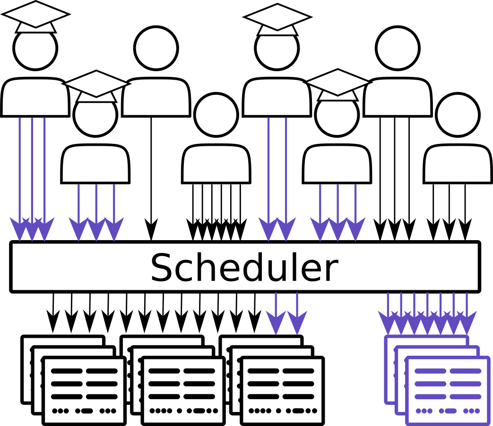
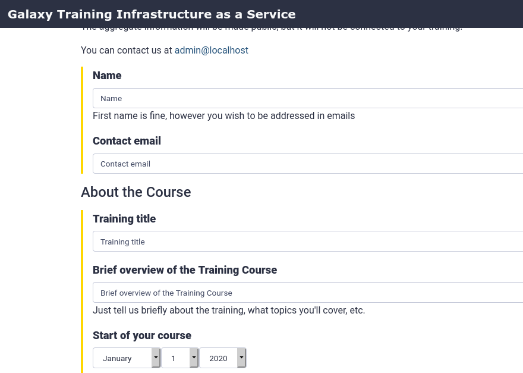
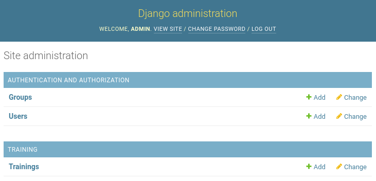
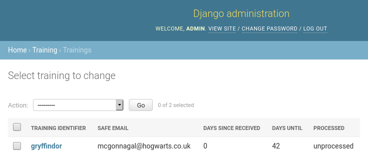
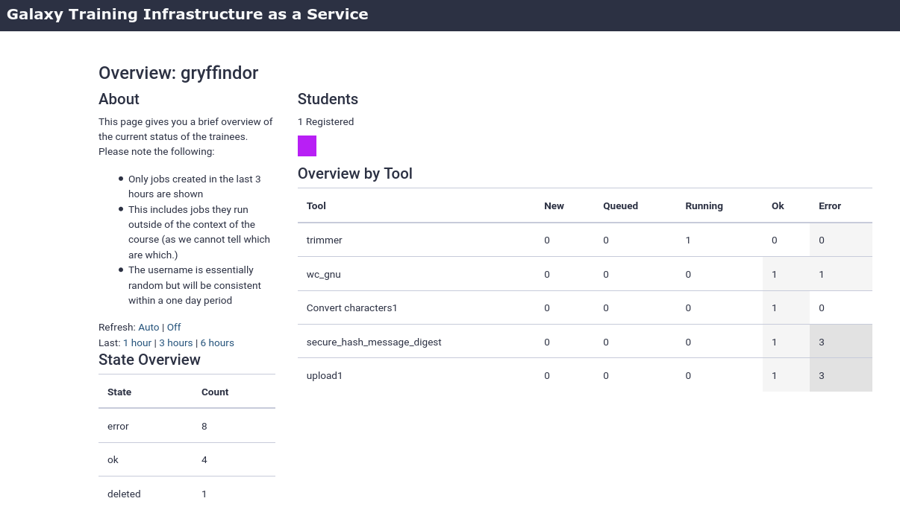
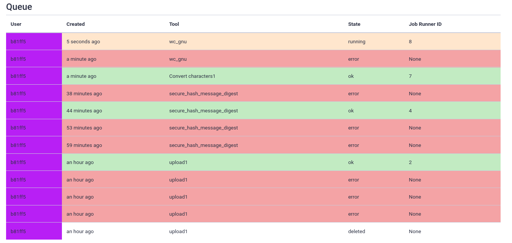

# Overview
{:.no_toc}


> ### Agenda
>
> 1. TOC
> {:toc}
>
{: .agenda}

# Introduction

Galaxy is widely used for teaching. In order to facilitate instructors, [Galaxy Europe](https://usegalaxy.eu) has developed Training Infrastructure as a Service (TIaaS).
Workshop instructors can apply for TIaaS, and on the day of their workshop, their participants will be placed in a special group and use dedicated
resources, thus reducing queue times on the day of the training.

{: width="70%"}

This tutorial will go cover how to set up such a service on your own Galaxy server.


# Setting up TIaaS

> ###  Hands-on: Setup TIaaS
>
> 1. In your `requirements.yml` add the TIaaS ansible role:
>
>    ```yml
>    - src: usegalaxy_eu.tiaas2
>      version: 0.0.1
>    ```
>
>    And run the install step:
>
>    ```
>    ansible-galaxy install -p roles -r requirements.yml
>    ```
>
> 2. In your `galaxyservers` group variables file, add the following:
>
>    ```yml
>    # TIaaS setup
>    tiaas_dir: /opt/tiaas
>    tiaas_user: tiaas
>    tiaas_group: tiaas
>    tiaas_version: master
>    tiaas_admin_user: admin
>    tiaas_admin_pass: changeme
>    ```
>
> 2. In the `galaxyservers` group variables file, we also need to set the database permissions correctly for TIaaS. It needs to be able to access some Galaxy tables, and we will carefully define only the ones we really need:
>
>    ```diff
>    +++ group_vars/galaxyservers.yml
>     postgresql_objects_users:
>       - name: galaxy
>         password: null
>    +  - name: tiaas
>    +    password: null
>     postgresql_objects_databases:
>       - name: galaxy
>         owner: galaxy
>    +postgresql_objects_privileges:
>    +- database: galaxy
>    +  roles: tiaas
>    +  objs: galaxy_user,galaxy_session,job
>    +  type: table
>    +  privs: SELECT
>    +- database: galaxy
>    +  roles: tiaas
>    +  objs: user_group_association,galaxy_group,role,group_role_association
>    +  type: table
>    +  privs: SELECT,INSERT
>    +- database: galaxy
>    +  roles: tiaas
>    +  objs: role_id_seq,galaxy_group_id_seq,group_role_association_id_seq,user_group_association_id_seq
>    +  type: sequence
>    +  privs: USAGE,SELECT
>    ```
>
>
> 3. We need to add the `usegalaxy_eu.tiaas2` role to the end of the playbook (`galaxy.yml`)
>
> 4. Lastly we should add the routes for TIaaS to the NGINX template for Galaxy:
>
>    ```nginx
>
>    location /tiaas {
>        uwsgi_pass 127.0.0.1:5000;
>        uwsgi_param UWSGI_SCHEME $scheme;
>        include uwsgi_params;
>    }
>
>    location /tiaas/static {
>        alias /opt/tiaas/static;
>    }
>
>    location /join-training {
>        uwsgi_pass 127.0.0.1:5000;
>        uwsgi_param UWSGI_SCHEME $scheme;
>        include uwsgi_params;
>    }
>
>    ```
>
> 5. Run the playbook (`ansible-playbook galaxy.yml`)
>
{: .hands_on}


TIaaS should be available now! The following routes on your server are now configured (we will run through these in the next section)


|URL | Use | Who |
|:----|----|-----|
|https://\<server\>/tiaas/new/ | Request a new TIaaS training | Instructors |
|https://\<server\>/tiaas/admin/ | Approve and Manage requests | Admin |
|https://\<server\>/tiaas/stats/ | Overall TIaaS statistics ([EU Stats](https://usegalaxy.eu/tiaas/stats/)) | Admins, Funding Agencies |
|https://\<server\>/tiaas/calendar/ | Calendar of trainings ([EU Calendar](https://usegalaxy.eu/tiaas/calendar/))| Admins, Funding Agencies |
|https://\<server\>/join-training/\<training-id\> | Join an TIaaS training | Participants |
|https://\<server\>/join-training/\<training-id\>/status | Dashboard with job states of trainees.| Instructors|


Let's see it in action!

> ###  Hands-on: Using TIaaS
>
> 1. **Create a new TIaaS request**
>    - Go to https://\<server\>/tiaas/new/
>    - Here you will find the request form users will fill in to request TIaaS:
>      
>    - For *"Training Identifier"*, fill in `gryffindor` (or remember this value if you enter something different)
>      - This is the `<training-id>` used in the URLs listed above used for:
>        1. Workshop participants to join the tiaas group
>        2. Workshop instructors to monitor the progress of their participants.
>    - Fill in the rest of the form as you like
>    - Submit the form and you should see a confirmation dialog:
>      
>
> 2. **Approve TIaaS request**
>    - Next, the request will have to be approved by an admin
>    - Go to https://\<server\>/tiaas/admin
>    - **Log in** using the values you configured `tiaas_admin_user` and `tiaas_admin_pass` in your group variables file
>      - Default values were `admin:changme`
>    - You should now see the admin panel:
>      
>    - Click on **Trainings**, you should see the TIaaS request listed here:
>      
>    - **Approve the request**
>      - Click on the training
>      - Scroll down to the bottom
>      - Change *"Processed"* to `Approved` and **Save**
>        
>    - At this point, you would likely email the person who made the request to inform them of approval
>
> 3. **Join TIaaS Training**
>    - Make sure you are logged in to Galaxy
>    - On the day of the workshop, participants will visit a following URL to join the TIaaS group
>      - https://\<server\>/join-training/gryffindor
>      - A confirmation dialog should appear if all went well:
>        
>
> 4. **Monitor TIaaS status**
>    - This is very useful for instructors to monitor the job state of their participants
>    - Go to https://\<server\>/join-training/gryffindor/status
>    - In the Dasboard you should see that one user (you) has joined the training \
>    - Run some jobs to see the dashboard in action
>      
>    - Scroll down to get some more information on a per-user level (anonymized)
>      - Every user designated by their own identifier and colour, but no personal information
>      
>
{: .hands_on}


> ###  Note: GDPR assistance
>
> Since this setup tracks additional personal information (submitter name & email, users in the queue view), TIaaS includes some always-on features to assist with your GDPR compliance.
>
>  - Users in public status dashboard are only visible by an anonymized identifier and colour
>  - Email addressses in the TIaaS admin panel will be automatically expunged 60 days after a training event
>
>  Of course you need to review any GDPR compliance concerns with your group's legal representative(s), this only attempts to ensure some protections exist for the users of the system.
>
{: .comment}


# Job Configuration

While observability for teachers or trainers is already a huge benefit, one of the primary benefits of TIaaS from UseGalaxy.eu is that your jobs get sent to dedicated compute resources, which won't be used by anyone else, during the period of the training. We will send all of the training jobs to pulsar if you have completed that tutorial, or one of the slurm destinations from the job configuration training.

In order to achieve this, we first need some way to *sort* the jobs of the training users into these private queues, while letting the other jobs continue on. So let's create a *sorting hat* to figure out where jobs belong.


> ###  Hands-on: Writing a dynamic job destination
>
> 1. Create and open `files/galaxy/dynamic_job_rules/hogwarts.py`
>
>    ```python
>    from galaxy.jobs import JobDestination
>    from galaxy.jobs.mapper import JobMappingException
>    import os
>
>    def sorting_hat(app, user):
>        # Check that the user is not anonymous
>        if not user:
>            return app.job_config.get_destination('slurm')
>
>        # Collect the user's roles
>        user_roles = [role.name for role in user.all_roles() if not role.deleted]
>
>        # If any of these are prefixed with 'training-'
>        if any([role.startswith('training-') for role in user_roles]):
>            # Then they are a training user, we will send their jobs to pulsar,
>            # Or give them extra resources
>            return app.job_config.get_destination('slurm-2c') # or pulsar, if available
>
>        return app.job_config.get_destination('slurm')
>    ```
>
>    This destination will check that the `user_email` is in a training group (role starting with `training-`).
>
> 2. As usual, we need to instruct Galaxy of where to find this file:
>
>    - Edit your group variables file and add the following:
>
>      ```diff
>       galaxy_dynamic_job_rules:
>         - my_rules.py
>      +  - hogwarts.py
>      ```
>
> 3. We next need to configure this plugin in our job configuration (`files/galaxy/config/job_conf.xml`):
>
>    ```xml
>    <destination id="sorting_hat" runner="dynamic">
>        <param id="type">python</param>
>        <param id="function">sorting_hat</param>
>    </destination>
>    ```
>
>    This is a **Python function dynamic destination**. Galaxy will load all python files in the `{{ galaxy_dynamic_rule_dir }}`, and all functions defined in those will be available to be used in the `job_conf.xml`
>
> 4. Again In `job_conf.xml`, update the top level `<destinations>` definition and point it to the sorting hat:
>
>    ```xml
>    <destinations default="sorting_hat">
>    ...
>    </destinations>
>    ```
>
> 5. Finally, upload jobs *must* stay local, the input files are a bit special, so we just send those to the local slurm cluster:
>
>    ```xml
>        <tools>
>            ...
>            <tool id="upload1" destination="slurm"/>
>        </tools>
>    ```
>
> 6. Run the playbook
>
> 7. Ensure your user is joined to a training
>
> 8. Run a job and observe the logs to see where it goes (`journalctf -u galaxy -f`)
>
{: .hands_on}

Congratulations! you have now set up TIaaS on your Galaxy server.
