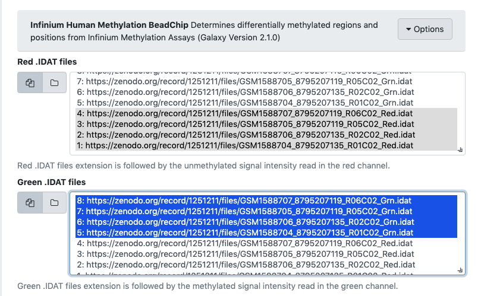
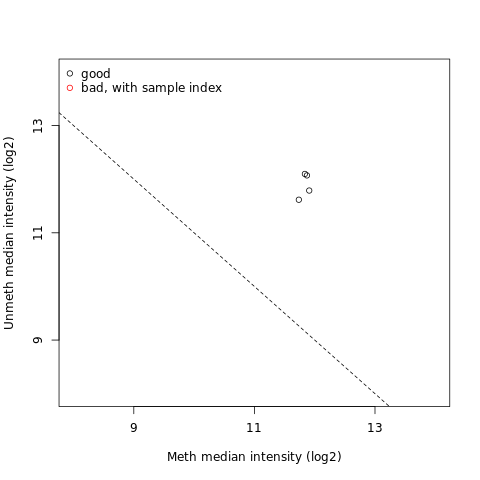
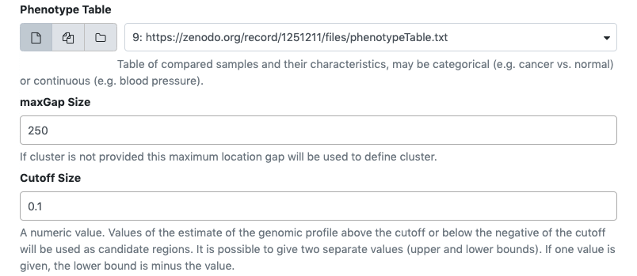
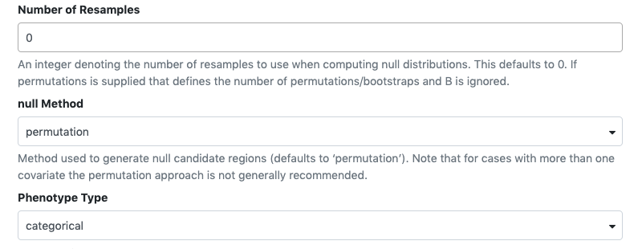
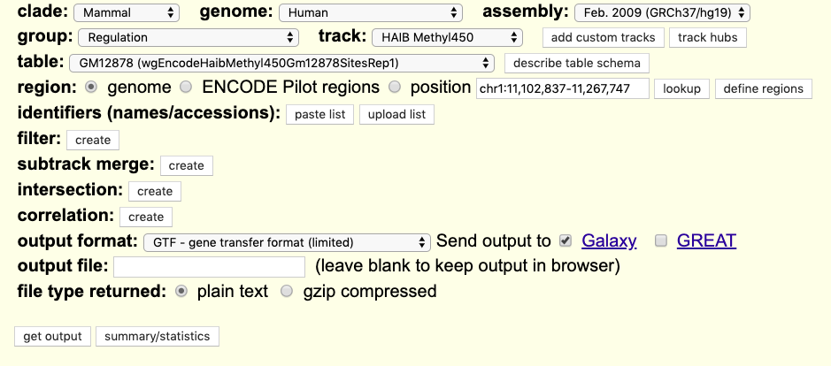

# Introduction
{:.no_toc}

The field of cancer genomics has demonstrated the power of massively parallel sequencing techniques to inform on genes and specific alterations that drive tumor onset and progression. Although large comprehensive sequence data sets continue to be made increasingly available, data analysis remains an ongoing challenge, particularly for laboratories lacking dedicated resources and bioinformatics expertise. To address this, we have provide training based on Galaxy Infinium Human Methylation BeadChip tool that represent many popular algorithms for detecting somatic genetic alterations from genome and exome data.

")

This exercise uses datasets from the Cell publication by Hugo, Willy, et al., 2015 . with the goal being to identify differentially methylated regions and positions associated with treatment resistant melanomas.
Datasets include the Infinium Human Methylation BeadChip array performed in melanoma tumors in a sample of patients pre and post MAPKi and BRAFi treatment with different outcomes (sensitive and resistant). For each sample there is raw green (methylated) and red (unmethylated) colour arrays containing the summarized bead information generated by the Infinium Human Methylation BeadChip scanner.

The Infinium Human Methylation BeadChip uses two different bead types to detect changes in DNA methylation levels. In the figure we can see M - methylated and U - unmethylated bead types. In our study unmethylated and methylated bead signals are reported as green and red colors respectively.

")


Accession  | Sensitivity | Treatment
--- | ---  | ---
GSM1588704 | baseline    | pre-treatment
GSM1588705 | baseline    | pre-treatment
GSM1588706 | resistant   | BRAFi
GSM1588707 | resistant   | BRAFi

The workflow combines 5 main steps, starting with raw intensity data loading (.idat) and then optional preprocessing and normalisation of the data. The next quality control step performs an additional sample check to remove low-quality data, which normalisation cannot detect. The workflow gives the user the opportunity to perform any of these preparation and data cleaning steps, including highly recommended genetic variation annotation step resulting in single nucleotide polymorphism identification and removal. Finally, the dataset generated through all of these steps can be used to hunt (find) differentially-methylated positions (DMP) and regions (DMR) with respect to a phenotype covariate.

# Raw intensity data loading

The first step of Infinium Human Methylation BeadChip array analysis is the raw methylation data loading (intensity information files for each two color micro array)

> ###  Hands-on: Data Loading
>
> Create a new history for this tutorial and give it a proper name
>
>    
>
> Import the following IDAT files from [Zenodo](https://zenodo.org/record/1251211#.WwREQ1Mvz-Y) or from the data library (ask your instructor)
>    - `GSM1588704_8795207135_R01C02_Red.idat`
>    - `GSM1588705_8795207119_R05C02_Red.idat`
>    - `GSM1588706_8795207135_R02C02_Red.idat`
>    - `GSM1588707_8795207119_R06C02_Red.idat`
>    - `GSM1588704_8795207135_R01C02_Grn.idat`
>    - `GSM1588705_8795207119_R05C02_Grn.idat`
>    - `GSM1588706_8795207135_R02C02_Grn.idat`
>    - `GSM1588707_8795207119_R06C02_Grn.idat`
>
>    > ###  List of Zenodo URLs
>    > ```
>    > https://zenodo.org/record/1251211/files/GSM1588704_8795207135_R01C02_Red.idat
>    > https://zenodo.org/record/1251211/files/GSM1588706_8795207135_R02C02_Red.idat
>    > https://zenodo.org/record/1251211/files/GSM1588705_8795207119_R05C02_Red.idat
>    > https://zenodo.org/record/1251211/files/GSM1588707_8795207119_R06C02_Red.idat
>    > https://zenodo.org/record/1251211/files/GSM1588704_8795207135_R01C02_Grn.idat
>    > https://zenodo.org/record/1251211/files/GSM1588706_8795207135_R02C02_Grn.idat
>    > https://zenodo.org/record/1251211/files/GSM1588705_8795207119_R05C02_Grn.idat
>    > https://zenodo.org/record/1251211/files/GSM1588707_8795207119_R06C02_Grn.idat
>    > ```
>    {: .details}
>
>    
>
>    
>
> Run **Infinium Human Methylation BeadChip**  with the following parameters:
>    -  *"red channel files"*: all files ending in `_Red`
>    -  *"green channel files"*: all files ending in `Grn`

>
{: .hands_on}

> ###  Questions
>
> How are the Green and Red signals stored?
>
> > ###  Solution
>    > Green and Red micro arrays are built up into `RGChannelSet`
> {: .solution}
>
{: .question}

# .idat preprocessing 

Preprocessing and data quality assurance is an important step in Infinium Methylation Assay analysis. Idat dataset represents two colour data with a green and a red channel and can be converted into methylated and unmethylated signals or into Beta values. Infinium Human Methylation BeadChip tool extracts and plots the quality control data frame with two columns mMed and uMed which are the medians of methylation signals (Meth and Unmeth). Comparing them against one another allows users to detect and remove low-quality samples.



> ###  Hands-on: Preprocessing
> Ilumina methylation array data can be mapped to the genome with or without additional preprocessing methods. Incomplete annotation of genetic variations such as single nucleotide polymorphism (SNP) may affect DNA measurements and interfere results from downstream analysis.   highly recommended to remove the probes that contain either a SNP at the methylated loci interrogation or at the single nucleotide extension. In this tutorial we will remove probes affected by genetic variation by selecting **(Optional) Preprocessing Method** .

> > ### (optional) Normalisation of the data
> > If your files require normalisation, you might prefer to use one of the other preprocessing tools provided in Infinium Human Methylation BeadChip tool i.e. Preprocess Funnorm or Preprocess Quantile look for recommendation at .
> >
> {: .comment}
>
{: .hands_on}
# Differentially methylated regions and positions analysis


> ###  Hands-on: Differentially methylated regions and positions analysis



DMPs and DMRs Identification



The main goal of the EWAS suite is to simplify the way differentially methylated loci sites are detected. The EWAS suite contains **minfi dmp**  tool detecting differentially methylated positions (DMPs) with respect to a phenotype covariate, and more complex **minfi dmr**  solution for finding differentially methylated regions (DMRs). Genomic regions that are differentially methylated between two conditions can be tracked using a bumphunting algorithm. The algorithm first implements a t-statistic at each methylated loci location, with optional smoothing, then groups probe into clusters with a maximum location gap and a cutoff size to refer the lowest possible value of genomic profile hunted by our tool.

From the next step we will need an additional file that annotates illumina450K with genomic features, which we can obtain from UCSC.

> ###  Hands-on: Data upload from UCSC
>
> 1. Search for `UCSC Main` in the tool search bar (top left)
>
> 2. Click on `UCSC Main` . You will be taken to the **UCSC table browser**
>
> 3. Set the following options:
>     - *"clade"*: `Mammal`
>     - *"genome"*: `Human`
>     - *"assembly"*: `Feb. 2009 (GRCh37/hg19)`
>     - *"group"*: `Regulation`
>     - *"track"*: `HAIB Methyl450`
>     - *"table"*: `GM12878 (wgEncodeHaibMethyl450Gm12878SitesRep1)`
>     - *"region"*: `genome`
>     - *"output format"*: `GTF - gene transfer (limited)`
>     - *"Send output to"*: `Galaxy` (only)
>
> 4. Click on the **get output** button at the bottom of the screen
> 5. On the next page, click on the **Send Query to Galaxy** button
> 6. Wait for the upload to finish
>
{: .hands_on}


> ###  Hands-on: DMPs and DMRs Identification
>
> 1. Import `phenotypeTable.txt` from [Zenodo](https://zenodo.org/record/1251211#.WwREQ1Mvz-Y) or data library:
>    ```
>    https://zenodo.org/record/1251211/files/phenotypeTable.txt
>    ```
>
> 2. Run **minfi dmp**  on the output of the minfi dropsnp tool adjusting the following parameters
>    -  *"Input set"*:`GenomicRatioSet`
>    -  *"Phenotype Table"*:`phenotypeTable.txt`
>    - *"Phenotype Type"*:`categorical`
>    - *"qCutoff Size"*:`0.5` (DMPs with an FDR q-value greater than this will not be returned)
>    - *"Variance Shrinkage"*:` TRUE` (This is recommended when sample sizes are small <10}
>    - *"Genome Table"*: `wgEncodeHaibMethyl450 ... `
>
> 3. Run **minfi dmr**  on the output of minfi_dmp adjusting the following parameters
>    -  *"Input set"*:`GenomicRatioSet`
>    -  *"Phenotype Table"*:`phenotypeTable.txt`
>    - *"factor1"*: `sensitive`
>    - *"factor2"*: `resistant`
>    - *"maxGap Size"*:`250`
>    - *"coef Size"*:`2`
>    - *"Cutoff Size"*:`0.1`
>    - *"nullMethod"*:`permutation`
>    - *"verbose"*:`TRUE`
>
> 4. Click on the **minfi dmr**  output in your history to expand it
> 5. Set the database build of your dataset to `Human Feb. 2009 (GRCh37/hg19) (hg19)`
>    
> 6. Click on `display at UCSC` towards the bottom of the history item.
>     This will launch UCSC Genome Browser with your Custom Track
{: .hands_on}


> ###  Phenotype table
> Phenotype table can be in different sizes with different arguments, however the second column is required to contain phenotype covariate information for each sample.
{: .comment}

> ###  Questions
> How do we define phenotype covariate?
> > ###  Solution
> > Phenotype covariate is the set of observable characteristics of an individual resulting from the gene-environment interactions
> {: .solution}
{: .question}


# Annotation and visualization

In addition to downstream analysis users can annotate the differentially methylated loci at the promoter regions of genes with gene function description, and relationships between these concepts.

> ###  Hands-on:  Annotate Differentially Methylated Position
> 1. Run **chipeakanno annopeaks** on the output of minfi_dmp with the following parameters
>   -  *"Differentialy methylated data"*: output of **minfi dmp** 
>   - *"bindingType"*: `StartSite`
>   - *"bindingRegionStart"*:`-5000`
>   - *"bindingRegionEnd"*:`3000`
>   - *"Additional Column of Score"*:`8`
>
>        Position of column of score optional value if it is required
>
> 2. **Cut**  on the previous output adjusting the following parameters to cut "gene_name" column from table of annotated peaks and then get a list of geenes
>   - *"Cut columns"*: `c16`
>   - *"Delimited by"*: `Tab`
>   -  *"From"*: output of **chipeakanno annopeaks** 
>
> 3. **Remove beginning**  of `Gene List` with the following parameters
>   - *"Remove first"*: `1`
>   -  *"from"*: output of **Cut** 
>
> 4. Run  **clusterProfiler bitr**  on the previous output adjusting the following parameters to convert the list of genes to list of entrez ID
>   - *"Input Type Gene ID"*: `SYMBOL`
>   - *"Output Type Gene ID"*: `ENTREZID`
>
> 5. Use the output of the  clusterProfiler bitr  to run a GO Enrichment Analysis using **clusterProfiler go**
{: .hands_on}


ID  | Description | pvalue | qvalue | geneID | Count
--- | ---  | --- | --- | --- | ---
GO:0048732 | gland development  | 1.38E-58 | 4.23E-55 | PTGS2 / KCNC1 / FZD1 /SLC22A18 /SLC22A3 (...) | 372
GO:1901652 | response to peptide | 3.99E-57 | 8.13E-54 | SULF1/ LAMA5/ MED1 /CFLAR/ MSX2 (...) | 359
GO:0048545 | response to steroid hormone | 1.38EE-54 | 2.11E-51 | HDAC9/ RAB10/ CFLAR/ WDTC1 (...) | 394

# Conclusion
{:.no_toc}

Epigenetic aberrations which involve DNA modifications give researchers an interest in identifying novel non-genetic factors responsible for complex human phenotypes such as height, weight, and disease. To identify methylation changes researchers need to perform complicated and time consuming computational analysis. Here, the EWAS suite becomes a solution for this inconvenience and provides a simplified downstream analysis available as a ready to run pipline in supplementary materials.
