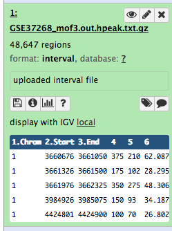
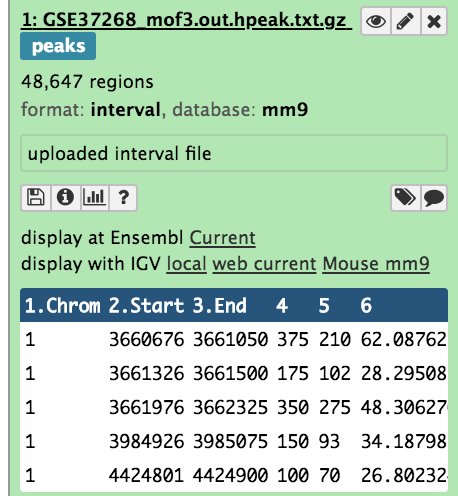
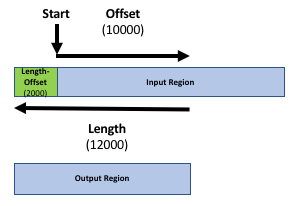
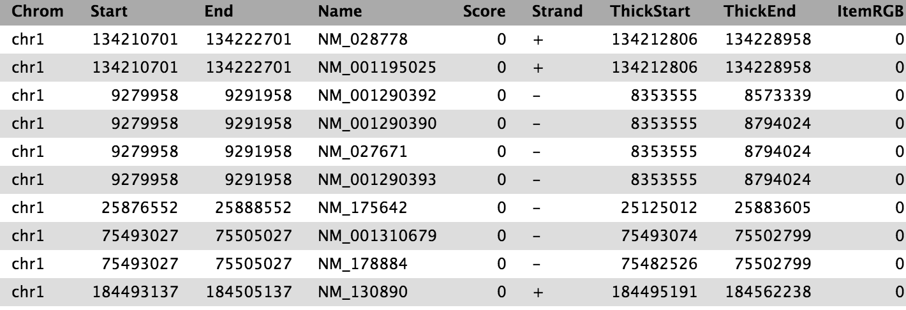
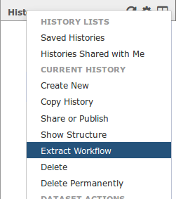
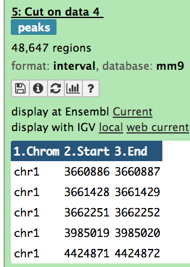
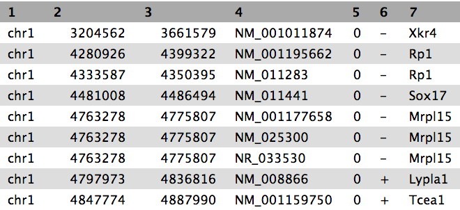

# Introduction
{:.no_toc}

We stumbled upon a paper () called *"The histone acetyltransferase MOF is a key regulator of the embryonic stem cell core transcriptional network"*. The paper contains the analysis of possible target genes of an interesting protein called Mof. The targets were obtained by ChIP-seq in mice and the raw data is available through [GEO](https://www.ncbi.nlm.nih.gov/geo/query/acc.cgi?acc=GSE37268).
However, the list of genes is neither in the supplement of the paper, nor part of the GEO submission.
The closest thing we could find is a file in GEO containing a list of the regions where the signal is significantly enriched (so called *peaks*):

1 | 3660676 | 3661050 | 375 | 210 | 62.0876250438913 | -2.00329386666667
1 | 3661326 | 3661500 | 175 | 102 | 28.2950833625942 | -0.695557142857143
1 | 3661976 | 3662325 | 350 | 275 | 48.3062708406486 | -1.29391285714286
1 | 3984926 | 3985075 | 150 | 93 | 34.1879823073944 | -0.816992
1 | 4424801 | 4424900 | 100 | 70 | 26.8023246007435 | -0.66282

**Table 1** Subsample of the available file

The goal of this exercise is to **turn this list of genomic regions into a list of possible target genes**.



> ### Agenda
>
> In this tutorial, we will deal with:
>
> 1. TOC
> {:toc}
>
{: .agenda}

# Pretreatments

> ###  Hands-on: Open Galaxy
> 1. Browse to a Galaxy instance: the one recommended by your instructor or one in the list **Galaxy instance** on the head of this page
> 2. Log in or register (top panel)
>
>    
{: .hands_on}

The Galaxy interface consist of three main parts. The available tools are listed on the left, your analysis history is recorded on the right, and the central panel will show the tools and datasets.


Let's start with a fresh history.

> ###  Hands-on: Create history
>
> 1. Make sure you have an empty analysis history.
>
>    > ###  Starting a new history
>    >
>    > * Click the  (gear) icon (**History options**)  at the top of the history panel
>    > * Select the option **Create New** from the menu
>    {: .tip}
>
> 2. **Rename your history** to make it easy to recognize
>
>    > ###  Rename a history
>    >
>    > * Click on the title of the history (by default the title is `Unnamed history`)
>    >
>    >   
>    >
>    > * Type `Galaxy Introduction` as the name
>    > * Press <kbd>Enter</kbd>
>    >
>    {: .tip}
>
{: .hands_on}

## Data upload

> ###  Hands-on: Data upload
>
> 1. Download the list of peak regions (the file [`GSE37268_mof3.out.hpeak.txt.gz`](https://www.ncbi.nlm.nih.gov/geo/download/?acc=GSE37268&format=file&file=GSE37268%5Fmof3%2Eout%2Ehpeak%2Etxt%2Egz)) from [GEO](https://www.ncbi.nlm.nih.gov/geo/query/acc.cgi?acc=GSE37268) to your computer
> 2. Click on the upload button in the upper left ot the interface
>
>    
>
> 3. Press **Choose local file** and search for your file on your computer
> 4. Select `interval` as **Type**
> 5. Press **Start**
> 6. Press **Close**
> 7. Wait for the upload to finish. Galaxy will automatically unpack the file.
>
> 8. After this you will see your first history item in Galaxy’s right pane. It will go through
> the gray (preparing/queued) and yellow (running) states to become green (success):
>
>    
>
>    Directly uploading files is not the only way to get data into Galaxy
>    
>
>    > ###  Tip: Importing data to Galaxy
>    > There are [more options]({{ site.baseurl }}) for advanced users.
>    {: .tip}
>
{: .hands_on}


> ###  Interval file format
> **Interval** format is a Galaxy format for representing genomic intervals. It is tab-separated, but has the added requirement that three of the columns must be:
> - chromosome ID
> - start position (0-based)
> - end position (end-exclusive)
>
> An optional strand column can also be specified, and an initial header row can be used to label the columns, which do not have to be in any special order. Unlike BED format (see below) arbitrary additional columns can also be present.
>
> You can find more information about formats that can be used in Galaxy at the [Galaxy Data Formats page](https://usegalaxy.org/static/formatHelp.html).
{: .comment}


> ###  Hands-on: Inspect and edit attributes of a file
>
> 1. Click on the file in the history panel
>
>    Some meta-information (e.g. format, reference database) about the file and the header of the file are then displayed, along with the number of lines in the file (48,647):
>
>    
>
> 2. Click on the  (eye) icon (**View data**) in your dataset in the history
>
>    The content of the file is displayed in the central panel
>
> 3. Click on the  (pencil) icon (**Edit attributes**) in your dataset in the history
>
>    A form to edit dataset attributes is displayed in the central panel
>
> 4. Search for `mm9` in **Database/Build** attribute and select `Mouse July 2007 (NCBI37/mm9)` (the paper tells us the peaks are from `mm9`)
> 5. Click on **Save** on the top
> 6. Add a tag called `#peaks` to the dataset to make it easier to track in the history
>    
>
>    The dataset should now look like below in the history
>
>    {: width="250px" height="300px"}
>
{: .hands_on}

In order to find the related genes to these peak regions,
we also need a list of genes in mice, which we can obtain from UCSC.

> ###  Hands-on: Data upload from UCSC
>
> 1. Search for `UCSC Main` in the tool search bar (top left)
>
>     
>
> 2. Click on `UCSC Main` 
>
>     You will be taken to the **UCSC table browser**, which looks something like this:
>
>     
>
> 3. Set the following options:
>     - *"clade"*: `Mammal`
>     - *"genome"*: `Mouse`
>     - *"assembly"*: `July 2007 (NCBI37/mm9)`
>     - *"group"*: `Genes and Gene Predictions`
>     - *"track"*: `RefSeq Genes`
>     - *"table"*: `refGene`
>     - *"region"*: `genome`
>     - *"output format"*: `BED - browser extensible data`
>     - *"Send output to"*: `Galaxy` (only)
>
> 4. Click on the **get output** button
>
>    You will see the next screen:
>
>    
>
> 5. Make sure that *"Create one BED record per"* is set to `Whole Gene`
> 6. Click on the **Send Query to Galaxy** button
> 7. Wait for the upload to finish
> 8. Rename our dataset to something more recognizable like `Genes`
>
>    
>
> 9. Add a tag called `#genes` to the dataset to make it easier to track in the history
>
{: .hands_on}

> ###  BED file format
> The **BED - Browser Extensible Data** format provides a flexible way to encode gene regions. BED lines have three required fields:
> - chromosome ID
> - start position (0-based)
> - end position (end-exclusive)
>
> There can be up to and nine additional optional fields, but the number of fields per line must be consistent throughout any single set of data.
>
> You can find more information about it at [UCSC](https://genome.ucsc.edu/FAQ/FAQformat#format1) including a description of the optional fields.
{: .comment}

Now we have collected all the data we need to start our analysis.

# Part 1: Naive approach

We will first use a "naive" approach to try to identify the genes that the peak regions are associated with. We will identify genes that overlap at least 1bp with the peak regions.

## File preparation

Let's have a look at our files to see what we actually have here.

> ###  Hands-on: View file content
>
> 1. Click on the  (eye) icon (**View data**) of the peak file to view the content of it
>
>    It should look like this:
>
>    
>
> 2. View the content of the regions of the genes from UCSC
>
>    
>
{: .hands_on}

> ###  Questions
>
> While the file from UCSC has labels for the columns, the peak file does not. Can you guess what the columns stand for?
>
>
> > ###  Solution
> >
> > This peak file is not in any standard format and just by looking at it, we cannot find out what the numbers in the different columns mean. In the paper the authors mention that they used the peak caller [HPeak](https://www.ncbi.nlm.nih.gov/pubmed/20598134).
> >
> > By looking at the HPeak manual we can find out that the columns contain the following information:
> >
> >  - chromosome name by number
> >  - start coordinate
> >  - end coordinate
> >  - length
> >  - location within the peak that has the highest hypothetical DNA fragment coverage (summit)
> >  - not relevant
> >  - not relevant
> >
> {: .solution}
{: .question}

In order to compare the two files, we have to make sure that the chromosome names follow the same format.
As we can see, the peak file lacks `chr` before any chromosome number. But what happens with chromosome 20 and 21? Will it be X and Y instead? Let's check:

> ###  Hands-on: View end of file
>
> 1. Search for **Select last**  tool and run **Select last lines from a dataset (tail)** with the following settings:
>     - *"Text file"*: our peak file `GSE37268_mof3.out.hpeak.txt.gz`
>     - *"Operation"*: `Keep last lines`
>     - *"Number of lines"*: Choose a value, e.g. `100`
> 2. Click **Execute**
> 3. Wait for the job to finish
> 4. Inspect the file through the  (eye) icon (**View data**)
>
>    > ###  Questions
>    >
>    > 1. How are the chromosomes named?
>    > 2. How are the chromosomes X and Y named?
>    >
>    > > ###  Solution
>    > > 1. The chromosomes are just given by their number. In the gene file from UCSC, they started with `chr`
>    > > 2. The chromosomes X and Y are named 20 and 21
>    > {: .solution }
>    {: .question}
{: .hands_on}

In order to convert the chromosome names we have therefore two things to do:

1. add `chr`
2. change 20 and 21 to X and Y

> ###  Hands-on: Adjust chromosome names
>
> 1. **Replace Text** : Run **Replace Text in a specific column** with the following settings:
>     - *"File to process"*: our peak file `GSE37268_mof3.out.hpeak.txt.gz`
>     - *"in column"*: `Column:1`
>     - *"Find pattern"*: `[0-9]+`
>
>         This will look for numerical digits
>
>     - *"Replace with"*: `chr&`
>
>         `&` is a placeholder for the find result of the pattern search
>
> 2. Rename your output file `chr prefix added`.
>
> 3. **Replace Text** : Let's rerun the tool with
>    - *"File to process"*: the output from the last run, `chr prefix added`
>    - *"in column"*: `Column:1`
>    - *"Find pattern"*: `chr20`
>    - *"Replace with"*: `chrX`
>
>    > ###  Tip: Rerunning a tool
>    >
>    > * Expand the dataset information
>    > * Press the  icon (**Run this job again**)
>    {: .tip}
>
> 4. Rename your output file `chrX fixed`
>
> 5. **Replace Text** : Rerun this tool to do the same for chromosome Y
>    - *"File to process"*: `chrX fixed`, the output from the last run
>    - *"in column"*: `Column:1`
>    - *"Find pattern"*: `chr21`
>    - *"Replace with"*: `chrY`
>
> 6. Inspect the latest file through the  (eye) icon. Have we been successful?
>
>    We have quite a few files now and need to take care to select the correct ones at each step.
>
>    > ###  Questions
>    >
>    > How many regions are in our output file? You can click the name of the output to expand it and see the number.
>    >
>    > > ###  Solution
>    > > It should be equal to the number of regions in your first file, `GSE37268_mof3.out.hpeak.txt.gz`: 48,647
>    > > If yours says 100 regions, then you have run it on the `Tail` file and need to re-run the steps.
>    > {: .solution }
>    {: .question}
>
> 7. Rename the file to something more recognizable, e.g. `Peak regions`
{: .hands_on}

## Analysis

Our goal is to compare the 2 region files (the genes file and the peak file from the publication)
to know which peaks are related to which genes. If you only want to know which peaks are located **inside** genes (within the gene body) you
can skip the next step. Otherwise, it might be reasonable to include the **promoter** region of the genes into the comparison, e.g. because
you want to include transcriptions factors in ChIP-seq experiments. There is no strict definition for promoter region but 2kb upstream of the TSS (start of region) is commonly used. We'll use the **Get Flanks** tool to get regions 2kb bases upstream of the start of the gene to 10kb bases downstream of the start (12kb in length). To do this we tell the Get Flanks tool we want regions upstream of the start, with an offset of 10kb, that are 12kb in length, as shown in the diagram below.



> ###  Hands-on: Add promoter region to gene records
>
> 1. **Get Flanks** : Run **Get flanks returns flanking region/s for every gene** with the following settings:
>     - *"Select data"*: `Genes` file from UCSC
>     - *"Region"*: `Around Start`
>     - *"Location of the flanking region/s"*: `Upstream`
>     - *"Offset"*: `10000`
>     - *"Length of the flanking region(s)"*: `12000`
>
>     This tool returns flanking regions for every gene
>
> 2. Compare the rows of the resulting BED file with the input to find out how the start and end positions changed
>
>    > ###  Tip: Inspecting several files using the scratchbook
>    >
>    > * Click **Enable/Disable Scratchbook** on the top panel
>    >
>    >    
>    >
>    > * Click on the  (eye) icon of the files to inspect
>    > * Click on **Show/Hide Scratchbook**
>    >
>    >    
>    {: .tip}
>
> 3. Rename your dataset to reflect your findings (`Promoter regions`)
{: .hands_on}

The output is regions that start from 2kb upstream of the TSS and include 10kb downstream. For input regions on the positive strand e.g. `chr1 134212701 134230065` this gives `chr1 134210701 134222701`. For regions on the negative strand e.g. `chr1 8349819 9289958` this gives `chr1  9279958 9291958`.

You might have noticed that the UCSC file is in `BED` format and has a database associated to it. That's what we want for our peak file as well. The **Intersect** tool we will use can automatically convert interval files to BED format but we'll convert our interval file explicitly here to show how this can be achieved with Galaxy.

> ###  Hands-on: Change format and database
>
> 1. Click on the  (pencil) icon in the history entry of our peak region file
> 2. Switch to the **Convert** tab
> 3. Select `Convert Genomic Intervals to BED`
> 4. Press **Convert datatype**
> 5. Check that the "Database/Build" is `mm9` (the database build for mice used in the paper)
> 6. Again rename the file to something more recognizable, e.g. `Peak regions BED`
{: .hands_on}

It's time to find the overlapping intervals (finally!). To do that, we want to extract the genes which overlap/intersect with our peaks.

> ###  Hands-on: Find Overlaps
>
> 1. **Intersect** : Run **Intersect the intervals of two datasets** with the following settings:
>     - *"Return"*: `Overlapping Intervals`
>     - *"of"*: the UCSC file with promoter regions (`Promoter regions`)
>     - *"that intersect"*: our peak region file from **Replace** (`Peak regions BED`)
>     - *"for at least"*: `1`
>
>    > ###  Comments
>    > The order of the inputs is important! We want to end up with a list of **genes**, so the corresponding dataset with the gene information needs to be the first input (`Promoter regions`).
>    {: .comment}
>    
{: .hands_on}

We now have the list of genes (column 4) overlapping with the peak regions, similar to shown above.

To get a better overview of the genes we obtained, we want to look at their distribution across the different chromosomes.
We will group the table by chromosome and count the number of genes with peaks on each chromosome

> ###  Hands-on: Count genes on different chromosomes
>
> 1. **Group** : Run **Group data by a column and perform aggregate operation on other columns** with the following settings:
>     - *"Select data"* to the result of the intersection
>     - *"Group by column"*:`Column 1`
>     - Press **Insert Operation** and choose:
>         - *"Type"*: `Count`
>         - *"On column"*: `Column 1`
>         - *"Round result to nearest integer?"*: `No`
>
>    > ###  Questions
>    >
>    > Which chromosome contained the highest number of target genes?
>    >
>    > > ###  Solution
>    > >
>    > > The result varies with different settings, for example, the annotation may change due to updates at UCSC. If you followed step by step, with the same annotation, it should be chromosome 11 with 1992 genes. Note that for reproducibility, you should keep all input data used because Galaxy can store all parameters but inputs may change e.g. the annotation from UCSC.
>    > {: .solution }
>    {: .question}
>
{: .hands_on}

## Visualization

Since we have some nice data, let's draw a barchart out of it!

> ###  Hands-on: Draw barchart
>
> 1. Click on  (visualize) icon on the output from the **Group** tool
> 2. Select `Bar diagram`
> 3. Choose a title at **Provide a title**, e.g. `Gene counts per chromosome`
> 4. Switch to the  **Select data** tab and play around with the settings
> 5. When you are happy, click the  **Save** visualization in the top right of the *main panel*
>
>    This will store it to your saved visualisations where you can later view, download, or share it with others.
>
{: .hands_on}

## Extracting workflow

When you look carefully at your history, you can see that it contains all steps of our analysis, from the beginning to the end. By building this history we have actually built a complete record of our analysis with Galaxy preserving all parameter settings applied at every step.
Wouldn't it be nice to just convert this history into a workflow that we'll be able to execute again and again?

Galaxy makes this very simple with the `Extract workflow` option. This means that any time you want to build a workflow, you can just perform it manually once, and then convert it to a workflow, so that next time it will be a lot less work to do the same analysis. It also allows you to easily share or publish your analysis.

> ###  Hands-on: Extract workflow
>
> 1. **Clean up** your history
>
>    If you had any failed jobs (red), please remove those datasets from your history by clicking on the  (cross) button. This will make the creation of a workflow easier.
>
> 2. Go to the history **History options** ( (gear) icon)
> 3. Select the `Extract Workflow` option.
>
>    
>
>    The central panel will change and you will be able to choose which steps to include/exclude and how to name the newly created workflow.
>
> 4. **Uncheck** any steps that shouldn't be included in the workflow
>
>    Since we did some steps which where specific to our custom peak file, we might want to exclude:
>    - **Select last** 
>    - all **Replace Text**  steps
>    - **Convert Genomic Intervals to BED**
>    - **Get flanks** 
>
> 5. Rename the workflow to something descriptive, e.g. `From peaks to genes`
>
> 6. Click on the **Create Workflow** button near the top.
>
>    You will get a message that the workflow was created. But where did it go?
>
> 7. Click on **Workflow** in the top menu of Galaxy
>
>    Here you have a list of all your workflows
>
> 8. Select the newly generated workflow and click on **Edit**
>
>    You should see something similar to this:
>
>    
>
>    > ###  The workflow editor
>    > We can examine the workflow in Galaxy's workflow editor. Here you can view/change the parameter settings of each step, add and remove tools, and connect an output from one tool to the input of another, all in an easy and graphical manner. You can also use this editor to build workflows from scratch.
>    {: .comment}
>
>     Although we have our two inputs in the workflow they are missing their connection to the first tool (**Intersect** ), because we didn't carry over some of the intermediate steps.
>
> 9. Connect each input dataset to the **Intersect**  tool by dragging the arrow pointing outwards on the right of its box (which denotes an output) to an arrow on the left of the **Intersect** box pointing inwards (which denotes an input)
> 10. Rename the input datasets to `Reference regions` and `Peak regions`
> 11. Click on the  (gear) icon at the top right
> 12. Press **Auto Re-layout** to clean up our view
>     
> 13. Click on the  (gear) icon at the top right
> 14. Press **Save** to save your changes
>
>    > ###  Tip: Hiding intermediate steps
>    > When a workflow is executed, the user is usually primarily interested in the final product and not in all intermediate steps. By default all the outputs of a workflow will be shown, but we can explicitly tell Galaxy which output to show and which to hide for a given workflow. This behaviour is controlled by the little asterisk next to every output dataset:
>    >
>    > 
>    >
>    > If you click on this asterisk for any of the output datasets, then *only* files with an asterisk will be shown, and all outputs without an asterisk will be hidden (Note that clicking *all* outputs has the same effect as clicking *none* of the outputs, in both cases all the datasets will be shown).
>    {: .tip}
>
{: .hands_on}

Now it's time to reuse our workflow for a more sophisticated approach.

# Part 2: More sophisticated approach

In part 1 we used an overlap definition of 1 bp (default setting) to identify genes associated with the peak regions. However, the peaks could be broad, so instead, in order to get a more meaningful definition, we could identify the genes that overlap where most of the reads are concentrated, the **peak summit**. We will use the information on the position of the peak summit contained in the original peak file and check for overlap of the summits with genes.

## Preparation

We again need our peak file, but we'd like to work in a clean history. Instead of uploading it twice, we can copy it to a new history.

> ###  Hands-on: Copy history items
>
> 1. Create a new history and give it a new name like `Galaxy Introduction Part 2`
>
>    If you have forgotten how to do that, you can check the beginning of this tutorial.
>
> 2. Click on the **View all histories** ( icon) at the top right of your history
>
>       You should see both of your histories side-by-side now
>
> 3. Drag and drop the edited peak file (`Peak regions`, after the replace steps), which contains the summit information, to your new history.
> 4. Click on **Analyze Data** in the top menu bar to go back to your analysis window
>
{: .hands_on}

## Create peak summit file

We need to generate a new BED file from the original peak file that contains the positions of the peak summits. The start of the summit is the start of the peak (column 2) plus the location within the peak that has the highest hypothetical DNA fragment coverage (column 5). As the end of the peak region, we will simply define `start + 1`.

> ###  Hands-on: Create peak summit file
>
> 1. **Compute an expression on every row**  with the following parameters:
>   - *"Add expression"*: `c2+c5`
>   - *"as a new column to"*: our peak file `Peak regions` (the interval format file)
>   - *"Round result?"*: `YES`
>
>   This will create an 8th column in our table, which we will use in our next step:
>
> 2. Rename the output `Peak regions new column`
>
> 3. **Compute an expression on every row** : rerun this tool on the last result with:
>   - *"Add expression"*: `c8+1`
>   - *"as a new column to"*: the `Peak regions new column` file we just created
>   - *"Round result?"*: `YES`
>
> 4. Rename this file `Peak summit regions`
{: .hands_on}

Now we cut out just the chromosome plus the start and end of the summit:

> ###  Hands-on: Cut out columns
> 1. **Cut** : Run **Cut columns from a table** with the following settings:
>   - *"Cut columns"*: `c1,c8,c9`
>   - *"Delimited by Tab"*: `Tab`
>   - *"From"*: `Peak summit regions`
>
>    The output from **Cut** will be in `tabular` format.
>
> 2. Change the format to `interval` (use the ) since that's what the tool **Intersect** expects.
>
>    
>
>    The output should look like below:
>
>    {: width="200px"}
{: .hands_on}

## Get gene names

The RefSeq genes we downloaded from UCSC did only contain the RefSeq identifiers, but not the gene names. To get a list of gene names in the end, we use another BED file from the Data Libraries.

> ###  Comments
> There are several ways to get the gene names in, if you need to do it yourself. One way is to retrieve a mapping through Biomart and then join the two files (**Join two Datasets side by side on a specified field** ). Another is to get the full RefSeq table from UCSC and manually convert it to BED format.
{: .comment}

> ###  Hands-on: Data upload
>
> 1. From [Zenodo](https://zenodo.org/record/1025586) or from the data library, import the file `mm9.RefSeq_genes_from_UCSC.bed`
>
>    ```
>    https://zenodo.org/record/1025586/files/mm9.RefSeq_genes_from_UCSC.bed
>    ```
>
>    
>
>    
>
>    As default, Galaxy takes the link as name, so rename them.
>
> 2. Inspect the file content to check if it contains gene names.
>    It should look similar to below:
>    
>
> 3. Rename it `mm9.RefSeq_genes`
> 4. Apply the tag `#genes`
>
{: .hands_on}

## Repeat workflow

It's time to reuse the workflow we created earlier.

> ###  Hands-on: Run a workflow
> 1. Open the workflow menu (top menu bar)
> 2. Find the workflow you made in the previous section, and select the option **Run**
> 3. Choose as inputs our `mm9.RefSeq_genes` (`#genes`) BED file and the result of the **Cut** tool (`#peaks`)
> 4. Click **Run workflow**
>
>    The outputs should appear in the history but it might take some time until they are finished.
>
{: .hands_on}

We used our workflow to rerun our analysis with the peak summits. The **Group** tool again produced a list containing the number of genes found in each chromosome.
But wouldn't it be more interesting to know the number of peaks in each unique gene? Let's rerun the workflow with different settings!

> ###  Hands-on: Run a workflow with changed settings
> 1. Open the workflow menu (top menu bar)
> 2. Find the workflow you made in the previous section, and select the option **Run**
> 3. Choose as inputs our `mm9.RefSeq_genes` (`#genes`) BED file and the result of the **Cut** tool (`#peaks`)
> 4. Click on the title of the  **Group** tool to expand the options.
> 5. Change the following settings by clicking on the  (pencil) icon on the left:
>     - *"Group by column"*: `7`
>     - In *"Operation"*:
>       - *"On column"*: `7`
> 6. Click **Run workflow**
{: .hands_on}

Congratulations! You should have a file with all the unique gene names and a count on how many peaks they contained.

> ###  Questions
>
> The list of unique genes is not sorted. Try to sort it on your own!
>
> > ###  Solution
> > You can use the tool "Sort data in ascending or descending order" on column 2 and "fast numeric sort".
> {: .solution }
{: .question}


# Share your work

One of the most important features of Galaxy comes at the end of an analysis. When you have published striking findings, it is important that other researchers are able to reproduce your in-silico experiment. Galaxy enables users to easily share their workflows and histories with others.

To share a history, click on the  (gear) symbol in the history pane and select `Share or Publish`. On this page you can do 3 things:

1. **Make accessible via Link**

    This generates a link that you can give out to others. Anybody with this link will be able to view your history.

2. **Publish History**

    This will not only create a link, but will also publish your history. This means your history will be listed under `Shared Data → Published Histories` in the top menu.

3. **Share with Individual Users**

    This will share the history only with specific users on the Galaxy instance.


> ###  Hands-on: Share history and workflow
>
> 1. Share one of your histories with your neighbour
> 2. See if you can do the same with your workflow!
> 3. Find the history and/or workflow shared by your neighbour
>
>    Histories shared with specific users can be accessed by those users in their history menu ( (gear) icon) under `Histories shared with me`.
>
{: .hands_on}

# Conclusion
{:.no_toc}

 You have just performed your first analysis in Galaxy. You also created a workflow from your analysis so you can easily repeat the exact same analysis on other datasets. Additionally you shared your results and methods with others.
