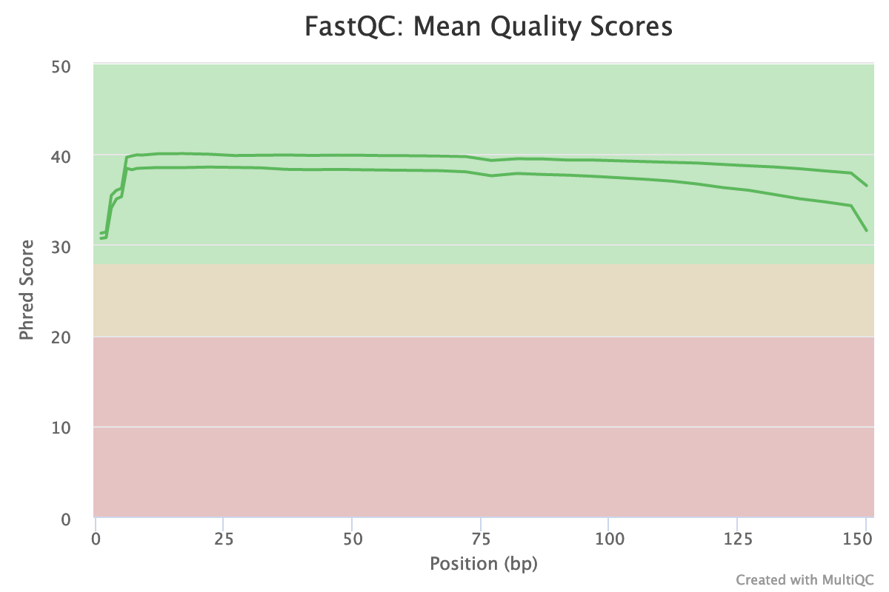
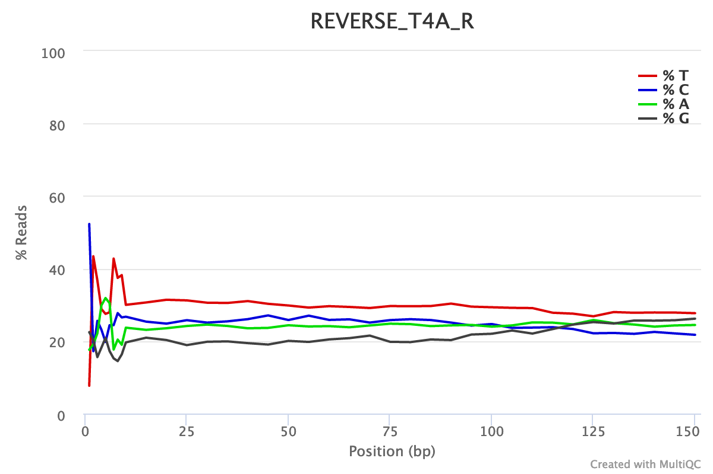
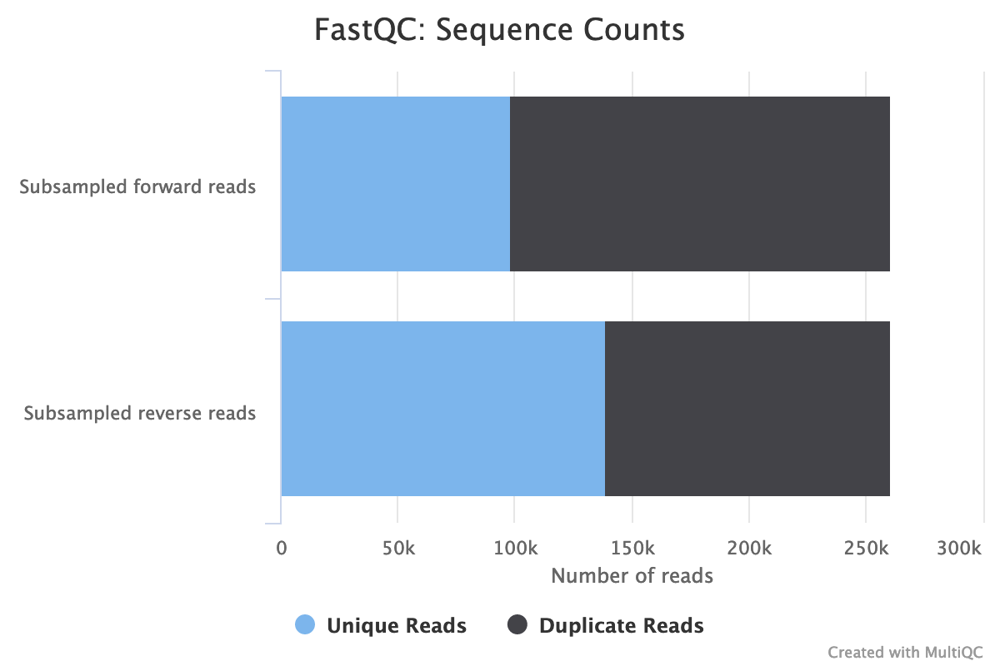
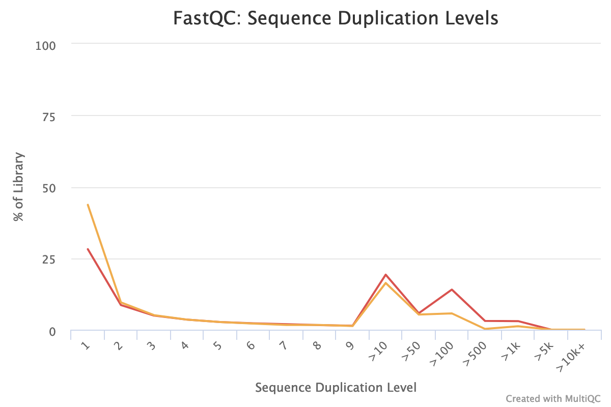
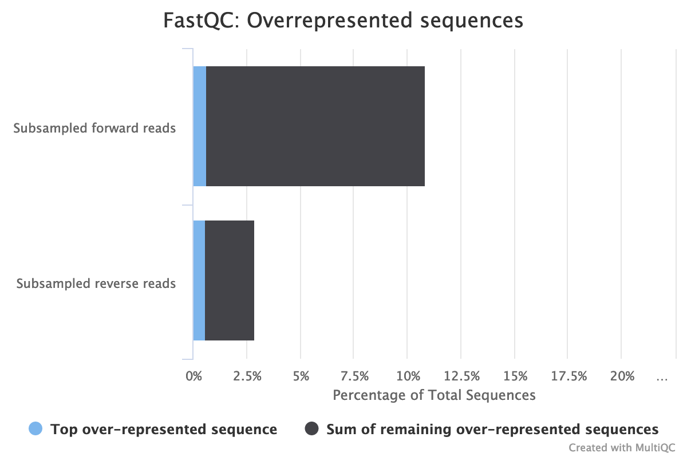
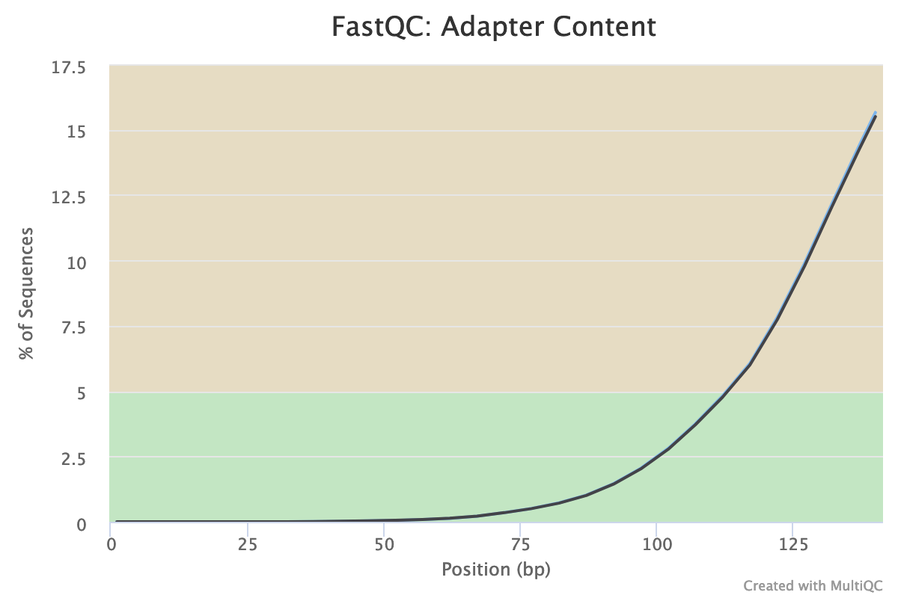
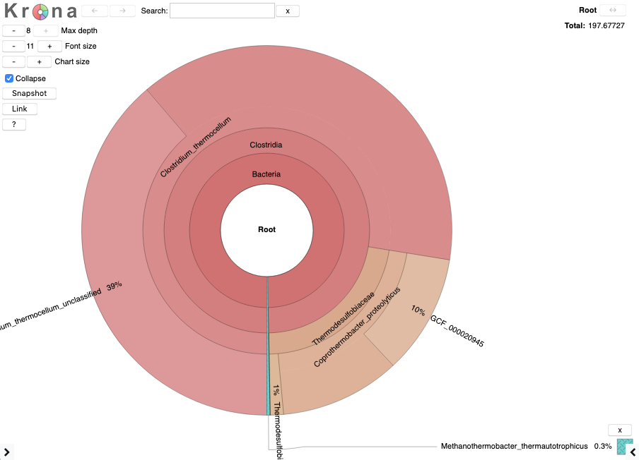
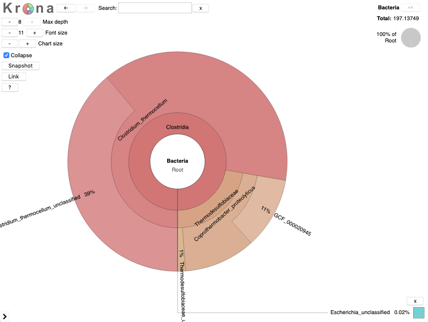
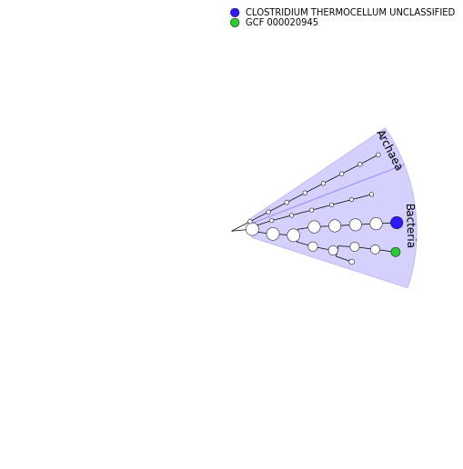
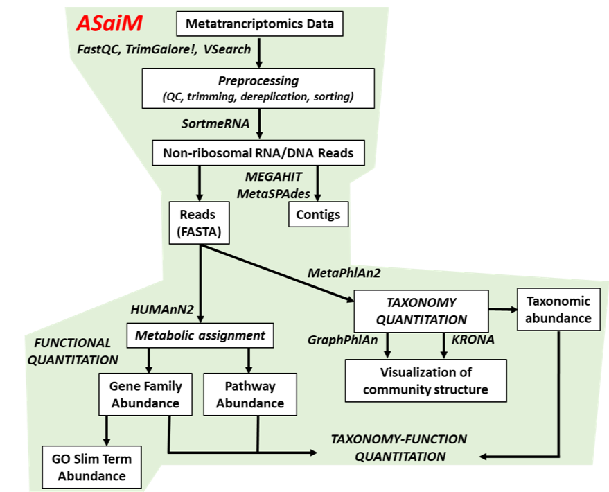

# Introduction
{:.no_toc}

Microbiomes play a critical role in host health, disease, and the environment. The study of microbiota and microbial communities has been facilitated by the evolution of technologies, specifically the sequencing techniques. We can now study the microbiome dynamics by investigating the DNA content (metagenomics), RNA expression (metatranscriptomics), protein expression (metaproteomics) or small molecules (metabolomics):


New generations of sequencing platforms coupled to numerous bioinformatics tools have led to a spectacular technological progress in metagenomics and metatranscriptomics to investigate complex microorganism communities. These techniques are giving insight into taxonomic profiles and genomic components of microbial communities. Metagenomics is packed with information about the present taxonomies in a microbiome, but do not tell much about important functions. That is where metatranscriptomics and metaproteomics play a big part.


In this tutorial, we will focus on **metatranscriptomics**. 

Metatranscriptomics analysis enables understanding of how the microbiome responds to the environment by studying the functional analysis of genes expressed by the microbiome. It can also estimate the taxonomic composition of the microbial population. It provides scientists with the confirmation of predicted open‐reading frames (ORFs) and potential identification novel sites of transcription and/or translation from microbial genomes. Metatranscriptomics can enable more complete generation of protein sequences databases for metaproteomics.

To illustrate how to analyze metatranscriptomics data, we will use data from time-serie analysis of a microbial community inside a bioreactor (). They generated metatranscriptomics data for 3 replicates over 7 time points. RNAs were enriched by rRNA depletion and treated with DNAse and library was prepared with the TruSeq stranded RNA sample preparation, which included the production of a cDNA library. 

In this tutorial, we focus on biological replicate A of the 1st time point, but [in a follow-up tutorial we illustrate how compare the results over the different time points and replicates]({{ site.baseurl }}). The input files used here are trimmed version of the original file for the purpose of saving time and resources. 

To analyze the data, we will follow the ASaiM workflow and explain it step by step. ASaiM () is an open-source Galaxy-based workflow that enables microbiome analyses. It's workflow offers a streamlined Galaxy workflow for users to explore metagenomic/metatranscriptomic data in a reproducible and transparent environment. The ASaiM workflow has been updated by the **GalaxyP** team (University of Minnesota) to perform metatranscriptomics analysis of large microbial datasets.

This workflow takes in paired-end datasets of raw shotgun sequences (in FastQ format) as an input and:
1. preprocess
2. extract and analyze the community structure (taxonomic information)
2. extract and analyze the community functions (functional information)
3. combine taxonomic and functional information to offer insights into taxonomic contribution to a function or functions expressed by a particular taxonomy.

> ###  Workflow also applicable to metagenomics data
> The approach with the tools described here can also apply to metagenomics data. What will change are the quality control profiles and proportion of rRNA sequences.
{: .comment}

> ### Agenda
>
> In this tutorial, we will cover:
>
> 1. TOC
> {:toc}
>
{: .agenda}

# Data upload

> ###  Hands-on: Data upload
>
> 1. Create a new history for this tutorial and give it a proper name
>
>    
>    
>
> 2. Import `T1A_forward` and `T1A_reverse` from [Zenodo](https://zenodo.org/record/3362849) or from the data library (ask your instructor)
>
>    ```
>    {{ page.zenodo_link }}/files/T1A_forward.fastqsanger
>    {{ page.zenodo_link }}/files/T1A_reverse.fastqsanger
>    ```
>
>    
>    
> Or Go to Upload file tool and copy These into your Paste/Fetch data 
> T1A_Forward: https://zenodo.org/record/3362849/files/T1A_forward.fastqsanger?download=1
> T1A_Reverse: https://zenodo.org/record/3362849/files/T1A_reverse.fastqsanger?download=1
>    As default, Galaxy takes the link as name, so rename them.
>
> 3. Rename the file to `T1A_forward` and `T1A_reverse`
>
>    
>
> 4. Check that the datatype is `fastqsanger` (e.g. **not** `fastq`). If it is not, please change the datatype to `fastqsanger`.
>
>    
>
{: .hands_on}

# Pretreatments

## Quality control

During sequencing, errors are introduced, such as incorrect nucleotides being called. These are due to the technical limitations of each sequencing platform. Sequencing errors might bias the analysis and can lead to a misinterpretation of the data.

Sequence quality control is therefore an essential first step in your analysis. We will use similar tools as described in the ["Quality control" training]({{site.baseurl}}): [FastQC](https://www.bioinformatics.babraham.ac.uk/projects/fastqc/) and [Cutadapt](https://cutadapt.readthedocs.io/en/stable/guide.html).

> ###  Hands-on: Quality control
>
> 1. **FastQC**  with the following parameters:
>       -  *"Short read data from your current history"*: both `T1A_forward` and `T1A_reverse` datasets selected with **Multiple datasets**
>
>    
>
> 2. Inspect the webpage output of **FastQC**  for the `T1A_forward` dataset
>
>    > ###  Questions
>    >
>    > What is the read length?
>    >
>    > > ###  Solution
>    > >
>    > > The read length is 151 bp.
>    > >
>    > {: .solution}
>    >
>    {: .question}
>
> 3. **MultiQC**  with the following parameters to aggregate the FastQC reports:
>      - In *"Results"*
>        - *"Which tool was used generate logs?"*: `FastQC`
>        - In *"FastQC output"*
>           - *"Type of FastQC output?"*: `Raw data`
>           -  *"FastQC output"*: `Raw data` files (output of **FastQC** )
> 4. Select both the Raw files.
> 5. Inspect the webpage output from MultiQC for each FASTQ
>
{: .hands_on}

> ###  Questions
>
> 1. How many sequences does each file have?
> 2. How is the quality score over the reads? And the mean score?
> 3. Is there any bias in base content?
> 4. How is the GC content?
> 5. Are there any unindentified bases?
> 6. Are there duplicated sequences?
> 7. Are there over-represented sequences?
> 8. Are there still some adapters left?
> 9. What should we do next?
>
> > ###  Solution
> >
> > 1. Both files have 260,554 sequences
> > 2. The "Per base sequence quality" is globally good: the quality stays around 40 over the reads, with just a slight decrease at the end (but still higher than 35)
> >
> >    
> >
> >    The reverse reads have a slight worst quality than the forward, a usual case in Illumina sequencing.
> >
> >    The distribution of the mean quality score is almost at the maximum for the forward and reverse reads:
> >
> >    
> >
> > 3. For both forward and reverse reads, the percentage of A, T, C, G over sequence length is biased. As for any RNA-seq data or more generally libraries produced by priming using random hexamers, the first 10-12 bases have an intrinsic bias.
> >
> >    
> >
> >    
> >
> >    We could also see that after these first bases the distinction between C-G and A-T groups is not clear as expected. It explains the error raised by FastQC.
> >
> > 4. With sequences from random position of a genome, we expect a normal distribution of the %GC of reads around the mean %GC of the genome. Here, we have RNA reads from various genomes. We do not expect a normal distribution of the %GC. Indeed, for the forward reads, the distribution shows with several peaks: maybe corresponding to mean %GC of different organisms.
> >
> >    
> >
> > 5. Almost no N were found in the reads: so almost no unindentified bases
> >
> >    
> >
> > 6. The forward reads seem to have more duplicated reads than the reverse reads with a rate of duplication up to 60% and some reads identified over 10 times. 
> >
> >    
> >    
> >
> >    In data from RNA (metatranscriptomics data), duplicated reads are expected. The low rate of duplication in reverse reads could be due to bad quality: some nucleotides may have been wrongly identified, altering the reads and reducing the duplication.
> >
> > 7. The high rate of overrepresented sequences in the forward reads is linked to the high rate of duplication.
> >
> >    
> > 
> > 8. Illumina universal adapters are still present in the reads, especially at the 3' end.
> >
> >    
> >
> > 10. After checking what is wrong, we should think about the errors reported by FastQC: they may come from the type of sequencing or what we sequenced (check the ["Quality control" training]({{site.baseurl}}): [FastQC](https://www.bioinformatics.babraham.ac.uk/projects/fastqc/) for more details): some like the duplication rate or the base content biases are due to the RNA sequencing. However, despite these challenges, we can still get slightly better sequences for the downstream analyses.
> {: .solution} 
{: .question}

Using Cutadapt, we can trim sequenced reads to remove bases that were sequenced with less certainty (= low-quality bases) at the read ends in addition to removing reads of overall bad quality 

**Cutadapt** also helps find and remove adapter sequences, primers, poly-A tails and/or other unwanted sequences from the input FASTQ files. It trims the input reads by finding the adapter or primer sequences in an error-tolerant way. Additional features include modifying and filtering reads.

> ###  Questions
>
> Are there any other tool which can perform similar functions?
>
>   > ###  Solution
>   >
>   > Yes, there are many tools such as Trimmomatic, Trim Galore, Clip, trim putative adapter sequences. etc. We choose Cutadapt here because it is error tolerant, it is fast and the version is pretty stable.
>   {: .solution}
>
{: .question}

> ###  Hands-on: Quality control
>
> 1. **Cutadapt**  with the following parameters to trim low quality sequences:
>    - *"Single-end or Paired-end reads?"*: `Paired-end`
>       -  *"FASTQ/A file #1"*: `T1A_forward`
>       -  *"FASTQ/A file #2"*: `T1A_reverse`
>
>      The order is important here!
>
>    - In *"Filter Options"*
>       - *"Minimum length"*: `150`
>    - In *"Read Modification Options"*
>       - *"Quality cutoff"*: `20`
>    - In *"Output Options"*
>       - *"Report"*: `Yes`
>
>      
>
> 2. Inspect the generated txt files (`Report`)
>
>    > ###  Questions
>    >
>    > 1. How many basepairs has been removed from the forwards reads because of bad quality? And from the reverse reads?
>    > 2. How many sequence pairs have been removed because at least one read was shorter than the length cutoff?
>    >
>    > > ###  Solution
>    > > 1. 203,654 bp has been trimmed for the forward read (read 1) and 569,653 bp bp on the reverse (read 2). It is not a surprise: we saw that at the end of the sequences the quality was dropping more for the reverse reads than for the forward reads.
>    > > 2. 1,500 (0.6%) reads were too short after trimming and then filtered.
>    > {: .solution }
>    {: .question}
{: .hands_on}

## Ribosomal RNA fragments filtering

Metatranscriptomics sequencing targets any RNA in a pool of micro-organisms. The highest proportion of the RNA sequences in any organism will be ribosomal RNAs. These rRNAs are useful for the taxonomic assignment (i.e. which organisms are found) but they do not provide any functional information, (i.e. which genes are expressed) To make the downstream functional annotation faster, we will sort the rRNA sequences using **SortMeRNA** (). It can handle large RNA databases and sort out all fragments matching to the database with high accuracy and specificity:


> ###  Hands-on: Ribosomal RNA fragments filtering
>
> 1. **Filter with SortMeRNA**  with the following parameters:
>    - *"Sequencing type"*: `Reads are paired`
>       -  *"Forward reads"*: the `Read 1 Output` (outputs of **Cutadapt** )
>       -  *"Reverse reads"*: the `Read 2 Output` (outputs of **Cutadapt** )
>       - *"If one of the paired-end reads aligns and the other one does not"*: `Output both reads to rejected file (--paired_out)`
>    - *"Which strands to search"*: `Search both strands`
>    - *"Databases to query"*: `Public pre-indexed ribosomal databases`
>       - *"rRNA databases"*: select all (`rfam-5s-database-id98`, `silva-arc-23s-id98`, `silva-euk-28s-id98`, `silva-bac-23s-id98`, `silva-euk-18s-id95`, `silva-bac-16s-id90`, `rfam-5.8s-database-id98`, `silva-arc-16s-id95`)
>    - *"Include aligned reads in FASTA/FASTQ format?"*: `Yes (--fastx)`
>       - *"Include rejected reads file?"*: `Yes`
>    - *"Generate statistics file"*: `Yes`
>    - *"Alignment report"*: `Do not report alignments`
>    - *"E-value threshold"*: `1`
>    - *"SW score for a match"*: `2`
>    - *"SW penalty for a mismatch"*: `-3`
>    - *"SW penalty for introducing a gap"*: `5`
>    - *"SW penalty for extending a gap"*: `2`
>    - *"SW penalty for ambiguous letters (N’s)"”*: `-3`
>
> 2. Expand the aligned and unaligned forward reads
>
>    > ###  Questions
>    >
>    > How many sequences have been identified as rRNA and non rRNA?
>    >
>    > > ###  Solution
>    > > 
>    > > Aligned forward read file has 1,947 sequences and the unaligned 2,858 sequences. Then 1,947 reads have been identified as rRNA and 2,858 as non rRNA. The numbers are the same for the reverse reads. 
>    > > 
>    > {: .solution }
>    {: .question}
>
> 2. Inspect the log file (`Log`)
>
>    > ###  Questions
>    >
>    > 1. How many reads have been processed?
>    > 2. How many reads have been identified as rRNA given the log file? 
>    > 3. Which type of rRNA are identified? Which organisms are we then expected to identify?
>    >
>    > > ###  Solution
>    > > 1. 518,108 reads are processed: 259,054 for forward and 259,054 for reverse (given the **Cutadapt** report)
>    > > 2. Out of the 518,108 reads, 136,622 (26%) have passed the e-value threshold and are identified as rRNA. The proportion of rRNA sequences is then quite high (around 40%), compared to metagenomics data where usually they represent < 1% of the sequences. Indeed there are only few copies of rRNA genes in genomes, but they are expressed a lot for the cells.
>    > >    Some of the aligned reads are forward (resp. reverse) reads but the corresponding reverse (resp. forward) reads are not aligned. As we choose *"If one of the paired-end reads aligns and the other one does not"*: `Output both reads to rejected file (--paired_out)`, if one read in a pair does not align, both go to unaligned.
>    > > 3. The 20.18% rRNA reads are 23S bacterial rRNA, 2.62% 16S bacterial rRNA and 2.22% 18S eukaryotic rRNA. We then expect to identify mostly bacteria but also probably some archae (18S eukaryotic rRNA).
>    > {: .solution }
>    {: .question}
>
{: .hands_on}

## Interlace forward and reverse reads

Tools for taxonomic and functional annotations need a single file as input, even with paired-end data. We need to join the two separate files (forward and reverse) to create a single interleaced file, using **FASTQ interlacer**, in which the forward reads have `/1` in their id and reverse reads `/2`. The join is performed using sequence identifiers (headers), allowing the two files to contain differing ordering. If a sequence identifier does not appear in both files, it provides a separate file.

We will run **FASTQ interlacer** on the outputs of **Cutadapt** and on the unaligned (non rRNA) reads from **SortMeRNA**.

> ###  Hands-on: 
>
> 1. **FASTQ interlacer**  with the following parameters:
>    - *"Type of paired-end datasets"*: `2 separate datasets`
>       -  *"Left-hand mates"*: `Read 1 Output` (outputs of **Cutadapt** )
>       -  *"Right-hand mates"*: `Read 2 Output` (outputs of **Cutadapt** )
>
> 2. Rename the pair output to `Interlaced QC controlled reads` 
>
>    
>
> 3. Change the datatype to `fastq`
>
>    
>
> 4. **FASTQ interlacer**  with the following parameters:
>   - *"Type of paired-end datasets”*: `2 separate datasets`
>      -  *"Left-hand mates"*: `Unaligned Forward reads` (output of **SortMeRNA** )
>      -  *"Right-hand mates"*: `Unaligned Reverse reads` (output of **SortMeRNA** )
>
> 5. Rename the pair output to `Interlaced non rRNA reads`
{: .hands_on}

# Extraction of the community profile

The first important information to get from microbiome data is the community structure: which organisms are present and in which abundance. This is called taxonomic profiling. Different approaches can be used:

- Identification and classification of OTUs, as used in amplicon data

   Such an approach first requires sequence sorting to extract only the 16S and 18S sequences, then again using the same tools as for amplicon data. However, because rRNA sequences represent less than 50% of the raw sequences, this approach is not the most statistically supported

- Assignment of taxonomy on the whole sequences using databases with marker genes

In this tutorial, we follow second approach using **MetaPhlAn2** (). This tool uses a database of ~1M unique clade-specific marker genes (not only the rRNA genes) identified from ~17,000 reference (bacterial, archeal, viral and eukaryotic) genomes. We will use the `Interlaced QC controlled reads` file with all reads (not only the non rRNAs) because the rRNAs reads are good marker genes.

> ###  Hands-on: Extract the community structure
>
> 1. **MetaPhlAn2**  with the following parameters:
>    -  *"Input file"*: `Interlaced QC controled reads` 
>    - *"Database with clade-specific marker genes"*: `Locally cached`
>      - *"Cached database with clade-specific marker genes"*: `MetaPhlAn2 clade-specific marker genes`
>    - *"Type of analysis to perform"*: `Profiling a metagenomes in terms of relative abundances`
>      - *"Taxonomic level for the relative abundance output"*: `All taxonomic levels`
>    - *"Profile viral organisms?"*: `Yes`
>    - *"Profile eukaryotic organisms?"*: `Yes`
>    - *"Profile bacteria organisms?"*: `Yes`
>    - *"Profile archea organisms?"*: `Yes`
>
{: .hands_on}

This step may take a couple of minutes as each sequence is compare to the full database with ~1 million reference sequences.

3 files are generated:

- A SAM file with the results of the sequence mapping via the reference database.

- A BIOM file with the same information as the previous file but in BIOM format

    BIOM format is quite common in microbiomics. This is standard, for example, as the input for tools like mothur or QIIME.

- A tabular file with the community structure

    ```
    #SampleID	Metaphlan2_Analysis
    k__Bacteria	99.73011
    k__Archaea	0.26989
    k__Bacteria|p__Firmicutes	99.68722
    k__Archaea|p__Euryarchaeota	0.26989
    k__Bacteria|p__Proteobacteria	0.04289
    ```

    Each line contains a taxa and its relative abundance found for our sample. The file starts with high level taxa (kingdom: `k__`) and go to more precise taxa.

    > ###  Questions
    >
    > 1. How many taxon have been identified?
    > 2. What are the different taxonomic levels we have access to with MetaPhlAn2?
    > 3. What genus and species are found in our sample?
    > 4. Has only bacteria been identified in our sample?
    >
    > > ###  Solution
    > > 1. The file has 28 lines, including an header. Therefore, 27 taxons of different levels have been identified
    > > 2. We have access: kingdom (`k__`), phylum (`p__`), class (`c__`), order (`o__`), family (`f__`), genus (`g__`), species (`s__`), strain (`t__`)
    > > 3. In our sample, we identified:
    > >     - 4 genera (Clostridium, Coprothermobacter, Methanothermobacter, Escherichia) and 1 genus unclassified (Thermodesulfobiaceae unclassified)
    > >     - 4 species (Clostridium thermocellum, Coprothermobacter proteolyticus, Methanothermobacter thermautotrophicus) and 1 unclassified species  (Escherichia unclassified)
    > > 4. As expected from the rRNA sorting, we have some archaea, Methanobacteria, in our sample.
    > {: .solution }
    {: .question}

> ###  Analyzing an isolated metatranscriptome
> 
> We are analyzing our RNA reads as we would do for DNA reads. This approach has one main caveat. In **MetaPhlAn2**, the species are quantified based on the recruitment of reads to species-specific marker genes. In metagenomic data, each genome copy is assumed to donate ~1 copy of each marker. But the same assumption cannot be made for RNA data: markers may be transcribed more or less within a given species in this sample compared to the average transcription rate. A species will still be detected in the metatranscriptomic data as long as a non-trivial fraction of the species' markers is expressed.
>
> We should then carefully interpret the species relative abundance. These values reflect species' relative contributions to the pool of species-specific transcripts and not the overall transcript pool. 
{: .warning}

## Extract abundance at the different taxonomic levels

> ###  Hands-on: Format MetaPhlAn2 output
>
> 1. **Format MetaPhlAn2 output**  with the following parameters:
>    -  *"Input file (MetaPhlAN2 output)"*: `Community profile` (output of **MetaPhlAn2**)
>
>     > ###  Questions
>     > 
>     > 1. What does **Format MetaPhlAn2 output** do?
>     > 2. What is the need for formatting the data?
>     >
>     > > ###  Solution
>     > >
>     > > This tool formats the output file of MetaPhlan2 containing community content (abundance) at all taxonomic levels (from kingdom to strains).
>     > >  9 files are generated: one file per taxonomic level with abundance for corresponding clades and one file combining all taxonomic levels and corresponding abundances.
>     > >
>     > > 2. This tool helps in simplifying the data for easy interpretation.
>     > >
>     > {: .solution}
>     {: .question}
>
{: .hands_on}

## Community structure visualization

Even if the output of MetaPhlAn2 can be easy to parse, we want to visualize and explore the community structure. 2 tools can be used there:

- **Krona** for an interactive HTML output
- **Graphlan** for a publication ready visualization

> ###  Hands-on: Interactive community structure visualization with KRONA
>
> 1. **Format MetaPhlAn2 output for Krona**  with
>    -  *"Input file (MetaPhlAN2 output)"*: `Community profile` (output of **MetaPhlAn2**)
>
> 2. **Krona pie chart**  with
>    - *"What is the type of your input data"*: `Tabular`
>       -  *"Input file"*: output of **Format MetaPhlAn2 output for Krona**
>
> 3. Inspect the Krona output
{: .hands_on}

**Krona**  renders results of a metagenomic profiling as a zoomable pie chart. It allows hierarchical data, here taxonomic levels, to be explored with zooming, multi-layered pie charts

> ###  Questions
>
> 1. What are the abundances of 2 kingdoms identified here?
>    
>    
>
> 2. When zooming on bacteria, what are the 2 subclasses identified?
>
>    
>
> > ###  Solution
> >
> > 1. Archaea represents 0.3% so bacteria are 99.7% of the organisms identified in our sample
> > 2. 0.02% of bacteria are Enterobacteriales and the rest Clostridia.
> {: .solution}
{: .question}

**GraPhlAn** is another software tool for producing high-quality circular representations of taxonomic and phylogenetic trees. It takes a taxonomic tree file as the input. We first need to convert the **MetaPhlAn2** output using **export2graphlan**. This conversion software tool produces both annotation and tree file for GraPhlAn.

> ###  Hands-on: Publication-ready community structure visualization with KRONA
>
> 1. **Export to GraPhlAn**  with the following parameters:
>    -  *"Input file"*: `Community profile` (output of **MetaPhlAn2**)
>    - *"List which levels should be annotated in the tree"*: `1,2`
>    - *"List which levels should use the external legend for the annotation"*: `3,4,5`
>    - *"List which levels should be highlight with a shaded background"*: `1`
> 
> 2. **Generation, personalization and annotation of tree**  with the following parameters:
>    -  *"Input tree"*: `Tree` (output of **Export to GraPhlAn**)
>    -  *"Annotation file"*: `Annotation` (output of **Export to GraPhlAn**)
>
> 3. **GraPhlAn**  with the following parameters:
>    -  *"Input tree"*: `Tree in PhyloXML`
>    - *"Output format"*: `PNG`
>
> 4. Inspect **GraPhlAn** output
{: .hands_on}




# Extract the functional information

We would now like to answer the question "What are the micro-organisms doing?" or "Which functions are performed by the micro-organisms in the environment?".

In the metatranscriptomics data, we have access to the genes that are expressed by the community. We can use that to identify genes, their functions, and build pathways, etc., to investigate their contribution to the community using **HUMAnN2** (). **HUMAnN2** is a pipeline developed for efficiently and accurately profiling the presence/absence and abundance of microbial pathways in a community from metagenomic or metatranscriptomic sequencing data.

To identify the functions made by the community, we do not need the rRNA sequences, specially because they had noise and will slow the run. We will then use the output of **SortMeRNA**, but also the identified community profile from **MetaPhlAn2**. This will help **HUMAnN2** to focus on the know sequences for the identified organisms.

> ###  Hands-on: Extract the functional information
> 1. **HUMAnN2**  with the following parameters:
>    -  *"Input sequence file"*: `Interlaced non rRNA reads`
>    - *"Use of a custom taxonomic profile"*: `Yes`
>       - *"Taxonomic profile file"*: `Community profile` (output of **MetaPhlAn2**)
>    - *"Nucleotide database"*: `Locally cached`
>      - *"Nucleotide database"*: `Full`
>    - *"Software to use for translated alignment"*: `Diamond`
>    - *"Protein database"*: `Locally cached`
>      - *"Protein database"*: `Full UniRef50`
>    - *"Search for uniref50 or uniref90 gene families?"*: `uniref50`
>    - *"Database to use for pathway computations"*: `MetaCyc`
>
>    This is a large step and might take some time, so please be patient. Otherwise, we have pre-generated the outputs and you can upload them to inspect them without waiting.
>
> 2. Import the 2 files:
>
>    ```
>    {{ page.zenodo_link }}/files/T1A_humann2_gene_family_abundances.tsv
>    {{ page.zenodo_link }}/files/T1A_humann2_pathway_abundances.tsv
>    ```
{: .hands_on}

HUMAnN2 generates 3 files

- A file with the abundance of gene families

    ```
    # Gene Family	humann2_Abundance-RPKs
    UNMAPPED	109359.0000000000
    UniRef50_P62593: Beta-lactamase TEM	51842.4304363200
    UniRef50_P62593: Beta-lactamase TEM|g__Clostridium.s__Clostridium_thermocellum	51842.4304363200
    UniRef50_R5FV61	46966.2923149157
    UniRef50_R5FV61|g__Clostridium.s__Clostridium_thermocellum	46966.2923149157
    ```

    This file details the abundance of each gene family in the community. Gene families are groups of evolutionarily-related protein-coding sequences that often perform similar functions. Here we used [UniRef50 gene families](https://www.uniprot.org/help/uniref): sequences in a gene families have at least 50% sequence identity.

    Gene family abundance at the community level is stratified to show the contributions from known and unknown species. Individual species' abundance contributions sum to the community total abundance.

    Gene family abundance is reported in RPK (reads per kilobase) units to normalize for gene length. It reflects the relative gene (or transcript) copy number in the community.

    The "UNMAPPED" value is the total number of reads which remain unmapped after both alignment steps (nucleotide and translated search). Since other gene features in the table are quantified in RPK units, "UNMAPPED" can be interpreted as a single unknown gene of length 1 kilobase recruiting all reads that failed to map to known sequences.

    > ###  Questions
    >
    > 1. What is the most abundant family? 
    > 2. Which species is involved in production of this family?
    > 3. How many gene families have been identified?
    >
    > > ###  Solution
    > > 1. The most abundant family is the first one in the family: UniRef50_P62593, involved in Beta-lactamase TEM, enzymes produced by bacteria that provide multi-resistance to β-lactam antibiotics.
    > > 2. Beta-lactamase TEM seems mostly produced here by *Clostridium thermocellum*.
    > > 3. There is 6,861 lines in gene family file. But some of the gene families have multiple lines when the involved species are known.
    > >
    > >      To know the number of gene families, we need to remove all lines with the species information, i.e. lines with `|` in them using the tool **Select lines that match an expression**  with:
    > >      - *"Select lines from"*: `Gene families and their abundance` (output of **HUMAnN2**)
    > >      - *"that"*: `NOT Matching`
    > >      - *"the pattern"*: `\|`
    > > 
    > >      The output file has 3,418 lines, including the header and the UNMAPPED. So 3,416 UniRef50 gene families have been identified for our sample.
    > {: .solution }
    {: .question}

- A file with the abundance of pathways

    ```
    # Pathway	humann2_Abundance
    UNMAPPED	11417.7392070186
    UNINTEGRATED	65807.9719501939
    UNINTEGRATED|g__Clostridium.s__Clostridium_thermocellum	48238.6191078367
    UNINTEGRATED|g__Coprothermobacter.s__Coprothermobacter_proteolyticus	6335.2676240042
    UNINTEGRATED|g__Methanothermobacter.s__Methanothermobacter_thermautotrophicus	80.7884346284
    PWY-6305: putrescine biosynthesis IV	764.5363426532
    PWY-6305: putrescine biosynthesis IV|g__Clostridium.s__Clostridium_thermocellum	751.0036125447
    ```

    This file shows each pathway and their abundance. Here, we used  the [MetaCyc Metabolic Pathway Database](https://metacyc.org/), a curated database of experimentally elucidated metabolic pathways from all domains of life. 
    
    The abundance of a pathway in the sample is computed as a function of the abundances of the pathway's component reactions, with each reaction's abundance computed as the sum over abundances of genes catalyzing the reaction. The abundance is proportional to the number of complete "copies" of the pathway in the community. Indeed, for a simple linear pathway `RXN1 --> RXN2 --> RXN3 --> RXN4`, if RXN1 is 10 times as abundant as RXNs 2-4, the pathway abundance will be driven by the abundances of RXNs 2-4. 

    The pathway abundance is computed once for all species (community level) and again for each species  using species gene abundances along the components of the pathway. Unlike gene abundance, a pathway's  abundance at community-level is not necessarily the sum of the abundance values of each species. For example, for the same pathway example as above, if the abundances of RXNs 1-4 are [5, 5, 10, 10] in Species A and [10, 10, 5, 5] in Species B, the pathway abundance would be 5 for Species A and Species B, but 15 at the community level as the reaction totals are [15, 15, 15, 15].

    > ###  Questions
    >
    > 1. What is the most abundant pathway? 
    > 2. Which species is involved in production of this pathway?
    > 3. How many gene families have been identified?
    > 4. What is the "UNINTEGRATED" abundance? 
    >
    > > ###  Solution
    > > 1. The most abundant pathway is PWY-6305. It produces the polyamine putrescine that may be involved in interactions with proteins, DNA and RNA molecules.
    > > 2. Like the gene family, this pathway is mostly achieved by *Clostridium thermocellum*.
    > > 3. There are 146 lines in the pathway file, including the lines with species information. To compute the number of gene families, we need to apply a similar approach as for the gene families by removing the lines with | in them using the tool Select lines that match an expression . 
    > >      The output file has 79 lines, including the header, UNMAPPED and UNINTEGRATED. Therefore, 76 UniRef50 pathways have been identified for our sample.”
    > >
    > > 4. The "UNINTEGRATED" abundance corresponds to the total abundance of genes in the different levels that do not contribute to any pathways.
    > {: .solution }
    {: .question}

- A file with the coverage of pathways

    Pathway coverage provides an alternative description of the presence (1) and absence (0) of pathways in a community, independent of their quantitative abundance.

> ###  Analyzing an isolated metatranscriptome
> 
> As we already mentioned above, we are analyzing our RNA reads as we would do for DNA reads and therefore we should be careful when interpreting the results. We already mentioned the analysis of the species' relative abundance from **MetaPhlAn2**, but there is another aspect we should be careful about.
> 
> From a lone metatranscriptomic dataset, the transcript abundance can be confounded with the underlying gene copy number. For example, transcript X may be more abundant in sample A relative to sample B because the underlying X gene (same number in both samples) is more highly expressed in sample A relative to sample B; or there are more copies of gene X in sample A relative to sample B (all of which are equally expressed). This is a general challenge in analyzing isolated metatranscriptomes.
>
> The best approach would be to combine the metatranscriptomic analysis with a metagenomic analysis. In this case, rather than running **MetaPhlAn2** on the metatranscriptomic data, we run it on the metagenomic data and use the taxonomic profile as input to **HUMAnN2**. RNA reads are then mapped to any species' pangenomes detected in the metagenome. Then we run **HUMAnN2** on both metagenomics and metatranscriptomic data. We can use both outputs to normalize the RNA-level outputs (e.g. transcript family abundance) by corresponding DNA-level outputs to the quantification of microbial expression independent of gene copy number.
>
> Here we do not have a metagenomic dataset to combine with and need to be careful in our interpretation
>
{: .warning}

## Normalize the abundances

Gene family and pathway abundances are in RPKs (reads per kilobase), accounting for gene length but not sample sequencing depth. While there are some applications, e.g. strain profiling, where RPK units are superior to depth-normalized units, most of the time we need to renormalize our samples prior to downstream analysis.

> ###  Hands-on: Normalize the gene family abundances
>
> 1. **Renormalize a HUMAnN2 generated table**  with
>    - *"Gene/pathway table"*: `Gene families and their abundance` (output of **HUMAnN2**)
>    - *"Normalization scheme"*: `Relative abundance`
>    - *"Normalization level"*: `Normalization of all levels by community total`
>
> 3. Rename the generated file `Normalized gene families`
> 4. Inspect the file
>
>    > ###  Questions
>    >
>    > 1. What percentage of sequences has not been assigned to a gene family?
>    > 2. What is the relative abundance of the most abundant gene family?
>    >
>    > > ###  Solution
>    > > 1. 14% (`0.140345 x 100`) of the sequences have not be assigned to a gene family
>    > > 2. The Beta-lactamase TEM gene family represents 6% of the reads.
>    > {: .solution }
>    {: .question}
>
> 5. **Renormalize a HUMAnN2 generated table**  with
>    - *"Gene/pathway table"*: `Pathways and their abundance` (output of **HUMAnN2**)
>    - *"Normalization scheme"*: `Relative abundance`
>    - *"Normalization level"*: `Normalization of all levels by community total`
>
> 6. Rename the generated file `Normalized pathways`
> 7. Inspect the file
>
>    > ###  Questions
>    >
>    > 1. What is the UNMAPPED percentage?
>    > 2. What percentage of reads assigned to a gene family has not be assigned to a pathway?
>    > 3. What is the relative abundance of the most abundant gene family?
>    >
>    > > ###  Solution
>    > > 1. UNMAPPED, here 14% of the reads, corresponds to the percentage of reads not assigned to gene families. It is the same value as in the normalized gene family file.
>    > > 2. 81% (UNINTEGRATED) of reads assigned to a gene family have not be assigned to a pathway
>    > > 3. The PWY-6305 pathway represents 0.9% of the reads.
>    > {: .solution }
>    {: .question}
{: .hands_on}

## Identify the gene families involved in the pathways

We would like to know which gene families are involved in our most abundant pathways and which species.

> ###  Hands-on: Normalize the gene family abundances
>
> 1. **Unpack pathway abundances to show genes included**  with
>    - *"Gene family or EC abundance file"*: `Normalized gene families`
>    - *"Pathway abundance file"*: `Normalized pathways`
>    - *"Remove the taxonomy from the output file?"*: `No`
>
> 2. Inspect the generated file
{: .hands_on}

This tool unpacks the pathways to show the genes for each. It adds another level of stratification to the pathway abundance table by including the gene family abundances:

```
# Pathway	humann2_Abundance
ANAGLYCOLYSIS-PWY: glycolysis III (from glucose)	46.9853692906
ANAGLYCOLYSIS-PWY|g__Coprothermobacter.s__Coprothermobacter_proteolyticus	23.6863932121	
ANAGLYCOLYSIS-PWY|g__Coprothermobacter.s__Coprothermobacter_proteolyticus|UniRef50_B5Y8V1: 6-phosphofructokinase 1 (Phosphofructokinase 1)(Phosphohexokinase 1) (ATP-PFK)	12.4204627049	
ANAGLYCOLYSIS-PWY|g__Coprothermobacter.s__Coprothermobacter_proteolyticus|UniRef50_B5Y8V2: 6-phosphofructokinase (Phosphofructokinase)(Phosphohexokinase)	24.9672323561	
ANAGLYCOLYSIS-PWY|g__Coprothermobacter.s__Coprothermobacter_proteolyticus|UniRef50_B5Y8I1: Triosephosphate isomerase
```

> ###  Questions
>
> Which gene families are involved in the PWY-6305 pathway? And which species?
>
> > ###  Solution
> > If we search the generated file for (using <kbd>CTR</kbd><kbd>F</kbd>):
> >
> > ````
> > PWY-6305: putrescine biosynthesis IV	0.00939758	
> > PWY-6305|g__Clostridium.s__Clostridium_thermocellum	0.00923124	
> > PWY-6305|g__Clostridium.s__Clostridium_thermocellum|UniRef50_Q814Q2: Agmatinase	0.00189827	
> > PWY-6305|g__Clostridium.s__Clostridium_thermocellum|UniRef50_D4KNP6: Arginine decarboxylase	8.60858e-05	
> > PWY-6305|g__Clostridium.s__Clostridium_thermocellum|UniRef50_G8LSV4: Arginine/lysine/ornithine decarboxylase	0.000559771	
> > ```
> >
> > The gene families UniRef50_Q814Q2, UniRef50_D4KNP6 and UniRef50_G8LSV4 are identified, for *Clostridium thermocellum*.
> {: .solution }
{: .question}

## Group abundances into GO slim terms

The gene families can be a long list of ids and going through the gene families one by one to identify the interesting ones can be cumbersome. To help constuct a big picture, we could identify and use categories of genes using the gene families. [Gene Ontology (GO)](http://www.geneontology.org/) analysis is widely used to reduce complexity and highlight biological processes in genome-wide expression studies. There is a dedicated tool which groups and converts UniRef50 gene family abundances generated with HUMAnN2 into GO slim terms. 

> ###  Hands-on: Group abundances into GO slim terms
>
> 1. **Group abundances**  with the following parameters:
>    -  *"HUMAnN2 output with UniRef 50 gene family abundance"*: `Gene families and their abundance` (output of **HUMAnN2**)
>
> 2. Inspect the generated file
{: .hands_on}

3 outputs are generated from executing this tool: the abundances of GO slim terms grouped in 3 groups (molecular functions, biological processes and cellular components). Each file is a tabular file with 3 columns: GO slim term id, name and abundance.

> ###  Questions
>
> Which of the GO terms related to molecular functions is the most abundant?
>
> > ###  Solution
> >
> > The GO terms in the `Molecular function abundance` file are not sorted by abundance:
> >
> > ```
> > GO id	GO name	Abundance
> > GO:0000150	recombinase activity	123.345
> > GO:0000150|g__Clostridium.s__Clostridium_thermocellum	recombinase activity|g__Clostridium.s__Clostridium_thermocellum	123.345
> > GO:0000166	nucleotide binding	51078.796
> > GO:0000166|g__Clostridium.s__Clostridium_thermocellum	nucleotide binding|g__Clostridium.s__Clostridium_thermocellum	43316.679
> > GO:0000166|g__Coprothermobacter.s__Coprothermobacter_proteolyticus	nucleotide binding|g__Coprothermobacter.s__Coprothermobacter_proteolyticus	7609.601
> > GO:0000166|g__Methanothermobacter.s__Methanothermobacter_thermautotrophicus	nucleotide binding|g__Methanothermobacter.s__Methanothermobacter_thermautotrophicus	152.517
> > ```
> >
> > So to identify the most abundant GO terms, we first need to sort the file using the **Sort data in ascending or descending order**  tool:
> >
> > ```
> > GO:0016491	oxidoreductase activity	58558.589
> > GO:0016787	hydrolase activity	58119.165
> > GO:0016787|g__Clostridium.s__Clostridium_thermocellum	hydrolase activity|g__Clostridium.s__Clostridium_thermocellum	57390.482
> > GO:0016491|g__Clostridium.s__Clostridium_thermocellum	oxidoreductase activity|g__Clostridium.s__Clostridium_thermocellum	54813.645
> > GO:0000166	nucleotide binding	51078.796
> > GO:0043167	ion binding	50385.168
> > GO:0003735	structural constituent of ribosome	46442.807
> > ```
> >
> > The most abundant GO terms related to molecular functions seem to be linked to oxidoreductase or hydrolase activity, but also to nucleotide, ion, nucleic acid, metal ion binding.
> {: .solution}
{: .question}

# Combine taxonomic and functional information

With **MetaPhlAn2** and **HUMAnN2**, we investigated "Which micro-organims are present in my sample?" and "What functions are performed by the micro-organisms in my sample?". We can go further in these analyses, for example using a combination of functional and taxonomic results. Although we did not detail that in this tutorial you can find more methods of analysis in our tutorials on shotgun metagenomic data analysis.

Although gene families and pathways, and their abundance may be related to a species, in the **HUMAnN2** output, relative abundance of the species is not indicated. Therefore, for each gene family/pathway and the corresponding taxonomic stratification, we will now extract the relative abundance of this gene family/pathway and the relative abundance of the corresponding species and genus.

> ###  Hands-on: Combine taxonomic and functional information
>
> 1. **Combine MetaPhlAn2 and HUMAnN2 outputs**  with the following parameters:
>   -  *"Input file corresponding to MetaPhlAN2 output"*: `Community profile` (output of **MetaPhlAn2**)
>   -  *"Input file corresponding HUMAnN2 output"*: `Normalized gene families`
>   - *"Type of characteristics in HUMAnN2 file"*: `Gene families`
>
> 2. Inspect the generated file
{: .hands_on}

The generated file is a table with 7 columns:
- genus and its abundance
- species and its abudance
- gene family id, name and abundance

```
genus	genus_abundance	species	species_abundance	gene_families_id	gene_families_name	gene_families_abundance
Clostridium	76.65512	Clostridium_thermocellum	76.65512	UniRef50_P62593	Beta lactamase TEM	6.65317186667
Clostridium	76.65512	Clostridium_thermocellum	76.65512	UniRef50_R5FV61		6.0274016911
Clostridium	76.65512	Clostridium_thermocellum	76.65512	UniRef50_P80579	Thioredoxin	5.34305149909
Clostridium	76.65512	Clostridium_thermocellum	76.65512	UniRef50_A3DC67		4.56309128026
```

> ###  Questions
>
> 1. Are there gene families associated with each genus identified with **MetaPhlAn2**?
> 2. Are there gene families associated to each species identified with **MetaPhlAn2**?
> 3. How many gene families are associated to each genus?
> 4. How many gene families are associated to each species?
>
> > ###  Solution
> > 
> > To answer the different questions, we need to first group the contents of the output of **Combine MetaPhlAn2 and HUMAnN2 outputs** by either 1st or 3rd column and count the number of occurrences of gene families. We do that using Group data by a column  with
> >  - *"Select data"*: output of **Combine MetaPhlAn2 and HUMAnN2 outputs**
> >  - *"Group by column"*: once with `Column:1` and once with `Column:3`
> >  - *"Operation"*:
> >    - Click on  *"Insert Operation"*
> >      - *"Type"*: `Count`
> >      - *"On column"*: `Column:5`
> >
> > Answers:
> >
> > 1. With **MetaPhlAn2**, we identified 4 genus (Clostridium, Coprothermobacter, Methanothermobacter, Escherichia). But in the output of **Combine MetaPhlAn2 and HUMAnN2 outputs**, we have only gene families for Clostridium, Coprothermobacter and Methanothermobacter. The abundance of Escherichia is probably too low to correctly identify correctly some gene families.
> >
> > 2. The 3 species (Clostridium thermocellum, Coprothermobacter proteolyticus, Methanothermobacter thermautotrophicus) identified by **MetaPhlAn2** are associated to gene families.
> >
> > 3. 2323 gene families are associated to Clostridium, 918 to Coprothermobacter and 202 to Methanothermobacter. Given a genus abundance of 76.65512 for Clostridium, 20.75226 for Coprothermobacter and 0.26989 for Methanothermobacter, the ratio between number of gene families and genus abundance is really high for Methanothermobacter (748.45) compare to Methanothermobacter (44.26) and Coprothermobacter (30.30). 
> >
> > 4. As the species found derived directly from the genus (not 2 species for the same genus here), the number of gene families identified are the sames: 2323 for Clostridium thermocellum, 918 for Coprothermobacter proteolyticus	and 202 Methanothermobacter thermautotrophicus. The abundances are also the same.
> >
> {: .solution}
{: .question}

We could now apply the same tool to the pathways and run similar analysis.

# Conclusion
{:.no_toc}

In this tutorial, we analyzed one metatranscriptomics sample from raw sequences to community structure, functional profiling. To do that, we:

1. preprocessed the raw data: quality control, trimming and filtering, sequence sorting and formatting
2. extracted and analyzed the community structure (taxonomic information)

    We identified bacteria to the level of strains, but also some archaea.

3. extracted and analyzed the community functions (functional information)

    We extracted gene families, pathways, but also the gene families involved in pathways and aggregated the gene families into GO terms

4. combined taxonomic and functional information to offer insights into taxonomic contribution to a function or functions expressed by a particular taxonomy

The workflow can be represented this way:



The dataset used here was extracted from a time-series analysis of a microbial community inside a bioreactor () in which there are 3 replicates over 7 time points. We analyzed here only one single time point for one replicate.

But during the preparation of this tutorial, we analyzed the remaining 20 datasets following the same workflow, making the samples comparable. You can now compare the different time points and replicates by following the [comparative analysis tutorial]({{ site.baseurl }}).
