# Overview
{:.no_toc}

In this tutorial we will perform an analysis based on the
[Standard Operating Procedure (SOP) for MiSeq data](https://www.mothur.org/wiki/MiSeq_SOP), developed by the
creators of the mothur software package, the [Schloss lab](http://www.schlosslab.org/).

> ### Agenda
>
> In this tutorial, we will cover:
>
> 1. TOC
> {:toc}
>
{: .agenda}




# Obtaining and preparing data

In this tutorial we use 16S rRNA data, but similar pipelines can be used for WGS data.

> ###  Background: The 16S ribosomal RNA gene
> 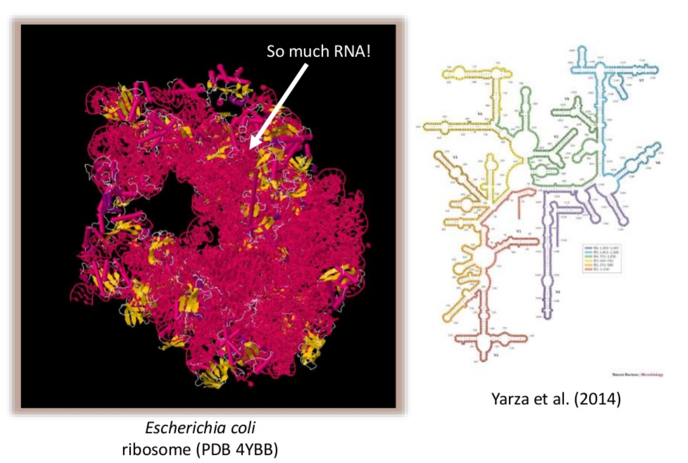 <br><br>
>
> The 16S rRNA gene has several properties that make it ideally suited for our purposes
>
> 1. Present in all prokaryotes
> 2. Highly conserved + highly variable regions
> 3. Huge reference databases
>
> 
>
> The highly conserved regions make it easy to target the gene across different organisms,
> while the highly variable regions allow us to distinguish between different species.
>
> (slide credit [https://www.slideshare.net/beiko/ccbc-tutorial-beiko](https://www.slideshare.net/beiko/ccbc-tutorial-beiko ))
{: .tip}

## Understanding our input data

In this tutorial we use the [dataset generated by the Schloss lab](https://mothur.org/wiki/Analysis_examples) to illustrate
[their MiSeq SOP](https://www.mothur.org/wiki/MiSeq_SOP)).

They [describe the experiment](https://www.mothur.org/wiki/MiSeq_SOP#Logistics) as follows:

*"The Schloss lab is interested in understanding the effect of normal variation in the gut microbiome on host health. To that end,
we collected fresh feces from mice on a daily basis for 365 days post weaning. During the first 150 days post weaning (dpw),
nothing was done to our mice except allow them to eat, get fat, and be merry. We were curious whether the rapid change in
weight observed during the first 10 dpw affected the stability microbiome compared to the microbiome observed between days
140 and 150."*


To speed up analysis for this tutorial, we will use only a subset of this data. We will look at a single mouse at 10 different
time points (5 early, 5 late). In order to assess the error rate of the analysis pipeline and experimental setup, the Schloss lab
additionally sequenced a mock community with a known composition (genomic DNA from 21 bacterial strains). The sequences used
for this mock sample are contained in the file `HMP_MOCK.v35.fasta`

> ###  Dataset naming scheme
> For this tutorial, you are given 10 pairs of files. For example, the following pair of files:<br />
>  `F3D0_S188_L001_R1_001.fastq`<br />
>  `F3D0_S188_L001_R2_001.fastq`
>
> The first part of the file name indicates the sample; `F3D0` here signifies that this sample was obtained from Female 3 on Day 0.
> The rest of the file name is identical, except for `_R1` and `_R2`, this is used to indicate the forward and reverse reads
> respectively.
{: .comment}

<!-- note: mothur does not include day 4 in their SOP example data, therefore this description and results
in this document differ slightly from the description on their website -->


## Importing the data into Galaxy

Now that we know what our input data is, let's get it into our Galaxy history:

All data required for this tutorial has been made available from Zenodo [](https://doi.org/10.5281/zenodo.800651)

> ###  Hands-on: Obtaining our data
>
> 1. Make sure you have an empty analysis history. Give it a name.
>
>    
>
> 2. **Import Sample Data.**
>       - Import the sample FASTQ files to your history, either from a shared data library (if available), or from Zenodo
>         using the URLs listed in the box below (click  to expand):
>
>       > ###  List of Zenodo URLs
>       > ```
>       > https://zenodo.org/record/800651/files/F3D0_R1.fastq
>       > https://zenodo.org/record/800651/files/F3D0_R2.fastq
>       > https://zenodo.org/record/800651/files/F3D141_R1.fastq
>       > https://zenodo.org/record/800651/files/F3D141_R2.fastq
>       > https://zenodo.org/record/800651/files/F3D142_R1.fastq
>       > https://zenodo.org/record/800651/files/F3D142_R2.fastq
>       > https://zenodo.org/record/800651/files/F3D143_R1.fastq
>       > https://zenodo.org/record/800651/files/F3D143_R2.fastq
>       > https://zenodo.org/record/800651/files/F3D144_R1.fastq
>       > https://zenodo.org/record/800651/files/F3D144_R2.fastq
>       > https://zenodo.org/record/800651/files/F3D145_R1.fastq
>       > https://zenodo.org/record/800651/files/F3D145_R2.fastq
>       > https://zenodo.org/record/800651/files/F3D146_R1.fastq
>       > https://zenodo.org/record/800651/files/F3D146_R2.fastq
>       > https://zenodo.org/record/800651/files/F3D147_R1.fastq
>       > https://zenodo.org/record/800651/files/F3D147_R2.fastq
>       > https://zenodo.org/record/800651/files/F3D148_R1.fastq
>       > https://zenodo.org/record/800651/files/F3D148_R2.fastq
>       > https://zenodo.org/record/800651/files/F3D149_R1.fastq
>       > https://zenodo.org/record/800651/files/F3D149_R2.fastq
>       > https://zenodo.org/record/800651/files/F3D150_R1.fastq
>       > https://zenodo.org/record/800651/files/F3D150_R2.fastq
>       > https://zenodo.org/record/800651/files/F3D1_R1.fastq
>       > https://zenodo.org/record/800651/files/F3D1_R2.fastq
>       > https://zenodo.org/record/800651/files/F3D2_R1.fastq
>       > https://zenodo.org/record/800651/files/F3D2_R2.fastq
>       > https://zenodo.org/record/800651/files/F3D3_R1.fastq
>       > https://zenodo.org/record/800651/files/F3D3_R2.fastq
>       > https://zenodo.org/record/800651/files/F3D5_R1.fastq
>       > https://zenodo.org/record/800651/files/F3D5_R2.fastq
>       > https://zenodo.org/record/800651/files/F3D6_R1.fastq
>       > https://zenodo.org/record/800651/files/F3D6_R2.fastq
>       > https://zenodo.org/record/800651/files/F3D7_R1.fastq
>       > https://zenodo.org/record/800651/files/F3D7_R2.fastq
>       > https://zenodo.org/record/800651/files/F3D8_R1.fastq
>       > https://zenodo.org/record/800651/files/F3D8_R2.fastq
>       > https://zenodo.org/record/800651/files/F3D9_R1.fastq
>       > https://zenodo.org/record/800651/files/F3D9_R2.fastq
>       > https://zenodo.org/record/800651/files/Mock_R1.fastq
>       > https://zenodo.org/record/800651/files/Mock_R2.fastq
>       > ```
>       {: .solution }
>
>       
>
>       
>
> 3. **Import Reference Data**
>    - Import the following reference datasets
>      - `silva.v4.fasta`
>      - `HMP_MOCK.v35.fasta`
>      - `mouse.dpw.metadata`
>      - `mouse.time.design`
>      - `trainset9_032012.pds.fasta`
>      - `trainset9_032012.pds.tax`
>
>
>    > ###  List of Zenodo URLs
>    > ```
>    > https://zenodo.org/record/800651/files/HMP_MOCK.v35.fasta
>    > https://zenodo.org/record/800651/files/mouse.dpw.metadata
>    > https://zenodo.org/record/800651/files/mouse.time.design
>    > https://zenodo.org/record/800651/files/silva.v4.fasta
>    > https://zenodo.org/record/800651/files/trainset9_032012.pds.fasta
>    > https://zenodo.org/record/800651/files/trainset9_032012.pds.tax
>    > ```
>    {: .solution }
{: .hands_on}

Now that's a lot of files to manage. Luckily Galaxy can make life a bit easier by allowing us to create
**dataset collections**. This enables us to easily run tools on multiple datasets at once.

Since we have **paired-end** data, each sample consist of two separate fastq files, one containing the
forward reads, and one containing the reverse reads. We can recognize the pairing from the file names,
which will differ only by `_R1` or `_R2` in the filename. We can tell Galaxy about this paired naming
convention, so that our tools will know which files belong together. We do this by building a **List of Dataset Pairs**


> ###  Hands-on: Organizing our data into a paired collection
>
> 1. Click on the **checkmark icon**  at top of your history.
>
> 2. Select all the FASTQ files (40 in total)
>    - Click on **for all selected..**
>    - Select **Build List of Dataset Pairs** from the dropdown menu
>
>    In the next dialog window you can create the list of pairs. By default Galaxy will look for pairs
>    of files that differ only by a `_1` and `_2` part in their names. In our case however, these
>    should be `_R1` and `_R2`.
>
> 3. Change these values accordingly
>    - Change `_1` to `_R1` in the text field on the top left
>    - Change `_2` to `_R2` om the text field on the top right
>
>    You should now see a list of pairs suggested by Galaxy:
>    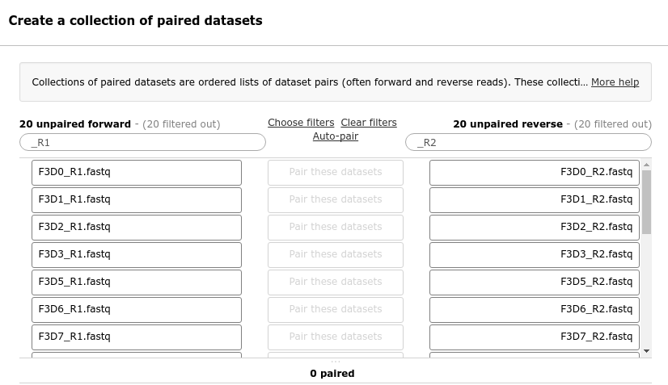 <br><br>
>
> 4. Examine the pairings and make sure they are correct.
>    - Click on **auto-pair** to create the suggested pairs.
>
>       <br><br>
>
>    The middle segment is the name for each pair. You can change these names by clicking on them.
>    These names will be used as sample names in the downstream analysis so always make sure they are informative!
>
> 5. **Name the pairs**.
>    - Make sure the pair names are like the image above (`F3D0`, `F3D5` etc)
>    - **Important:** If the files were imported via URL, they may have the full URL as sample name, please remove everything but the sample name for each pair!
>
> 6. **Name your collection** at the bottom right of the screen
> 7. Click the **Create List** button. A new dataset collection item will now appear in your history
{: .hands_on}


# Quality Control

For more information on the topic of quality control, please see our training materials
[here]({{site.baseurl}}).

Before starting any analysis, it is always a good idea to assess the quality of your input data and improve it
where possible by trimming and filtering reads. The mothur toolsuite contains several tools to assist with this task.
We will begin by merging our reads into contigs, followed by filtering and trimming of reads based on quality score
and several other metrics.

## Create contigs from paired-end reads

In this experiment, paired-end sequencing of the ~253 bp V4 region of the 16S rRNA gene was performed.
The sequencing was done from either end of each fragment. Because the reads are about 250 bp in length, this results in a
significant overlap between the forward and reverse reads in each pair. We will combine these pairs of reads into *contigs*.

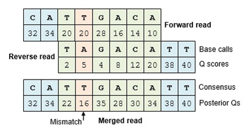

The **Make.contigs** tool creates the contigs, and uses the paired collection as input. **Make.contigs**
will look at each pair, take the reverse complement reverse read, and then determine the overlap between the
two sequences. Where an overlapping base call differs between the two reads, the quality score is used to determine
the consensus base call. A new quality score is derived by combining the two original quality scores in both of
the reads for all the overlapping positions.


> ###  Hands-on: Combine forward and reverse reads into contigs
>
> - **Make.contigs**  with the following parameters
>   -  *"Way to provide files"*: `Multiple pairs - Combo mode`
>   -  *"Fastq pairs"*: the collection you just created
>   - Leave all other parameters to the default settings
>
{: .hands_on}


This step combined the forward and reverse reads for each sample, and also combined
the resulting contigs from all samples into a single file. So we have gone from a paired
collection of 20x2 FASTQ files, to a single FASTA file. In order to retain information about
which reads originated from which samples, the tool also output a *group file*. View that
file now, it should look something like this:

```
M00967_43_000000000-A3JHG_1_1101_10011_3881     F3D0
M00967_43_000000000-A3JHG_1_1101_10050_15564    F3D0
M00967_43_000000000-A3JHG_1_1101_10051_26098    F3D0
[..]
```

Here the first column contains the read name, and the second column contains the sample name.


## Data Cleaning

As the next step, we want to improve the quality of our data. But first, let's get a feel of our dataset:

> ###  Hands-on: Summarize data
>
> - **Summary.seqs**  with the following parameters
>   -  *"fasta"*: the `trim.contigs.fasta` file created by **Make.contigs** 
>   - *"Output logfile?"*: `yes`
>
{: .hands_on}

The `summary` output files give information per read. The `logfile` outputs also contain some summary
statistics:

```
             Start    End        NBases     Ambigs   Polymer  NumSeqs
Minimum:     1        248        248        0        3        1
2.5%-tile:   1        252        252        0        3        3810
25%-tile:    1        252        252        0        4        38091
Median:      1        252        252        0        4        76181
75%-tile:    1        253        253        0        5        114271
97.5%-tile:  1        253        253        6        6        148552
Maximum:     1        502        502        249      243      152360
Mean:        1        252.811    252.811    0.70063  4.44854
# of Seqs:   152360
```

In this dataset:

* Almost all of the reads are between 248 and 253 bases long.
* 2,5% or more of our reads had ambiguous base calls (`Ambigs` column).
* The longest read in the dataset is 502 reads.
* There are 152,360 sequences.

In our region of interest, the V4 region of the
16S gene, is only around 250. Any reads significantly longer than this expected value likely did not
assemble well in the **Make.contigs** step. Furthermore, we see that 2,5% of our reads had between 6 and 249
ambiguous base calls (`Ambigs` column). In the next steps we will clean up our data by removing these
problematic reads.

We do this data cleaning using the `Screen.seqs` tool, which removes

1. sequences with ambiguous bases (`maxambig`) and
2. contigs longer than a given threshold (`maxlength`).

> ###  Hands-on: Filter reads based on quality and length
>
> - **Screen.seqs**  with the following parameters
>   -  *"fasta"*: the `trim.contigs.fasta` file created by **Make.contigs** 
>   -  *"group"*: the group file created in the **Make.contigs**  step
>   - *"maxlength"*: `275`
>   - *"maxambig"*: `0`
>
> > ###  Question
> >
> > How many reads were removed in this screening step? (Hint: run the summary.seqs tool again)
> >
> > > ###  Solution
> > > 23,488.
> > >
> > > This can be determined by looking at the number of lines in bad.accnos output of screen.seqs
> > > or by comparing the total number of seqs between of the summary log before and after this screening
> > > step
> > {: .solution }
> {: .question}
{: .hands_on}


## Optimize files for computation

Microbiome samples typically contain a large numbers of the same organism, and therefore we expect
to find many identical sequences in our data. In order to speed up computation, we first determine
the unique reads, and then record how many times each of these different reads was observed in
the original dataset. We do this by using the **Unique.seqs** tool.


> ###  Hands-on: Remove duplicate sequences
>
> - **Unique.seqs**  with the following parameters
>   -  *"fasta"*: the `good.fasta` output from **Screen.seqs** 
>   - *"output format"*: `Name File`
>
> > ###  Question
> >
> > How many sequences were unique? how many duplicates were removed?
> >
> > > ###  Solution
> > > 16,426 unique sequences and 112,446 duplicates.
> > >
> > > This can be determined from the number of lines in the fasta (or names) output, compared to the
> > > number of lines in the fasta file before this step.
> > {: .solution}
> {: .question}
{: .hands_on}

Here we see that this step has greatly reduced the size of our sequence file; not only will this speed up further computational
steps, it will also greatly reduce the amount of disk space (and your Galaxy quota) needed to store all the intermediate files generated during
this analysis. This **Unique.seqs** tool created two files, one is a FASTA file containing only the unique sequences,
and the second is a so-called *names file*. This names file consists of two columns, the first contains the sequence names
for each of the unique sequences, and the second column contains all other sequence names that are identical to the representative
sequence in the first column.

```
name          representatives
read_name1    read_name2,read_name,read_name5,read_name11
read_name4    read_name6,read_name,read_name10
read_name7    read_name8
...
```

To recap, we now have the following files:

- a FASTA file containing every distinct sequence in our dataset (the *representative* sequences)
- a *names file* containing the list of duplicate sequences
- a *group file* containing information about the samples each read originated from


To further reduce file sizes and streamline analysis, we can use the **Count.seqs** tool to combine
the *group file* and the *names file* into a single *count table*.


> ###  Hands-on: Generate count table
>
> - **Count.seqs**  with the following parameters
>   -  *"name"*: the `names` output from **Unique.seqs** 
>   - *"Use a Group file"*: `yes`
>   -  *"group"*: the `group file` we created using the **Screen.seqs** 
{: .hands_on}

The *count_table* output will look something like this:

```
Representative_Sequence                      total   F3D0   F3D1  F3D141  F3D142  ...
M00967_43_000000000-A3JHG_1_1101_14069_1827  4402    370    29    257     142
M00967_43_000000000-A3JHG_1_1101_18044_1900  28      1      0     1       0
M00967_43_000000000-A3JHG_1_1101_13234_1983  10522   425    281   340     205
...
```

The first column contains the read names of the representative sequences, and the subsequent columns contain
the number of duplicates of this sequence observed in each sample.

## Sequence Alignment

For more information on the topic of alignment, please see our training materials
[here]({{site.baseurl}})

We are now ready to align our sequences to the reference. This is an important
step to improve the clustering of your OTUs [[Schloss 2013]](https://doi.org/10.1038/ismej.2012.102)


> ###  Hands-on: Align sequences
>
> 1. **Align.seqs**  with the following parameters
>   -  *"fasta"*: the `fasta` output from **Unique.seqs** 
>   -  *"reference"*: `silva.v4.fasta` reference file from your history
> <br><br>
> 2. **Summary.seqs**  with the following parameters
>   -  *"fasta"*: the aligned output from **Align.seqs** 
>   -  *"count"*: `count_table` output from **Count.seqs** 
>   - *"Output logfile?"*: `yes`
>
{: .hands_on}

Have a look at the summary output (log file):

```
            Start    End      NBases  Ambigs   Polymer  NumSeqs
Minimum:    1250     10693    250     0        3        1
2.5%-tile:  1968     11550    252     0        3        3222
25%-tile:   1968     11550    252     0        4        32219
Median:     1968     11550    252     0        4        64437
75%-tile:   1968     11550    253     0        5        96655
97.5%-tile: 1968     11550    253     0        6        125651
Maximum:    1982     13400    270     0        12       128872
Mean:       1967.99  11550    252.462 0        4.36693
# of unique seqs:   16426
total # of seqs:    128872
```


The `Start` and `End` columns tell us that the majority of reads aligned between positions 1968 and 11550,
which is what we expect to find given the reference file we used. However, some reads align to very different positions,
which could indicate insertions or deletions at the terminal ends of the alignments or other complicating factors.

Also notice the `Polymer` column in the output table. This indicates the average homopolymer length. Since we know that
our reference database does not contain any homopolymer stretches longer than 8 reads, any reads containing such
long stretches are likely the result of PCR errors and we would be wise to remove them.

Next we will clean our data further by removing poorly aligned sequences and any sequences with long
homopolymer stretches.

### More Data Cleaning

To ensure that all our reads overlap our region of interest, we will remove any reads not overlapping the region
from position 1968 to 11550 using the **Screen.seqs** tool. To make sure they overlap *only* that region, we will
use the **Filter.seqs** step to remove any overhang on either end of the V4 region. The **Filter.seqs** tool will
additionally clean up our alignment file by removing any columns that have a gap character (`-`, or `.` for terminal gaps)
in that position for every aligned sequence (`vertical` parameter).


> ###  Hands-on: Remove poorly aligned sequences
>
> 1. **Screen.seqs**  with the following parameters
>   -  *"fasta"*: the aligned fasta file from **Align.seqs** 
>   - *"start"*: `1968`
>   - *"end"*: `11550`
>   - *"maxhomop"*: `8`
>   -  *"count"*: the `count table` file from **Count.seqs** 
>
>     **Note:** we supply the count table so that it can be updated for the sequences we're removing.
>
>     > ###  Question
>     >
>     >  How many sequences were removed in this step?
>     > > ###  Solution
>     > > 128 sequences were removed. This is the number of lines in the bad.accnos output.
>     > {: .solution }
>     {: .question}
>
>     Next, we will remove any overhang on either side of the V4 region, and
>
> 2. **Filter.seqs**  with the following parameters
>   -  *"fasta"*: `good.fasta` output from the lastest **Screen.seqs** 
>   - *"trump"*: `.`
>   - *"vertical"*: `yes`
>   - *"Output logfile"*: `yes`
>
{: .hands_on}


Your resulting alignment (`filtered fasta` output) should look something like this:

```
>M00967_43_000000000-A3JHG_1_1101_14069_1827
TAC--GG-AG-GAT--GCG-A-G-C-G-T-T--AT-C-CGG-AT--TT-A-T-T--GG-GT--TT-A-AA-GG-GT-GC-G-TA-GGC-G-G-C-CT-G-C-C-AA-G-T-C-A-G-C-G-G--TA-A-AA-TT-G-C-GG-GG--CT-C-AA-C-C-C-C-G-T-A--CA-G-C-CGTT-GAAAC-TG-C-CGGGC-TCGA-GT-GG-GC-GA-G-A---AG-T-A-TGCGGAATGCGTGGTGT-AGCGGT-GAAATGCATAG-AT-A-TC-AC-GC-AG-AACCCCGAT-TGCGAAGGCA------GC-ATA-CCG-G-CG-CC-C-T-ACTGACG-CTGA-GGCA-CGAAA-GTG-CGGGG-ATC-AAACAGG
>M00967_43_000000000-A3JHG_1_1101_18044_1900
TAC--GG-AG-GAT--GCG-A-G-C-G-T-T--GT-C-CGG-AA--TC-A-C-T--GG-GC--GT-A-AA-GG-GC-GC-G-TA-GGC-G-G-T-TT-A-A-T-AA-G-T-C-A-G-T-G-G--TG-A-AA-AC-T-G-AG-GG--CT-C-AA-C-C-C-T-C-A-G-CCT-G-C-CACT-GATAC-TG-T-TAGAC-TTGA-GT-AT-GG-AA-G-A---GG-A-G-AATGGAATTCCTAGTGT-AGCGGT-GAAATGCGTAG-AT-A-TT-AG-GA-GG-AACACCAGT-GGCGAAGGCG------AT-TCT-CTG-G-GC-CA-A-G-ACTGACG-CTGA-GGCG-CGAAA-GCG-TGGGG-AGC-AAACAGG
>M00967_43_000000000-A3JHG_1_1101_13234_1983
TAC--GG-AG-GAT--GCG-A-G-C-G-T-T--AT-C-CGG-AT--TT-A-T-T--GG-GT--TT-A-AA-GG-GT-GC-G-CA-GGC-G-G-A-AG-A-T-C-AA-G-T-C-A-G-C-G-G--TA-A-AA-TT-G-A-GA-GG--CT-C-AA-C-C-T-C-T-T-C--GA-G-C-CGTT-GAAAC-TG-G-TTTTC-TTGA-GT-GA-GC-GA-G-A---AG-T-A-TGCGGAATGCGTGGTGT-AGCGGT-GAAATGCATAG-AT-A-TC-AC-GC-AG-AACTCCGAT-TGCGAAGGCA------GC-ATA-CCG-G-CG-CT-C-A-ACTGACG-CTCA-TGCA-CGAAA-GTG-TGGGT-ATC-GAACAGG
```

These are all our representative reads again, now with additional alignment information.

In the log file of the **Filter.seqs** step we see the following additional information:

```
Length of filtered alignment: 376
Number of columns removed: 13049
Length of the original alignment: 13425
Number of sequences used to construct filter: 16298
```

From this log file we see that while our initial alignment was 13425 positions wide, after filtering the overhangs
(`trump` parameter) and removing positions that had a gap in every aligned read (`vertical` parameter), we have
trimmed our alignment down to a length of 376.

Because any filtering step we perform might lead to sequences no longer being unique, we deduplicate our data by re-running
the **Unique.seqs** tool:

> ###  Hands-on: Re-obtain unique sequences
>
> - **Unique.seqs**  with the following parameters
>   -  *"fasta"*: the `filtered fasta` output from **Filter.seqs** 
>   -  *"name file or count table"*: the `count table` from the last **Screen.seqs** 
>
> > ###  Question
> >
> >  How many duplicate sequences did our filter step produce?
> >
> > > ###  Solution
> > > 3: The number of unique sequences was reduced from 16298 to 16295
> > {: .solution }
> {: .question}
{: .hands_on}


### Pre-clustering

The next step in cleaning our data, is to merge near-identical sequences together. Sequences that only differ
by around 1 in every 100 bases are likely to represent sequencing errors, not true biological variation. Because
our contigs are ~250 bp long, we will set the threshold to 2 mismatches.

> ###  Hands-on: Perform preliminary clustering of sequences
>
> - **Pre.cluster**  with the following parameters
>   -  *"fasta"*: the `fasta` output from the last **Unique.seqs**  run
>   -  *"name file or count table"*: the `count table` from the last **Unique.seqs** 
>   - *"diffs"*: `2`
>
> > ###  Question
> >
> >  How many unique sequences are we left with after this clustering of highly similar sequences?
> > > ###  Solution
> > > 5720: This is the number of lines in the fasta output
> > {: .solution }
> {: .question}
{: .hands_on}


## Chimera Removal

We have now thoroughly cleaned our data and removed as much sequencing error as we can. Next, we will look
at a class of sequencing artefacts known as *chimeras*. During PCR amplification, it is possible that two unrelated
templates are combined to form a sort of hybrid sequence, also called a chimera. Needless to say, we do not want such
sequencing artefacts confounding our results.


> ###  Background: Chimeras
> 
> (slide credit: [http://slideplayer.com/slide/4559004/ ](http://slideplayer.com/slide/4559004/ ))
{: .tip}

We'll do this chimera removal using the `VSEARCH` algorithm [[Rognes 2016](https://dx.doi.org/10.7717)] that is called within mothur, using the
**Chimera.vsearch** tool. This command will split the data by sample and check for chimeras. The recommended
way of doing this is to use the abundant sequences as our reference.

> ###  Hands-on: Remove chimeric sequences
>
> 1. **Chimera.vsearch**  with the following parameters
>   -  *"fasta"*: the `fasta` output from **Pre.cluster** 
>   -  *"Select Reference Template from"*: `Self`
>   -  *"count"*: the `count table` from the last **Pre.cluster** 
>   -  "dereplicate" to Yes
>
>     Running **Chimera.vsearch** with the count file will remove the chimeric sequences from the count table, but we
>     still need to remove those sequences from the fasta file as well. We do this using **Remove.seqs**:
>
> 2. **Remove.seqs**  with the following parameters
>   -  *"accnos"*: the `vsearch.accnos` file from **Chimera.vsearch** 
>   -  *"fasta"*: the `fasta` output from **Pre.cluster** 
>   -  *"count"*: the `count table` from **Chimera.vsearch** 
>
> > ###  Question
> >
> >  How many sequences were flagged as chimeric? what is the percentage? (Hint: summary.seqs)
> > > ###  Solution
> > > If we run summary.seqs on the resulting fasta file and count table, we see that we went from 128,655
> > > sequences down to 118,091 sequences in this step, for a reduction of 8.2%. This is a reasonable number of
> > > sequences to be flagged as chimeric.
> > {: .solution }
> {: .question}
{: .hands_on}


## Removal of non-bacterial sequences

Despite all we have done to improve data quality, there may still be more to do:
There may be 18S rRNA gene fragments or 16S rRNA from Archaea, chloroplasts, and mitochondria
that have survived all the cleaning steps up to this point. We are generally not interested in these sequences
and want to remove them from our dataset.

Before we know which sequences may originate from sources other than our intended 16S bacterial genes, we must
first classify those sequences. We can do this using a Bayesian classifier (via the **Classify.seqs** tool) and a [training
set provided by the Schloss lab](https://www.mothur.org/wiki/RDP_reference_files).

> ###  Hands-on: Remove undesired sequences
>
> 1. **Classify.seqs**  with the following parameters
>   -  *"fasta"*: the `fasta` output from **Remove.seqs** 
>   -  *"reference"*: `trainset9032012.pds.fasta` from your history
>   -  *"taxonomy"*: `trainset9032012.pds.tax` from your history
>   -  *"count"*: the `count table` file from **Remove.seqs** 
>
>     Have a look at the taxonomy output. You will see that every read now has a classification.
>
>     Now that everything is classified we want to remove our undesirables. We do this with the **Remove.lineage**
>     tool:
>
> 2. **Remove.lineage**  with the following parameters
>   -  *"taxonomy"*: the taxonomy output from **Classify.seqs** 
>   -  *"taxon - Manually select taxons for filtering"*: `Chloroplast-Mitochondria-unknown-Archaea-Eukaryota`
>   -  *"fasta"*: the `fasta` output from **Remove.seqs** 
>   -  *"count"*: the `count table` from **Remove.seqs** 
>
> > ###  Questions
> >
> > 1. How many unique (representative) sequences were removed in this step?
> > 2. How many sequences in total?
> >
> > > ###  Solution
> > > 20 representative sequences were removed.
> > >
> > > The fasta file output from Remove.seqs had 2281 sequences while the fasta output from Remove.lineages
> > > contained 2261 sequences.
> > >
> > > 162 total sequences were removed.
> > >
> > > If you run summary.seqs with the count table, you will see that we now have 2261 unique sequences
> > > representing a total of 117,929 total sequences (down from 118,091 before). This means 162 of our
> > > sequences were in represented by these 20 representative sequences.
> > {: .solution }
> {: .question}
{: .hands_on}

The data is now as clean as we can get it. In the next section we will use the Mock sample to assess how accurate
our sequencing and bioinformatics pipeline is.


## Optional: Calculate error rates based on our mock community


> ###  Tip: Skipping the mock community analysis
>
> The mock community analysis is optional. If you are low on time or want to skip ahead, you can jump straight to [the next section](#removing-mock-sample)
> where we will cluster our sequences into OTUs, classify them and perform some visualisations.
>
{: .tip}


The following step is only possible if you have co-sequenced a mock community with your samples. A mock community is a sample
of which you know the exact composition and is something we recommend to do, because it will give you an idea of how
accurate your sequencing and analysis protocol is.


> ###  Background: Mock communities
>
> **What is a mock community?**
>
> A mock community is an artificially constructed sample; a defined mixture of microbial cells and/or
> viruses or nucleic acid molecules created *in vitro* to simulate the composition of a microbiome
> sample or the nucleic acid isolated therefrom.
>
> **Why sequence a mock community?**
>
> In a mock community, we know exactly which sequences/organisms we expect to find, and at which proportions.
> Therefore, we can use such an artificial sample to assess the error rates of our sequencing and
> analysis pipeline.
>   - Did we miss any of the sequences we know to be present in the sample (false negatives)?
>   - Do we find any sequences that were not present in the sample (false positives)?
>   - Were we able to accurately detect their relative abundances?
>
> If our workflow performed well on the mock sample, we have more confidence in the accuracy of the
> results on the rest of our samples.
>
> **Example**
>
> As an example, consider the following image from [Fouhy 2016](https://dx.doi.org/10.1186%2Fs12866-016-0738-z).
> A mock community sample was sequenced for different combinations of sequencer and primer sets (V-regions).
> Since we know the expected outcome, we can assess the accuracy of each pipeline. A similar approach can be used to
> assess different parameter settings of the *in-silico*  analysis pipline.
>
> ")
>
>
> **Further reading**
>
> - [Next generation sequencing data of a defined microbial mock community](https://dx.doi.org/10.1038%2Fsdata.2016.81)
> - [16S rRNA gene sequencing of mock microbial populations- impact of DNA extraction method, primer choice and sequencing platform](https://dx.doi.org/10.1186%2Fs12866-016-0738-z)
>
{: .tip}

The mock community in this experiment was composed of genomic DNA from 21 bacterial strains. So in a perfect world, this is
exactly what we would expect the analysis to produce as a result.

First, let's extract the sequences belonging to our mock samples from our data:

> ###  Hands-on: extract mock sample from our dataset
>
> - **Get.groups**  with the following parameters
>   -  *"group file or count table"*: the `count table` from **Remove.lineage** 
>   -  *"groups"*: `Mock`
>   - *"fasta"*: `fasta` output from **Remove.lineage** 
>   -  *"output logfile?"*: `yes`
>
{: .hands_on}

In the log file we see the following:

```
Selected 58 sequences from your fasta file.
Selected 4046 sequences from your count file
```

The Mock sample has 58 unique sequences, representing a total of 4,046 total sequences.

The **Seq.error** tool measures the error rates using our mock reference. Here we align
the reads from our mock sample back to their known sequences, to see how many fail to match.

> ###  Hands-on: Assess error rates based on a mock community
> - **Seq.error**  with the following parameters
>   -  *"fasta"*: the `fasta` output from **Get.groups** 
>   -  *"reference"*: `HMP_MOCK.v35.fasta` file from your history
>   -  *"count"*: the `count table` from **Get.groups** 
>   -  *"output log?"*: `yes`
>
{: .hands_on}

In the log file we see something like this:

```
Overall error rate:    6.5108e-05
Errors    Sequences
0    3998
1    3
2    0
3    2
4    1
[..]
```

That is pretty good! The error rate is only 0.0065%! This gives us confidence that the rest of the samples
are also of high quality, and we can continue with our analysis.


### Cluster mock sequences into OTUs

We will now estimate the accuracy of our sequencing and analysis pipeline by clustering the Mock sequences into OTUs,
and comparing the results with the expected outcome.

> ###  Background: What are Operational Taxonomic Units (OTUs)?
>
> In 16S metagenomics approaches, OTUs are clusters of similar sequence variants of the 16S rDNA marker gene
> sequence. Each of these clusters is intended to represent a taxonomic unit of a bacteria species or genus
> depending on the sequence similarity threshold. Typically, OTU cluster are defined by a 97% identity
> threshold of the 16S gene sequence variants at species level. 98% or 99% identity is suggested for strain
> separation.
>
> 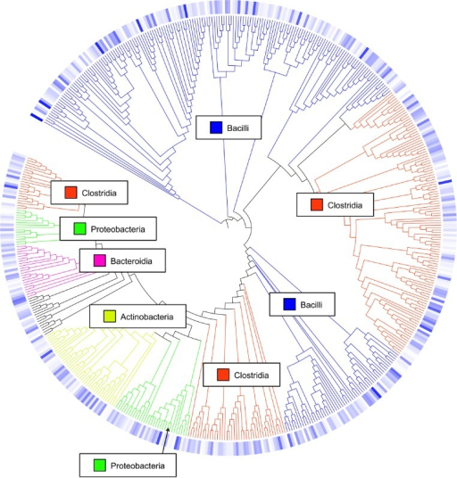
>
> (Image credit: Danzeisen et al. 2013, 10.7717/peerj.237)
{: .tip}


> ###  Hands-on: Cluster mock sequences into OTUs
>
> First we calculate the pairwise distances between our sequences
>
> 1. **Dist.seqs**  with the following parameters
>   -  *"fasta"*: the `fasta` from **Get.groups** 
>   - *"cutoff"*: `0.20`
>
>     Next we group sequences into OTUs
>
> 2. **Cluster**  with the following parameters
>   -  *"column"*: the `dist` output from **Dist.seqs** 
>   -  *"count"*: the `count table` from **Get.groups** 
>
>     Now we make a *shared* file that summarizes all our data into one handy table
>
> 3. **Make.shared**  with the following parameters
>   -  *"list"*: the `OTU list` from **Cluster** 
>   -  *"count"*: the `count table` from **Get.groups** 
>   - *"label"*: `0.03` (this indicates we are interested in the clustering at a 97% identity threshold)
>
>     And now we generate intra-sample rarefaction curves
>
> 4. **Rarefaction.single**  with the following parameters
>   -  *"shared"*: the `shared` file from **Make.shared** 
>
> > ###  Question
> >
> >  How many OTUs were identified in our mock community?
> > > ###  Solution
> > > 34: Open the shared file or OTU list and look at the header line. You will see a column for each OTU
> > {: .solution }
> {: .question}
{: .hands_on}


Open the rarefaction output (dataset named `sobs` inside the `rarefaction curves` output collection), it should look
something like this:

```
numsampled	0.03-	lci-	hci-
1	1.0000	1.0000	1.0000
100	18.0240	16.0000	20.0000
200	19.2160	17.0000	22.0000
300	19.8800	18.0000	22.0000
400	20.3600	19.0000	22.0000

[..]

3000	30.4320	28.0000	33.0000
3100	30.8800	28.0000	34.0000
3200	31.3200	29.0000	34.0000
3300	31.6320	29.0000	34.0000
3400	31.9920	30.0000	34.0000
3500	32.3440	30.0000	34.0000
3600	32.6560	31.0000	34.0000
3700	32.9920	31.0000	34.0000
3800	33.2880	32.0000	34.0000
3900	33.5920	32.0000	34.0000
4000	33.8560	33.0000	34.0000
4046	34.0000	34.0000	34.0000

```


When we use the full set of 4060 sequences, we find 34 OTUs from the Mock community; and with
3000 sequences, we find about 31 OTUs. In an ideal world, we would find exactly 21 OTUs. Despite our
best efforts, some chimeras or other contaminations may have slipped through our filtering steps.

> ###  Background: Rarefaction
>
> To estimate the fraction of species sequenced, rarefaction curves are typically used. A rarefaction curve
> plots the number of species as a function of the number of individuals sampled. The curve usually begins
> with a steep slope, which at some point begins to flatten as fewer species are being discovered per sample:
> the gentler the slope, the less contribution of the sampling to the total number of operational taxonomic
> units or OTUs.
>
> 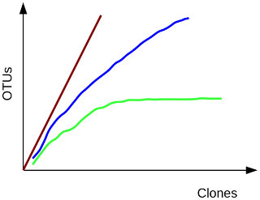
>
> Green, most or all species have been sampled; blue, this habitat has not been exhaustively sampled; red,
> species rich habitat, only a small fraction has been sampled.
>
> (*A Primer on Metagenomics*, Wooley et al. 2010, https://doi.org/10.1371/journal.pcbi.1000667)
{: .tip}

Now that we have assessed our error rates we are ready for some real analysis.


### Removing Mock sample

Now that we have cleaned up our data set as best we can, and assured ourselves of the quality of our sequencing
pipeline by considering a mock sample, we are almost ready to cluster and classify our real data. But
before we start, we should first remove the Mock dataset from our data, as we no longer need it. We do this using
the **Remove.groups** tool:

> ###  Hands-on: Remove Mock community from our dataset
>
> - **Remove.groups**  with the following parameters
>   - *"Select input type"*: `fasta , name, taxonomy, or list with a group file or count table`
>   - *"groups"*: `Mock`
>   -  *"count table"*, *"fasta"*, and *"taxonomy"* to the respective outputs from **Remove.lineage** 
>
{: .hands_on}


# OTU-based Analysis

In this tutorial we will continue with an OTU-based approach, for the phylotype and phylogenic
approaches, please refer to the [mothur wiki page](https://www.mothur.org/wiki/MiSeq_SOP).

## Clustering sequences into OTUs

There are several ways we can perform clustering. For the Mock community, we used the traditional approach of
using the **Dist.seqs** and **Cluster** tools. Alternatively, we can also use the **Cluster.split** tool. With
this approach, the sequences are split into bins, and then clustered with each bin.  Taxonomic information is used to guide this process.
The Schloss lab have [published results](https://www.mothur.org/wiki/MiSeq_SOP#OTUs) showing that if you split at the level of Order or Family, and cluster to a 0.03
cutoff, you'll get just as good of clustering as you would with the "traditional" approach. In addition, this approach
is less computationally expensive and can be parallelized, which is especially advantageous when you have large
datasets.

We'll now use the **Cluster** tool, with `taxlevel` set to `4`, requesting that clusering be done at the *Order* level.

> ###  Hands-on: Cluster our data into OTUs
>
> 1. **Cluster.split**  with the following parameters
>   - *"Split by"*: `Classification using fasta`
>   -  *"fasta"*: the `fasta` output from **Remove.groups** 
>   -  *"taxonomy"*: the `taxonomy` output from **Remove.groups** 
>   -  *"name file or count table"*: the `count table` output from **Remove.groups** 
>   - *"taxlevel"*: `4`
>   - *"cutoff"*: `0.03`
>
>    Next we want to know how many sequences are in each OTU from each group and we can do this using the
>    **Make.shared** tool. Here we tell mothur that we're really only interested in the 0.03 cutoff level:
>
> 2. **Make.shared**  with the following parameters
>   -  *"list"*: the `list` output from **Cluster.split** 
>   -  *"count"*: the `count table` from **Remove.groups** 
>   - *"label"*: `0.03`
>
>    We probably also want to know the taxonomy for each of our OTUs. We can get the consensus taxonomy for each
>    OTU using the **Classify.otu** tool:
>
> 3. **Classify.otu**  with the following parameters
>   -  *"list"*: the `list` output from **Cluster.split** 
>   -  *"count"*: the `count table` from **Remove.groups** 
>   -  *"taxonomy"*: the `taxonomy` output from **Remove.groups** 
>   - *"label"*: `0.03`
>
{: .hands_on}

The different levels of taxonomy are shown in the dataset names.
Opening the taxonomy output for level 0.03 (meaning 97% similarity, or *species* level) shows a file structured like the following:

```
OTU       Size    Taxonomy
..
Otu0008	5260	Bacteria(100);"Bacteroidetes"(100);"Bacteroidia"(100);"Bacteroidales"(100);"Rikenellaceae"(100);Alistipes(100);
Otu0009	3613	Bacteria(100);"Bacteroidetes"(100);"Bacteroidia"(100);"Bacteroidales"(100);"Porphyromonadaceae"(100);"Porphyromonadaceae"_unclassified(100);
Otu0010	3058	Bacteria(100);Firmicutes(100);Bacilli(100);Lactobacillales(100);Lactobacillaceae(100);Lactobacillus(100);
Otu0011	2958	Bacteria(100);"Bacteroidetes"(100);"Bacteroidia"(100);"Bacteroidales"(100);"Porphyromonadaceae"(100);"Porphyromonadaceae"_unclassified(100);
Otu0012	2134	Bacteria(100);"Bacteroidetes"(100);"Bacteroidia"(100);"Bacteroidales"(100);"Porphyromonadaceae"(100);"Porphyromonadaceae"_unclassified(100);
Otu0013	1856	Bacteria(100);Firmicutes(100);Bacilli(100);Lactobacillales(100);Lactobacillaceae(100);Lactobacillus(100);
..
```

The first line shown indicates that Otu008 occurred 5260 times, and that all of the
sequences (100%) were binned in the genus *[Alistipes](https://en.wikipedia.org/wiki/Alistipes)*.


> ###  Question
>
> Which samples contained sequences belonging to an OTU classified as Staphylococcus?
>
> > ###  Solution
> > Examine the tax.summary file.
> >
> > Samples F3D141, F3D142,  F3D144, F3D145, F3D2. This answer can be found by
> > examining the tax.summary output and finding the columns with nonzero
> > values for the line of Staphylococcus
> {: .solution }
{: .question}


Before we continue, let's remind ourselves what we set out to do. Our original question was about the stability of
the microbiome and whether we could observe any change in community structure between the early and late samples.

Because some of our sample may contain more sequences than others, it is generally a good idea to normalize the
dataset by subsampling.


> ###  Hands-on: Subsampling
>
> First we want to see how many sequences we have in each sample. We'll do this with the
> **Count.groups** tool:
>
> 1. **Count.groups**  with the following parameters
>   -  *"shared"*: the `shared` file from **Make.shared** 
>
>    > ###  Question
>    > How many sequences did the smallest sample consist of?
>    > > ###  Solution
>    > > 2389. This is a reasonable number, so we will now subsample all the other samples down to this level.
>    > {: .solution}
>    {: .question}
>
> 2. **Sub.sample**  with the following parameters
>   - *"Select type of data to subsample"*: `OTU Shared`
>   -  *"shared"*: the `shared` file from **Make.shared** 
>   - *"size"*: `2389`
>
>    > ###  Question
>    >
>    >  What would you exect the result of `count.groups` on this new shared output collection to be? Check if you are correct.
>    > > ###  Solution
>    > > all groups (samples) should now have 2389 sequences. Run count.groups again on the shared output collection by the sub.sample
>    > > tool to confirm that this is indeed what happened.
>    > {: .solution }
>    {: .question}
>
> **Note:** since subsampling is a stochastic process, your results from any tools using this subsampled data
> will deviate from the ones presented here.
{: .hands_on}


## Calculate Species Diversity

Species diversity is a valuable tool for describing the ecological complexity of a single sample (alpha diversity)
or between samples (beta diversity). However, diversity is not a physical quantity that can be measured directly,
and many different metrics have been proposed to quantify diversity [Finotello et al. 2016](https://www.ncbi.nlm.nih.gov/pubmed/28025179).


> ###  Background: Species Diversity
>
> Species diversity consists of three components: species richness, taxonomic or phylogenetic diversity and species evenness.
>
> - **Species richness** = the number of different species in a community.
> - **Species evenness** = how even in numbers each species in a community is.
> - **Phylogenetic diversity** = how closely related the species in a community are.
>
> <br><br>
> To understand the difference between richness and evenness, consider the following example:
>
> 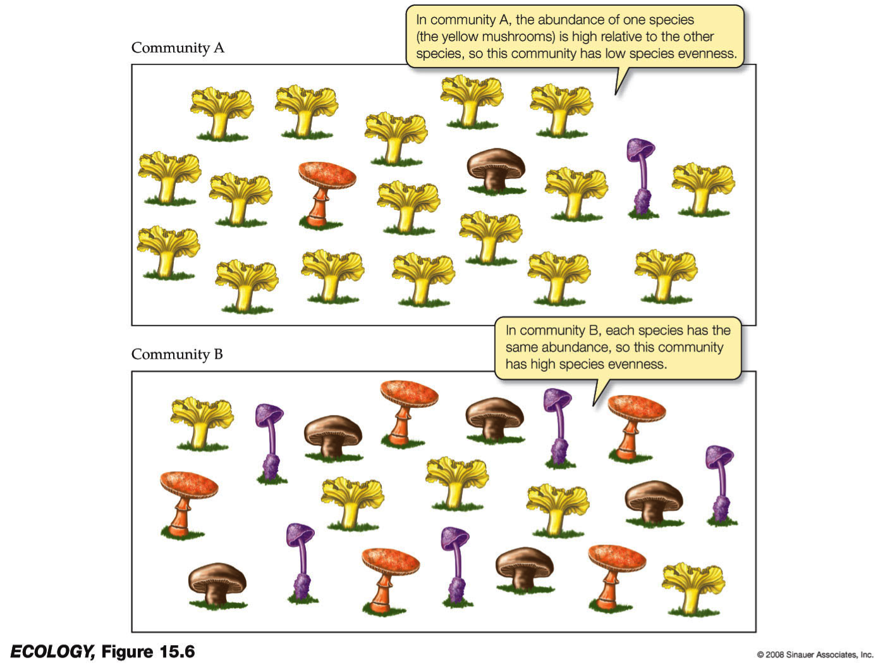
>
> > ###  Question
> > 1. Which of these communities has the highest richness?
> > 2. Which of these communities has the highest evenness?
> >
> > > ###  Solution
> > > 1. Both communities have 4 different species, so they have same richness.
> > > 2. Communty B is more even, because each species has the same abundance.
> > {: .solution }
> >
> {: .question}
> <br><br>
>
> Even when two samples have identical richness and evenness, we still may conclude that one is more diverse than
> the other if the species are very dissimilar in one of the samples (have high phylogenetic distance), but very
> closely related to each other in the second sample.
>
> 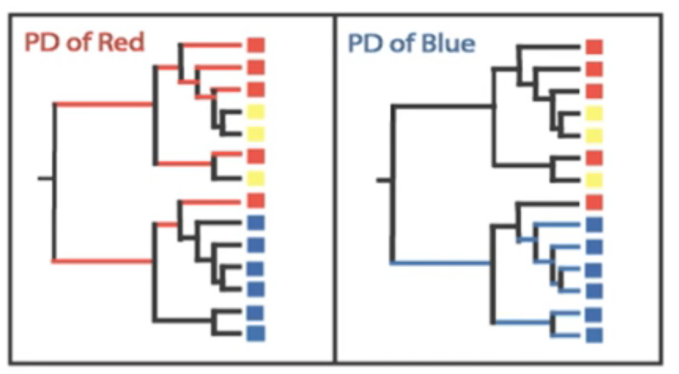{: width="50%"}
>
> Each of these factors play a role in diversity, but how to combine them into a single measure of diversity is nontrivial.
> Many different metrics have been proposed for this, for example: *shannon, chao, pd, ace, simpson, sobs, jack, npshannon,
> smithwilson, heip bergerparker, boney, efron, shen, solow, bootstrap, qstat, coverage, anderberg, hamming, jclass, jest,
> ochiai, canberra, thetayc, invsimpson*, just to name a few ;).
>
> Now, you do not need to know what all these different metrics are, but just remember that there is not a single
> definition of diversity and as always, the metric you choose to use may influence your results.
>
{: .tip}

### Alpha diversity

In order to estimate alpha diversity of the samples, we first generate the rarefaction curves. Recall that
rarefaction measure the number of observed OTUs as a function of the subsampling size. We do this with the
**Rarefaction.single** tool:

> ###  Hands-on: Calculate Rarefaction
> - **Rarefaction.single**  with the following parameters
>   -  *"shared"*: the `shared file` from **Make.shared** 
{: .hands_on}

Note that we used the default diversity measure here (*sobs*; observed species richness), but there are many
more options available under the *calc* parameter. The mothur wiki describes some of these calculators
[here](https://mothur.org/wiki/Calculators).

Examine the rarefaction curve output.

```
numsampled    0.03-F3D0    lci-F3D0    hci-F3D0    0.03-F3D1   ...
1              1.0000       1.0000      1.0000      1.0000
100           41.6560      35.0000     48.0000     45.0560
200           59.0330      51.0000     67.0000     61.5740
300           70.5640      62.0000     79.0000     71.4700
400           78.8320      71.0000     87.0000     78.4730
500           85.3650      77.0000     94.0000     83.9990
...
```

This file displays the number of OTUs identified per amount of sequences used (numsampled). What we would like
to see is the number of additional OTUs identified when adding more sequences reaching a plateau. Then we know
we have covered our full diversity. This information would be easier to interpret in the form of a graph.
Let's plot the rarefaction curve for a couple of our sequences:

> ###  Hands-on: Plot Rarefaction
>
> - **Plotting tool**  with the following parameters
>   - *"Plot Title"*: `Rarefaction`
>   - *"Label for x axis"*: `Number of Sequences`
>   - *"Label for y axis"*: `Number of OTUs`
>   - *"Output File Type"*: `PNG`
>   -  Click on **Insert Series**,
>     -  *"Dataset"*: rarefaction curve collection
>     - *"Header in first line?"*: `Yes`
>     - *"Column for x axis"*: `Column 1`
>     - *"Column for y-axis"*: `Column 2` and `Column 5` and every third column until the end (we are
>       skipping the low confidence and high confidence interval columns)
>
{: .hands_on}

From the resulting image we can see that the rarefaction curves for all samples have started to level
off so we are confident we cover a large part of our sample diversity:

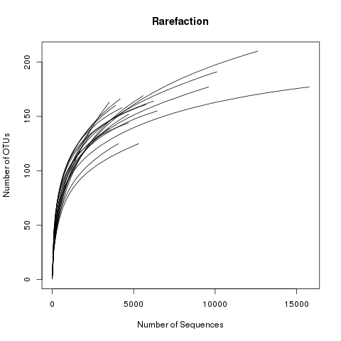


Finally, let's use the **Summary.single** tool to generate a summary report.  The following step
will randomly subsample down to 2389 sequences, repeat this process 1000 times, and report several metrics:

> ###  Hands-on: Summary.single
>
> - **Summary.single**  with the following parameters
>   -  *"share"*: the `shared` file from **Make.shared** 
>   - *"calc"*: `nseqs,coverage,sobs,invsimpson`
>   - *"size"*: `2389`
{: .hands_on}

The data will be outputted to a table called the *summary file*:

```
label   group   sobs          coverage    invsimpson   invsimpson_lci   invsimpson_hci  nseqs
0.03    F3D0    167.000000    0.994697    25.686387    24.648040        26.816067       6223.000000
0.03    F3D1    145.000000    0.994030    34.598470    33.062155        36.284520       4690.000000
0.03    F3D141  154.000000    0.991060    19.571632    18.839994        20.362390       4698.000000
0.03    F3D142  141.000000    0.978367    17.029921    16.196090        17.954269       2450.000000
0.03    F3D143  135.000000    0.980738    18.643635    17.593785        19.826728       2440.000000
0.03    F3D144  161.000000    0.980841    15.296728    14.669208        15.980336       3497.000000
0.03    F3D145  169.000000    0.991222    14.927279    14.494740        15.386427       5582.000000
0.03    F3D146  161.000000    0.989167    22.266620    21.201364        23.444586       3877.000000
0.03    F3D147  210.000000    0.995645    15.894802    15.535594        16.271013       12628.000000
0.03    F3D148  176.000000    0.995725    17.788205    17.303206        18.301177       9590.000000
0.03    F3D149  194.000000    0.994957    21.841083    21.280343        22.432174       10114.000000
0.03    F3D150  164.000000    0.989446    23.553161    22.462533        24.755101       4169.000000
0.03    F3D2    179.000000    0.998162    15.186238    14.703161        15.702137       15774.000000
0.03    F3D3    127.000000    0.994167    14.730640    14.180453        15.325243       5315.000000
0.03    F3D5    138.000000    0.990523    29.415378    28.004777        30.975621       3482.000000
0.03    F3D6    155.000000    0.995339    17.732145    17.056822        18.463148       6437.000000
0.03    F3D7    126.000000    0.991916    13.343631    12.831289        13.898588       4082.000000
0.03    F3D8    158.000000    0.992536    23.063894    21.843396        24.428855       4287.000000
0.03    F3D9    162.000000    0.994803    24.120541    23.105499        25.228865       5773.000000
```

This shows the [number of sequences](https://www.mothur.org/wiki/Nseqs), the [sample coverage](https://www.mothur.org/wiki/Coverage), the number of [observed OTUs](https://www.mothur.org/wiki/Sobs), and the [Inverse Simpson diversity estimate](https://www.mothur.org/wiki/Invsimpson) for each group.

There are a couple of things to note here:
* The differences in diversity and richness between early and late time points is small.
* All sample coverage is above 97%.

We could perform additional statistical tests (e.g. ANOVA) to confirm our feeling that there is no significant difference based on sex or early vs. late, but this is beyond the scope of this tutorial.

### Beta diversity

Beta diversity is a measure of the similarity of the membership and structure found between *different* samples.
The default calculator in the following section is *thetaYC*, which is the [Yue & Clayton theta similarity
coefficient](http://csyue.nccu.edu.tw/2005communicationindex.pdf).

We calculate this with the **Dist.shared** tool, which will rarefy our data.

> ###  Hands-on: Beta diversity
>
> 1. **Dist.shared**  with the following parameters
>   -  *"shared"*: to the `shared` file from **Make.shared** 
>   - *"calc"*: `thetayc,jclass`
>   - *"subsample"*: `2389`
>
>    Let's visualize our data in a Heatmap:
>
> 2. **Heatmap.sim**  with the following parameters
>   - *"Generate Heatmap for"*: `phylip`
>   -  *"phylip"*: the output of **Dist.shared**  (this is a collection input)
>
> <!-- TODO: add image conversion tool for Galaxy instances that do not support viewing of SVGs files? -->
{: .hands_on}

Look at some of the resulting heatmaps (you may have to download the SVG images first). In all of these
heatmaps the red colors indicate communities that are more similar than those with black colors.

For example this is the heatmap for the `thetayc` calculator (output `thetayc.0.03.lt.ave`):

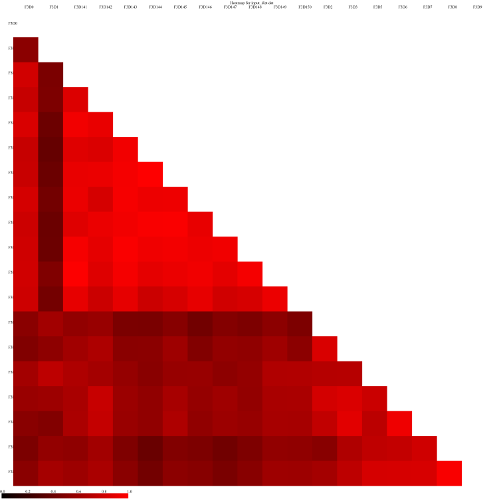

and the jclass calulator (output `jclass.0.03.lt.ave`):

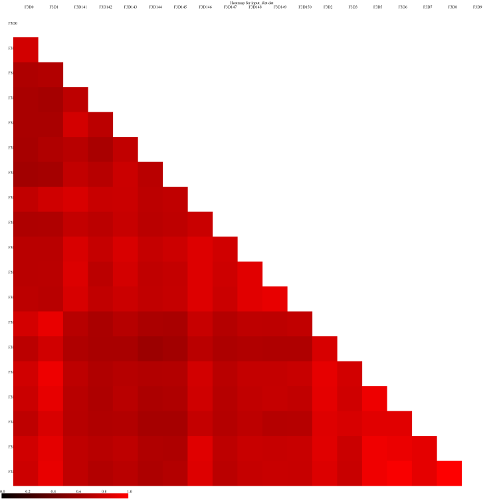

When generating Venn diagrams we are limited by the number of samples that we can analyze simultaneously.
Let's take a look at the Venn diagrams for the first 4 time points of female 3 using the **Venn** tool:

> ###  Hands-on: Venn diagram
>
> - **Venn**  with the following parameters
>   -  *"OTU Shared"*: output from **Sub.sample**  (collection)
>   - *"groups"*: `F3D0,F3D1,F3D2,F3D3`
{: .hands_on}

This generates a 4-way Venn diagram and a table listing the shared OTUs.


This shows that there were a total of 180 OTUs observed between the 4 time points. Only 76 of those OTUs were
shared by all four time points. We could look deeper at the shared file to see whether those OTUs were
numerically rare or just had a low incidence.

Next, let's generate a dendrogram to describe the similarity of the samples to each other. We will generate a
dendrogram using the jclass and thetayc calculators within the **Tree.shared** tool:

> ###  Tree
>
> 1. **Tree.shared**  with the following parameters
>   - *"Select input format"*: `Phylip Distance Matrix`
>   -  *"phylip"*: the `distance files` output from **Dist.shared** 
>
> 2. **Newick display**  with the following parameters
>  -  *"Newick file"*: output from **Tree.shared** 
{: .hands_on}

Inspection of the the tree shows that the early and late communities cluster with themselves to the exclusion
of the others.

`thetayc.0.03.lt.ave`:

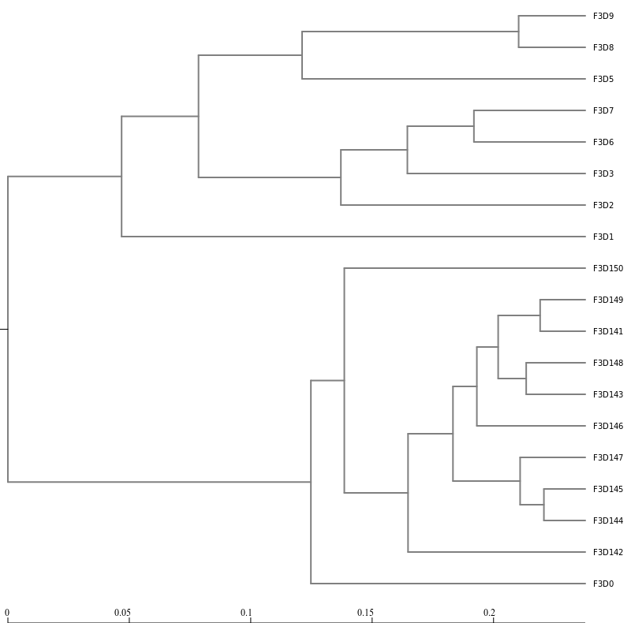

`jclass.0.03.lt.ave`:

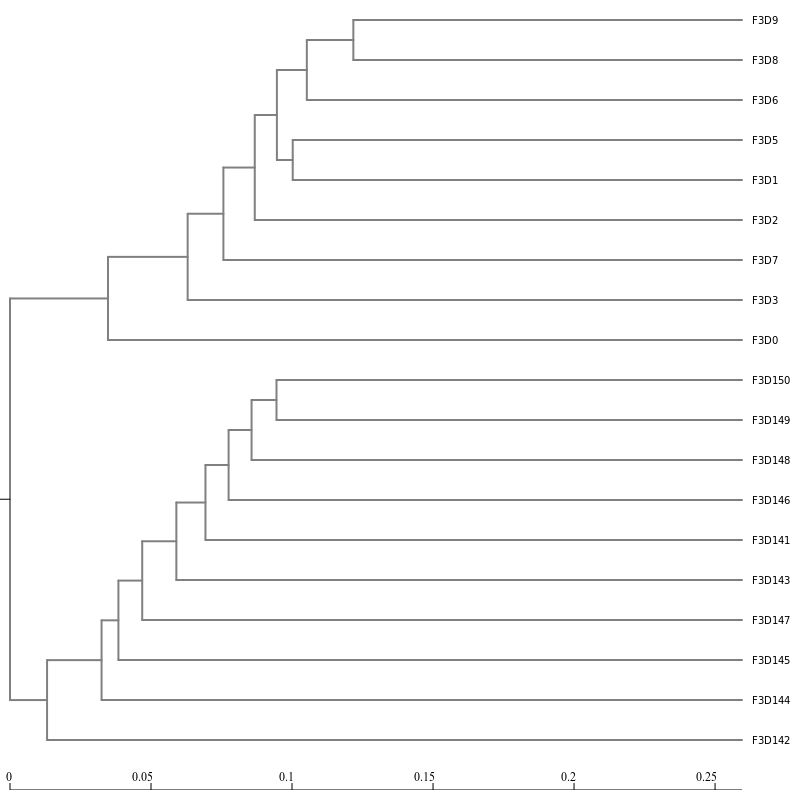


# Visualisations

We may now wish to visualize our results. We can convert our *shared* file to the more widely used `biom` format and
view it in a platform like [Phinch](http://www.phinch.org/).

## Phinch

> ###  Hands-on: Phinch
>
> 1. **Make.biom**  with the following parameters
>   -  *"shared"*: the output from **Sub.sample** 
>   -  *"constaxonomy"*: the `taxonomy` output from **Classify.otu** 
>   -  *"metadata"*: the `mouse.dpw.metadata` file you uploaded at the start of this tutorial
>
> 2. **View** the file in Phinch
>   - The Galaxy project runs an instance of Phinch, and if you look at the output biom file, you will see a link
>     to view the file at Phinch:
>
>       
>
>  Clicking on this link will lead you to the Phinch website, which will automatically load in your file, and
>  where you can several interactive visualisations:
>  
>
> > ###  Comment
> >
> > If this link is not present on your Galaxy, you can download the generated BIOM file and upload it directly to the Phinch server at [http://phinch.org](http://phinch.org).
> >
> > **Important:** After downloading, please change the file extension from `.biom1` to `.biom` before uploading to Phinch.
> {: .comment}
{: .hands_on}

## Krona

A second tool we can use to visualize our data, is [Krona](https://github.com/marbl/Krona/wiki)

> ###  Hands-on: Krona
>
>  First we convert our mothur taxonomy file to a format compatible with Krona
>
> 1. **Taxonomy-to-Krona**  with the following parameters
>   -  *"Taxonomy file"*: the `taxonomy` output from **Classify.otu**
>
> 2. **Krona pie chart**  with the following parameters
>   - *"Type of input"*: `Tabular`
>   -  *"Input file"*: the `taxonomy` output from **Taxonomy-to-Krona** 
{: .hands_on}

The resulting file is an HTML file containing an interactive visualization. For instance try double-clicking the
innermost ring labeled "Bacteria"


> ###  Question
>
>  What percentage of your sample was labelled `Lactobacillus`?
>
> > ###  Solution
> > Explore the Krona plot, double click on Firmicutes, here you should see Lactobacillus
> > clearly (16% in our case), click on this segment and the right-hand side will show you the percentages at
> > any point in the hierarchy (here 5% of all)
> >
> > 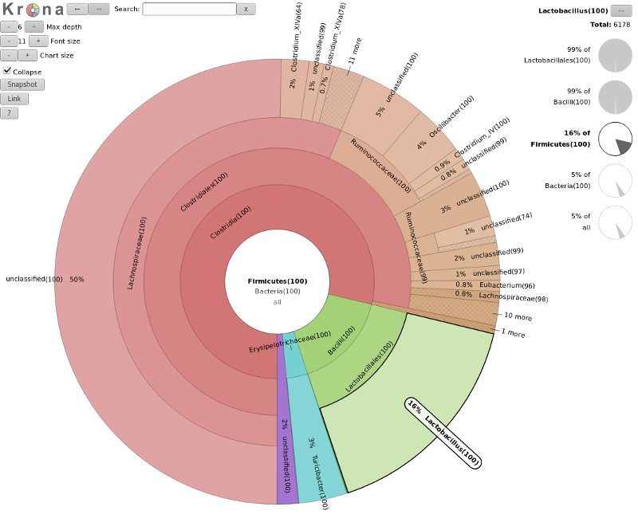
> {: .solution }
{: .question}


# Conclusion
{:.no_toc}

Well done!  You have completed the basics of the Schloss lab's [Standard Operating Procedure for Illumina MiSeq data](https://www.mothur.org/wiki/MiSeq_SOP). You have worked your way through the following pipeline:

{:width="50%"}

