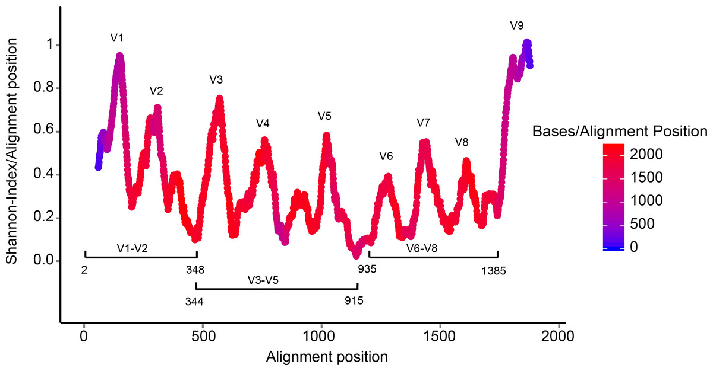
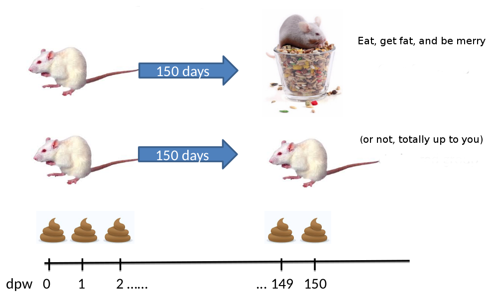
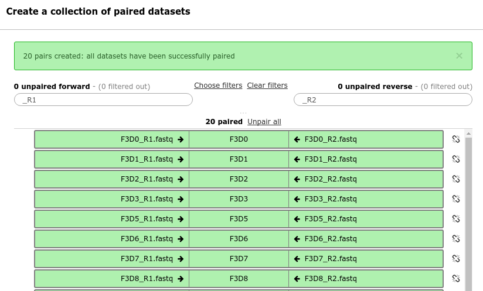
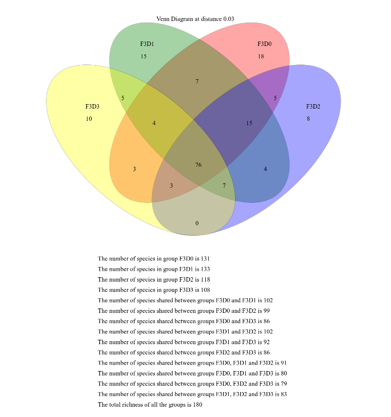
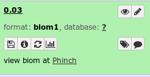
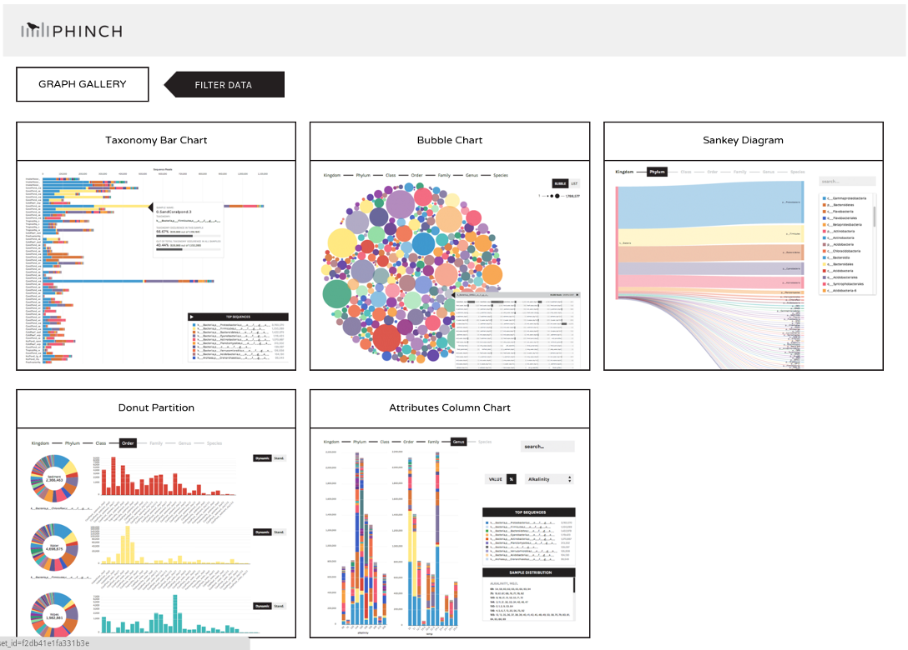
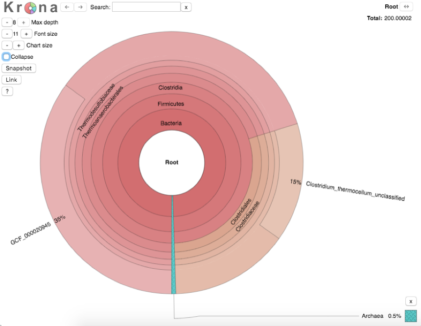
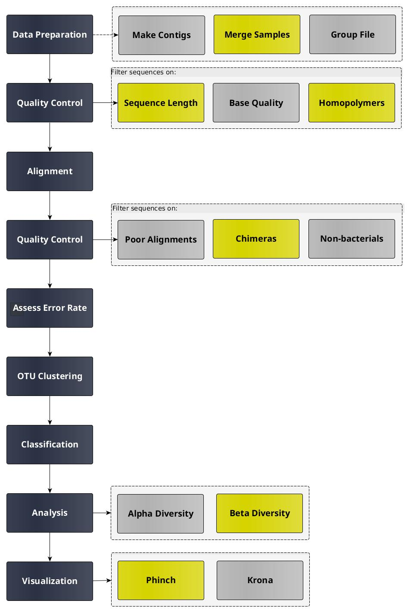

# 概要
{:.no_toc}

このチュートリアルでは、Mothur ソフトウェアパッケージを開発した [Schloss lab](http://www.schlosslab.org/) が作成した [MiSeq データの標準操作手順（SOP）](https://www.mothur.org/wiki/MiSeq_SOP)を Galaxy で行います。

> ### アジェンダ
>
> このチュートリアルでは、次のことを行います:
>
> 1. TOC
> {:toc}
>
{: .agenda}


> ###  注意
> Galaxy にある Mothur ツールのそれぞれにはヘルプセクションにある mothur wiki へのリンクが含まれています。ここではツールのすべてのインプットや、アウトプット、そしてパラメーターに関するより詳しい内容を見ることができます。
> <br><br>
> Your results may deviate slightly from the ones presented in this tutorial due to differing tool or
> reference data versions or stochastic processes in the algorithms.
{: .comment}


# データの取得と準備

このチュートリアルでは16S rRNA データを使用しますが、チュートリアルの同様の流れを WGS データを使用しても行うことができます。

> ###  背景: 16S リボソーム RNA 遺伝子
>  <br><br>
>
> 16S rRNA 遺伝子は私たちの目的に非常に適したいくつかの特性を持っています
>
> 1. すべての生物に存在する
> 2. シングルコピー（組換えが起きない）
> 3. 高度に保存されていて、高度に可変な領域
> 4. 巨大なリファレンスのデータベース
>
> 
>
> 高度に保存された領域は異なる生物の間で遺伝子を標的とすることを容易にし、高度に可変な領域は異なる種を区別することを可能にします。
>
> (slide credit [https://www.slideshare.net/beiko/ccbc-tutorial-beiko ](https://www.slideshare.net/beiko/ccbc-tutorial-beiko ))
{: .tip}

## インプットデータを理解する
このチュートリアルでは宿主の健康に対する腸内微生物叢の一般的な変化の影響を知ることに興味があります。
そのために、離乳後365日間マウスから新鮮な糞を毎日採集しました。離乳後最初の150日間（dpw）は、 nothing was done to our mice except allow them to eat, get fat, and be merry. 私たちは離乳後最初の10日間で観察された急激な重量の変化が140～150日の間で観察された微生物叢と比較して安定した微生物叢に影響を及ぼすのかどうか興味がありました。このチュートリアルでは OTU、phylotype、そして系統発生学的な手法を組み合わせて使うことでこの問いに取り組みます。



このチュートリアルを行いやすくするため、私たちはデータの一部分のみを用意していて、1匹の動物の10のタイムポイント（初期の5時点と後期の5時点）のフローファイルをあなたに提供します。解析パイプラインと実験機器のエラー率を評価するために、21種のバクテリア株由来のゲノムDNAからなる mock 共同体を追加でリシーケンスしました。

> ###  データセットの詳細
> オリジナルのデータセットのサイズが大きいため（3.9 GB）fastq ファイルの362 ペアのうちの20 ペアを与えています。例えば、次の2ファイルが表示されます: `F3D0_S188_L001_R1_001.fastq` と `F3D0_S188_L001_R2_001.fastq`
>
> これら2つのファイルは0日目の3匹のメス（F3D0）（離乳した日）のものに対応しています。1つ目のファイル（および名前にR1があるすべてのファイル）はフォワードリードに対応していて、もう一方の2つ目のファイル（および名前にR2があるすべてのファイル）はリバースリードに対応しています。
>
> これらの配列は250 bpで、16S rRNA 遺伝子の V4 領域で重なり合っています; この領域はおよそ250 bp ほどの長さです。データセットを見てみると、22個のfastqファイルがあり、これらはメス3匹と mock 共同体1つからの10のタイムポイントを表しています。`HMP_MOCK.v35.fasta` も見ることができて、このファイルには mock 共同体で使用されている配列が fasta 形式で並べて入っています。
{: .comment}

<!-- note: mothur seems to have forgotten day 4 in their SOP example data, therefore this description and results
in this document differ slightly from the description on their website -->


## Galaxy にデータをインポートする

それではインプットデータについて理解したので、Galaxy のヒストリーにデータを取得してみましょう:

> ###  ハンズオン: データを入手する
>
> 1. 空の解析ヒストリーがあることを確認してください。そのヒストリーに名前をつけましょう。
>
>    > ###  新しいヒストリーを始める
>    >
>    > * ヒストリーパネルの上部にある**歯車アイコン**をクリックする
>    > * メニューから**新しく作成**というオプションを選択する
>    {: .tip}
>
> 2. **サンプルデータをインポートする。**このコースのデータは Galaxy の共有ライブラリから入手することができます（インストラクターに聞いてください）。もしデータがない場合は、自分自身でアップロードすることができます。
> - オプション 1: データライブラリから:
>   - 共有データライブラリに移動すると、20 ペアの fastq ファイルが見つかります; マウスからは19 ペア、そして残り1 ペアは mock 共同体からのものです。
> - オプション 2: コンピュータから:
>   - Zenodo から直接データを取得する: [](https://doi.org/10.5281/zenodo.165147)
>   - `input_data.zip` をダウンロードし解凍する
>   - すべてのファイルをヒストリーにアップロードする。
> <br><br>
>
> 3. **リファレンスデータをインポートする。**データライブラリに戻り、以下のリファレンスデータセットをインポートするか、 Zenodo からダウンロードして (`reference_data.zip`) ヒストリーにアップロードしましょう:
>  - `silva.v4.fasta`
>  - `HMP_MOCK.v35.fasta`
>  - `trainset9_032012.pds.fasta`
>  - `trainset9_032012.pds.tax`
>
{: .hands_on}

現在扱うファイルがたくさんあります。幸いなことに Galaxy では *dataset collections* を作成することでファイルの扱いを少し用簡単にすることができます。これにより一度に複数のデータセットでツールを簡単に実行することができます。それではコレクションを作成してみましょう:

> ###  ハンズオン: データをコレクションにまとめる
>
> ペアエンドデータを持っているため、各サンプルは2つの別々の fastq ファイルで構成されており、1つはフォワードリード、もう1つはリバースリードのものが入っております。ペアはファイル名で分かり、このペアはファイル名の `_R1`または` _R2` のみ異なっています。Galaxy にはこのペアの命名法について認識させることができ、このためどのファイルがどのファイルとセットになっているかをツールが認識できるようになっています。
>
> 1. ヒストリー上部にある**チェックマークアイコン**をクリックする。
>   
>
> 2. すべての fastq ファイル（計40個）を選択して、**各項目を...**をクリックしてドロップダウンメニューから **Build List of Dataset Pairs** を選択する。
> 3. 次のダイアログウィンドウでペアのリストを作成することができます。デフォルトでは Galaxy は名前において `_1` と `_2` の部分だけが異なるファイルのペアを探します。私たちの場合は、`_R1` と `_R2` を探すようにしなければなりません。よってこれらの値を変更しましょう。変更すると Galaxy がペアのリストを提案し表示します。
>    <br><br>
>
> 4. ペアを調べて、大丈夫そうだったら、**auto-pair** をクリックすることで提案されたペアを作成できます。
>    <br><br>
>   中央のセグメントは各ペアの名前です。これらの名前はクリックして変更することができます。これらの名前は以降の解析でサンプル名として使用されるため、常に内容がわかるような名前であることを確認してください。
>   **重要:**これらのサンプル名が英数字のみであることを確認してください。Zenodo からデータをインポートした場合、デフォルトではサンプル名はフルの URL になっているため、`F3D0` や `F3D5` などというような、最後の部分のみに変更してください。
>
> 5. 納得のいくペアになったら、画面の右下に新しいコレクションの名前を入力します。そして **Create List** ボタンをクリックしましょう。ヒストリーに新しいデータセットのコレクションアイテムが表示されます。
{: .hands_on}


# クオリティコントロール

## シーケンシングと PCR のエラーを減らす

まず初めに各サンプルのフォワードリードとリバースリードを組み合わせます。これはインプットとしてペアのコレクションが必要で、 `make.contigs` コマンドを利用して行われます。このコマンドは fastq ファイルから配列と品質スコアのデータを抽出し、リバースリードの reverse complement を作成してリードをコンティグに加えます。そしてすべてのサンプルを1つの fasta ファイルにまとめ、*group* ファイルを使ってどのサンプルからどのリードを持ってきたかを記憶させます。

> ###  アルゴリズムの詳細
> これを行うための非常にシンプルなアルゴリズムを私たちは持っています。まずは配列のペアを揃えます。次にアライメントを調べて２つのリードが一致しない位置を特定します。１つの配列にベースがありもう１つにギャップがある場合、ベースの品質スコアは２５以上であることを考慮する必要があります。両方の配列にベースがある場合は、ベースの1つが他のものよりも６点以上の品質スコアである必要があります。もしそれが６点以下であれば、コンセンサスベースを N に設定します。
{: .comment}

### データを統合する

#### ペアエンドリードからコンティグを作成する

この実験ではペアエンドシーケンシングを使用し、 this means sequencing was done from from both ends of each
fragment, resulting in an overlap in the middle. We will now combine these pairs of reads into *contigs*.


> ###  ハンズオン: フォワードとリバースリードを結合してコンティグにする
>
> - **Make.contigs**  で次のように設定する
>   - "Way to provide files" → *Multiple pairs - Combo mode*
>   - "Fastq pairs" → 先ほど作成したコレクションを選択
>   - 他のすべてのパラメーターはデフォルトのままにする <br><br>
>
{: .hands_on}

このステップではフォワードリードとリバースリードを各ペアのコンティグに統合し、結果を1つの fasta ファイルにまとめています。また、サンプルからのリードについての情報を保持するために、グループファイルも作成しています。そのファイルを表示すると、次のようになっています:

```
M00967_43_000000000-A3JHG_1_1101_10011_3881     F3D0
M00967_43_000000000-A3JHG_1_1101_10050_15564    F3D0
M00967_43_000000000-A3JHG_1_1101_10051_26098    F3D0
```

このファイルでは1列目にリードの名前があり、２列目にサンプル名が表記されています。


### データクリーニング

クオリティコントロールのトピックについてより知りたい場合は、training material をご覧ください。
[こちら]({{site.baseurl}}/topics/sequence-analysis/)

次にデータの品質を向上させようと思います。ですがまずは、データをよく見てみましょうNext we want to improve the quality of our data. But first, let's get a feel of our data

> ###  ハンズオン: データを要約する
>
> - **Summary.seqs**  で次のように設定する
>   - "fasta" のパラメーターには make.contigs ツールによって作成された `trim.contigs.fasta` ファイルを選択する
>   - name や count にファイルを選択する必要はありません
>
{: .hands_on}

`summary` のアウトプットファイルはリードごとの情報を表示します。`logfile` のアウトプットにも次のようないくつかのサマリーの統計が含まれています:

```
             Start    End        NBases     Ambigs   Polymer  NumSeqs
Minimum:     1        248        248        0        3        1
2.5%-tile:   1        252        252        0        3        3810
25%-tile:    1        252        252        0        4        38091
Median:      1        252        252        0        4        76181
75%-tile:    1        253        253        0        5        114271
97.5%-tile:  1        253        253        6        6        148552
Maximum:     1        502        502        249      243      152360
Mean:        1        252.811    252.811    0.70063  4.44854
# of Seqs:   152360
```

これは 152,360の配列があり、大部分が248～253塩基の間にあることを示しています。
面白いことに、データセット内の最も長いリードは 502 bp です。これについて疑いましょう。それぞれのリードの長さは 251 bp であることを思い出してください。このリードははっきりと（または全く）集めていませんでした。そして、塩基配列の少なくとも 2.5% に曖昧なリードが含まれていることも注意してください。次のステップでは `screen.seqs` を実行してこれらの問題を対処します。

次のツールでは曖昧な塩基や 275 bp 以上の長さのリードである配列を除去します。

> ###  ハンズオン: 品質と長さに基づいてリードをフィルタリングする
>
> - **Screen.seqs**  で次のように設定する
>   - "fasta" には make.contigs ツールで作成された `trim.contigs.fasta` ファイルを選択する
>   - "group" には make.contigs のステップで作成された group file を選択する
>   - "maxlength" → `275`
>   - "maxambig" → `0`
>
> > ###  Question
> >
> > このスクリーニングのステップでいくつのリードが除去されましたか？（ヒント：summary.seqs ツールを再実行しましょう）
> >
> >    <details>
> >    <summary>クリックして答えを表示</summary>
> >    23,488. <br>
> >    これは screen.seqs のアウトプットである bad.accnos のライン数を見るか、スクリーニングステップ前後のサマリーログ間の seqs の合計数を比べることで分かります。
> >    </details>
> {: .question}
{: .hands_on}

## 改良された配列の処理

### 計算のためにファイルを最適化する
私たちは多くの同種の生物をシーケンスしているので、配列の多くは互いに重複していることが予想されます。同じことに莫大な時間を費やすのは計算上無駄なので、 `unique.seqs` コマンドを用いて配列を一意なものにします:

> ###  ハンズオン: 重複している配列を除去する
>
> - **Unique.seqs**  で次のように設定する
>   - "fasta" には Screen.seqs のアウトプットである `good.fasta` を選択する
>
>
> > ###  Question
> >
> > 一意な配列の数はいくつでしょうか？除去された重複した配列の数はいくつでしょうか？
> >
> >    <details>
> >    <summary>クリックして答えを表示</summary>
> >    一意な配列は 16,426 あり、112,446 の配列が重複していました。 <br>
> >    これはこのステップの前の fasta ファイルのライン数と、fasta（もしくは names）アウトプットのライン数を比べることで分かります。ログファイルには前段階の配列の合計数とコマンドも書いてあります: <br><br>
> >    mothur > unique.seqs(fasta=fasta.dat) <br>
> >    128872	16426
> >    </details>
> {: .question}
{: .hands_on}

このツールは2つのファイルをアウトプットとし、1つは一意な配列のみを含んだ fasta ファイルで、*names files* です。
この names file は2列で構成されていて、1列目には一意な配列の配列名があり、２列目には1列目の代表的な配列と同じ配列を持つすべての配列名が書かれています。

```
name          representatives
read_name1    read_name2,read_name,read_name5,read_name11
read_name4    read_name6,read_name,read_name10
read_name7    read_name8
...
```

ファイルサイズを小さくし解析を能率化するために、データを *count table* にまとめることができます。

> ###  ハンズオン: カウントテーブルを生成する
>
> - **Count.seqs**  で次のように設定する
>   - "name" では Unique.seqs のアウトプットである `names` を選択する
>   - "Use a Group file" → `yes`
>   - "group" では Screen.seqs ツールを用いて作成した group file を選択する
{: .hands_on}

*count_table* のアウトプットは次のようになっています:

```
Representative_Sequence                      total   F3D0   F3D1  F3D141  F3D142  ...
M00967_43_000000000-A3JHG_1_1101_14069_1827  4402    370    29    257     142
M00967_43_000000000-A3JHG_1_1101_18044_1900  28      1      0     1       0
M00967_43_000000000-A3JHG_1_1101_13234_1983  10522   425    281   340     205
...
```

1列目には代表的な配列のリード名が書かれていて、後続の列には各サンプルで見られる配列の重複数が書かれています。

### Sequence Alignment

アライメントについて詳しく知りたい場合は、training materials をご覧ください[こちら]({{site.baseurl}}/topics/sequence-analysis/)

配列をリファレンスに対して比較する準備ができました。このステップは OTU のクラスタリングを改善するために実行する重要な段階です [[Schloss 2013]](https://doi.org/10.1038/ismej.2012.102)

> ###  ハンズオン: Align sequences
>
> 1. **Align.seqs**  で次のように設定する
>   - "fasta" には Unique.seqs のアウトプットである fasta ファイルを選択する
>   - "reference" にはリファレンスファイルである `silva.v4.fasta` を選択する
> <br><br>
> 2. **Summary.seqs**  で次のように設定する
>   - "fasta" パラメーターには前段階の Align のアウトプットを選択する
>   - "count" パラメーターには Count.seqs のアウトプットである `count_table` ファイルを選択する
>
{: .hands_on}

summary のアウトプット(log file)を見てみましょう:

```
            Start    End      NBases  Ambigs   Polymer  NumSeqs
Minimum:    1250     10693    250     0        3        1
2.5%-tile:  1968     11550    252     0        3        3222
25%-tile:   1968     11550    252     0        4        32219
Median:     1968     11550    252     0        4        64437
75%-tile:   1968     11550    253     0        5        96655
97.5%-tile: 1968     11550    253     0        6        125651
Maximum:    1982     13400    270     0        12       128872
Mean:       1967.99  11550    252.462 0        4.36693
# of unique seqs:   16426
total # of seqs:    128872
```

さて、これはどういう意味でしょうか? 大部分の配列が開始座標が1968で終了座標が11550であることが分かります。
いくつかの配列は開始座標が1250や1982で、終了座標が10693や13400です。 These deviants from the mode positions
are likely due to an insertion or deletion at the terminal ends of the alignments. 時として同じ座標で開始し終了する配列が非常に乏しいアライメントを示すことがありますが、これは一般的に非特異的な増幅によるものです。

### More Data Cleaning

すべてが同じ領域に重複するように screen.seqs を再実行して開始や先頭の座標は1968で終了や末尾の座標を11550の配列を取得します。  We'll also set the maximum
homopolymer length to 8 since there's nothing in the database with a stretch of 9 or more of the same
base in a row (this also could have been done in the first execution of screen.seqs above).

> ###  ハンズオン: 共通部分の少ない配列を除去する
>
> - **Screen.seqs**  で次のように設定する
>   - "fasta" → aligned fasta file
>   - "start" → 1968
>   - "end" → 11550
>   - "maxhomop" → 8
>   - "count" には最も直近の count_table を選択する
>
> **注:** 除去する配列に対して更新できるように count table を使います。
>
> > ###  Question
> >
> >  このステップではいくつの配列が除去されるのでしょうか？
> > <details>
> >   <summary> クリックして回答を表示</summary>
> >   128 配列が除去されました。これは bad.accnos のアウトプットの配列数です。
> > </details>
> {: .question}
{: .hands_on}


今私たちは同じアライメント座標で重なっている配列を知っていますが、それらがその領域*だけ*で重なっていることを確認したいです。そこで配列をフィルタリングして両端のはみ出しているものを除去します。ペアエンドシーケンシングを行っているため、これは大きな問題にはなりません。加えて、アライメントの中にはギャップ文字（即ち「.」）だけを含んだ多くの列があります。これらは情報を失うことなく抜き出すことができます。これはすべて filter.seqs を用いて行います:

> ###  ハンズオン: 配列をフィルタリングする
>
> - **Filter.seqs**  で次のように設定する
>   - "fasta"" to good.fasta output from Sreen.seqs
>   - "vertical" → Yes
>   - "trump" → `.`
{: .hands_on}

log file には次のような情報が表示されます:

```
Length of filtered alignment: 376
Number of columns removed: 13049
Length of the original alignment: 13425
Number of sequences used to construct filter: 16298
```

This means that our initial alignment was 13425 columns wide and that we were able to remove 13049 terminal gap
characters using `trump=.` and vertical gap characters using `vertical=yes`. The final alignment length is 376
columns. Because we've perhaps created some redundancy across our sequences by trimming the ends, we can re-run
`unique.seqs`:

> ###  ハンズオン: 一意な配列を再取得する
>
> - **Unique.seqs**  で次のように設定する
>   - "fasta" には Filter.seqs のアウトプットである `filtered fasta` ファイルを選択する
>   - "name file or count table" to the count table from the last Screen.seqs
>
> > ###  Question
> >
> >  filter の段階ではいくつの複製配列が生成されましたか？
> > <details>
> >   <summary>クリックして解答を表示</summary>
> >   3塩基。 <br>
> >   一意な配列数は16298から16295に減少しました
> > </details>
> {: .question}
{: .hands_on}


### プレクラスタリング
配列をさらにノイズ除去したいので次に、 `pre.cluster` コマンドを使用して配列のプレクラスタリングを行い、配列間の違いを2塩基までにします。このコマンドはグループごとに配列を分割して This command will split the
sequences by group and then sort them by abundance and go from most abundant to least and identify
sequences that differ no more than 2 nucleotides from on another.  この場合、それらはマージされます。一般的に、100塩基対あたり1塩基の違いを許容することをお勧めします:

> ###  ハンズオン: 配列のプレクラスタリングを行う
>
> - **Pre.cluster**  で次のように設定する
>   - "fasta" には最後に実行した Unique.seqs のアウトプットである fasta ファイルを選択する
>   - "name file or count table" には最後に実行した Unique.seqs のアウトプットである count table を選択する
>   - "diffs" → 2
>
> > ###  Question
> >
> >  類似度の高い配列をクラスタリングした後では一意な配列はいくつ残りましたか？
> > <details>
> >   <summary> クリックして解答を表示</summary>
> >   5672塩基。 <br>
> >   これは fasta のアウトプットのライン数です
> > </details>
> {: .question}
{: .hands_on}


### キメラを除去する
ここまでの時点でできる限りの多くのシーケンシングエラーを除去したので、ここからはキメラと呼ばれるシーケンシングアーティファクトを除去することに注意を向けましょう。

> ###  背景: キメラ
> 
> (slide credit: [http://slideplayer.com/slide/4559004/ ](http://slideplayer.com/slide/4559004/ ))
{: .tip}

`chimera.uchime` コマンドを利用して、Mothur で `UCHIME` と呼ばれるアルゴリズムを利用しこのキメラを除去します。このコマンドはサンプルごとにデータを分割しキメラをチェックします。

これを行うための良い方法としては大量の配列をリファレンスとして用いることです。 In addition, if a sequence
is flagged as chimeric in one sample, the default (`dereplicate=No`) is to remove it from all samples. Our
experience suggests that this is a bit aggressive since we've seen rare sequences get flagged as chimeric
when they're the most abundant sequence in another sample. This is how we do it:

> ###  ハンズオン: キメラ配列を除去する
>
> - **Chimera.uchime**  で次のように設定する
>   - "fasta" には Pre.cluster のアウトプットである fasta ファイルを選択する
>   - "Select Reference Template from" → `Self`
>   - "count" には Pre.cluster のアウトプットである count table を選択する
>   - "dereplicate" → Yes
>
> count ファイルで chimera.uchime を実行すると、count table からキメラ配列が除去されますが、fasta ファイルからもそれらの配列を除去する必要があります。これは remove.seqs を使って行います:
>
> - **Remove.seqs**  で次のように設定する
>   - "accnos" には Chimera.uchime のアウトプットである uchime.accnos ファイルを選択する
>   - "fasta" には Pre.cluster のアウトプットである fasta ファイルを選択する
>   - "count" には Chimera.uchime のアウトプットである count table を選択する
>
> > ###  Question
> >
> >  いくつの配列がキメラとしてフラグされましたか？その割合は？（ヒント: summary.seqs）
> > <details>
> >   <summary> クリックして解答を表示</summary>
> >   If we run summary.seqs on the resulting fasta file and count table, we see that we went from 128,655
> >   sequences down to 119,330 sequences in this step, for a reduction of 7.3%. This is a reasonable number of
> >   sequences to be flagged as chimeric.
> > </details>
> {: .question}
{: .hands_on}


### 細菌以外の配列の除去

クオリティコントロールの最後のステップとして、データセットに"望ましくないもの"があるかを確認する必要があります。プライマーのセットを選ぶとき、アーキア由来の 18S rRNA や 16S rRNA の遺伝子断片や、葉緑体や、ミトコンドリアといった他のものがパイプラインのこの時点まで残っていると増幅されてしまいます。除去したい不特定のものもあります。

Now you may say, "But wait I want that stuff". Fine. But, the primers we use, are only supposed to amplify
members of the Bacteria and if they're hitting Eukaryota or Archaea, then it is a mistake. Also, realize
that chloroplasts and mitochondria have no functional role in a microbial community.

それでは `classify.seqs` コマンドでベイズ分類器を利用してこれらの配列を分類しましょう:

> ###  ハンズオン: 望ましくない配列を除去する
>
> - **Classify.seqs**  で次のように設定する
>   - "fasta" には Remove.seqs のアウトプットである fasta ファイルを選択する
>   - "reference" にはヒストリーから `trainset9032012.pds.fasta` を選択する
>   - "taxonomy" にはヒストリーから `trainset9032012.pds.tax` を選択する
>   - "count" には Remove.seqs からの count table ファイルを選択する
>   - "cutoff" → 80
>
> taxonomy のアウトプットを見てください。すべてのリードが分類されています。
>
> 現在すべてのリードが分類されているので望ましくないものを除去します。これは remove.lineage コマンドによって行います:
>
> - **Remove.lineage**  で次のように設定する
>   - "taxonomy" には Classify.seqs のアウトプットである taxonomy を選択する
>   - "taxon" には *Manually select taxons for filtering* の下のテキストボックスに `Chloroplast-Mitochondria-unknown-Archaea-Eukaryota` と入力する
>   - "fasta" には Remove.seqs のアウトプットである fasta ファイルを選択する
>   - "count" には Remove.seqs からの count table ファイルを選択する
>
> > ###  Questions
> >
> > 1. このステップでいくつの一意な（代表的な）配列が除去されたでしょうか？
> > 2. 合計の配列はいくつでしょうか？
> >
> >    <details>
> >      <summary> クリックして解答を表示</summary><br>
> >      20 の代表的な配列が除去されました。 <br>
> >      Remove.seqs からのアウトプットである fasta ファイルには 2628 の配列があり、Remove.lineages からのアウトプットである fasta ファイルは 2608 の配列を含んでいました。
> >      <br><br>
> >      合計で 162 の配列が除去されました。 <br>
> >      If you run summary.seqs with the count table, you will see that we now have 2608 unique sequences
> >      representing a total of 119,168 total sequences (down from 119,330 before). This means 162 of our  
> >      sequences were in represented by these 20 representative sequences.
> >    </details>
> {: .question}
{: .hands_on}

また、*unknown* が分類としてポップアップするのは分類する際に配列がドメインの1つに仕分けることができないときのみであることに注意しましょう。

この段階まででデータを可能な限り精選したので、エラー率について調べる準備が整いました。


## mock 共同体に基づいてエラー率を評価する

配列のエラー率を測ることは mock 共同体を co-sequenced した場合、つまり、正確な構成を知っているサンプルである場合のみ行うことができます。  This is something we include for every 95 samples we sequence. You should too because it will help you gauge your error rates and allow you to see how well your curation is going, and whether something is wrong with your sequencing setup.

> ###  定義
>
> **mock 共同体:** 微生物のサンプルやそれから単離した核酸の組成をシミュレートするための *in vitro* で作成された微生物細胞および/またはウイルスまたは核酸分子による明確な混合物。
>
{: .note}

私たちの mock 共同体は 21 の細菌株由来のゲノムDNAから作成されています。ですので完璧な世界では、これは解析の結果産物とまったく同じものになります。    

まずは、データから mock サンプルに属する配列を抽出しましょう:

> ###  ハンズオン: データセットから mock サンプルを抽出する
>
>
>
> 1. **Get.groups**  で次のように設定する
>   - "group file or count table" には Remove.lineage からの count table を選択する
>   - "groups" → `Mock`
>   - "fasta" には Remove.lineage のアウトプットである fasta ファイルを選択する
>
{: .hands_on}

log file には次の内容が表示されます:

```
Selected 67 sequences from your fasta file.
Selected 4060 sequences from your count file
```

これは mock サンプル中に67個の一意な配列と合計4060個の配列があることを示しています。 `seq.error` コマンドを用いて mock リファレンスに基づいてエラー率を測ることができます。ここでは mock サンプルのリードを既知の配列に照らし合わせて、どのくらい一致していないかを確認します。

> ###  ハンズオン: mock 共同体に基づいてエラー率を評価する
> - **Seq.error**  で次のように設定する
>   - "fasta" には Get.groups からの fasta ファイルを選択する
>   - "reference" にはヒストリーから `HMP_MOCK.v35.fasta` ファイルを選択する
>   - "count" には Get.groups からの count table を選択する
>
{: .hands_on}

 log file には次のような内容が表示されます:

```
It took 0 to read 32 sequences.
Overall error rate:    6.5108e-05
Errors    Sequences
0    3998
1    3
2    0
3    2
4    1
```

えぇ？すごいですね、エラー率は 0.0065% です！


### OTU への mock 配列の集約

今 mock 配列を OTU へ集約して We can now cluster the mock sequences into OTUs to see how many spurious OTUs we have:

> ###  背景: Operational Taxonomic Units (OTUs)
>
> 16S メタゲノミクスアプローチでは、OTU は 16S rDNA マーカー遺伝子と同種な配列の変異体のクラスターである。これらのクラスターのそれぞれは配列の類似性の閾値に応じて細菌種または属の分類学的な単位を示すことを意図している。典型的には、OTU クラスターは Typically, OTU cluster are defined by a 97% identity threshold of the 16S gene sequence variants at genus level. 98% or 99% identity is suggested for species separation.
>
> 
>
> (Image credit: Danzeisen et al. 2013, 10.7717/peerj.237)
{: .tip}


> ###  ハンズオン: Cluster mock sequences into OTUs
>
> まず、配列間の pairwise 距離を計算します
>
> - **Dist.seqs**  で次のように設定する
>   - "fasta" には Get.groups からの fasta ファイルを選択する
>   - "cutoff" → `0.20`
>  
> 次に配列を OTU にグループ化します
>
> - **Cluster**  で次のように設定する
>   - "column" には Dist.seqs のアウトプットである dist を選択する
>   - "count" には Get.groups からの count table を選択する
>
> それからすべてのデータを1つの便利な表にまとめた *shared* ファイルを作成します
>
> - **Make.shared**  で次のように設定する
>     - "list" には Cluster からの OTU list を選択する
>     - "count" には Get.groups からの count table を選択する
>     - "label" → `0.03` （これは97％の同定閾値でのクラスタリングに関心があることを示しています）
>
> そしてサンプル内の rarefaction 曲線を生成します
>
> - **Rarefaction.single**  で次のように設定する
>   - "shared" には Make.shared からの shared ファイルを選択する
>
> > ###  Question
> >
> >  How many OTUs were identified in our mock community?
> > <details>
> >   <summary> クリックして解答を表示</summary>
> >   34. <br>
> >   Open the shared file or OTU list and look at the header line. You will see a column for each OTU
> >  </details>
> {: .question}
{: .hands_on}


rarefaction のアウトプット（ `rarefaction curves` のアウトプットコレクションの中にある `sobs` という名前のデータセット）を開きましょう。
4060 の配列があり、 Mock 共同体からの34のOTUがあることが分かります。この数には検出方法から逃れた隠れたキメラが含まれています。3000配列を使用する場合は、およそ31のOTUが必要になります。キメラがなくシーケンシングのエラーもない完璧な世界には、21のOTUがあります。
これは完璧な世界ではありません。ですが、かなり良いです！

> ###  背景: Rarefaction
>
> 典型的には、配列決定された種の割合を推定するために、rarefaction 曲線が用いられる。rarefaction 曲線はサンプリングされた個体数を関数として種の数をプロットします。曲線は基本的に序盤は傾きが急ですが、サンプルごとに発見される種が少なくなっていくため、ある時点で平坦化し始めます:
> 傾きが緩やかになればなるほど、操作分類学的な単位または OTU の合計数に対するサンプルの寄与が少なくなります。
>
> 
>
> 緑色は、ほとんどまたはすべての種がサンプリングされています; 青色は、この生息地は完全にはサンプリングされていません; 赤色は、様々な種がいる生息地だが、ごくわずかな部分しかサンプリングされていません。
>
> (*A Primer on Metagenomics*, Wooley et al. 2010, https://dx.doi.org/10.1371/journal.pcbi.1000667)
{: .tip}

エラー率を評価したので実際の解析を行う準備が整いました。

## 解析の前準備

### Mock サンプルを除去する
私たちは自分のデータを楽しむことのできる段階になっています（私はすでに楽しんでいますが、あなたはどうですか？）
次に、OTU に配列を割り当てますが、最初に、データセットから Mock サンプルを除去する必要があり、エラー率を見積もることで目的を果たしますが、その後の手順では実際のサンプルのみを使用したいです。

`remove.groups` コマンドを利用します:

> ###  ハンズオン: データセットから Mock 共同体を除去する
>
> - **Remove.groups**  で次のように設定する
>   - "Select input type" → `fasta , name, taxonomy, or list with a group file or count table`
>   - "count table" と "fasta" 、そして "taxonomy" には Remove.lineage のそれぞれのアウトプットを選択する
>   - "groups" → `Mock`
{: .hands_on}


### OTU への配列のクラスタリング

今、配列を OTU にクラスタリングするための2つのオプションがあります。このような小さなデータセットには、Mock サンプルで行ったように `dist.seqs` と `cluster` を用いて伝統的なアプローチを行うことができました。

今回は代わりに `cluster.split` コマンドを利用します。このアプローチでは、分類情報を利用して配列をビンに分割しそれぞれのビン内でクラスタリングします。Schloss lab の発表した結果によると Order や Family のレベルで分割して、クラスターを0.03でカットオフすると、「伝統的な」アプローチと同じように適したクラスタリングを行うことができます。

`cluster.split` アプローチの利点としてはより高速で、より少ないメモリを使用し、そして複数のプロセッサー上で実行できることです。  In an ideal world we would prefer the traditional route because "Trad is rad", but we also think that kind of humor is funny.... このコマンドでは *Order* のレベルに対応する、`taxlevel=4` を使用します。これは Schloss lab で一般的に使用しているアプローチです。

> ###  ハンズオン: Cluster our data into OTUs
>
> - **Cluster.split**  で次のように設定する
>   - "Split by" → `Classification using fasta`
>   - "fasta" には Remove.groups のアウトプットである fasta を選択する
>   - "taxonomy" には Remove.groups のアウトプットである taxonomy を選択する
>   - "name file or count table" には Remove.groups のアウトプットである count table を選択する
>   - "taxlevel" → `4`
>   - "cutoff" → `0.03`
>
> 次に各グループの各 OTU にある配列の数を知りたいので `Make.shared` コマンドを使用してこれを知ります。ここでは Mothur には0.03のカットオフレベルに興味があると伝えています:
>
> - **Make.shared**  で次のように設定する
>   - "Select input type" → `OTU list`
>   - "list" には Cluster.split のアウトプットであるリストを選択する
>   - "count" には Remove.groups からの count table を選択する
>   - "label" → `0.03`
>
> 私たちはまた OTU のそれぞれの分類法について知りたいと思うでしょう。`Classify.otu` コマンドを使用して各 OTU の分類のコンセンサスを得ることができます:
>
> - **Classify.otu**  で次のように設定する
>   - "list" には Cluster.split のアウトプットを選択する
>   - "count" には Remove.groups からの count table を選択する
>   - "taxonomy" には Remove.groups のアウトプットである taxonomy を選択する
>   - "label" → `0.03`
>
{: .hands_on}

レベル 0.03 の taxonomy のアウトプットを開くと次のような構造のファイルが表示されます:

```
OTU       Size    Taxonomy
..
Otu0008	5260	Bacteria(100);"Bacteroidetes"(100);"Bacteroidia"(100);"Bacteroidales"(100);"Rikenellaceae"(100);Alistipes(100);
Otu0009	3613	Bacteria(100);"Bacteroidetes"(100);"Bacteroidia"(100);"Bacteroidales"(100);"Porphyromonadaceae"(100);"Porphyromonadaceae"_unclassified(100);
Otu0010	3058	Bacteria(100);Firmicutes(100);Bacilli(100);Lactobacillales(100);Lactobacillaceae(100);Lactobacillus(100);
Otu0011	2958	Bacteria(100);"Bacteroidetes"(100);"Bacteroidia"(100);"Bacteroidales"(100);"Porphyromonadaceae"(100);"Porphyromonadaceae"_unclassified(100);
Otu0012	2134	Bacteria(100);"Bacteroidetes"(100);"Bacteroidia"(100);"Bacteroidales"(100);"Porphyromonadaceae"(100);"Porphyromonadaceae"_unclassified(100);
Otu0013	1856	Bacteria(100);Firmicutes(100);Bacilli(100);Lactobacillales(100);Lactobacillaceae(100);Lactobacillus(100);
..
```

このファイルはあなたのサンプルで Otu008 が5260回観察されたことやすべての配列（100％）が Alistipes のメンバーであると分類されたことを示しています。

> ###  Question
>
> どのサンプルに Staphylococcus と分類された OTU に属する配列が含まれていますか？
>
> <details><summary>ヒント</summary>
> tax.summary ファイルを調べてみましょう。
>  </details>
>
> <details><summary>回答</summary>
> サンプル F3D141 と F3D142 、F3D144 、F3D145 、そして F3D2。この答えは tax.summary のアウトプットを調べて Staphylococcus の列について非ゼロ値の列を見つけることによって分かります。
> </details>
{: .question}


このチュートリアルではこの otu をベースとしたアプローチを行っていきます。phylotype と phylogenic のアプローチについては、 [Mothur wiki page](https://www.mothur.org/wiki/MiSeq_SOP) を参照してください。

# OTU-based 解析

より面白いことをして実際にデータを解析してみましょう。OTU ベースのデータセットに焦点を当てます。phylotype ベースの解析は本質的に同じです。また、当初の質問が早期サンプルと後期サンプルを比較する時のこれらのサンプルのコミュニティー構造の変化や安定性に関係していたことを忘れないでください。

Keep in mind that the group names have either a F or M (sex of animal) followed by a number (number of
animal) followed by a D and a three digit number (number of days post weaning).

> ###  ハンズオン: サブサンプリング
>
> 私たちが今したいことは各サンプルにどれくらいの配列があるかを見ることです。これは `Count.groups` コマンドで行います:
>
> - **Count.groups**  で次のように設定する
>   - "shared" には Make.shared からの shared ファイルを選択する
>
> アウトプットを見てください。最も小さいサンプルには 2389 の配列が入っていることが分かります。それは適当な数です。何を述べるかに関わらず、データをサブサンプリングし希薄化することは重要なことです。
>
> `Sub.sample` コマンドを用いて解析のためのサブサンプリングされたファイルを生成します:
>
> - **Sub.sample**  で次のように設定する
>   - "Select type of data to subsample" → `OTU Shared`
>   - "shared" には Make.shared のアウトプットを選択する
>   - "size" → `2389`
>
> > ###  Question
> >
> >  この新しい共有アウトプットコレクションの `count.groups` の結果は正確なのでしょうか？正しいかどうかを確認しましょう。
> > <details>
> >   <summary> クリックして解答を表示</summary>
> >   今すべてのグループ（サンプル）は 2440 の配列を持っているはずです。sub.sample ツールからの共有アウトプットコレクションに対して count.groups を再実行して実際に何が起きていたのか確認します。
> >  </details>
> {: .question}
>
> **注意:** サブサンプリングは確率的なプロセスなので、このサブサンプリングされたデータを使用するツールの結果はここに示されているものから逸脱しています。
{: .hands_on}

## 種の多様性を計算する

多様性指数は、単一のサンプルでの生態学的な複雑性を説明するため（*α多様性*）やサンプル間の種の違いを見つけるため（*β多様性*）に用いられる意味のある数学的なツールです。しかしながら、多様性は一般的な定義や測定単位が確立されている決まった物理量ではなく、いくつかの多様性指数が現在利用されています [Finotello et al. 2016]。

### α多様性

サンプルのα多様性を調べる解析を始めましょう。まずサンプリングの成果の関数として観測された OTU の数を記述する rarefaction curves を生成します。これは `Rarefaction.single` コマンドを用いて行います:

> ###  ハンズオン: Rarefaction を計算する
> - **Rarefaction.single**  で次のように設定する
>   - "shared" には Make.shared からの shared ファイルを選択する
{: .hands_on}

ここではデフォルトの多様性の尺度である（*sobs*; 観察された種の豊富さ）を使用しましたが、*calc* パラメーターではより多くのオプションを利用することができます。mothur の wiki にはこれらの計算法のいくつかについて記述しています[ページはこちら](https://mothur.org/wiki/Calculators)。

rarefaction curve のアウトプットを調べてみましょう。

```
numsampled    0.03-F3D0    lci-F3D0    hci-F3D0    0.03-F3D1   ...
1              1.0000       1.0000      1.0000      1.0000
100           41.6560      35.0000     48.0000     45.0560
200           59.0330      51.0000     67.0000     61.5740
300           70.5640      62.0000     79.0000     71.4700
400           78.8320      71.0000     87.0000     78.4730
500           85.3650      77.0000     94.0000     83.9990
...
```

このファイルには使用された配列の量ごとに識別された OTU の数 (numsampled) が表示されています。私たちが知りたいのはさらに配列を追加して曲線が水平状態に達したときに追加で識別される OTU の数です。それを知ることで私たちは多様性のすべてを把握したことになります。この情報はグラフの形にすることで理解しやすくなります。
私たちの一対の配列で rarefaction curve をプロットしてみましょう:

> ###  ハンズオン: Rarefaction をプロットする
> <!-- the following tool is because plotting tool will not detect columns in files inside collections yet -->
> まずは操作を少しでも楽にしましょう。コレクションにはデータセットが1つしかないので、ファイルを1つにまとめることができます。
>
> - **Collapse Collection**  で次のように設定する
>   - "Collection of files to collapse to a single dataset" には rarefaction curve のコレクションを選択する
>
> これで rarefaction curve をプロットする準備が整いました:
>
> - **Plotting tool**  で次のように設定する
>   - "Plot Title" → `Rarefaction`
>   - "Label for x axis" → `Number of Sequences`
>   - "Label for y axis" → `Number of OTUs`
>   - "Output File Type" → `PNG`
>   - Insert Series をクリックし、
>     - "Dataset" には1つにまとめた rarefaction curve のコレクションを選択する
>     - **Header in first line?** → `Yes` を選択する
>     - "Column for x axis" → `Column 1`
>     - "Column for y-axis" には `Column 2` と `Column 5` そして最後の列まで2つおきに列を選択する（列間における低い信頼度と高い信頼度の列をスキップしています）
>
{: .hands_on}

結果の画像から、すべてのサンプルで rarefaction curves が水平になり始めたので、サンプルの多様性の大部分を把握したと確信しました。


残念ながら、rarefaction は豊富さの尺度ではなく、多様性の尺度です。多くの個体をサンプリングした後に豊富さは同じだが水平度は異なる2つのコミュニティを考えると、それらの rarefaction curves は同じ値に漸近します。それらは水平度が異なるために曲線の形が異なります。したがって、   Therefore, selecting a number of individuals to cutoff the rarefaction curve isn't allowing a researcher to compare samples based on richness, but their diversity.

最後に、`Summary.single` を用いて配列数、サンプルのカバレッジ、観測された OTU の数、そしてシンプソン多様度の逆数の推定を含んだ表を取得しましょう。すべてを標準化するために、無作為に各サンプルから2440配列を1000回選択して平均を計算してみましょう:

> ###  ハンズオン: Summary.single
>
> - **Summary.single**  で次のように設定する
>   - "share" には Make.shared からの shared ファイルを選択する
>   - "calc" → `nseqs,coverage,sobs,invsimpson`
>   - "size" → 2389
{: .hands_on}

データは *summary file* と呼ばれる表にアウトプットされます:

```
label   group   sobs          coverage    invsimpson   invsimpson_lci   invsimpson_hci  nseqs
0.03    F3D0    167.000000    0.994697    25.686387    24.648040        26.816067       6223.000000
0.03    F3D1    145.000000    0.994030    34.598470    33.062155        36.284520       4690.000000
0.03    F3D141  154.000000    0.991060    19.571632    18.839994        20.362390       4698.000000
0.03    F3D142  141.000000    0.978367    17.029921    16.196090        17.954269       2450.000000
0.03    F3D143  135.000000    0.980738    18.643635    17.593785        19.826728       2440.000000
0.03    F3D144  161.000000    0.980841    15.296728    14.669208        15.980336       3497.000000
0.03    F3D145  169.000000    0.991222    14.927279    14.494740        15.386427       5582.000000
0.03    F3D146  161.000000    0.989167    22.266620    21.201364        23.444586       3877.000000
0.03    F3D147  210.000000    0.995645    15.894802    15.535594        16.271013       12628.000000
0.03    F3D148  176.000000    0.995725    17.788205    17.303206        18.301177       9590.000000
0.03    F3D149  194.000000    0.994957    21.841083    21.280343        22.432174       10114.000000
0.03    F3D150  164.000000    0.989446    23.553161    22.462533        24.755101       4169.000000
0.03    F3D2    179.000000    0.998162    15.186238    14.703161        15.702137       15774.000000
0.03    F3D3    127.000000    0.994167    14.730640    14.180453        15.325243       5315.000000
0.03    F3D5    138.000000    0.990523    29.415378    28.004777        30.975621       3482.000000
0.03    F3D6    155.000000    0.995339    17.732145    17.056822        18.463148       6437.000000
0.03    F3D7    126.000000    0.991916    13.343631    12.831289        13.898588       4082.000000
0.03    F3D8    158.000000    0.992536    23.063894    21.843396        24.428855       4287.000000
0.03    F3D9    162.000000    0.994803    24.120541    23.105499        25.228865       5773.000000
```

興味深いことに、サンプルのカバレッジはすべて97％を超えており、コミュニティをサンプリングするのに非常に良い仕事をしたことを物語っています。サンプルの豊かさまたは多様性をプロットすることで異なる動物間または初期と後期の時点の間に差がほぼないことが示されました。これは反復測定 ANOVA で追跡調査することができ、性別または初期と後期に有意差がないことを見出すことができます。

### β多様性

β多様性は *異なる* サンプル間にみられるメンバーシップや構造の類似性を測るものです。
次のセクションでのデフォルトの計算法は *thetaYC* で、これは [Yue & Clayton theta similarity
coefficient](http://csyue.nccu.edu.tw/2005communicationindex.pdf) です。

> ###  ハンズオン: β多様性
>
> それでは計算してみましょう。これを行うには `Dist.shared` コマンドを使用し、このコマンドは私たちのデータを共通の数の配列に希薄化してくれます。
>
> - **Dist.shared**  で次のように設定する
>   - "shared" には Make.shared からの shared ファイルを選択する
>   - "calc" → thetayc,jclass
>   - "subsample" → 2389
>
> データをヒートマップで視覚化してみましょう
>
> - **Heatmap.sim**  で次のように設定する
>   - "Generate Heatmap for" → `phylip`
>   - "phylip" には Dist.shared のアウトプットを選択する（これはコレクションのインプットです）
>
> <!-- TODO: way to view the SVGs inside Galaxy? -->
{: .hands_on}

いくつかのヒートマップを見てください（最初に SVG のイメージをダウンロードする必要があるかもしれません）。これらすべてのヒートマップにおいて赤色は黒色のものよりも類似したコミュニティを示しています。

例えばこれは `thetayc` の計算法によるヒートマップです（アウトプット `thetayc.0.03.lt.ave`）:


そしてこれは jclass の計算法によるものです（アウトプット `jclass.0.03.lt.ave`）:


ベン図を生成する際には同時に解析できるサンプルの数によって制限を受けます。
`venn` コマンドを用いてメス3の最初の4時点についてのベン図を見てみましょう:

> ###  ハンズオン: ベン図
>
> <!-- need to collapse collection again for group select to work -->
> まずは私たちのコレクションを再びまとめましょう
>
> - **Collapse Collection**  で次のように設定する
>   - "Collection" には Sub.sample ステップのアウトプットコレクションである Subsample.shared を選択する
>
> ツールの終了後、アウトプットの名前を `Subsample.shared` に変更して今後の解析で認識しやすくしましょう
>
> - **Venn**  で次のように設定する
>   - `OTU Shared` には前段階からの Subsample.shared ファイルを選択する
>   - `groups` → `F3D0,F3D1,F3D2,F3D3`
{: .hands_on}

This generates a 4-way Venn diagram and a table listing the shared OTUs.



これは4つの時点の間に合計180の OTU が観察されたことを示しています。これらの OTU で76個だけが4つの時点で共有されていました。これらの OTU  We could look deeper at the shared file to see whether those OTUs were umerically rare or just had a low incidence.

次に、サンプルのそれぞれの類似性を示す樹形図を生成します。`tree.shared` コマンドで jclass と thetayc の計算法を使って樹形図を生成しましょう:

> ###  Tree
>
> 1. **Tree.shared**  で次のように設定する
>   - "Select input format" → Phylip Distance Matrix
>   - "phylip" には Dist.shared からの dist ファイル（コレクション）を選択する
>
> 2. **Newick display**  で次のように設定する
>  - "Newick file" には Tree.shared のアウトプット（コレクション）を選択する
{: .hands_on}

樹形図を調べることで初期と後期のコミュニティがほかのコミュニティとは排他的にクラスターを作っていることが分かります。

`thetayc.0.03.lt.ave`:


`jclass.0.03.lt.ave`:


# 視覚化

Mothur にはあまり視覚化ツールが組み込まれていませんが、外部ツールを使うことで視覚化を行うことができます。例えば私たちの持っている shared ファイルをより広く使われている `biom` 形式に変換し [Phinch](http://www.phinch.org/) のようなプラットフォームで見ることができます。

## Phinch

> ###  ハンズオン: Phinch
>
> - **Make.biom**  で次のように設定する
>   - "shared" → Subsample.shared
>   - "constaxonomy" には Classify.otu の taxonomy アウトプット（コレクション）を選択する
>   - "metadata" → `mouse.dpw.metadata`
>
> Galaxy は Phinch のインスタンスを実行し、そしてそのアウトプットである biom ファイルを見ると、Phinch でファイルを表示するためのリンクがあることが分かります:
>
> 
>
> このリンクをクリックすると、ファイルを自動的にロードして、いくつかのインタラクティブな視覚化を行うことができる Phinch のウェブサイトに移動します:
>
> 
>
> > ###  Comment
> >
> > このリンクが Galaxy に現れない場合は、生成された BIOM ファイルをダウンロードして Phinch のサーバー [http://phinch.org](http://phinch.org) に直接アップロードすることでできます。
> {: .comment}
{: .hands_on}

## Krona

データを視覚化するために使うことができるツールの2つ目として、[Krona]() があります。

> ###  ハンズオン: Krona
>
>  まず、私たちの mothur taxonomy ファイルを Krona と互換性のある形式に変換しましょう
>
> - **Taxonomy-to-Krona**  で次のように設定する
>   - "Taxonomy file" to the taxonomy output from Classify.otu (collection)
>
> - **Krona pie chart**  で次のように設定する
>   - "Type of input" to `Tabular`
>   - "Input file" to taxonomy output from Classify.otu (collection)
{: .hands_on}

結果のファイルはインタラクティブな視覚化を含む HTML ファイルです。例えば "Bacteria" とラベルされている最も内側のリングをダブルクリックしてみてください 



> ###  Question
>
>  あなたのサンプルの何パーセントが `Lactobacillus` とラベルされましたか？
>
> <details>
>   <summary> クリックして解答を表示</summary>
>   Krona プロットを探って、Firmicutes をダブルクリックすると、Lactobacillus が何パーセントあるか明らかになるはずで（私たちの場合は16％）、このセグメントを右クリックすると階層内の任意のポイントでのパーセンテージが表示されます（ここでは全体の5％） 
>
>  
> </details>
{: .question}

よくできました！あなたは mothur の SOP の基本を修了しました。統計的な有意性テストや母集団レベルの解析についてより詳細なことに進みたい場合は以下の演習を行ってください。 

# Extra Credit

## Determine statistical significance of clusterings

We can perform a test to determine whether the clustering within the tree is statistically significant or not
using by choosing from the `parsimony`, `unifrac.unweighted`, or `unifrac.weighted` commands. To run these we
will first need to create a design file that indicates which treatment each sample belongs to.

> ###  ハンズオン: Obtain design file
>
> - Find the file `mouse.time.design` in your history (you imported this file at the start of this tutorial)
> - Make sure the datatype is set to `mothur.design`.
>
> > ###  Changing datatype of a datasets
> >  - Click on the **pencil icon** of the dataset
> >  - Click on the **Datatypes** tab
> >  - Select the new datatype from dropdown menu
> >  - Click **Save**
> {: .tip}
{: .hands_on}


The design file look something like this:

```
group    time
F3D0     Early
F3D1     Early
F3D141   Late
F3D142   Late
F3D143   Late
F3D144   Late
F3D145   Late
F3D146   Late
F3D147   Late
F3D148   Late
F3D149   Late
F3D150   Late
F3D2     Early
F3D3     Early
F3D5     Early
F3D6     Early
F3D7     Early
F3D8     Early
F3D9     Early
```

Using the `parsimony` command let's look at the pairwise comparisons. Specifically, let's focus on the
early vs. late comparisons for each mouse:

> ###  ハンズオン: Compare Early-vs-Late
> - **Parsimony**  で次のように設定する
>   - "tree" to the `tre` output from Tree.Shared (collection)
>   - "group" to the design file described above
>   - "output logfile?" to `yes`
{: .hands_on}

In the logfile for `thetayc.0.03.lt.ave` we see

```
Tree#   Groups      ParsScore   ParsSig
1       Early-Late  1           <0.001
```

There was clearly a significant difference between the clustering of the early and late time points.
Recall that this method ignores the branch length.

The two distance matrices that we generated earlier (i.e. `jclass.0.03.lt.ave.dist` and
    `thetayc.0.03.lt.ave.dist`) can then be visualized using the pcoa or nmds plots.

Principal Coordinates (PCoA) uses an eigenvector-based approach to represent multidimensional
data in as few dimensions as possible. Our data is highly dimensional (~9 dimensions).

> ###  ハンズオン: PCoA
>
> - **Pcoa**  で次のように設定する
>   - "phylip" to dist files from Dist.shared (collection)
{: .hands_on}

The loadings files will tell you what fraction of the total variance in the data are represented
by each of the axes. For instance the loading file for `thetayc.0.03.lt.ave` looks something like:

```
axis  loading
1     45.354207
2     13.526582
3     11.791424
4     4.493544
5     4.012474
...
```

In this case the first and second axis represent about 45 and 14% of the variation (59% of the total)
for the thetaYC distances. The output to the logfile:

```
Processing...
Rsq 1 axis: 0.736369
Rsq 2 axis: 0.882025
Rsq 3 axis: 0.978093
```

indicates that the R-squared between the original distance matrix and the distance between the points in 2D
PCoA space was 0.88, but that if you add a third dimension the R-squared value increases to 0.98. All in all,
not bad.

Alternatively, non-metric multidimensional scaling (NMDS) tries to preserve the distance between samples using
a user defined number of dimensions. We can run our data through NMDS with 2 dimensions with the following
tool:

> ###  ハンズオン: Nmds
>
> - **Nmds**  で次のように設定する
>   - "phylip" to dist files from Dist.shared (collection)
>   - "output logfile?" to `yes`
>
> Opening the `stress` file for `thetayc.0.03.lt.ave` we can inspect the stress and R^2 values, which describe
> the quality of the ordination. Each line in this file represents a different iteration and the configuration
> obtained in the iteration with the lowest stress is reported in the `axes` file. In the logfile:
>
> ```
> Number of dimensions:           2
> Lowest stress :                 0.113657
> R-squared for configuration:    0.947622
> ```
>
> We find that the lowest stress value was 0.11 with an R-squared value of 0.95; that stress level is
> actually pretty good. You can test what happens with three dimensions in the following way:
>
> - **Nmds**  で次のように設定する
>   - "phylip" to dist files collection from Dist.shared
>   - "mindim" to `3`
>   - "maxdim" to `3`
>   - "output logfile?" to `yes`
>
> > ###  Question
> >
> > What are stress and R-squared values when using 3 dimensions?
> >
> > <details>
> >   <summary> クリックして解答を表示</summary>
> >   The stress value drops to 0.05 and the R2 value goes up to 0.99 (see logfile). Not bad.
> > </details>
> {: .question}
{: .hands_on}


In general, we would like a stress value below 0.20 and a value below 0.10 is even better. Thus, we can conclude that,
NMDS is better than PCoA. We can plot the three dimensions of the NMDS data by plotting the contents of the `axes`
file. <!-- TODO: tool for 3D plots in Galaxy? -->

Again, it is clear that the early and late samples cluster separately from each other. Ultimately, ordination
is a data visualization tool. We might ask if the spatial separation that we see between the early and late
plots in the NMDS plot is statistically significant. To do this we have two statistical tools at our disposal.
The first analysis of molecular variance (AMOVA), tests whether the centers of the clouds representing a group
are more separated than the variation among samples of the same treatment. This is done using the distance
matrices we created earlier and does not actually use ordination.

> ###  ハンズオン: Amova
>
> - **Amova**  で次のように設定する
>   - "phylip" to dist files from Dist.shared (collection)
>   - "design" to mouse.time.design file from your history
>   - "output logfile?" to `yes`
{: .hands_on}

in logfile for thetaYC we find:

```
Early-Late    Among       Within     Total
SS            0.628379    0.552221   1.1806
df            1           17         18
MS    0.628379    0.0324836

Fs:    19.3445
p-value: <0.001*
```

Here we see from the AMOVA that the "cloud" early and late time points has a significantly different centroid
for this mouse. Thus, the observed separation in early and late samples is statistically significant. We can
also see whether the variation in the early samples is significantly different from the variation in the late
samples using the `Homova` command:

> ###  ハンズオン: Homova
>
> - **Homova**  で次のように設定する
>   - "phylip" to dist files from Dist.shared (collection)
>   - "design" to mouse.time.design file from your history
>   - "output logfile?" to `yes`
{: .hands_on}

```
HOMOVA        BValue     P-value    SSwithin/(Ni-1)_values
Early-Late    7.51408    <0.001*    0.0603208    0.00773943
```

We see that there is a significant difference in the variation with the early samples having a larger amount
of variation (0.061) than the late samples (0.008). This was what we found in the original study - the early
samples were less stable than the late samples.

Next, we might ask which OTUs are responsible for shifting the samples along the two axes. We can determine
this by measuring the correlation of the relative abundance of each OTU with the two axes in the NMDS dataset.
We do this with the `corr.axes` tool:

> ###  ハンズオン: Correlation
>
> - **Corr.axes**  で次のように設定する
>   - "axes" to axes output from Nmds in 3 dimension (collection)
>   - "shared" to shared output from collapse collection on Sub.sample
>   - "method" to `Spearman`
>   - "numaxes" to `3`
{: .hands_on}

Examining the axes output, we see the data for the first five OTUs look something like this..

```
OTU         axis1       p-value      axis2       p-value     axis3       p-value     length
Otu0001     0.285213    0.226258    -0.742431    0.000272    0.676613    0.001466    1.044201
Otu0002     0.283582    0.228923    -0.636524    0.003387    0.873574    0.000001    1.117458
Otu0003     0.461270    0.046828    -0.586271    0.008337    0.767610    0.000125    1.070378
Otu0004    -0.131579    0.576679    -0.240351    0.307860    0.408772    0.082266    0.492114
Otu0005    -0.315327    0.180955     0.046553    0.843432    0.097497    0.679135    0.333323
...
```

What these results show is that OTUs 1 and 2 are responsible for moving points in a negative direction along
axis 2. Recalling that we classified each OTU earlier (see taxonomy output from `Classify.otu`), we can see
that these first five OTUs are mainly members of the Porphyromonadaceae:

```
OTU        Size   Taxonomy
Otu0001    12329   Bacteria(100);"Bacteroidetes"(100);"Bacteroidia"(100);"Bacteroidales"(100);"Porphyromonadaceae"(100);unclassified(100);
Otu0002    8912    Bacteria(100);"Bacteroidetes"(100);"Bacteroidia"(100);"Bacteroidales"(100);"Porphyromonadaceae"(100);unclassified(100);
Otu0003    7857    Bacteria(100);"Bacteroidetes"(100);"Bacteroidia"(100);"Bacteroidales"(100);"Porphyromonadaceae"(100);unclassified(100);
Otu0004    7483    Bacteria(100);"Bacteroidetes"(100);"Bacteroidia"(100);"Bacteroidales"(100);"Porphyromonadaceae"(100);Barnesiella(100);
Otu0005    7479    Bacteria(100);"Bacteroidetes"(100);"Bacteroidia"(100);"Bacteroidales"(100);"Porphyromonadaceae"(100);unclassified(100);
...
```

This helps to illustrate the power of OTUs over phylotypes since each of these OTUs is behaving differently.
These data can be plotted in what's known as a biplot where lines radiating from the origin (axis1=0, axis2=0,
axis3=0) to the correlation values with each axis are mapped on top of the PCoA or NMDS plots.
<!-- TODO: make this plot? -->

Later, using the metastats command, we will see another method for describing which populations are
responsible for differences seen between specific treatments.

An alternative approach to building a biplot would be to provide data indicating metadata about each sample.
For example, we may know the weight, height, blood pressure, etc. of the subjects in these samples. For
discussion purposes the file `mouse.dpw.metadata` is provided and looks something like this:

```
group    dpw
F3D0     0
F3D1     1
F3D141   141
F3D142   142
F3D143   143
F3D144   144
F3D145   145
F3D146   146
F3D147   147
F3D148   148
F3D149   149
F3D150   150
F3D2     2
F3D3     3
F3D5     5
F3D6     6
F3D7     7
F3D8     8
F3D9     9
```

> ###  ハンズオン
>
> - **Corr.axes**  で次のように設定する
>   - "axes" to axes output from Nmds in 3 dimension
>   - "Generate Collector Curvers for" to Metadata table
>   - "metadata table" to `mouse.dpw.metadata`
>   - "method" to `Spearman`
>   - "numaxes" to `3`
>
> This will output a file like the following:
>
> ```
> Feature    axis1       p-value      axis2       p-value     axis3       p-value     length
> dpw        0.205263    0.383832    -0.292982    0.213861    0.821053    0.000016    0.895600
> ```
>
> Indicating that as the dpw increases, the communities shift to in the positive direction along axis 3.
>
> Another tool we can use is `get.communitytype` to see whether our data can be partitioned in to separate
> community types
>
> <!-- TODO: add this tool to mothur suite -->
> - **Get.communitytype**  で次のように設定する
>   - "shared" to Subsample.shared file
>   - "output logfile?" to `yes`
>
{: .hands_on}

In logfile we find the following output:

```
K    NLE        logDet    BIC         AIC         Laplace
1    9612.15    522.97    10070.01    9923.15     9587.84
2    9688.76    464.05    10605.95    10311.76    9348.28
3    10329.39   329.18    11705.91    11264.39    9634.77
4    11026.12   97.78     12861.98    12273.12    9929.10
5    11662.52  -250.61    13957.71    13221.52    10104.59
```

We see that the minimum Laplace value is for a K value of 2 (9348.28). This indicates that our samples
belonged to two community types. Opening the `design` output we see that all of the late samples and the Day 0
sample belonged to Partition_1 and the other early samples belonged to Partition_2. We can look at the
`summary` output to see which OTUs were most responsible for separating the communities:

```
OTU        P0.mean  P1.mean  P1.lci  P1.uci  P2.mean  P2.lci  P2.uci  Difference   CumFraction
Otu0006    3.36     10.48    9.17    11.97   0.46     0.28    0.78    10.01        0.15
Otu0014    6.17     8.45     7.35    9.72    3.76     2.98    4.73    4.70         0.22
Otu0002    5.63     7.14     6.17    8.25    3.83     3.05    4.81    3.31         0.27
Otu0008    4.01     2.92     2.41    3.54    5.85     4.80    7.12    2.92         0.31
Otu0019    2.07     3.48     2.90    4.18    0.94     0.63    1.40    2.54         0.35
...
```

Again we can cross reference these OTU labels with the consensus classifications in the taxonomy file to get
the names of these organisms.

> ###  Question
>
> What organisms were the top 5 contributing OTUs classified as?
>
> <details>
>   <summary> クリックして解答を表示</summary>
>   Note down the names of the top 5 OTUs as output by thesummary output of get.communitytype.
>   Then look at the taxonomy file output by Classify.otu. <br><br>
>
>   In our example these top 5 OTUs were classified
>   as belonging to Porphyromonadaceae (top 3 OTUs), Alistipes and Lactobacillus.
> </details>
{: .question}

## Population-level Analysis

In addition to the use of `corr.axes` and `get.communitytype` we have several tools to differentiate between
different groupings of samples. The first we'll demonstrate is `metastats`, which is a non-parametric T-test
that determines whether there are any OTUs that are differentially represented between the samples from early and late in this study.

> ###  ハンズオン: T-test
>
> - **Metastats**  で次のように設定する
>   - "shared" to Subsample.shared
>   - "design" to `mouse.time.design`
{: .hands_on}

Looking at the first 5 OTUs from `Late-Early` output file we see the following:

```
OTU        mean(group1)  variance(group1)  stderr(group1)  mean(group2)  variance(group2)  stderr(group2)  p-value
Otu0001    0.026104      0.000079          0.002807        0.011304      0.000031          0.001856        0.000999
Otu0002    0.072869      0.000101          0.003176        0.041946      0.000208          0.004805        0.000999
Otu0003    0.015261      0.000023          0.001531        0.002182      0.000003          0.000539        0.000999
Otu0004    0.029451      0.000064          0.002536        0.020427      0.000140          0.003947        0.074925
Otu0005    0.068139      0.000087          0.002957        0.070058      0.000163          0.004254        0.729271
```

These data tell us that OTUs 1, 2, and 3 was significantly different between the early and late samples.

> ###  Question
>
>  Which of the top 10 OTUs in your output were significantly different between early and late samples?
>
> <details>
>  <summary> クリックして解答を表示</summary>
>  Looking at the p-value cut-off and using your favorite cutoff threshold (say 0.01).
>  Answer to the question is all OTUs with a value lower than this threshold. Note that these OTU labels may
>  be different for you and may very between one repetition of this tutorial to the next, and therefore may
>  vary between you and your neighbour as well.
> </details>
{: .question}

Another non-parametric tool we can use as an alternative to metastats is lefse:

> ###  ハンズオン: Lefse
>
> - **Lefse**  で次のように設定する
>   - "shared" to Subsample.shared
>   - "design" to `mouse.time.design`
{: .hands_on}

Looking at the top of the lefse summary file we see:

```
OTU        LogMaxMean  Class   LDA         pValue
Otu0001    4.41671     Late    3.91585    0.000601825
Otu0002    4.86254     Late    4.20329    0.000695271
Otu0003    4.18358     Late    3.82749    0.00022674
Otu0004    4.4691      -
Otu0005    4.84546     -
```

Again, OTUs 1, 2, and 3 are significantly different between the two groups and are significantly elevated in the
late samples

Finally, Mothur has an implementation of the random forest algorithm build into her as classify.rf. This will tell
us which features (i.e. OTUs) are useful in discriminating between the two groups of samples:

> ###  ハンズオン: Classify.rf
>
> - **Classify.rf**  で次のように設定する
>   - "shared" to Subsample.shared
>   - "design" to `mouse.time.design`
{: .hands_on}

in the logfile we see:

```
Creating 100 (th) Decision tree
numCorrect = 19
forrestErrorRate = 0
confusion matrix:
        Early    Late    time
Early   9        0       0
Late    0        10      0
time    0        0       0
```

We can ignore the time row and column and see that our samples were all correctly assigned to the proper groups.
Looking at `summary` output, we see the top 10 OTUs that resulted in the greatest mean decrease in activity were:

```
OTU        Mean decrease accuracy
Otu0038    0.21
Otu0003    0.15
Otu0091    0.14
Otu0096    0.13
Otu0024    0.12
Otu0006    0.1
Otu0011    0.1
Otu0015    0.09
Otu0082    0.08
Otu0042    0.07
```

# Conclusion
{:.no_toc}

You have now seen how to perform the Schloss lab's Standard Operating Procedure (SOP) for MiSeq data.
You have worked your way through the following pipeline:


