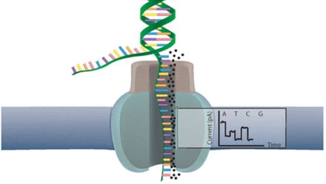
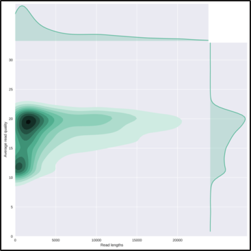
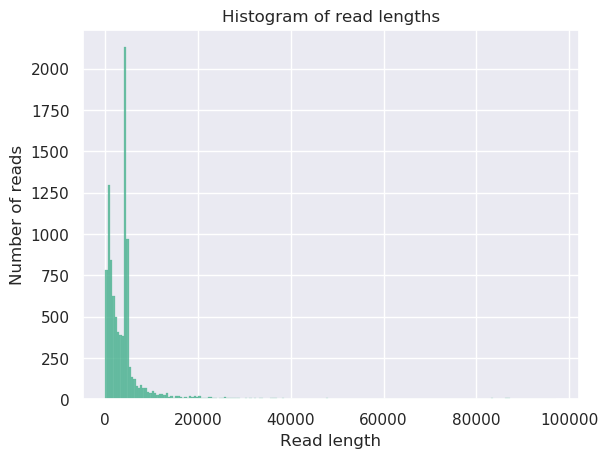
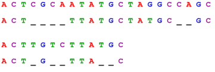
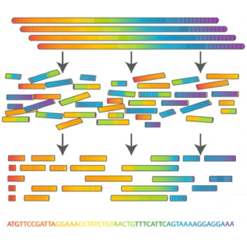
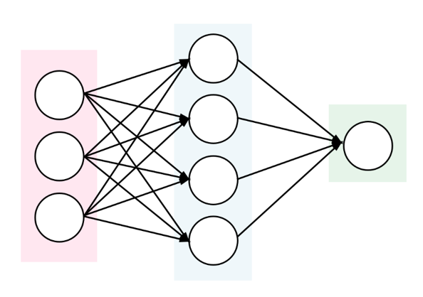
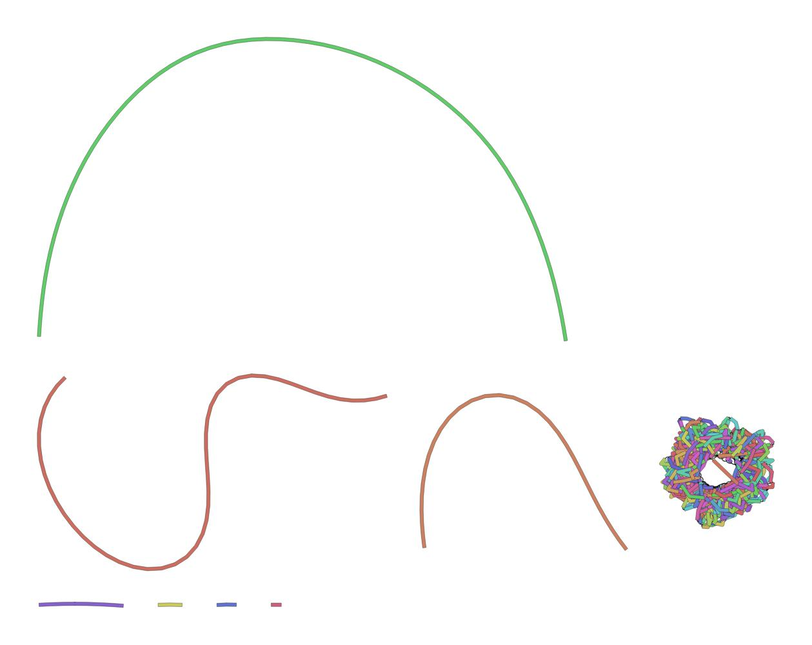
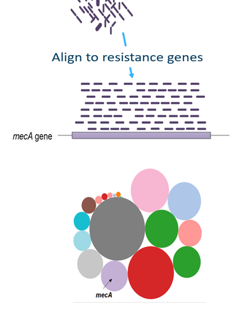
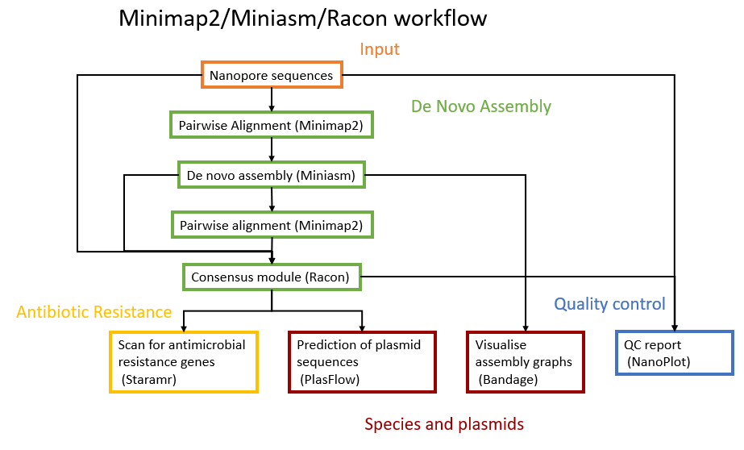

# Overview
{:.no_toc}

In this tutorial we will perform an assembly of nanopore data and show some of the possible analysis tools. The assembly is performed with Minimap2, Miniasm and Racon. The analysis is done with Nanoplot, Bandage and PlasFlow.

> ### Agenda
>
> In this tutorial, we will:
>
> 1. TOC
> {:toc}
>
{: .agenda}


> ###  Note
> Your results may deviate slightly from the ones presented in this tutorial due to differing tool or
> reference data versions or stochastic processes in the algorithms.
{: .comment}


# Obtaining and preparing data

In this tutorial we use metagenomic nanopore data, but similar pipelines can be used for Illumina data.

> ###  Background: Nanopore sequencing
>  <br><br>
>
> Nanopore sequencing has serveral properties that make it more suited for our purposes
>
> 1. Long-read sequencing technology offers simplified and less ambiguous genome assembly
> 2. Long-read sequencing gives the ability to span repetitive genomic regions
> 3. Long-read sequencing makes it possible to identify large structural variation
>
> (slide credit [Nanopore sequencing: The advantages of long reads for genome assembly](https://nanoporetech.com/sites/default/files/s3/white-papers/WGS_Assembly_white_paper.pdf?submissionGuid=40a7546b-9e51-42e7-bde9-b5ddef3c3512 ))
{: .tip}

## Understanding our input data
In this tutorial we are interested in determing the antimicrobial resistance genes.

As training data we use a sing plasmid from a dataset (,created by Li, Ruichao et al.) used for evaluation of the efficiency of MDR plasmid sequencing by MinION platform. In the experiment 12 MDR plasmid-bearing strains were selected for plasmid extraction, including E. coli, S. typhimurium, V. parahaemolyticus, and K. pneumoniae. Overnight cultures (100 mL) were harvested and subjected to plasmid extraction using the QIAGEN Plasmid Midi Kit. The extracted plasmids were dissolved in ultrapure distilled water, and concentrations were measured by Qubit 3.0 Fluorometer with a dsDNA BR Assay Kit. The plasmids were stored in –20°C until library preparation.

Library preparation was performed using the Rapid Barcoding Sequencing Kit (SQK-RBK001) according to the standard protocol provided by the manufacturer (Oxford Nanopore). Briefly, 7.5-μL plasmid templates were combined with a 2.5-μL Fragmentation Mix Barcode (1 barcode for each sample). The mixtures were incubated at 30°C for 1 minute and at 75°C for 1 minute. The barcoded libraries were pooled together with designated ratios in 10 μL; 1 μL of RAD (Rapid 1D Adapter) was added to the pooled library and mixed gently; 0.2 μL of Blunt/TA Ligase Master Mix was added and incubated for 5 minutes at room temperature. The constructed library was loaded into the Flow Cell R9.4 (FLO-MIN106) on a MinION device and run with the SQK-RBK001_plus_Basecaller script of MinKNOW1.5.12 software. The run was stopped after 8 hours, and the flow cell was washed by a Wash Kit (EXP-WSH002) and stored in 4°C for later use.

To obtain high-quality short read data, paired-end (2 × 150 bp) libraries were prepared by the focused acoustic shearing method with the NEBNext Ultra DNA Library Prep Kit and the Multiplex Oligos Kit for Illumina (NEB). The libraries were quantified by employing quantitative PCR with P5-P7 primers, and they were pooled together and sequenced on the NextSeq 500 platform according to the manufacturer's protocol (Illumina).

Although a local basecaller script was used during the run, there was still a small amount of reads that were not basecalled due to the generation of raw data in a rapid mode. Albacore basecalling software (v1.0.3) was used to generate fast5 files harboring the 1D DNA sequence from fast5 files with only raw data in the tmp folder. Also, the read_fast5_basecaller.py script in Albacore was used to de-multiplex the 12 samples from basecalled fast5 files (except the files in fail folder) based on the 12 barcodes in SQK-RBK001. The Poretools toolkit was utilized to extract all the DNA sequences from fast5 to fasta format among the 12 samples, respectively (Poretools, RRID:SCR_015879).

To make this tutorial easier to execute, we are providing only one MDR pasmid-bearing strain - you are given the file below.

> ###  Dataset details
> Because of the large size of the original datasets (1.15 GB) you are given 1 of the 12 plasmids
> files.
> <br><br>
> This sequence file is 51 MB of nanopore sequences. The 10026 reads found in this file contain 49190798 nucleotides.
> As mentioned before nanopore sequences are long reads and this is confirmed by a mean read length of 4906.3.
{: .comment}

## Importing the data into Galaxy

Now that we know what our input data is, let's get it into our Galaxy history:

> ###  Hands-on: Obtaining our data
>
> 1. Make sure you have an empty analysis history. Give it a name.
>
>    > ###  Starting a new history
>    >
>    > * Click the **gear icon** at the top of the history panel
>    > * Select the option **Create New** from the menu
>    {: .tip}
>
> 2. **Import Sample Data.** The data for this course may be available from a shared library in Galaxy
> (ask your instructor). If this is not the case, you can upload it yourself.
>   - Option 1: From data library:
>     - Navigate to the shared data library, you should find the fasta file.
>     - Option 2: From your Zenodo:
>       - Data is available from Zenodo here: [](https://doi.org/10.5281/zenodo.1443246)
>       - In the file upload menu choose the `Paste/Fetch data` option and enter the following urls to import the file from Zenodo to Galaxy directly
>
>       > ###  List of Zenodo URLs
>       > ```
>       > https://zenodo.org/record/1443246/files/RB01.fasta
>       > ```
>       {: .solution }
{: .hands_on}

# Quality Control

## NanoPlot to explore data

 <br><br>

The first thing we want to do is to understand the input data we use. This is done
using the NanoPlot command, which requires the Nanopore sequences as input. This command will
create several plots, statisical report and a HTML report page.

> ###  Hands-on: Plotting scripts for long read sequencing data
>
> - **NanoPlot**  with the following parameters
>   - "Type of the file(s) to work on" to `fasta`
>   - "files" to the `RB01.fasta` you just uploaded
>   - Leave all other parameters to the default settings <br><br>
>
{: .hands_on}

The `Histogram Read Length` gives an overview of the read distribution of the input file.
 <br><br>

For more information on the topic of quality control, please see our training materials
[here]({{site.baseurl}}/topics/sequence-analysis/)

# De Novo Assembly

## Pairwise alignment using Minimap2

In this experiment we used Nanopore sequencing, this means sequencing results in long reads with overlap.
To find this overlaps Minimap2 is used. Minimap2 is a versatile sequence alignment program that aligns
DNA or mRNA sequences against a large reference database. Typical use cases include: (1) mapping PacBio
 or Oxford Nanopore genomic reads to the human genome; (2) finding overlaps between long reads with
error rate up to ~15%; (3) splice-aware alignment of PacBio Iso-Seq or Nanopore cDNA or Direct RNA
reads against a reference genome; (4) aligning Illumina single- or paired-end reads;
(5) assembly-to-assembly alignment; (6) full-genome alignment between two closely related species
with divergence below ~15%.

For ~10kb noisy reads sequences, minimap2 is tens of times faster than mainstream long-read mappers
such as BLASR, BWA-MEM, NGMLR and GMAP. It is more accurate on simulated long reads and produces biologically
 meaningful alignment ready for downstream analyses. For >100bp Illumina short reads, minimap2 is three times
 as fast as BWA-MEM and Bowtie2, and as accurate on simulated data. Detailed evaluations are available from
the minimap2 paper or the preprint.



> ###  Hands-on: Pairwise sequence alignment
>
> - **Map with minimap2**  with the following parameters
>   - "Will you select a reference genome from your history or use a built-in index?" to `Use a genome from history and build index`
>   - "Use the following dataset as the reference sequence"  to the `RB01.fasta` you just uploaded
>   - "Select analysis mode (sets default)" to `Oxford Nanopore all-vs--all overlap mapping`
>   - "Select an output format" to `paf`
>   - Leave all other parameters to the default settings <br><br>
>
{: .hands_on}

This step maps the Nanopore sequence reads against itself to find overlaps. The result is a paf file.
PAF is a text format describing the approximate mapping positions between two
set of sequences. PAF is TAB-delimited with each line consisting of the
following predefined fields:

|Col|Type  |Description                               |
|--:|:----:|:-----------------------------------------|
|1  |string|Query sequence name                       |
|2  |int   |Query sequence length                     |
|3  |int   |Query start (0-based)                     |
|4  |int   |Query end (0-based)                       |
|5  |char  |Relative strand: "+" or "-"               |
|6  |string|Target sequence name                      |
|7  |int   |Target sequence length                    |
|8  |int   |Target start on original strand (0-based) |
|9  |int   |Target end on original strand (0-based)   |
|10 |int   |Number of residue matches                 |
|11 |int   |Alignment block length                    |
|12 |int   |Mapping quality (0-255; 255 for missing)  |

View that file now, it should look something like this:
```
b9497173-8976-48fa-a822-93edea3f0baf_Basecall_1D_template	4435	212	4342	+	channel_364_204a2254-2b6f-4f10-9ec5-6d40f0b870e4_template	4464	121	4170	278	4142	0	tp:A:S	cm:i:35	s1:i:258	dv:f:0.2189
b9497173-8976-48fa-a822-93edea3f0baf_Basecall_1D_template	4435	716	4235	+	channel_13_16a53018-b542-46ba-8175-3425db8b32aa_template	4460	159	3609	274	3531	0	tp:A:S	cm:i:34	s1:i:255	dv:f:0.2123
b9497173-8976-48fa-a822-93edea3f0baf_Basecall_1D_template	4435	930	4275	+	channel_324_3090c29b-5e25-496f-ba01-7d496b381ad9_template	4479	731	4038	259	3365	0	tp:A:S	cm:i:34	s1:i:246	dv:f:0.2096
```

## Ultrafast de novo assembly using Miniasm

The mapped reads are ready to be assembled with Miniasm. Miniasm is a very fast OLC-based de novo assembler for noisy long reads. It takes all-vs-all read self-mappings (typically by minimap) as input and outputs an assembly graph in the GFA format. Different from mainstream assemblers, miniasm does not have a consensus step. It simply concatenates pieces of read sequences to generate the final unitig sequences. Thus the per-base error rate is similar to the raw input reads.


> ###  Hands-on: De novo assembly
>
> - **miniasm**  with the following parameters
>   - "Sequence Reads" parameter to the `RB01.fasta` you uploaded
>   - "PAF file" to the `PAF file` created by the Minimap2 tool
>
{: .hands_on}

The `Assembly Graph` output file gives information about the steps taken in the asssembly.

The output should look like:

```
S	utg000001l	GAAATCATCAGGCGTTTTTCACGATATGGACGGGAAGATGCGGAAATAGGCAGGAGGACATAGAAATGCCTGAGGGGTCTGGGATGGTGCGGGCAACGGATGTTATGGTAAATAAGCTTCCGTTGGTAAACCTGTAAGTTTTCAGGAACGAGACTCGTTTAGAACATCTAAAAAGCACATGAATGCTGCTATAGAAGCGACTGTTTGATGGTTCATGGTTTTATATTAAGGTAGATGAAAACTCAATACAGCGCTATTTAGAGACGCTTAAATGGCATTCTTGTATTTTAACGATGCAGAGTAACAGGCTCTAGCTAGTTATAGTACATCGAAAAGTTCATATAGGGACAAAACAAAGGGACTGAAATACATAGCCATAAGCTCGCTTCAAAGTCCTAACCACCAGCTATATTGCATGGGTTTGGTTAAGACATACGTCATGTCTTTGGGGCATATTATGGTGAAAAACGCGTTCATCTACACCAATATTTATACATTTCTCTTCAATAATGACGCCGTTTCCAGCCAACTTTGCTATATGGGTGACAATTTTCGCTTTTAAACGGAGATGTCTCCATGATTGAGCAGATCTAAAAATCTGCATTTTGTGCTGTGCAGGCATTACCATTCTTTCTATGCACAAACGTGCCGCGTCTTGCATTCTGCTTTGTATGCGGAGGTGCTCAATGAGGCTTTAACTACTCCCCTCCGTTAACGCCGTTCGTGTTTTAAACCGCCTTCTCGATAAAGAGTTTCACAGGTGCTGAAGAAATTCGCCTTTACGATGATCAGGGCGGGTGATTGGTACATCAACAACAGGCTTCTTGTTCTGTTTTGAGAGCATGAAGATCAGCCGCGATGGTAATATGTTCGTGTATTTGTCTCAAATACATTGATGACTATTACAACCGTCGTGAGTATCAGTTTAGTCAGCAGAGGCATGCTGTCGCTGTGCTCGTCAGCATAGAAAAGCCTCTACGGCCGCTCGTTTGCTTTTATCGCTAGGTGAGCTTGTCCCAGAAAGTATCCGTATGATTCTTGCGCTAATGATGATTAGGGGATATTATGTTTCTGGGGTTATTTTGTTGTTTTGCTGGCTTTCTCTACTATTAGAGAGCTTGGGGTTTCTTGGAAACGTTGAATGGGGTCCTCTAGCATGATTTGTTTGAGCTTCATCTGGTCTATGAAGCAGTCAGGAAGAGTCTTAAGCACGATGTTGGGTCTTAAACTAGACTAAAAATATAATATGCGAGCTTTTAACTCATAGACGTGTAGTTTTCACTCTTTTTGCTGGTGTTCTAAGCAAAAACTTCTGCATTACGCCTGTTTGTGGTTGCCTGTTATAAGATAACAGTAAAATCCATGCGTTTCTAAGGAGAAAATGAACAAAAGCTATCACTAAATCGTATTTCCAATAGAGGTTTCGTCCTCTTTGAAAGGGGTAGTTCATGAAAATTAGTTCATGGAAATGTTTATGATTTAGGTTGGAGTTATTAGGCGCAAAGAAGAAATATAAAAGGATAATTGAAGTTCTAAATCATTATGGTGATTGAGAGGCGTTATGAGCACAGCTAAGGAAAGTTAAGGAAAAAGGCACTCCAATGAGTAGTGCCAATGAATATTCTGGTCGTGATAGTATGAATCAAGATTACATCTAGGCAATCCATGGATATTATTATAGGTTTCTGTGGGCTGTTGGTTCGGTATTAAGTCAATTGTAGATGTAACCGAAGAAGAACTGAAGATTTAGGATACGAAGTATATAGGATAAGAGTTAGCGATCTTATCAGAAACTTTTTCTGAGTGGTGGGGATACATCTACTCCATTCAAAAGATATAATTCCTTGCGGGATTTTGGTGATTCCTTAAGATGTAGAGTACTACCCACACATACTAGCTGAAGCTGTAATTCATGAAATAAAGATAGAAAAATCTAGAAGGAAAATCAAAGGTTAAAGAAACGACTTTCCTTATGAATCAACTAAAAACATAAGATGAAGTGAGTTGCCCAAGTGGTCTAACATAATTTCTATTTATTAGGTGATAGGGCGAAACTGAAAGAAAAGAAATCTTCGAGATAGGGGTTTAAGCAAATCTGAAGTTGATATAATCATCCATCATGACAGGAGTCTGAGCACCCTTATGGCCAGCAAACAGCAAAAGCTATACTTGATGCTGACTATTTTGTTAAAATAATCAGGCCAGAGCTCACCTTAAATCTAAGTTAAACGCTTTCTTGGTCTATTCATGGGCTTAATGGCCTTACGCCAAACGCGCATGAGGAAGACATGTACGCAGCTCATTCTGCCTCTTTACAATCTGCATGTCTTTCCAGACAGGTAGGTGCTGCTATTTTAGATATAAAGGAAATTTAATTGCTGTTGGGCGCAATGATGTTCTAAATTTAACAGTGTGGCCTTTATAGTGCTGATGATGGTGAATGATCATCGCTGTGTCTACAAAGGTGGCAAATGTTACAATGAAGCAAGAAAATTAAATAAAGATAAATACAGCAAATATTGCTTTTCTGATAGGTTAAGAATTTGTCTGTTCAGTTAACTCAAGAACAAGCAGAAAAGGTTGCTGGAATGTCTACGAAGGTACTCCTGTATCATCAATCGACAGTACTCGCTCTATTCATGCTGAAATGGATGCTTCACAGCCCATCTTGCTAGACTCGAGATAGTGGTTTTGAAGATAAGGTTTTATATACAACTACGTTCCCCTGTCATAATTGTGCAGGGTATATTGTTGCTGTTGGTATCAATAAAGTTGTTTATTGAACATATGAAAAAGCAGCTTTAGAGTTGCTGATGATGCAATAACTAGAAGTTAACGAAAGTGGTAAAGTTTTATTTGAGTCCTTTGAAGGGGTTTCTACTGGAATATCATAGAAGTTCTTCTTTTCTACAGATGAAAGGATAGTAAGGTAATGCGGAGAAATATTCAACGAAGTATAAGAATCATATTGATATACAGTTTATTGATAGTTGGATTTTAATCGTGTGGCGGATATTTTCATTAACACAAAACAGATGCTGAAGCTCAAGTAGCCGTTCCATCTGGGACATAGTTAATCCGCTTCTGCCACCGATTCTCGACACCACCAACATCGGGTATGAATCTGTGACTCTGATGTTACAGAGCTTAATCTTGTGTACCAAAAACCACCATACCAACGGTGGTTTTCTCTGAGCTACTGCTCTTTGAGCCGAGGTAACTGGCTTGGAGGAGCTCAGTCACCAAAACTTGTTCTTTCAGTTTAGCCTTAACAGGCGCACAACTTAAGATGCTCCTCTAAATCAGTTACCAGTGGCTGCTGCCAGTGGCGCTTTGTCGTGCCTTCTGGGTTGGACTCAAGACGATAGTTACCGGGGCAGGCGCAGCGGTCGGACTGAACGGGGTTCGTGCGCTGGTCAGCTTGGGCGAACTGCCTGCGGAACGCTGAGTGTCAGGCGATGAGTAAAGTTTAAACAGCCATAACAGCAGGTGAAGAGCACCCCGGTGCCAAACCGAAGGCAGGAACAGAGCGCAGGGAGCTACCGGGGAAACGCAGGATCTTTATAGTCCTGTCCGGGTTTCGCCACCATGATTTGAGCGTCAGATTCTGTGATGCTTGTCAGGGGGCGGAGCCTATCGGAAAACCGGCAACGCGGCCTTTCTTGTTGCTTCTCCCATTCTCTCATTGCCTATGGCTTAATGTCTCTGTTCCCTCCGCTCGCCGCAGCGAACGACCGAGCGGGCGAGTCAGTGAGCGGAAGCGGAATATCTGCGGGCTTCTCTTTGGCACCGTACGCCATAGCGCATTTTAATACGATGCAGAATAGGGCGGGTACGCCGCAAAGTGACGTCACCTGACGTTCTGGATTACAAAGGTTAAAGCAGCGGACAGGAAATGTTTTGTGCCTAGCTATGCTATTCACAAGTAGCAGGACAGATGTGTTTTGGAGTACCATGACATAAAGACTCTGGTTAGCTCCCGCATGTTTGCTATCTTTGCTACCATTTGCTACTTTTGCTATCTCCAGGGTCTTCTGGTCTTTCAGTTGCTATCCTTTTGCTACTTTTGCTATCAAAATGCTACCTCTCCCTTCTTGCAATAAATGACCAAGGCACGTTAGCGATGTATACATCGCGCACCATAAGTGCCCCTTCCGAATCCCGTTCATCACTGTGTGATTAATCGAGGTTAAATCGACTACCAACGTAAAATCCTGCCATGCCTGACGGCTGACAACGCCCTCACGGTCGCGCAGTAAACTGCGCGCCCCTTTCACCGTTATCGGTGGGGTTCGTGGTGGCTTTCAGGGCGCTCGCCGGATTTTAACCGCTAAAATGAGCGATCCATGCGTTCGTG	LN:i:4357
a	utg000001l	0	channel_364_204a2254-2b6f-4f10-9ec5-6d40f0b870e4_template:101-4457	+	4357
```

## Remapping using Minimap2

The Assembly graph created can be used for mapping again with minimap2, but first the graph should be transformed to FASTA format

> ###  Hands-on: Pairwise sequence alignment
>
> - **GFA to Fasta**  with the following parameters
>   - "Input GFA file" to the `Assembly Graph` created by the Miniasm tool
>
> - **Map with minimap2**  with the following parameters
>   - "Will you select a reference genome from your history or use a built-in index?" to `Use a genome from history and build index`
>   - "Use the following dataset as the reference sequence"  to the `FASTA file` created by the GFA to Fasta tool
>   - "Select fastq dataset" parameter to the `RB01.fasta` you uploaded
>   - "Select an output format" to `paf`
>   - Leave all other parameters to the default settings <br><br>
>
> > ###  Question
> >
> > How many reads are over after the use of Minimap2 and Miniasm? (Hint: run the Nanoplot tool on the output of GFA to Fasta)
> >
> > > ###  Solution
> > > 456
> > >
> > > This can be determined by looking at the NanoStats output of NanoPlot.
> > {: .solution }
> {: .question}
{: .hands_on}

## Ultrafast consensus module using racon

The mapped reads can be improved even more using Racon to find a consensus sequence. Racon is intended as a standalone consensus module to correct raw contigs generated by rapid assembly methods which do not include a consensus step. The goal of Racon is to generate genomic consensus which is of similar or better quality compared to the output generated by assembly methods which employ both error correction and consensus steps, while providing a speedup of several times compared to those methods. It supports data produced by both Pacific Biosciences and Oxford Nanopore Technologies.


> ###  Hands-on: Consensus module
>
> - **Racon**  with the following parameters
>   - "Sequences" parameter to the `RB01.fasta` you uploaded
>   - "Overlaps" to the latest `PAF file` created by the Minimap2 tool
>   - "Target sequences" to the `FASTA file` created by the GFA to Fasta tool
>
{: .hands_on}

The `Racon` output file gives the final contigs.

The output should look like:

```
>utg000001l LN:i:4399 RC:i:43 XC:f:1.000000
GGGCAACGGATGTTATGGTAAATAGCTTCCGTTGGTAAGTATCTCAATGTCTGAAGTTTTCAGGGTTTGAGACTCGTTTAGAACATCTAAAAAAAAGCACATGAATGCTGCTATAGAAGCGACTGTTTGATGGTTCATGGTTTACCATTAAGGTAGATGAAAACTCAATACAGCGCTATTTAGGGCGCTTAAATGGCATTCTTATTATTTTTAACGATGCAGAGTAACAGGCTCTAGCTAGGTTATGGTACACTCGAAAAGTTCCCTTATAGGGACAAAACAAAGGGACTTTGAAGCTACGCAACCGCCAAGCTCGCTTCAAAGTCCCTGTACCGCAGCTATATTGCATGGGTTTGGTTAAGACATACGTCATGTCTTTGGGGCATATTATGGTGAAAACGCGTTCGCGTCTACACCAATATTTATACATTTCTCTTCAATATTGACGCCGTTTCCAGCCAACTTTTGCTATATGGGTGACAATTTTCGCTTTTAAAACGGAGATGTCTCCATGATTGAGCATGATCCTAAAATCTGCATTTTGTGCTGTGCAGGCATTACCATTCTTTCTATGCACAAACGTGCCGCGTCTTGCATTCTGCTTTTGTATGCGGAGGTGCTCAATGAGAGCTTTAACTACTCCCCTCGTTATGCTAACGCCGTTCGTGTTTTAAACCGCCTTCTCGATAAAGAGTTTCTGAGTGCTGAAGAAATTCGCCTTTACGATGATCAGGGCGGGTGATTGAGTACATCAACAACAGGCTTCTTGTTCCTGTTTTGAGCATGAAGATCAGCCGCGATGGTGAGTATGTTCGTGTCTGGTATTTGTCTCAAGAAGCCATTGATGACTATTACAACCGTCGTGAGTATCAGTTTAGTCAGCAGAGGCATGCTGTCGCTGTTGCTCGTCAGCATAGAAAAGCCTCTACGGCCGCTCGTTTGCTTTTATCGCTAGGTGAAACTGTCCCAGAAAGTATCCGTATGATTCTTGCTGCTAATGATGATTAGGAGGATATTATGTTTCTGGGGTTATTTGTTGTTTTGCTGGCTTTCTCTACCTATTAGAGAGCTTGGGGTTTCTTCACGGAAACGTTGAATGGGAGTGCCTCTCGCCATGATTTGTTTTAGGCTTCATCTGGTCTATGAAGCAGTCAGGAGAGTGCTTAAGCACGATGTTTAGGTCTTAAACTAGACTAAAAGCTCGCAATATGCGAGCTTTTATTTATTCATAGACTTGTGTAGTTTTCACTCTTTTTGCTGGTGTTCTAAGCAAAAACTTCTGCGCATTACGCCTGTTTGTGGTTGCCTGTTATAAAGATAACAGTAAAATCCATGCGTTTCGCAGGAGAAAATATGAGCAAAGAGCTATCACTAAATCGTATTTCCAATAGAGTTTCGTCCTCTTTGAAGAGGGGTAGTTCATGAAAGAGTGGTTCATGGAAATGTTTATGATTTGGAGTTGGAGTTATTAAGGCGCAAAAGAGAAGAAGCTATAAAAGGATAATTGAAGATTCTAAATCATTAAAATGGTGATTGAGAGGCGTTATGAGCACAGCTAGGAAGTTAAAGGAAAAAAAGCACTCCAATGAGTAGTGCCAATGAAGATATTTCTGGTCGTGATAGTATGAATCAGATTACATCTAGGCAATCCATGGATATTATTATAGGTTTCTGTGGGGCTGTTGGTTCCGGTATTAAGTCAATTGTAGATGTAACCGAAGAAGAACTGGAAGATTTAGGATACGAAGTATATAGGATAAGAGTTAGCGATCTTATGCAGAAACTTTTTTTCTGAGTGGTGTGGGGATACATCTACTCCATTCAAAGATATAATTCCTTGCAGGATTTTGGTGATTCCTTAAGATGTAAGTACTACCCACACATACTAGCTGAAGCTGTAATTCATGAAATAAAGATAGAAAAATCTAGAAGGAAAATCAAAAGAGTTAAAGAAACGAGCTTTCCTTATAGATCAACTAAAGCACCAAGATGAAATTGAGTTGCTTAGAATGGTCTATCAACATAATTTCTATTTATTAGGTGTTATTAGGAGCGAGACTGAAAGAAAAGAAATCTTCGAGATGAGGGTTTAAGCAAATCTGAAGTTGATATAATCATCCATCATGACAGGAAGTCTGAGCACCCTTATGGCCAGCAAACAGCAAAAGCTATACTTGATGCTGACTATTTTGTTAAAAATAATCAAGGCCAGAGCTCACCTTAAATCTAAAGTTAAACGCTTTCTTGGTCTAATTCATGGGCTTAATGGCCTTACGCCAAACGCGCATGAGAAGGGCATGTACGCAGCTCATTCTGCCTCTTTACAATCTGCATGTCTTTCCAGACAGGTAGGTGCTGCTATTTTAGATATAAAGGAAATTTAATTGCTGTTGGGCGCAATGATGTTCCTAAATTTAACGGTGGCCTTTATAGTGCTGATGATGGGTGAATGATCATCGCTGTGTCTACAAAGGTGGCAAATGTTACAATGAAGTAAGAAAATTAAAATAAAAGATAAAATACAGCAAATATTGCTTTCTGATAAGGTTAAGGAGTTGTCTGTTCAGTTAACTCAAGAACAAGCAGAAAAGGTTGCTGGAATAATCTACGAAGGTACTCCTGTATCATCAATCATTGAGTACTCTCGCTCTATTCATGCTGAAATGGATGCTATTACATCTCTTGCTAGACTCGGGAATGGTGGTTTTGAAGATAAGGTTTTATATACAACTACGTTCCCCTGTCATAATTGTGCGAGACATATTGTTGCTGTTGGTATCAATAAAGTTGTTTACATTGAACCTTATGAAAAAAGCTTAGCTTTAGAGTTGCACGATGATGCAATAACTGAAGTTAACGAAAGTGGTAAGGTTTTATTTGAGTCCTTTGAAGGGGTTTCACCAAGGAGATATCATAAGTTCTTCTTTTCTACAGATGAAAGGAAGGATAGTAAAGGTAATGCGGAGAAATATTCAACGAAGTATAAGAATCATATTGATATACAGTTTATTGATAGTTATGGATTTTGAAAATCGTGTGGCGGATATTTTCATTAGTAACACAAAACAGATGCTGAAGCTCAAGTAGCCGTTCCATCTGGGACGCCAGTTAATCCGCTTCTGCCACCGATTCCTCCGACGCCACCAACATCGGTATGAAGATCTATTGACTCTGATGTTACACAGAGCTTAATCTTGCAAAGAAGAAAAACCACCGCTACCAACGGTGGTTTTCAGGTTCTCTGAGCTACCAACTCTTTGAACCGAGGTAACTGGCTTGGAGGAGCTCAGTCACCAAAACTTGTTCTTTCAGTTTAGCCTTAACAGGCGCACAACTTCAAGACTAACTCCTCTAAATCAGTTACCAGTGGCTGCTGCCAGTGGCGCTTTGTCGTGCCTTCTCGGGTTGGACTCAAGACGATAGTTACCGGGGCAGGCGCAGCGGTCGGACTGAACGGGGGTTCGTGCATACAGTCCAGCTTGGAGCGAACTGCCTACCCGGAACTGAGTGTCAGGCGTGGAATGAGACAAACGCGGCCATAACAGCGGAATGACACACCGGTAAACCGAAAGGCAGGAACAGGAGAGCGCACGAGGGAGCTACCGGGGAAACGCAGGATCTTTATAGTCCTGTCGGGTTTCGCCACCACTGATTTGAGCGTCAGATTCTGTGATGCTTGTCAGGGGGCGGAGCCTATGGAAAACCGGCAACGCCGCGGCCTTTCTTGTTGCTTCTCCATTCTCTCATTGCCTATGGCTTAATGTCTCTGTTCCCTCCGCTCGCCGCAGCCGAACGACCGAGCGGAGCGAGTCAGTGAGCGAGGAAGCGGAATATCTGCGGGCTTCTCTTTGGCACCGTACGCGCCATAGCTGCATTTTTAATACGATGCAGGATAGGGCGAACGCCGCAAAGTGACGTCACCTGACGTTCTGGATTACAAAGGTTAAAGCAGCGGACAGGAAATGTTTTGTGCCCACAGCTATGCTGGCTTATTCACAAAACAGCGGGACAAGATGTGTTTTGGAGTACCGCCGGCCCGCTAAAGACTCTGGTTAGCTCCCGCATGTTTGCTATCTTTTTGCTACCATTTTGCTACTTTTTTGCTATCTCCAGAGTCTTCTGGTCTTTCGGTTGCTATCCTTTTGCTACTTTTTTGCTATCAAAATGCTACCTCTCCCTTCTTGCAATAAATGACCAAGGCACGTTAGCGATGTATACATCGCCGCGCCCATAAGTGCCCCTTCGAATCCCGTTCATCACTGTGCTGATTAATCGAGGTTAAATCCGACCCCTTAGCAATAAATCCTGCCATGCCTGACGGGCTGCCAACGCCTCACGGTCGCATTGAGTAAACTGCGCACCCTTTCACCGTTATCGGTGGGGTTCGTGGTGGCTTTCA
```

# Species and plasmids

## Prediction of plasmid sequences and classes using PlasFlow

To determine whether the contigs are chomosomal or plasmid DNA PlasFlow can be used. Furthermore, it
assigns the contigs to a bacterial class.

PlasFlow is a set of scripts used for prediction of plasmid sequences in metagenomic contigs. It relies on the neural network models trained on full genome and plasmid sequences and is able to differentiate between plasmids and chromosomes with accuracy reaching 96%. It outperforms other available solutions for plasmids recovery from metagenomes and incorporates the thresholding which allows for exclusion of incertain predictions.




> ###  Hands-on: Prediction of plasmid sequences
>
> - **PlasFlow**  with the following parameters
>   - "Sequence Reads" to the `contig file` created by the Racon tool
>
> > ###  Question
> >
> > What is the classification of utg000144c? (Hint: Check the probability table created by PlasFlow)
> >
> > > ###  Solution
> > > plasmid.Proteobacteria
> > >
> > > This can be determined by looking at the 5th column of the probability table.
> > {: .solution }
> {: .question}
{: .hands_on}


The most important output of PlasFlow is a tabular file containing all predictions (specified with `--output` option), consiting of several columns including:

```
contig_id 	contig_name 	contig_length 	id 	label 	...
```

where:

- `contig_id`is an internal id of sequence used for the classification
- `contig_name` is a name of contig used in the classification
- `contig_length` shows the length of a classified sequence
- `id` is an internal id of a produced label (classification)
- `label` is the actual classification
- `...` represents additional columns showing probabilities of assignment to each possible class

Sequences can be classified to 26 classes including: chromosome.Acidobacteria, chromosome.Actinobacteria, chromosome.Bacteroidetes, chromosome.Chlamydiae, chromosome.Chlorobi, chromosome.Chloroflexi, chromosome.Cyanobacteria, chromosome.DeinococcusThermus, chromosome.Firmicutes, chromosome.Fusobacteria, chromosome.Nitrospirae, chromosome.other, chromosome.Planctomycetes, chromosome.Proteobacteria, chromosome.Spirochaetes, chromosome.Tenericutes, chromosome.Thermotogae, chromosome.Verrucomicrobia, plasmid.Actinobacteria, plasmid.Bacteroidetes, plasmid.Chlamydiae, plasmid.Cyanobacteria, plasmid.DeinococcusThermus, plasmid.Firmicutes, plasmid.Fusobacteria, plasmid.other, plasmid.Proteobacteria, plasmid.Spirochaetes.

If the probability of assignment to given class is lower than threshold (default = 0.7) then the sequence is treated as unclassified.

Additionaly, PlasFlow produces fasta files containing input sequences binned to plasmids, chromosomes and unclassified.

## Visualising de novo assembly graphs using Bandage

To determine whether the contigs are chomosomal or plasmid DNA Bandage can give a clear view of the assembly.

Bandage (a Bioinformatics Application for Navigating De novo Assembly Graphs Easily), is a program that creates visualisations of assembly graphs. Sequence assembler programs (such as Miniasm, Velvet, SPAdes, Trinity and MEGAHIT) carry out assembly by building a graph, from which contigs are generated. By granting easy access to these assembly graphs, Bandage allows users to better understand, troubleshoot and improve their assemblies.


> ###  Hands-on: Visualising de novo assembly graphs
>
> - **Bandage image**  with the following parameters
>   - "Graphical Fragment Assembly" to the `Assembly graph` created by the Miniasm tool
>
{: .hands_on}

The Assembly graph image shows one hypothetical plasmid, where the other sequences seem to be chromosal DNA.


# Antibiotic Resistance

## Scans genome contigs for antimicrobial resistance genes

To determine whether the contigs contain antimirocbial resistance genes (AMR) staramr can be used.
Staramr (*AMR) scans bacterial genome contigs against both the ResFinder and PointFinder databases (used by the ResFinder webservice) and compiles a summary report of detected antimicrobial resistance genes.




> ###  Hands-on: Prediction of AMR genes
>
> - **staramr**  with the following parameters
>   - "genomes" to the `contig file` created by the Racon tool
>
> > ###  Question
> >
> > Which contig contains the Gene: dfrA17? (Hint: Check the resfinder.tsv created by staramr)
> >
> > > ###  Solution
> > > utg000144c
> > >
> > > This can be determined by looking at the 2nd and 7th column of the resfinder.tsv.
> > {: .solution }
> {: .question}
{: .hands_on}

There are 5 different output files produced by `staramr`:

1. `summary.tsv`:  A summary of all detected AMR genes/mutations in each genome, one genome per line.
2. `resfinder.tsv`: A tabular file of each AMR gene and additional BLAST information from the **ResFinder** database, one gene per line.
3. `pointfinder.tsv`: A tabular file of each AMR point mutation and additional BLAST information from the **PointFinder** database, one gene per line.
4. `settings.txt`: The command-line, database versions, and other settings used to run `staramr`.
5. `results.xlsx`: An Excel spreadsheet containing the previous 4 files as separate worksheets.

The summary file is most important and gives all the resistance genes found.

# Conclusion
You have now seen how to perform an assembly on Nanopore sequencing data, with some extra analysis tools. You have worked your way through the following pipeline:

