# Introduction
{:.no_toc}

During sequencing, the nucleotide bases in a DNA or RNA sample (library) are determined by the sequencer. For each fragment in the library, a short sequence is generated, also called a **read**, which is simply a succession of nucleotides

Modern sequencing technologies can generate a massive number of sequence reads in a single experiment. However, no sequencing technology is perfect, and each instrument will generate different types and amounts of error, such as incorrect nucleotides being called. These are due to the technical limitations of each sequencing platform.

Therefore, it is necessary to understand, identify and exclude error-types that may impact the interpretation of downstream analysis.
Sequence quality control is therefore an essential first step in your analysis. Catching errors early saves time later on.

> ### Agenda
>
> In this tutorial, we will deal with:
>
> 1. TOC
> {:toc}
>
{: .agenda}

# Inspect a raw sequence file

> ###  Hands-on: Data upload
>
> 1. Create a new history for this tutorial and give it a proper name
>
>    
>    
>
> 2. Import `GSM461178_untreat_paired_subset_1.fastq` from [Zenodo](https://zenodo.org/record/61771) or from the data library (ask your instructor)
>
>    ```
>    https://zenodo.org/record/61771/files/GSM461178_untreat_paired_subset_1.fastq
>    ```
>
>    
>    
>
>    As default, Galaxy takes the link as name, so rename them.
>
> 4. Rename the file to `reads_1`
>
>    
>
{: .hands_on}

We just imported a file into Galaxy. This file is similar the data we could get directly from a sequencing facility: a [FASTQ file](https://en.wikipedia.org/wiki/FASTQ_format).

> ###  Hands-on: Inspect the FASTQ file
>
> 1. Inspect the file by clicking on the  (eye) icon
>
{: .hands_on}

Although it looks complicated (and maybe it is), the FASTQ format is easy to understand with a little decoding.

Each read, representing a fragment of the library, is encoded by 4 lines:

Line  | Description
--- | ---
1 | Always begins with `@` and then information about the read
2 | The actual nucleic sequence
3 | Always begins with a `+` and sometimes the same info in line 1
4 | Has a string of characters which represent the quality scores associated with each base of the nucleic sequence; must have the same number of characters as line 2

So for example, the first sequence in our file is:

```
@SRR031716.1 HWI-EAS299_4_30M2BAAXX:3:1:944:1798 length=37
GTGGATATGGATATCCAAATTATATTTGCATAATTTG
+SRR031716.1 HWI-EAS299_4_30M2BAAXX:3:1:944:1798 length=37
IIIIIIIIIIIIIIIIIIIIIIIIIIIII8IIIIIII
```

It means that the fragment named `SRR031716.1` corresponds to the DNA sequence `GTGGATATGGATATCCAAATTATATTTGCATAATTTG` and this sequence has been sequenced with a quality `IIIIIIIIIIIIIIIIIIIIIIIIIIIII8IIIIIII`.

But what does this quality mean?

The quality score for each sequence is a string of characters, one for each base of the nucleic sequence, used to characterize the probability of mis-identification of each base. The score is encoded using the ASCII character table (with [some historical differences](https://en.wikipedia.org/wiki/FASTQ_format#Encoding)):


So each nucleotide is assigned to an ASCII character, representing its [Phred quality score](https://en.wikipedia.org/wiki/Phred_quality_score), the probability of an incorrect base call:

Phred Quality Score | Probability of incorrect base call | Base call accuracy
--- | --- | ---
10 | 1 in 10 | 90%
20 | 1 in 100 | 99%
30 | 1 in 1000 | 99.9%
40 | 1 in 10,000 | 99.99%
50 | 1 in 100,000 | 99.999%
60 | 1 in 1,000,000 | 99.9999%

> ###  Questions
>
> 1. Which ASCII character corresponds to the worst Phred score for Illumina 1.8+?
> 1. What is the Phred quality score of the 3rd nucleotide of the 1st sequence?
> 2. What is the accuracy of this 3rd nucleotide?
>
> > ###  Solution
> > 1. The worst Phred score is the smallest one, so 0. For Illumina, it corresponds to the `!` character.
> > 2. The 3rd nucleotide of the 1st sequence has a ASCII character `I`, which correspond to a score of 40.
> > 3. The corresponding nucleotide `G` has an accuracy of 99.99%
> >
> {: .solution }
{: .question}

> ###  Comment
> The current lllumina (1.8+) uses Sanger format (Phred+33). If you are working with older datasets you may encounter the older scoring schemes. **FastQC** , the tool we will use in the next step, can be used to try to determine what type of quality encoding is used (through assessing the range of Phred values seen in the FASTQ).
{: .comment}

When looking at the file in Galaxy, it looks like most the nucleotides have a high score (`I` corresponding to a score 40). Is it true for all sequences? And along the full sequence length?

# Assess the Read Quality

To estimate sequence quality along all sequences, we now use [FastQC](https://www.bioinformatics.babraham.ac.uk/projects/fastqc/). It is an open-source tool that provides a simple way to quality control raw sequence data. It provides a modular set of analyses which you can use to give a quick impression of whether your data has any problems of which you should be aware before doing any further analysis.

> ###  Hands-on: Quality check
>
> 1. Run **FastQC**  with the following parameters
>    -  *"Short read data from your current history"*: `reads_1`
>
> 2. Inspect the generated HTML files
>
{: .hands_on}

> ###  Questions
>
> Which Phred encoding is used in the FASTQ file for these sequences?
>
> > ###  Solution
> > The Phred scores are encoded using `Sanger / Illumina 1.9` (`Encoding` in the top table).
> {: .solution }
{: .question}

## Per base sequence quality

Rather than looking at quality scores for each individual read, FastQC looks at quality collectively across all reads within a sample:

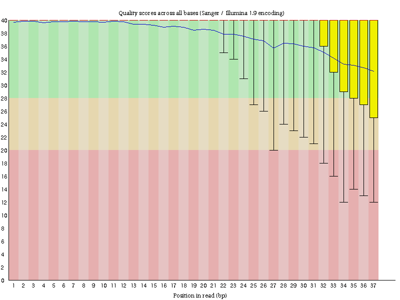

On the x-axis are the base position in the read. In this example, the sample contains reads that are 37 bp long.

> ###  Non uniform X-axis
>
> The X-axis is not uniform. It starts out with individual 1-10 bases. After that, bases are binned across a window a certain number of bases wide. Data binning means grouping and is a data pre-processing technique used to reduce the effects of minor observation errors. The number of base positions binned together depends on the length of the read. With 150 bp reads, the latter part of the plot will report aggregate statistics for 5bp windows. Shorter reads will have smaller windows and longer reads larger windows. 
>
> Binning can be removed when running FastQC
{: .comment}

For each position, a boxplot (BoxWhisker type ) is drawn with:

- the median value, represented by the central red line
- the inter-quartile range (25-75%), represented by the yellow box
- the 10% and 90% values in the upper and lower whiskers
- the mean quality in the blue line

The y-axis shows the quality scores. The higher the score, the better the base call. The background of the  graph divides the y-axis into very good quality scores (green), scores of reasonable quality (orange), and reads of poor quality (red).

It is normal with all Illumina sequencers for the median quality score to start out lower over the first 5-7 bases and to then rise. The quality of reads on most platforms will drop at the end of the read. This is often due to signal decay or phasing during the sequencing run:

- Signal decay

  The fluorescent signal intensity decays with each cycle of the sequencing process. Due to the degrading fluorophores, a proportion of the strands in the cluster are not being elongated. The proportion of the signal being emitted continues to decrease with each cycle, yielding to a decrease of quality scores at the 3' end of the read. 

- Phasing

  The signal starts to blur with the increase of number of cycles because the cluster looses synchronicity. As the cycles progress, some strands get random failures of nucleotides to incorporate due to:

  - Incomplete removal of the 3' terminators and fluorophores
  - Incorporation of nucleotides without effective 3' terminators

  This leads to a decrease in quality scores at the 3' end of the read. 

Newer chemistry has improved this somewhat, but reads are now longer than ever. 

> ###  Other sequencing error profiles
> 
> - Overclustering
>
>   Sequencing facilities can overcluster the flow cells. It results in small distances between clusters and an overlap in the signals. Two clusters can be interpreted as a single cluster with mixed fluorescent signals being detected, decreasing signal purity. It generates lower quality scores across the entire read.
>
> - Instrumentation breakdown
>
>   Some issues can occasionally happen with the sequencing instruments during a run. Any sudden drop in quality or a large percentage of low quality reads across the read could indicate a problem at the facility. Some examples of such issues:
>
>    - Manifold burst
>
>      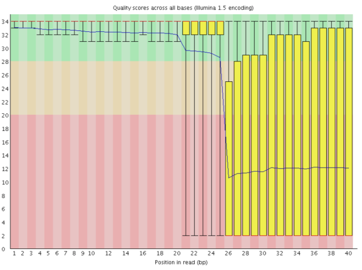
>
>    - Cycles loss
>
>      
>
>    - Read 2 failure
>
>      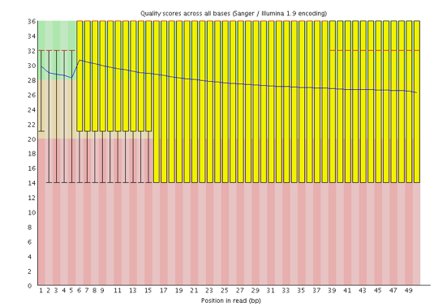
>
>    With such data, the sequencing facility should be contacted for discussion. Often, a resequencing then is needed (and from our experience also offered by the company).
>
{: .details}

> ###  Questions
>
> 1. How is the mean score changing along the sequence?
> 2. Is this tendency seen in all sequences?
>
> > ###  Solution
> > 1. The mean score over the sequence is dropping at the end of the sequences. This is very common: the sequencers are incorporating more incorrect nucleotides at the end. But the overall score stays good: over 28.
> > 2. The box plots are getting wider at the end of the sequences. It means a lot of sequences have their score dropping at the end of the sequence. At after 31 nucleotides, more than 10% of the sequences have scores below 20.
> >
> {: .solution }
{: .question}

When the median quality is below a Phred score of ~20, we should consider trimming away bad quality bases from the sequence. We will explain that process in the next section.

FastQC produces other diagnostic plots to assess sample quality.

## Per sequence quality scores

It plots the average quality score over the full length of all reads on the x-axis and gives the total number of reads with this score on the y-axis:

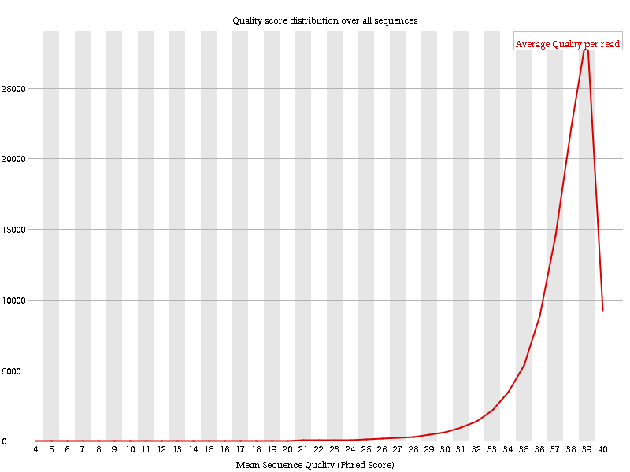

The distribution of average read quality should be fairly tight in the upper range of the plot. It can also report if a subset of the sequences have universally low quality values: it can happen because some sequences are poorly imaged (on the edge of the field of view etc), however these should represent only a small percentage of the total sequences.

## Per base sequence content

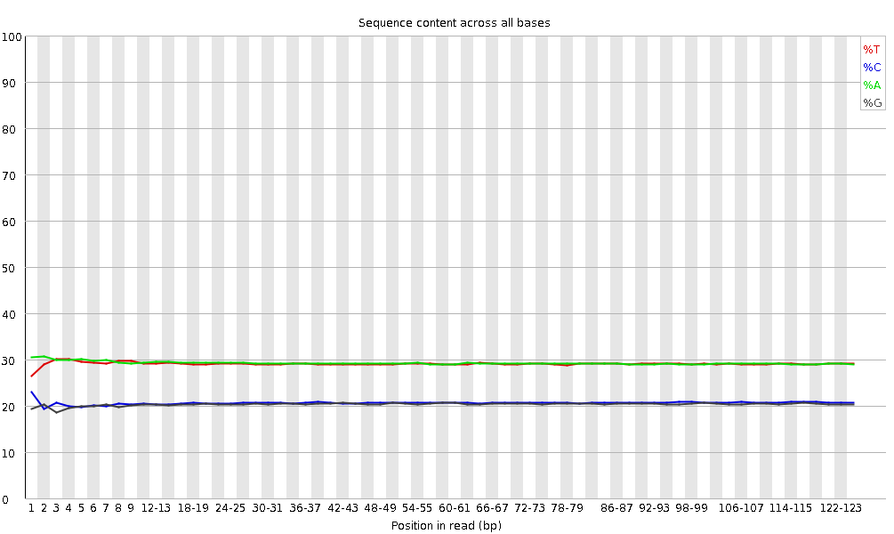

Per Base Sequence Content plots the percentage of each of the four nucleotides (T, C, A, G) at each position across all reads in the input sequence file.  As for the per base sequence quality, the x-axis is non-uniform.

In a random library we would expect that there would be little to no difference between the four bases. The proportion of each of the four bases should remain relatively constant over the length of the read with `%A=%T` and `%G=%C`, and the lines in this plot should run parallel with each other. 

> ###  Biases by library type
> 
> It's worth noting that some library types will always produce biased sequence composition, normally at the start of the read. Libraries produced by priming using random hexamers (including nearly all RNA-Seq libraries as in the previous plot), and those which were fragmented using transposases, will contain an intrinsic bias in the positions at which reads start (the first 10-12 bases). This bias does not involve a specific sequence, but instead provides enrichment of a number of different K-mers at the 5' end of the reads. Whilst this is a true technical bias, it isn't something which can be corrected by trimming and in most cases doesn't seem to adversely affect the downstream analysis. It will, however, produce a warning or error in this module.
>
> 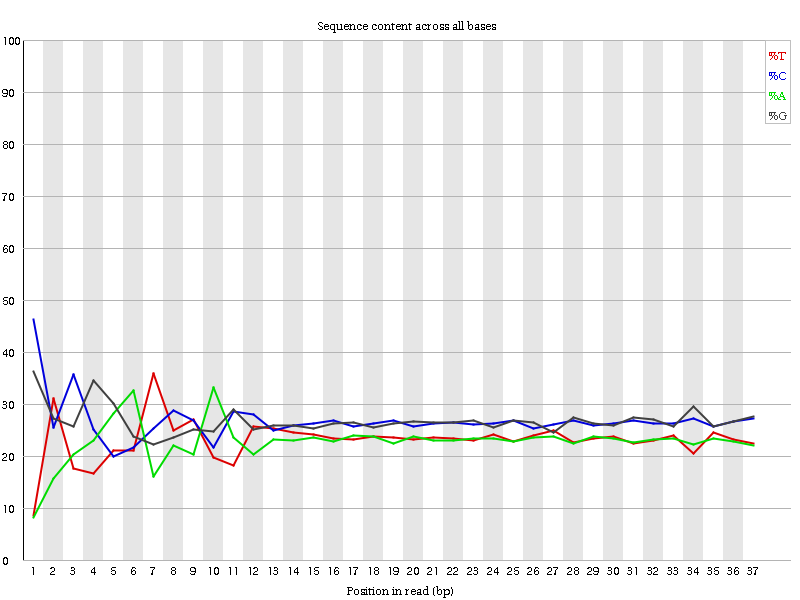
> 
> ChIP-seq data can also encounter read start sequence biases in this plot if fragmenting with transposases. With bisulphite converted data, e.g. HiC data, a separation of G from C and A from T is expected:
> 
> 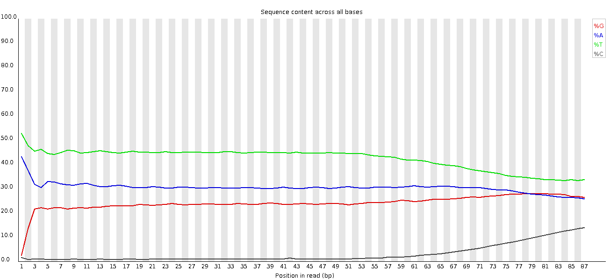
>
> At the end, there is an overall shift in the sequence composition. This correlates with a loss of sequencing quality so the suspicion is that miscalls get made with a more even sequence bias than bisulphite converted libraries. Trimming the sequences fixed this problem, but if this hadn't been done it would have had a dramatic effect on the methylation calls which were made. 
{: .details}

> ###  Questions
>
> Why is there a warning for the per-base sequence content graphs?
>
> > ###  Solution
> > In the beginning of sequences, the sequence content per base is not really good and the percentages are not equal, as expected for RNA-seq data.
> {: .solution }
{: .question}


## Per sequence GC content

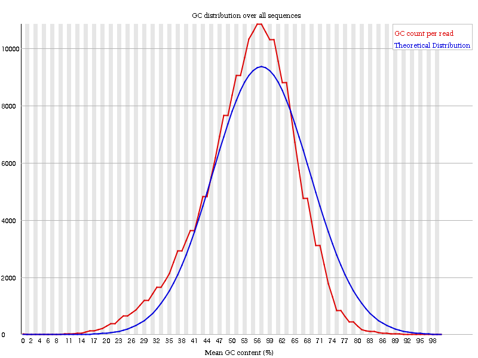

This plot displays the number of reads vs. [%] of the bases G and C per read. It is compared to a theoretical distribution assuming an uniform GC content for all reads, expected for whole genome shotgun sequencing, where the central peak corresponds to the overall GC content of the underlying genome. Since the GC content of the genome is not known, the modal GC content is calculated from the observed data and used to build a reference distribution.

An unusually-shaped distribution could indicate a contaminated library or some other kind of biased subset. A normal distribution which is shifted indicates some systematic bias, which is independent of base position. If there is a systematic bias which creates a shifted normal distribution then this won't be flagged as an error by the module since it doesn't know what your genome's GC content should be.

But there are also other situations in which an unusually-shaped distribution may occur. For example, with RNA sequencing there may be a greater or lesser distribution of mean GC content among transcripts causing the observed plot to be wider or narrower than an idealized normal distribution.

> ###  Questions
>
> Why is there a warning for the per sequence GC content graphs?
>
> > ###  Solution
> > The distribution is slightly shifted on the left, and too high.
> {: .solution }
{: .question}

## Sequence Duplication Levels

It plots in blue the percentage of reads of a given sequence in the file which are present a given number of times in the file:

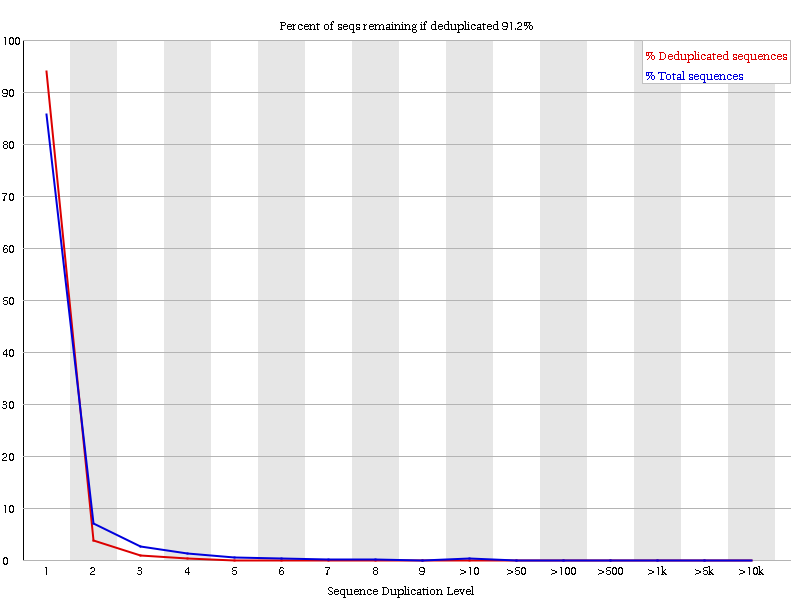

In a diverse library most sequences will occur only once in the final set. A low level of duplication may indicate a very high level of coverage of the target sequence, but a high level of duplication is more likely to indicate some kind of enrichment bias.

Two sources of duplicate reads can be found:
- PCR duplication in which library fragments have been over represented due to biased PCR enrichment

  It is a concern because PCR duplicates misrepresent the true proportion of sequences in the input. 

- Truly overrepresented sequences such as very abundant transcripts in an RNA-Seq library

  It is an expected case and not of concern because it does faithfully represent the input.

FastQC counts the degree of duplication for every sequence in a library and creates a plot showing the relative number of sequences with different degrees of duplication. There are two lines on the plot:
- Blue line: distribution of the duplication levels for the full sequence set
- Red line: distribution for the de-duplicated sequences with the proportions of the deduplicated set which come from different duplication levels in the original data.

For whole genome shotgun data it is expected that nearly 100% of your reads will be unique (appearing only 1 time in the sequence data). Most sequences should fall into the far left of the plot in both the red and blue lines. This indicates a highly diverse library that was not over sequenced. If the sequencing depth is extremely high (e.g. > 100x the size of the genome) some inevitable sequence duplication can appear: there are in theory only a finite number of completely unique sequence reads which can be obtained from any given input DNA sample.

More specific enrichments of subsets, or the presence of low complexity contaminants will tend to produce spikes towards the right of the plot. These high duplication peaks will most often appear in the blue trace as they make up a high proportion of the original library, but usually disappear in the red trace as they make up an insignificant proportion of the deduplicated set. If peaks persist in the red trace then this suggests that there are a large number of different highly duplicated sequences which might indicate either a contaminant set or a very severe technical duplication.

It is usually the case for RNA sequencing where there is some very highly abundant transcripts and some lowly abundant. It is expected that duplicate reads will be observed for high abundance transcripts:

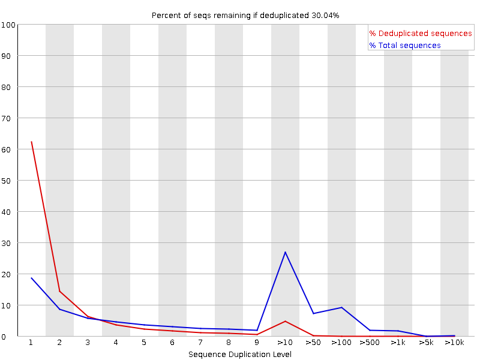

## Overrepresented sequences

A normal high-throughput library will contain a diverse set of sequences, with no individual sequence making up a tiny fraction of the whole. Finding that a single sequence is very overrepresented in the set either means that it is highly biologically significant, or indicates that the library is contaminated, or not as diverse as you expected.

FastQC lists all of the sequence which make up more than 0.1% of the total. For each overrepresented sequence FastQC will look for matches in a database of common contaminants and will report the best hit it finds. Hits must be at least 20bp in length and have no more than 1 mismatch. Finding a hit doesn't necessarily mean that this is the source of the contamination, but may point you in the right direction. It's also worth pointing out that many adapter sequences are very similar to each other so you may get a hit reported which isn't technically correct, but which has very similar sequence to the actual match.

With DNA sequencing data no single sequence should be present at a high enough frequency to be listed, but we can sometimes see a small percentage of adapter reads. RNA sequencing data may have some transcripts that are so abundant that they register as overrepresented sequence.

> ###  More details about other FastQC plots
>
> #### Per tile sequence quality
> 
> 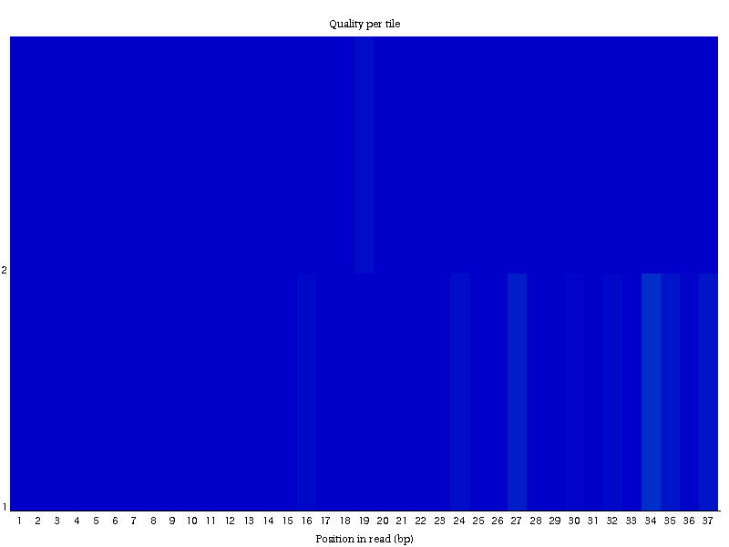
> 
> This graph will only appear for Illumina library which retains its original sequence identifiers. Encoded in these is the flowcell tile from which each read came. The graph enables you to look at the quality scores from each tile across all of your bases to see if there was a loss in quality associated with only one part of the flowcell.
>   
> The plot shows the deviation from the average quality for each tile. The colours are on a cold to hot scale, with cold colours being positions where the quality was at, or above, the average for that base in the run, and hotter colours indicate that a tile had worse qualities than other tiles for that base. In the example above you can see that certain tiles show consistently poor quality. A good plot should be blue all over.
>
> In some cases, the chemicals used during sequencing becoming a bit exhausted over the time in some tiles which makes the sequencing reactions a bit error-prone. The "Per tile sequence quality" graph will then have some horizontal lines like this:
>
> 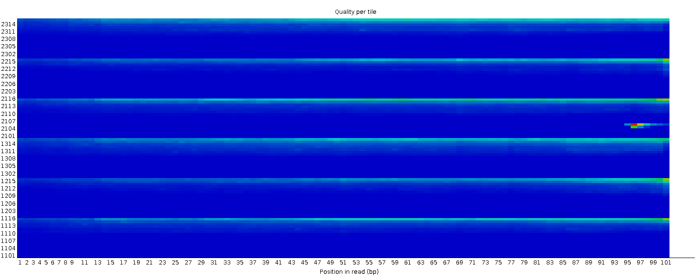
>
> #### Per base N content
>
> 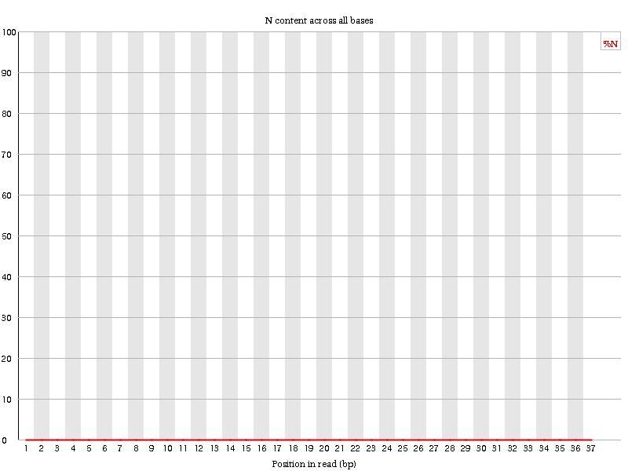
>
> If a sequencer is unable to make a base call with sufficient confidence, it will write an "N" instead of a conventional base call. This plot displays the percentage of base calls at each position or bin for which an N was called.
>
> It's not unusual to see a very low proportion of Ns appearing in a sequence, especially near the end of a sequence. But this curve should never rises noticeably above zero. If it does this indicates a problem occurred during the sequencing run. In the example below, an error caused the instrument to be unable to call a base for approximately 20% of the reads at position 29:
>
> 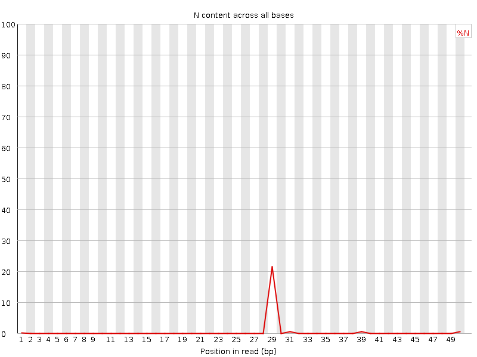
> 
> #### Sequence length distribution
>
> 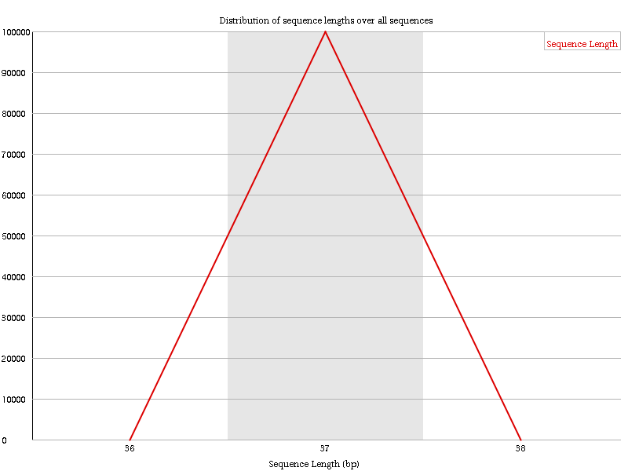
>
> Some high-throughput sequencers generate sequence fragments of uniform length, but others can contain reads of widely varying lengths. Even within uniform length libraries some pipelines will trim sequences to remove poor quality base calls from the end or the first $n$ bases if they match the first $n$ bases of the adapter up to 90% (by default), with sometimes $n = 1$. 
>
> This graph shows the distribution of fragment sizes in the file which was analysed. In many cases this will produce a simple graph showing a peak only at one size, but for variable length FASTQ files this will show the relative amounts of each different size of sequence fragment.
>
> #### Adapter Content
>
> 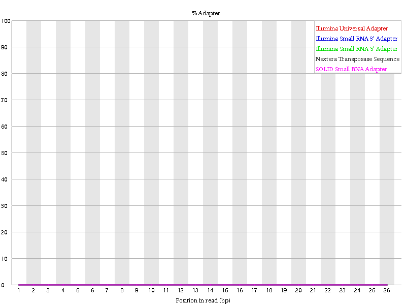
>
> The plot shows a cumulative percentage count of the proportion of your library which has seen each of the adapter sequences at each position. Once a sequence has been seen in a read it is counted as being present right through to the end of the read so the percentages only increases as the read length goes on. Only adapters specific to the library type are searched. 
>
> Ideally Illumina sequence data should not have any adapter sequence present. But with when using long read, some of the library inserts are shorter than the read length resulting in read-through to the adapter at the 3' end of the read. This is more likely to occur with RNA-Seq libraries where the distribution of library insert sizes is more varied and likely to include some short inserts. In the example below, a high quality RNA-Seq library have a small percentage of the library with inserts smaller than 150bp:
>
> 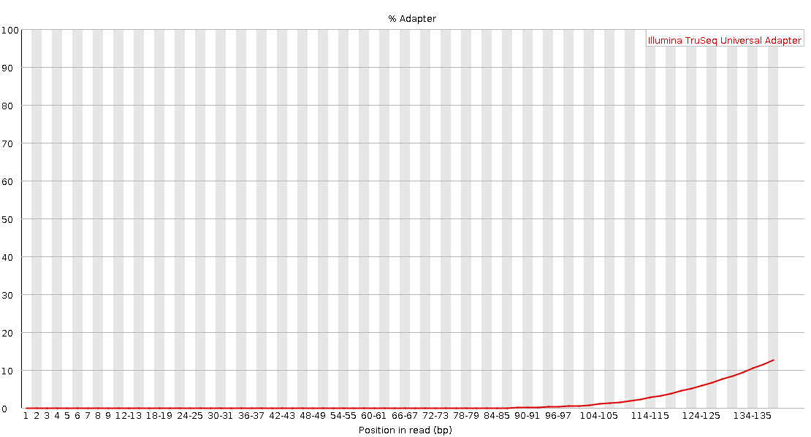
>
> #### Kmer Content
>
> FastQC does a generic analysis of all of the short nucleotide sequences of length k (kmer, with k = 7 by default) starting at each position along the read in the library to find those which do not have an even coverage through the length of your reads. Any given kmer should be evenly represented across the length of the read. 
>
> FastQC will report the list of kmers which appear at specific positions with a greater than expected frequency. This can be due to different sources of bias in the library which can include the presence of read-through adapter sequences building up on the end of the sequences. The presence of any overrepresented sequences in the library (such as adapter dimers) causes the kmer plot to be dominated by the kmer these sequences contain, and then it's not always easy to see if there are other interesting biases are present.
>
> The following example is from a high-quality DNA-Seq library. The biased kmers nearby the start of the read likely are due to slight sequence dependent efficiency of DNA shearing or a result of random priming:
>
> 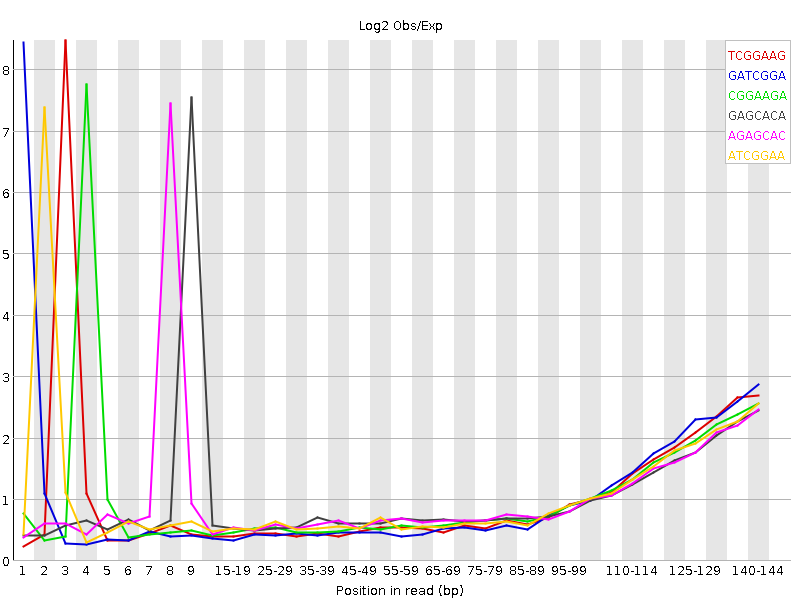
>
> This module can be very difficult to interpret. RNA-seq libraries may have highly represented kmers that are derived from highly expressed sequences. To learn more about this plot, please check the [FastQC Kmer Content documentation](http://www.bioinformatics.babraham.ac.uk/projects/fastqc/Help/3%20Analysis%20Modules/11%20Kmer%20Content.html).
>
{: .details}

We tried to explain here there different FastQC reports and some use cases. More about this and also some common next-generation sequencing problems can be found on [QCFAIL.com](https://sequencing.qcfail.com/)

> ###  Specific problem for alternate library types
>
> #### Small/micro RNA
> 
> In small RNA libraries, we typically have a relatively small set of unique, short sequences. Small RNA libraries are not randomly sheared before adding sequencing adapters to their ends: all the reads for specific classes of microRNAs will be identical. It will result in:
> 
> - Extremely biased per base sequence content
> - Extremely narrow distribution of GC content
> - Very high sequence duplication levels
> - Abundance of overrepresented sequences
> - Read-through into adapters
>
> #### Amplicon
> 
> Amplicon libraries are prepared by PCR amplification of a specific target. For example, the V4 hypervariable region of the bacterial 16S rRNA gene. All reads from this type of library are expected to be nearly identical. It will result in:
>
> - Extremely biased per base sequence content
> - Extremely narrow distribution of GC content
> - Very high sequence duplication levels
> - Abundance of overrepresented sequences
>
> #### Bisulfite or Methylation sequencing
>
> With Bisulfite or methylation sequencing, the majority of the cytosine (C) bases are converted to thymine (T). It will result in:
>
> - Biased per base sequence content
> - Biased per sequence GC content
>
> #### Adapter dimer contamination
>
> Any library type may contain a very small percentage of adapter dimer (i.e. no insert) fragments. They are more likely to be found in amplicon libraries constructed entirely by PCR (by formation of PCR primer-dimers) than in DNA-Seq or RNA-Seq libraries constructed by adapter ligation. If a sufficient fraction of the library is adapter dimer it will become noticeable in the FastQC report:
>
> - Drop in per base sequence quality after base 60
> - Possible bi-modal distribution of per sequence quality scores
> - Distinct pattern observed in per bases sequence content up to base 60
> - Spike in per sequence GC content
> - Overrepresented sequence matching adapter
> - Adapter content > 0% starting at base 1
>
{: .details}

# Filter and Trim

The quality of the sequences drops at the end of the sequences. This could cause bias in downstream analyses with these potentially incorrectly called nucleotides. Sequences must be treated to reduce bias in downstream analyis. In general, quality treatments include:

1. Cutting/Trimming/masking sequences
    - from low quality score regions
    - beginning/end of sequence
    - removing adapters
2. Filtering of sequences
    - with low mean quality score
    - too short
    - with too many ambiguous (N) bases

To accomplish this task we will use [Cutadapt](https://cutadapt.readthedocs.io/en/stable/guide.html), a tool that enhances sequence quality by automating adapter trimming as well as quality control.

> ###  Hands-on: Improvement of sequence quality
>
> 1. Run **Cutadapt**  with the following parameters
>    - *"Single-end or Paired-end reads?"*: `Single-end`
>       -  *"Reads in FASTQ format"*: `reads_1` (Input dataset)
>
>          > ###  Tip: Files not selectable?
>          > If your FASTQ files cannot be selected, you might check whether their format is FASTQ with Sanger-scaled quality values (`fastqsanger`). You can edit the data type by clicking on the pencil symbol.
>          {: .tip}
>
>       - In *Read 1 Options*
>          
>          > ###  Know adapters
>          > In this dataset, no adapters were found as we saw in FastQC report. They were already removed. 
>          > If you see or know which adapter sequences were used during library preparation, provide their sequences there.
>          {: .comment}
>
>    - In *"Filter Options"*
>       - *"Minimum length"*: `20`
>
>           It will remove reads that are shorter than 20 bp, after trimming of adapters and bad regions.
>
>    - In *"Read Modification Options"*
>       - *"Quality cutoff"*: `20`
>
>           After adapter removal (if any), we choose to remove ends ( 5' and/or 3') with low-quality, here below 20 in quality).
>
>    - In *"Output Options"*
>       - *"Report"*: `Yes`
>
> 2. Inspect the generated txt file (`Report`)
>
>    > ###  Questions
>    >
>    > 1. How many reads have been found with adapters?
>    > 2. How many basepairs have been removed from the reads because of bad quality?
>    > 3. How many sequence pairs have been removed because they were too short?
>    >
>    > > ###  Solution
>    > > 1. 0 reads with adapters
>    > > 2. 44,164 bp (1.2%) (`Quality-trimmed:`)
>    > > 3. 322 sequences
>    > {: .solution }
>    {: .question}
>
> 2. (Optional) **FastQC** : Re-run **FastQC** on the quality-controlled data, and inspect the new FastQC report
>
>    > ###  Questions
>    >
>    > 1. How many sequences have been removed?
>    > 2. Has sequence quality been improved?
>    >
>    > > ###  Solution
>    > > 1. Before Cutadapt, the dataset comprised 100,000 sequences. After Cutadapt, there are 99,678 sequences
>    > > 2. The per-base quality score looks better, but other indicators show bad values now. The sequence length distribution is not clear anymore because sequences have different size after the trimming operation
>    > {: .solution }
>    {: .question}
{: .hands_on}

The quality of the previous dataset was pretty good from the beginning and we improved it with with trimming and filtering step (in a reasonable way to not lose too much information)

> ###  Bad quality sequences
> If the quality of the reads is not good, we should always first check what is wrong and think about it: it may come from the type of sequencing or what we sequenced (high quantity of overrepresented sequences in transcriptomics data, biaised percentage of bases in HiC data).
>
> You can also ask the sequencing facility about it, especially if the quality is really bad: the quality treatments can not solve everything and you may lose too much information if too many bad quality bases are cut away. These reads then will be filtered out and you loose them.
{: .comment}

> ###  Trimming with Cutadapt
>
> One of the biggest advantage of Cutadapt compared to other trimming tools (e.g. TrimGalore!) is that it has a good [documentation](https://cutadapt.readthedocs.io) explaining how the tool works in detail.
>
> Cutadapt quality trimming algorithm consists of three simple steps:
>
> 1. Substract the chosen threshold value from the quality value of each position
> 2. Compute a partial sum of these differences from the end of the sequence to each position
>    (as long as the partial sum is negative)
> 3. Cut at the minimum value of the partial sum
>
> In the following example, we assume that the 3’ end is to be quality-trimmed with a threshold of 10 and we have the following quality values
>
> ```
> 42 40 26 27 8 7 11 4 2 3
> ```
>
> 1. Subtract the threshold
>
>     ```
>     32 30 16 17 -2 -3 1 -6 -8 -7
>     ```
>
> 2. Add up the numbers, starting from the 3' end (partial sums) and stop early if the sum is greater than zero
>
>     ```
>     (70) (38) 8 -8 -25 -23 -20, -21 -15 -7
>     ```
>
>     The numbers in parentheses are not computed (because 8 is greater than zero), but shown here for completeness.
>
> 3. Choose the position of the minimum (`-25`) as the trimming position
>
> Therefore, the read is trimmed to the first four bases, which have quality values
>
> ```
> 42 40 26 27
> ```
>
> Note that thereby also positions with a quality value larger than the chosen threshold are removed if they are embedded in regions with lower quality (the partial sum is decreasing if the quality values are smaller than the threshold). The advantage of this procedure is that it is robust against a small number of positions with a quality higher than the threshold.
>
>
> Alternatives to this procedure would be:
>
> * Cut after the first position with a quality smaller than the threshold
> * Sliding window approach
>
>     The sliding window approach checks that the average quality of each sequence window of specified length is larger than the threshold. Note that in contrast to cutadapt's approach, this approach has one more parameter and the robustness depends of the length of the window (in combination with the quality threshold). Both approaches are implemented in Trimmomatic.
{: .details}

# Process paired-end data

With paired-end sequencing, the fragments are sequenced from both sides. This approach results in two reads per fragment, with the first read in forward orientation and the second read in reverse-complement orientation. With this technique, we have the advantage to get more information about each DNA fragment compared to reads sequenced by only single-end sequencing:

```
    ------>                       [single-end]

    ----------------------------- [fragment]

    ------>               <------ [paired-end]
```
The distance between both reads is known and therefore is additional information that can improve read mapping.

Paired-end sequencing generates 2 FASTQ files:
- One file with the sequences corresponding to foward orientation of all the fragments
- One file with the sequences corresponding to reverse orientation of all the fragments

The data we analyzed in the previous step was not single-end data but the forward reads of paired-end data. We will now do the quality control on the reverse reads.

> ###  Hands-on: Assessing the quality of paired-end reads
>
> 1. Import the reverse read `GSM461178_untreat_paired_subset_2.fastq` from [Zenodo](https://zenodo.org/record/61771) or from the data library (ask your instructor)
>
>    ```
>    https://zenodo.org/record/61771/files/GSM461178_untreat_paired_subset_2.fastq
>    ```
>
> 2. Rename the file to `reads_2`
> 3. **FastQC**  with the reverse reads>
> 4. **MultiQC**  with the following parameters to aggregate the FastQC reports of both forward and reverse reads
>      - In *"Results"*
>        - *"Which tool was used generate logs?"*: `FastQC`
>        - In *"FastQC output"*
>           - *"Type of FastQC output?"*: `Raw data`
>           -  *"FastQC output"*: `Raw data` files (output of both **FastQC** )
>
>    
>
> 5. Inspect the webpage output from MultiQC
>
{: .hands_on}

> ###  Questions
>
> 1. What do you think about the quality of the sequences?
> 2. What should we do?
>
> > ###  Solution
> >
> > 1. The quality of the sequences seems worse for the reverse reads than for the forward reads: 
> >     - Per Sequence Quality Scores: distribution more on the left, i.e. a lower mean quality of the sequences
> >     - Per base sequence quality: less smooth curve and stronger decrease at the end with a mean value below 28
> >     - Per Base Sequence Content: stronger bias at the beginning and no clear distinction between C-G and A-T groups
> >
> >    The other indicators (adapters, duplication levels, etc) are similar.
> >
> > 2. We should trim the end of the sequences and filter them with **Cutadapt** 
> >
> {: .solution}
{: .question}

With paired-end reads the average quality scores for forward reads will almost always be higher than for reverse reads. 

After trimming, reverse reads will be shorter because of their quality and then will be eliminated during the filtering step. If one of the reverse reads is removed, its corresponding forward read should be removed too. Otherwise we will get different number of reads in both files and in different order, and order is important for the next steps. Therefore **it is important to treat the forward and reverse reads together for trimming and filtering**.

> ###  Hands-on: Improving the quality of paired-end data
> 1. **Cutadapt**  with the following parameters
>    - *"Single-end or Paired-end reads?"*: `Paired-end`
>       -  *"FASTQ/A file #1"*: `reads_1` (Input dataset)
>       -  *"FASTQ/A file #2"*: `reads_2` (Input dataset)
>
>          The order is important here!
>
>       - In *Read 1 Options* or *Read 2 Options*
>
>         As before, no adapters were found in these datasets. When you process your own data and you know which adapter sequences were used during library preparation, you should provide their sequences here.
>
>    - In *"Filter Options"*
>       - *"Minimum length"*: `20`
>    - In *"Read Modification Options"*
>       - *"Quality cutoff"*: `20`
>    - In *"Output Options"*
>       - *"Report"*: `Yes`
>
> 2. Inspect the generated txt file (`Report`)
>
>    > ###  Questions
>    >
>    > 1. How many basepairs has been removed from the reads because of bad quality?
>    > 2. How many sequence pairs have been removed because they were too short?
>    >
>    > > ###  Solution
>    > > 1. 44,164 bp (`Quality-trimmed:`) for the forward reads and 138,638 bp for the reverse reads.
>    > > 2. 1,376 sequences have been removed because at least one read was shorter than the length cutoff (334 when only the forward reads were analyzed).
>    > {: .solution }
>    {: .question}
>
{: .hands_on}

In addition to the report, Cutadapt generates 2 files:
- Read 1 with the trimmed and filtered forward reads
- Read 2 with the trimmed and filtered reverse reads

These datasets can be used for the downstream analysis, e.g. mapping.

> ###  Questions
>
> 1. What kind of alignment is used for finding adapters in reads?
> 2. What is the criterion to choose the best adapter alignment?
>
> > ###  Solution
> >
> > 1. Semi global alignment, i.e., only the overlapping part of the read and the adapter sequence is used for scoring.
> > 2. An alignment with maximum overlap is computed that has a smallest number of mismatches and indels.
> >
> {: .solution}
{: .question}

# Conclusion
{:.no_toc}

In this tutorial we checked the quality of two FASTQ files to ensure that their data looks good before inferring any further information. This step is the usual first step for analyses such as RNA-Seq, ChIP-Seq, or any other OMIC analysis relying on NGS data. Quality control steps are similar for any type of sequencing data:

- Quality assessment with a tool like **FastQC** 
- Trimming and filtering with a tool like **Cutadapt** 
