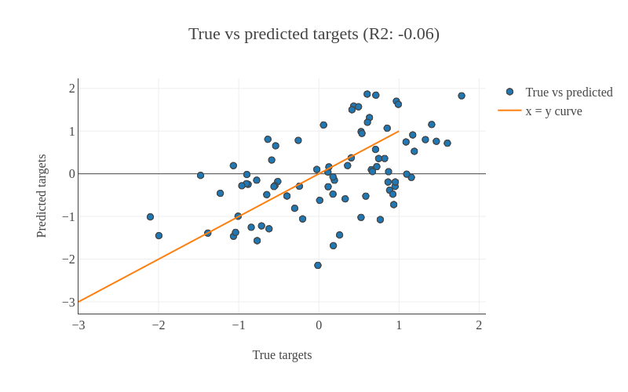
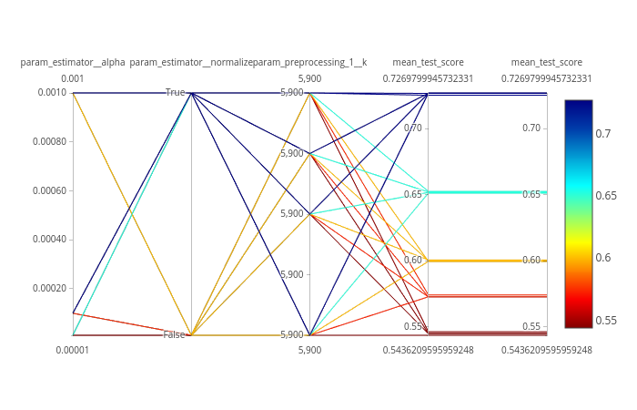
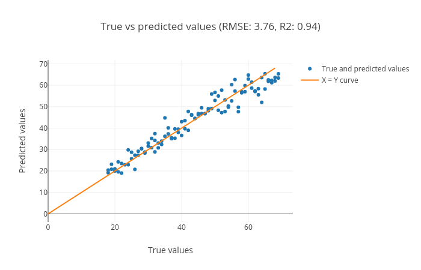
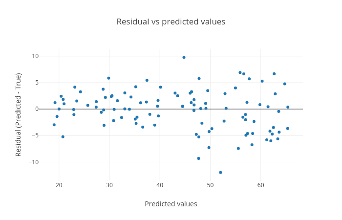
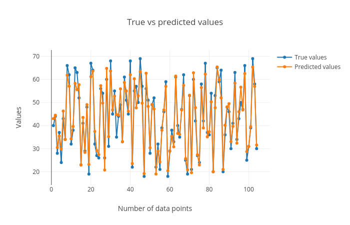

# Introduction
{:.no_toc}

[Machine Learning](https://en.wikipedia.org/wiki/Machine_learning) is used to create predictive models by learning features from datasets. In the studies [Jason G. Fleischer et al. 2018](https://genomebiology.biomedcentral.com/articles/10.1186/s13059-018-1599-6#Sec9) and [Jana Naue et al. 2017](https://www.sciencedirect.com/science/article/pii/S1872497317301643?via%3Dihub), biomarkers are examined to predict chronological age of humans by analysing the RNA-seq gene expression levels and DNA methylation pattern respectively. Different machine learning algorithms are used in these studies to select specific biomarkers to make age prediction. The RNA-seq gene expression ([FPKM](https://www.ebi.ac.uk/training/online/glossary/fpkm)) dataset was generated using fibroblast cell lines from 133 healthy humans and their ages range from 1 to 94 years. Within each individual, [DNA methylation](https://www.ncbi.nlm.nih.gov/pmc/articles/PMC3174260/) changes with age. This knowledge was used to select useful biomarkers from DNA methylation dataset. The [CpGs sites](https://en.wikipedia.org/wiki/CpG_site) with the highest correlation to age are selected as biomarkers/features. In both these studies, specific biomarkers are analysed by machine learning algorithms to create an age prediction model. [Regression](https://en.wikipedia.org/wiki/Regression_analysis) is used as the machine learning task in both the studies because the targets/labels/ages are real numbers.

Using machine learning tools in Galaxy, we can achieve comparable prediction scores as achieved by these analyses. In this tutorial, we will apply a couple of ([scikit-learn](https://scikit-learn.org/stable/)) machine learning tools to [RNA-seq](https://genomebiology.biomedcentral.com/articles/10.1186/s13059-018-1599-6#Sec9) and [DNA methylation](https://www.sciencedirect.com/science/article/pii/S1872497317301643?via%3Dihub) datasets to predict the chronological age of humans. These datasets have been taken directly from these studies. The training is done over 5-fold cross-validation and [r2](https://scikit-learn.org/stable/modules/generated/sklearn.metrics.r2_score.html) (coefficient of determination) scoring metric is used to evaluate the performance of the trained model. The closer it is to 1.0, the better it is. If it is negative, then the trained model is not good. To infer how its values exhibit model performance, we can compare the figure [1](#figure-1) and [2](#figure-2). In both the plots, the true and predicted targets are plotted in a scatter plot. For a good model, most of the points should lie along the `x = y` line as the true and predicted targets are close to each other. In figure [1](#figure-1), we can see that the points are scattered and do not show any pattern. Therefore, the r2 score is `-0.06`. But, figure [2](#figure-2) shows a better pattern as most of the points lie along the line and the r2 score is almost `1.0`.

> 

> 

This tutorial is divided into two parts - one with RNA-seq dataset and another with DNA methylation dataset. We will use the r2 metric to evaluate the performance of the trained model. For RNA-seq dataset, we will compute cross-validated r2 score using the training set and for DNA methylation dataset, we will compute the r2 score for the test set.

> ### Agenda
>
> In this tutorial, we will cover:
>
> 1. TOC
> {:toc}
>
{: .agenda}

# Analyze RNA-seq dataset 

The RNA-seq dataset is collected from fibroblast cell lines belonging to 133 healthy patients with age ranging from 1 to 94 years. Skin fibroblasts cells dataset is conducive for age prediction related studies because of multiple reasons - these skin fibroblasts hold age related damages, contain phenotypic, epigenomic and transcriptomic changes which are age-dependent and it is easy to collect this dataset using non-invasive techniques. Using this dataset, we perform an [exhaustive search](https://en.wikipedia.org/wiki/Hyperparameter_optimization) (also known as grid search) for finding the best features/genes and then apply [ElasticNet regressor](https://scikit-learn.org/stable/modules/generated/sklearn.linear_model.ElasticNet.html#sklearn.linear_model.ElasticNet) with 5-fold cross-validation. The r2 score achieved is comparable to the predictions found in the study [Jason G. Fleischer et al. 2018](https://genomebiology.biomedcentral.com/articles/10.1186/s13059-018-1599-6#Sec9).

> ###  5-fold cross-validation
>
> It is a model validation technique which estimates the performance of a predictive model on an unseen data. A dataset is divided into `5` folds and these folds are categorised into training and validation sets. The idea of cross-validation is shown in figure [3](#figure-3). The complete dataset is divided into `5` equal parts. 80% of the dataset is used for training and the remaining 20% is used for validating the performance of training. This is done for `5` folds/iterations, each time the validation set (20% of dataset) is different. In all five folds, the complete dataset is used for training and validation. The final validation performance is averaged over `5` folds. 
> 
>
{: .details}

## Get dataset

We proceed to the analysis by uploading the RNA-seq dataset.

> ###  Hands-on: Data upload
>
> 1. Create a new history for this tutorial
> 2. Import the files from [Zenodo](https://zenodo.org/record/2545213#.XEWTJ9-YVa0)
>
>    ```
>    https://zenodo.org/record/2545213/files/training_data_normal.tsv
>    ```
>
>    
>
> 3. Rename the dataset to `training_data_normal`.
>
>    
>
> 4. Check that the datatype is `tabular`
>
>    
>
{: .hands_on}

The dataset has `133` rows corresponding to humans and over `27,000` columns specifying genes. The last column `age` contains the chronological age of humans. For the validation set, this `age` column is predicted and r2 metric is computed.

> ###  Comment
> In `training_data_normal` dataset, you might have noticed that it showed `134` rows instead of `133` rows. The first row contains the header information i.e. the description of each column.
{: .comment}

## Create data processing pipeline

We can see that this RNA-seq dataset is high-dimensional. There are over `27,000` columns/features. Generally, not all the features in the dataset are useful for prediction. We need only those features which increase the predictive ability of the model. To filter these features, we perform feature selection and retain only those which are useful. To do that, we use [SelectKBest](https://scikit-learn.org/stable/modules/generated/sklearn.feature_selection.SelectKBest.html#sklearn.feature_selection.SelectKBest) module. This approach involves extracting those features which are most correlated to the target (`age` in our dataset). [F-regression](https://scikit-learn.org/stable/modules/generated/sklearn.feature_selection.f_regression.html#sklearn.feature_selection.f_regression) is used for the extraction of features. Moreover, we are not sure of how many of these features we will need. To find the right number of features, we do a hyperparameter search. It works by setting a different number of features and find out the best number for which the accuracy is the best among all the numbers. To wrap this feature selector with a regressor, we will use **pipeline builder** tool. This tool creates a sequential flow of algorithms to execute on datasets. It does not take any dataset as an input. Rather, it is used as an input to **hyperparameter search tool** (explained in the following step). As a regressor, we will use ElasticNet which creates an age prediction model. It is a linear regressor with `l1` (also called lasso) and `l2` (also called ridge) as regularisers. Regularisation is a technique used in machine learning to prevent overfitting. Overfitting happens when a machine learning algorithm starts memorising dataset it is trained upon instead of learning general features. The consequence of overfitting is that the accuracy on training set is good but on the unseen set (test set) is not good which happens because the algorithm has not learned general features from dataset. To prevent overfitting, regularisers like `l1` and `l2` are used. `L1` is a linear term added to the error function of a machine learning algorithm and `l2` adds a squared term to the error function. More details about `l1` and `l2` can found [here](https://www.kaggle.com/residentmario/l1-norms-versus-l2-norms).

> ###  Hands-on: Create pipeline
>
> 1. **Pipeline Builder**  with the following parameters:
>    - In *"1: Pre-processing step:"*:
>        - *"Choose the type of transformation:"*: `Feature Selection`
>            - *"Select a feature selection algorithm:"*: `SelectKBest - Select features according to the k highest scores`
>                - *"Select a score function:"*: `f_regression - Univariate linear regression tests`
>    - In *"Final Estimator:"*:
>        - *"Choose the module that contains target estimator:"*: `sklearn.linear_model`
>            - *"Choose estimator class:"*: `ElasticNet`
>
{: .hands_on}

## Optimise hyperparameters

In any machine learning algorithm, there are many parameters (hyperparameters). We are not sure which values of these parameters will give an optimal prediction. The default values given for these parameters may not be optimal for different datasets. To find the best combination of the values of different parameters for a dataset, [hyperparameter optimisation](https://en.wikipedia.org/wiki/Hyperparameter_optimization) is performed. There are different techniques to optimise the hyperparameters of any algorithm given a dataset:
- [Grid search](https://scikit-learn.org/0.16/modules/generated/sklearn.grid_search.GridSearchCV.html)
- [Random search](https://scikit-learn.org/0.16/modules/generated/sklearn.grid_search.RandomizedSearchCV.html#sklearn.grid_search.RandomizedSearchCV)

For our analyses, we will use the grid search approach. It is an exhaustive search which tries out all the combinations of different hyperparameters and ranks these combinations based on a scoring metric. In the random search, the values of a parameter are selected randomly from a given range and the best one is found. Grid search works well for parameters taking categorical as well as numerical values but for the random search, it becomes difficult for parameters which take categorical values.

In the pipeline builder, we added two steps - preprocessing (feature selection) and an estimator (regressor). There are different hyperparameters for these two steps and their best combination should be found out. We will perform grid search to estimate the best values for these parameters: **k** (number of features), **normalize** (subtract the mean and divide by the l2-norm of the dataset) and **alpha** (a constant which is multiplied to the regularisation term). For each parameter, we need to specify a set of values to choose from:

- **k**: [5880, 5890, 5895, 5900]
- **normalize**: [True, False]
- **alpha**: [0.00001, 0.0001, 0.001]

There are many more hyperparameters of [ElasticNet regressor](https://scikit-learn.org/stable/modules/generated/sklearn.linear_model.ElasticNet.html#sklearn.linear_model.ElasticNet) which are explained in the official documentation of scikit-learn. But, the combination of the above three parameters already gives comparable accuracy published in the study [Jason G. Fleischer et al. 2018](https://genomebiology.biomedcentral.com/articles/10.1186/s13059-018-1599-6#Sec9), we will stick to these parameters.

> ###  Comment
> It is advisable to tune all the parameters of a machine learning algorithm for a dataset if no prior information is available about the subset of parameters which works best for the dataset.
{: .comment}

The values of `k` have been chosen to get the best accuracy. We can choose any number (integers) between `1` and `27,000` (maximum number of features in the dataset). We will use only these values (shown above) for `k` as the accuracy remains best around these numbers. But, it may vary for a different RNA-seq dataset. That's the reason we perform hyperparameter search to find the best values for parameters for any dataset. The default value of `normalize` is `False`. We will check for both, `[True, False]`. The parameter `alpha` takes a positive real number and its default value is `1.0`. For these three parameters, we have 24 different combinations (4 x 2 x 3) of values and we will verify the performance of each combination. You might have noticed that the parameter **k** is used for feature selection and parameters **normalize** and **alpha** are used for regressor. There are few more parameters (**advanced options**) of hyperparameter search tool which are explained below:

- **Select the primary metric (scoring)**: A scoring metric can be set. In this tutorial, we will use `Regression -- 'r2'`
- **Select the cv splitter**: There are different ways to split the dataset into training and validation sets. In our tutorial, we will use `KFold` which spilts the dataset into `K` consecutive parts. It is used for cross-validation. It is set to `5` using another parameter `n_splits`.
- **Random seed number**: It is set to an integer and used to retain the randomness/accuracy when **Whether to shuffle data before splitting** is `True` across successive experiments.
- **Raise fit error**: While setting different values for a parameter during hyperparameter search, it can happent that wrong values are set which generates exception. To avoid stopping the execution of a regressor, it is set to `No` which means even if a wrong parameter value is encountered, the regressor does not stop running and skips that value. 

> ###  Comment
> These parameters have the same description and values in the second part of the tutorial where we will again use **hyperparameter search** tool.
{: .comment}

> ###  Hands-on: Hyperparameter search
>
> 1. **Hyperparameter Search**  with the following parameters:
>    - *"Select a model selection search scheme:"*: `GridSearchCV - Exhaustive search over specified parameter values for an estimator ` 
>        -  *"Choose the dataset containing pipeline object"*: `Zipped` file (output of **Pipeline Builder** )
>        - In *"Search parameters Builder"*:
>            - In *"Parameter setting for search:"*:
>                -  *"Insert Parameter setting for search:"*
>                    - *"Choose the transformation the parameter belongs to"*: `Pre-processing step #1`
>                        - *"Pre_processing component #1  parameter:"*: `k: [5880, 5890, 5895, 5900]`
>                -  *"Insert Parameter setting for search:"*
>                    - *"Choose the transformation the parameter belongs to"*: `Final estimator`
>                        - *"Estimator parameter:"*: `normalize: [True, False]`
>                -  *"Insert Parameter setting for search:"*
>                    - *"Choose the transformation the parameter belongs to"*: `Final estimator`
>                        - *"Estimator parameter:"*: `alpha: [0.00001, 0.0001, 0.001]`
>        - In *"Advanced Options for SearchCV"*:
>            - *"Select the primary metric (scoring):"*: `Regression -- 'r2'`
>            - *"Select the cv splitter:"*: `KFold`
>                - *"n_splits"*: `5`
>                - *"Whether to shuffle data before splitting"*: `Yes`
>                - *"Random seed number"*: `3111696`
>            - *"Raise fit error:"*: `No`
>    - *"Select input type:"*: `tabular data`
>        -  *"Training samples dataset:"*: `training_data_normal` tabular file
>        - *"Does the dataset contain header:"*: `Yes`
>        - *"Choose how to select data by column:"*: `All columns BUT by column header name(s)`
>            - *"Type header name(s):"*: `age`
>        -  *"Dataset containing class labels or target values"*: `training_data_normal` tabular file
>        - *"Does the dataset contain header:"*: `Yes`
>        - *"Choose how to select data by column:"*: `Select columns by column header name(s)`
>            - *"Type header name(s):"*: `age`
>
{: .hands_on}

> ###  Comment
> The tool returns two outputs, one of which is a table with numerical results. Please inspect it carefully: the `rank_test_score` column shows the ranking of different combinations based on the values in `mean_test_score` column.
{: .comment}

> ###  Questions
>
> 1. What is the best `mean_test_score` value estimated by the hyperparameter search tool?
> 2. Which combination of parameters gives the best result?
> 3. How many possible combinations of parameters the hyperparameter search tool estimated?
>
> > ###  Solution
> >
> > 1. 0.73 (it is close to the best r2 score (0.81) achieved by a customised ensemble algorithm explained in [Jason G. Fleischer et al. 2018](https://genomebiology.biomedcentral.com/articles/10.1186/s13059-018-1599-6#Sec9))
> > 2. alpha: 0.001, normalize: True, k: 5880
> > 3. 24 (it is equal to the number of rows in the tabular output of **hyperparameter search** )
> >
> {: .solution}
>
{: .question}

## Create parallel coordinates plot

We will visualize the tabular output of hyperparameter search tool from the previous step using **parallel coordinates plot of tabular data**. There are multiple columns in the tabular output, but we will focus on only a few of them.

> ###  Hands-on: Create parallel coordinates plot
>
> 1. **Parallel Coordinates Plot**  with the following parameters:
>    -  *"Select data file:"*: 'Tabular' file (output of **Hyperparameter Search** )
>    - *"Select the columns for dimensions:"*: `c5, c6, c7, c14`
>    - *"Select a column containing the values for coloring:"*: `c14`
>
{: .hands_on}

> ###  Comment
> The output plot has the following legend: the colour-coding is based on the `mean_test_score` column. You can follow the line leading to the score along every column with parameters' settings.
{: .comment}

> 

> ###  Question
>
> 1. What can you notice about the least performing (let's say least four) hyperparameters' settings (judging by the plot)?
>
> > ###  Solution
> >
> > 1. The four 'worst' settings are:
> > - alpha: 0.00001, normalize: False, k: 5880
> > - alpha: 0.00001, normalize: False, k: 5890
> > - alpha: 0.00001, normalize: False, k: 5895
> > - alpha: 0.00001, normalize: False, k: 5900
> >
> {: .solution}
>
{: .question}

## Conclusion

In the plot shown above in figure [4](#figure-4), we achieved an r2 score of `0.73` (last column) with 5-fold cross-validation on the training set. In the study [Jason G. Fleischer et al. 2018](https://genomebiology.biomedcentral.com/articles/10.1186/s13059-018-1599-6#Sec9) as well, a similar r2 score is mentioned for linear regressors. Moreover, the study also included a customised ensemble regressor which achieved better performance (`r2 = 0.81`). However, our analysis showcases the use of machine learning tools in Galaxy to reproduce the results published in the paper. The trained model can be used to predict age using another RNA-seq dataset, but this new dataset should contain the same features as are used for the training.

# Analyze DNA methylation dataset

In the second part of the analysis, we will use DNA methylation dataset to predict chronological age. One important reason to choose this dataset for age prediction task is that DNA methylation changes with age and this change occurs at specific CpG sites in humans. Whole blood samples are collected from humans with their ages falling in the range 18-69 and the best age-correlated CpG sites in the genome are chosen as features. The dataset is divided into two parts - training and test sets. The training set is used to train a regressor and the test set is used to evaluate the performance of the trained model using the r2 scoring metric. 5-fold cross-validation is used for training.

## Get train and test datasets

We proceed with the analysis by uploading new datasets. You might want to create a new history first. The training set contains `208` rows corresponding to humans and `13` features (age-correlated CpG sites). The last column is `age`. The test set contains `104` rows and the same number of features as the training set. The `age` column in the test set is predicted after training on the training set. Another dataset `test_rows_labels` contains the true age values of the test set which is used to compute r2 scores between true and predicted age.

> ###  Hands-on: Data upload
>
> 1. Create a new history for this tutorial
> 2. Import the files from [Zenodo](https://zenodo.org/record/2545213#.XEWTJ9-YVa0)
>
>    ```
>    https://zenodo.org/record/2545213/files/train_rows.csv
>    https://zenodo.org/record/2545213/files/test_rows_labels.csv
>    https://zenodo.org/record/2545213/files/test_rows.csv
>    ```
>
>    
>
> 3. Rename the datasets as `train_rows`, `test_rows_labels` and `test_rows` respectively.
>
>    
>
> 4. Check that the datatype of all the three datasets is `tabular`.
>
>    
>
{: .hands_on}

> ###  Comment
> The `train_rows` contains a column `Age` which is the label or target. We will evaluate our model on `test_rows` and compare the predicted age with the true age in `test_rows_labels`
{: .comment}

## Create data processing pipeline

We will create a pipeline with **pipeline builder** tool but this time, we just specify the regressor. [Jana Naue et al. 2017](https://www.sciencedirect.com/science/article/pii/S1872497317301643?via%3Dihub) has used [random forest](https://scikit-learn.org/stable/modules/generated/sklearn.ensemble.RandomForestRegressor.html#sklearn.ensemble.RandomForestRegressor) as the regressor and we can conclude from this study that ensemble-based regressor worked well on this DNA methylation dataset. Therefore, we will also use [gradient boosting](https://scikit-learn.org/stable/modules/generated/sklearn.ensemble.GradientBoostingRegressor.html) which is another ensemble-based regressor. This is an ensemble-based regressor because it uses multiple tree-based regressors internally and predicts by taking an ensemble of the predictions. It has good predictive power and it is robust to outliers. It creates an ensemble of weak learners (decision trees) and iteratively minimises error. One disadvantage which comes from its basic principle of boosting is that it cannot be parallelised. 
The pipeline builder tool will wrap this regressor and returns a zipped file.

> ###  Hands-on: Create pipeline
>
> 1. **Pipeline Builder**  with the following parameters:
>    - In *"Final Estimator:"*:
>        - *"Choose the module that contains target estimator:"*: `sklearn.ensemble`
>            - *"Choose estimator class:"*: `GradientBoostingRegressor`
>
{: .hands_on}

> ###  Comment
> [*Ensemble*](https://en.wikipedia.org/wiki/Ensemble_learning) method uses multiple learning models internally for better predictions. 
{: .comment}

## Optimise hyperparameters

For this analysis as well, we will use **hyperparameter search** tool to estimate the best values of parameters for the given dataset.
We use only one parameter `n_estimators` of `Gradient Boosting` regressor for this task. This parameter specifies the number of boosting stages the learning process has to go through. The default value of `n_estimators` for this regressor is `100`. But, we are not sure if this gives the optimal accuracy. Therefore, it is important to set this parameter to different values to find the optimal one. We choose some values which are less than `100` and few more than `100`. The hyperparameter search will look for the optimal number of estimators and gives the best-trained model as one of the outputs. This model is used in the next step to predict age in the test dataset.

> ###  Hands-on: Hyperparameter search
>
> 1. **Hyperparameter Search**  with the following parameters:
>    - *"Select a model selection search scheme:"*: `GridSearchCV - Exhaustive search over specified parameter values for an estimator `
>        -  *"Choose the dataset containing pipeline object"*: `Zipped` file (output of **Pipeline Builder** )
>        - In *"Search parameters Builder"*:
>            - In *"Parameter setting for search:"*:
>                -  *"Insert Parameter setting for search:"*
>                    - *"Choose the transformation the parameter belongs to"*: `Final estimator`
>                        - *"Estimator parameter:"*: `n_estimators: [25, 50, 75, 100, 200]`
>        - In *"Advanced Options for SearchCV"*:
>            - *"Select the primary metric (scoring):"*: `Regression -- 'r2'`
>            - *"Select the cv splitter:"*: `KFold`
>                - *"n_splits"*: `5`
>                - *"Whether to shuffle data before splitting"*: `Yes`
>                - *"Random seed number"*: `3111696`
>            - *"Raise fit error:"*: `No`
>    - *"Select input type:"*: `tabular data`
>        -  *"Training samples dataset:"*: `train_rows` tabular file
>        - *"Does the dataset contain header:"*: `Yes`
>        - *"Choose how to select data by column:"*: `All columns BUT by column header name(s)`
>            - *"Type header name(s):"*: `Age`
>        -  *"Dataset containing class labels or target values"*: `train_rows` tabular file
>        - *"Does the dataset contain header:"*: `Yes`
>        - *"Choose how to select data by column:"*: `Select columns by column header name(s)`
>            - *"Type header name(s):"*: `Age`
>
{: .hands_on}

> ###  Question
>
> 1. What is the optimal number of estimators for the given dataset?
>
> > ###  Solution
> >
> > 1. 75
> >
> {: .solution}
>
{: .question}

## Predict age

Using the hyperparameter search, we found the best model based on the training data. Now, we will predict age in the test dataset using this model in order to see if the model has learned important features which can generalise on a new dataset. The test dataset (`test_rows`) contains the same number of features but does not contain the `age` column. This is predicted using the trained model.

> ###  Hands-on: Predict age
>
> 1. **Ensemble methods for classification and regression**  with the following parameters:
>    - *"Select a Classification Task:"*: `Load a model and predict`
>        -  *"Models"*: `Zipped` file (output of **Hyperparameter Search** )
>        -  *"Data (tabular)"*: `test_rows` tabular file
>        - *"Does the dataset contain header:"*: `Yes`
>        - *"Select the type of prediction:"*: `Predict class labels`
>
{: .hands_on}

## Create plots

In the previous step, we generated predictions for the test dataset. We have one more dataset (`test_rows_labels`) which contains the true age values of the test set. Using the true and predicted values of age in the test set, we will verify the performance by analysing the plots.

> ###  Hands-on: Create regression plots
>
> 1. **Plot actual vs predicted curves and residual plots of tabular data**  with the following parameters:
>    -  *"Select input data file :"*: `test_rows_labels` tabular file
>    -  *"Select predicted data file :"*: `Tabular` file (output of **Ensemble methods for classification and regression** )
>
{: .hands_on}

> ###  Comment
> The tool outputs three html files with the interactive plots.
{: .comment}

> ###  Question
>
> 1. Inspect the plots. What can you say about the predictions?
>
> > ###  Solution
> >
> > 1. Figure [5](#figure-5) and [7](#figure-7) show that the prediction is good because the predicted age lie close to the true age.
> >
> {: .solution}
{: .question}

> 
> We can see in the scatter plot figure [5](#figure-5) that most of the points lie along the x=y curve. It means that the true and predicted ages are close to each other. The root mean square error (`RMSE`) is `3.76` and r2 score is `0.94`.
> 
> 
> The residual plot shown in figure [6](#figure-6) is generated to see if there is any visible pattern between residual (predicted age - true age) and predicted  age. For a good model, there should not be any visible pattern with the plotted points.
> 
> 
> The plot in figure [7](#figure-7) shows the true and predicted ages. It can be seen that the points are close.

## Conclusion

We can see in figure [5](#figure-5) that we have achieved an r2 score of `0.94` and root mean square score of `3.76` for the test set using gradient boosting regressor. In the study [Jana Naue et al. 2017](https://www.sciencedirect.com/science/article/pii/S1872497317301643?via%3Dihub) as well, a similar root mean square score (`3.93`) is mentioned using random forest regressor. The root mean square score shows the difference in the true and predicted age of humans. The r2 score (`0.94`) is close to the best achievable score of `1.0` which shows that the trained model is good. Overall, the second part of the analysis also shows that using the machine learning tools in Galaxy, we can achieve state-of-the-art predictions mentioned in the recent scientific studies.
{:.no_toc}

