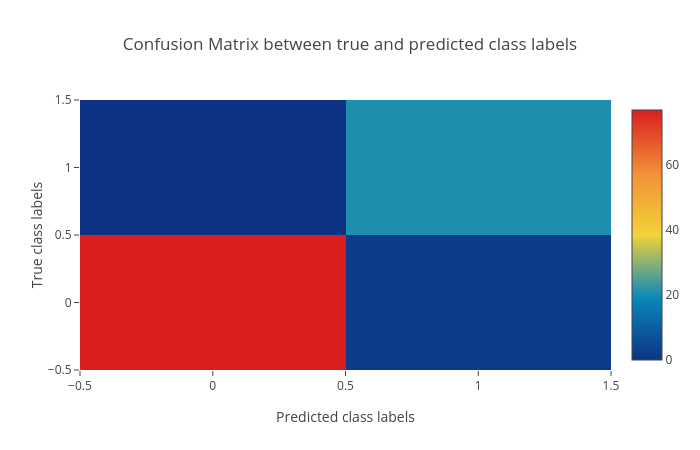
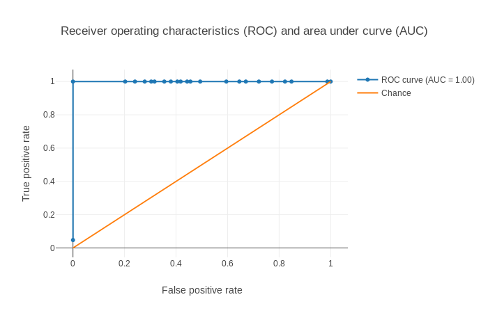

# Introduction
{:.no_toc}

Supervised learning methods in machine learning have targets/classes/categories defined in the datasets. These targets can either be discreet values or real-values (continuous). When the targets are discreet, the learning task is called as classification. When the targets are real-values, the task becomes regression. Classification is assigning a distinct category to each sample in the dataset. Regression assigns a real-valued output to a sample in the dataset. In the image below, the "green" line is a boundary which separates the blue balls from the red ones. The task of a classification method is to learn this boundary which can be used to differentiate between unseen blue and red balls.


The following image shows how a (regression) curve is fit which explains most of the data points. Here, the curve is a straight line. The regression task is to learn this curve which explains the underlying data distribution.


# Classification

Classification task assigns a category/class to a sample by learning a decision boundary using a dataset. This dataset is called a training dataset and contains a class/category for each sample. The algorithm which performs this task is called a classifier. The training dataset contains "features" as columns and a mapping between these features and the target is learned for each sample. The performance of mapping is evaluated using test dataset. The test dataset contains only the feature columns and not the target column. The target column is predicted using the mapping learned on the training dataset. In this tutorial, we will use a classifier to train a model using a training dataset, predict the targets for test dataset and visualize the results using plots.


# Upload datasets

The datasets required for this tutorial contain 9 features of breast cancer which include the thickness of clump, cell-size, cell-shape and so on ([more information](https://github.com/EpistasisLab/penn-ml-benchmarks/tree/master/datasets/classification/breast-w)). In addition to these features, the training dataset contains one more column as `target`. It has a binary value (0 or 1) for each row. `0` indicates no breast cancer and `1` indicates breast cancer. The test dataset does not contain the `target` column. The third dataset contains the all the samples from test dataset but also the `target` column which would be needed to create plot showing comparison between actual and predicted targets.

> ###  Hands-on: Data upload
>  1. Download and import the following datasets in a new Galaxy history. Choose the type of data as `tabular`.
> 
>    ```
>    https://zenodo.org/record/1401230/files/breast-w_train.tsv
>    https://zenodo.org/record/1401230/files/breast-w_test.tsv
>    https://zenodo.org/record/1401230/files/breast-w_targets.tsv
>    ```
>    
>
>  2. Rename each dataset as `breast-w_train`, `breast-w_test` and `breast-w_targets`
>
>    
{: .hands_on}

# Train a classifier
In this step, `SVM (Support vector machine)` classifier is trained using `breast-w_train` dataset. The last column of this dataset assigns a category for each row. The classifier learns a mapping between each row and its category. This mapping is called a trained model. It is used to predict the categories of unseen data (`breast-w_test`).

> ###  Hands-on: Train a classifier
> 
> **SVM Classifier (Support vector machine)**  with the following parameters
> 1.  *"Select a Classification Task"*: `Train a model`
> 2.  *"Classifier type"*: `Linear Support Vector Classification`
> 3.  *"Select input type"*: `tabular data`
> 4.  *"Training samples dataset"*: `breast-w_train`
> 5.  *"Does the dataset contain header"*: `Yes`
> 6.  *"Choose how to select data by column"*: `All columns but by column header name(s)`
> 7.  *"Type header name(s)"*: `target`
> 8.  *"Dataset containing class labels"*: `breast-w_train`
> 9.  *"Does the dataset contain header"*: `Yes`
> 10.  *"Choose how to select data by column"*: `Select columns by column header name(s)`
> 11.  *"Select target column(s)"*: `target`
> 12. `Execute` the classifier to train
{: .hands_on}


# Predict using a trained model
The previous step produces a model file of type `zip`. Rename this file to `model.zip` by using `edit` dataset property. The trained model is used to predict the categories of each row in `breast-w_test` dataset.

> ###  Hands-on: Predict using a trained model
> 
> **SVM Classifier (Support vector machine)**  with the following parameters
> 
> 1.  *"Select a Classification Task"*: `Load a model and predict`
> 2.  *"Models"*: `model.zip`
> 3.  *"Data (tabular)"*: `breast-w_test`
> 4.  *"Does the dataset contain header"*: `Yes`
> 5.  *"Select the type of prediction"*: `Predict class labels`
> 6. `Execute` to predict categories
{: .hands_on}


# Visualize the predictions
The previous step produces a predicted file of type `tabular`. Rename this file to `predicted_labels` by using `edit` dataset property.

> ###  Hands-on: Visualize the predictions
> 
> **Plot confusion matrix, precision, recall and ROC and AUC curves**  with the following parameters
> 
> 1.  *"Select input data file"*: `breast-w_targets`
> 2.  *"Select predicted data file"*: `predicted_labels`
> 3.  *"Select trained model"*: `model.zip`
> 4. `Execute` to predict categories
>
>    
>    
>    
{: .hands_on}


