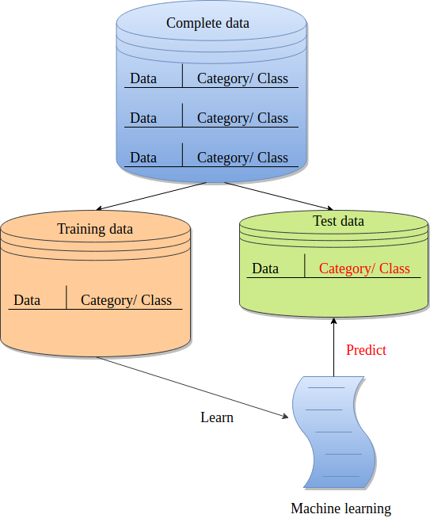
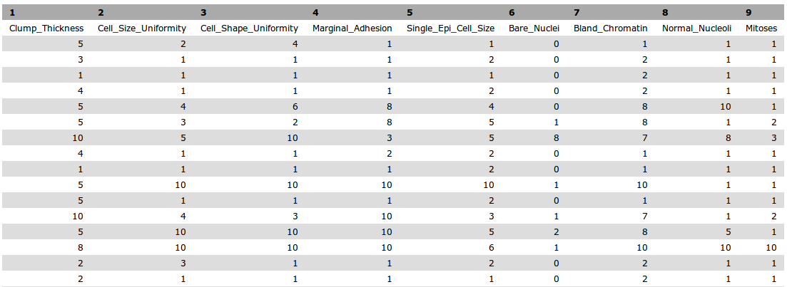

# Introduction
{:.no_toc}

Machine learning uses the techniques from statistics, mathematics and computer science to make computer programs learn from data. It is one of the most popular fields of computer science and finds applications in multiple streams of data analysis like classification, regression, clustering, dimensionality reduction, density estimation and many more. Some real-life applications are spam filtering, medical diagnosis, autonomous driving, recommendation systems, facial recognition, stock prices prediction and many more. The following image shows a basic flow of any machine learning task. A user has data and it is given to a machine learning algorithm for analysis.


There are multiple ways in which machine learning can be used to perform data analysis. They depend on the nature of data and the kind of data analysis. The following image shows the most popular ones.


The following image shows how a classification task is performed. The complete data is divided into training and test sets. The training set is used by a classifier to learn features. It results in a trained model and it is evaluated using the test set (unseen by the classifier during the training).



This tutorial shows how to use a machine learning module implemented as a Galaxy tool. The data used in this tutorial is available at [Zenodo](https://zenodo.org/record/1468039#.W8zyxBRoSAo).

> ### Agenda
>
> Performing a machine learning task (classification) using a tool involves the following steps:
>
> 1. TOC
> {:toc}
>
{: .agenda}

# Upload datasets

Two datasets, `breast-w_train.tsv` and `breast-w_test.tsv`, are required for this tutorial. They contain 9 features of breast cancer which include the thickness of clump, cell-size, cell-shape and so on ([more information](https://github.com/EpistasisLab/penn-ml-benchmarks/tree/master/datasets/classification/breast-w)). In addition to these features, the training dataset (`breast-w_train.tsv`) contains one more column as `target`. It has a binary value (0 or 1) for each row. `0` indicates no breast cancer and `1` indicates breast cancer. The test dataset (`breast-w_test.tsv`) does not contain the `target` column.

> ###  Hands-on: Data upload
>  Download and import the following datasets in a new Galaxy history: `breast-w_train.tsv` and `breast-w_test.tsv`. Choose the type of data as `tabular`.
> 
>    ```
>    https://zenodo.org/record/1468039/files/breast-w_train.tsv
>    https://zenodo.org/record/1468039/files/breast-w_test.tsv
>    ```
>    
>    
>    
{: .hands_on}


# Train a classifier
In this step, `SVM (Support vector machine)` classifier is trained using `breast-w_train.tsv` dataset. The last column of this dataset assigns a category for each row. The classifier learns a mapping between each row and its category. This mapping is called a trained model. It is used to predict the categories of unseen data (`breast-w_test.tsv`).

> ###  Hands-on: Train a classifier
> 
> **SVM Classifier (Support vector machine)**  with the following parameters
> 1.  *"Select a Classification Task"*: `Train a model`
> 2.  *"Classifier type"*: `Linear Support Vector Classification`
> 3.  *"Select input type"*: `tabular data`
> 4.  *"Training samples dataset"*: `breast-w_train.tsv`
> 5.  *"Does the dataset contain header"*: `Yes`
> 6.  *"Choose how to select data by column"*: `All columns but by column header name(s)`
> 7.  *"Type header name(s)"*: `target`
> 8.  *"Dataset containing class labels"*: `breast-w_train.tsv`
> 9.  *"Does the dataset contain header"*: `Yes`
> 10.  *"Choose how to select data by column"*: `Select columns by column header name(s)`
> 11.  *"Select target column(s)"*: `target`
> 12. `Execute` the classifier to train
{: .hands_on}


# Predict using a trained model
The previous step produces a model file of type `zip`. Rename this file to `model.zip` by using `edit` dataset property. The trained model is used to predict the categories of each row in `breast-w_test.tsv` dataset.

> ###  Hands-on: Predict using a trained model
> 
> **SVM Classifier (Support vector machine)**  with the following parameters
> 
> 1.  *"Select a Classification Task"*: `Load a model and predict`
> 2.  *"Models"*: `model.zip`
> 3.  *"Data (tabular)"*: `breast-w_test.tsv`
> 4.  *"Does the dataset contain header"*: `Yes`
> 5.  *"Select the type of prediction"*: `Predict class labels`
> 6. `Execute` to predict categories
{: .hands_on}


# See predictions
The last column of the predicted dataset shows the category of each row. A row either gets `0` (no breast cancer) or `1` (breast cancer) as its predicted category. 

> ###  Hands-on: See the predicted columns
> 1. Click on `view data` link of the dataset created after executing the previous step.
> 2. The last column of the `tabular` data shows the predicted category (`target`) for each row.
> 
{: .hands_on}


> ###  Additional resources:
>
> Read more about **machine learning using scikit-learn** [here](http://scikit-learn.org/stable/).
{:.tip}
