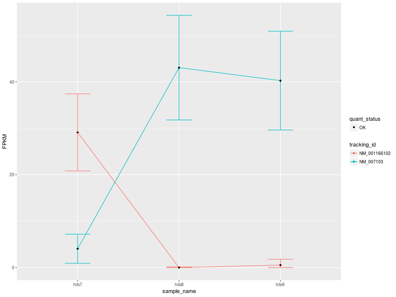
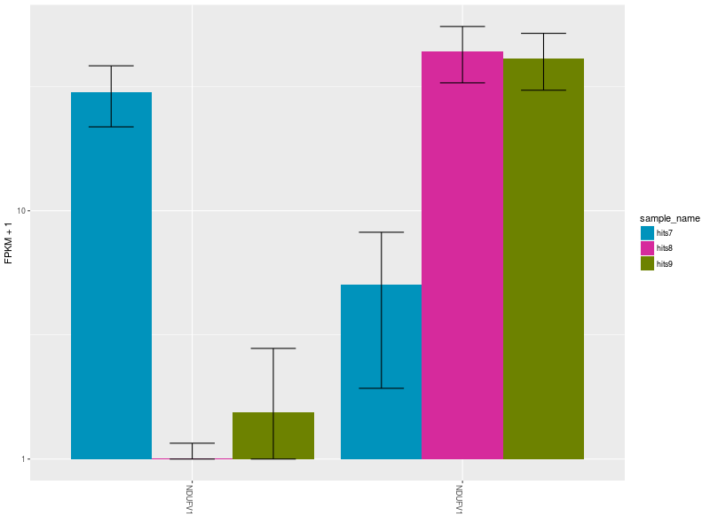
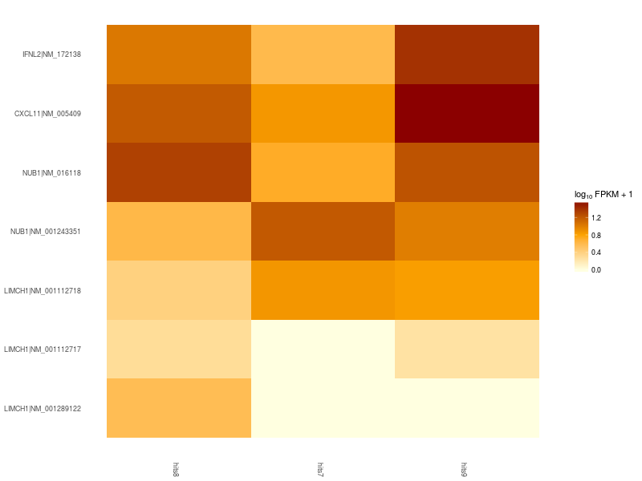

# Introduction
{:.no_toc}

RNA-Seq analysis helps researchers annotate new genes and splice variants, and provides cell- and context-specific quantification of gene expression. RNA-Seq data, however, are complex and require both computer science and mathematical knowledge to be managed and interpreted.

Visualization techniques are key to overcome the complexity of RNA-Seq data, and represent valuable tools to gather information and insights.

> ### Agenda
>
> In this tutorial, we will deal with:
>
> 1. TOC
> {:toc}
>
{: .agenda}

# Reasons for visualizing RNA-Seq results

To make sense of the available RNA-Seq data, and overview the condition-specific gene expression levels of the provided samples, we need to visualize our results. Here we will use [CummeRbund](http://compbio.mit.edu/cummeRbund/).

CummeRbund is an open-source tool that simplifies the analysis of a CuffDiff RNA-Seq output. In particular, it helps researchers:
- managing, integrating, and visualizing the data produced by CuffDiff
- simplifying data exploration
- providing a bird's-eye view of the expression analysis by describing relationships betweeen genes, transcripts, transcription start sites, and protein-coding regions
- exploring subfeatures of individual genes or gene-sets
- creating publication-ready plots

A typical workflow for the visualization of RNA-Seq data involving CummeRbund:

CummeRbund reads your RNA-Seq results from a [SQLite](https://www.sqlite.org/) database. This database has to be created using CuffDiff's SQLite output option.

> ###  Tip: SQLite output with CuffDiff
>
> Instruct CuffDiff to organize its output in a SQLite database to be read CummeRbund.
>
> 
{: .tip}

# Importing RNA-Seq result data

> ###  Hands-on: Data upload
>
> 1. Create a new history
> 2. Import the [`CuffDiff SQLite`](https://zenodo.org/record/1001880/files/CuffDiff_SQLite_database.sqlite) dataset
>
>    > ###  Tip: Importing data via links
>    >
>    > * Copy the link location
>    > * Open the Galaxy Upload Manager
>    > * Select **Paste/Fetch Data**
>    > * Paste the link into the text field
>    > * Press **Start**
>    {: .tip}
>
>    > ###  Comments
>    >
>    > Rename the dataset to "RNA-Seq SQLite result data"
>    {: .comment}
> By default, when data is imported via its link, Galaxy names it with its URL.
{: .hands_on}

CuffDiff's output data is organized in a SQLite database, so we need to extract it to be able to see what it looks like.

For this tutorial, we are interested in CuffDiff's tested transcripts for differential expression.

> ###  Hands-on: Extract CuffDiff results
>
> 1. **Extract CuffDiff**  with the following parameters
>   - *"Select tables to output"*: `Transcript differential expression testing`
>
> 2. Inspect the table
>
>    > ###  Tip: Inspecting the content of a file in Galaxy
>    >
>    > * Click on the eye ("View data") on the right of the file name in the history
>    > * Inspect the content of the file on the middle
>    {: .tip}
>
> Each entry is a differentially expressed gene, which is described in terms of the following attributes.
>
> - *test_id*: A unique identifier describing the transcript being tested
> - *gene_id*: The identifier of the gene being tested
> - *gene*: The name of the gene being tested
> - *locus*: The genomic coordinates of the gene transcript being tested
> - *sample_1*: Label of the 1st sample
> - *sample_2*: Label of the 2nd sample
> - *status*: The test's status:
>   - "OK" if test successful
>   - "NOTEST" if not enough alignments for testing
>   - "LOWDATA" if too complex or shallowly sequenced
>   - "HIDATA" if too many fragments in locus
>   - "FAIL" if a numerical exception prevented testing
> - *value_1*: The gene's FPKM in sample_1
> - *value_2*: The gene's FPKM in sample_2
> - *log2(fold_change)*: The log2 of the fold change (sample_1/sample_2). This reports the expression difference between condition one (sample_1) and condition two (sample_2)
> - *test_stat*: The test statistic's value, used to determine the significance of the observed change in FPKM
> - *p_value*: The uncorrected p-value of the test statistic
> - *q_value*: The False-discovery-rate-adjusted p-value of the test statistic
> - *significant*: "yes" or "no", depending on whether the p_value is greater then the FDR after Benjamini-Hochberg correction for multiple-testing. This tells whether the difference between the expression levels in condition one (sample_1) and condition two (sample_2) is significant
>
> We want to keep only those the *significant differentially expressed* genes.
>
>    > ###  Questions
>    >
>    > 1. How to retain only the significant differentially expressed genes?
>    > 2. Which column stores this information?
>    >
>    > > ###  Solution
>    > > 1. We need to filter on the column storing the record's significance
>    > > 2. Column 14
>    > {: .solution }
>    {: .question}
{: .hands_on}

# Filtering and sorting

We now want to highlight those gene transcripts whose expression difference, the log2(fold_change), has been statistically assessed as both high and significant.

> ###  Hands-on: Extract CuffDiff's significant differentially expressed genes
>
> 1. **Filter**  with the following parameters
>   - *"Filter"*: the extracted table from the previous step
>   - *"With following condition"*: an appropriate filter over the target column (see questions below when in doubt)
>   - *"Number of header lines to skip"*: the number of rows used for the table's header
>
>    > ###  Questions
>    > 1. What column stores the information of significance for each record?
>    > 2. Which conditional expression has to be set to filter all records on the selected column?
>    > 3. How many rows are allocated for the table's header?
>    > 4. How many entries were originally stored in the table? And how many after the filtering operation?
>    >
>    > > ###  Solution
>    > > 1. column 14
>    > > 2. c14=='yes'
>    > > 3. 1
>    > > 4. ~140.000 (before filtering) vs. 219 (after filtering)
>    > {: .solution }
>    {: .question}
>
>  Review the meaning of each column, and look at your data.
>
>  - The differential expression values are stored on column 10
>  - The statistical score, assessing the differential expression significance, is stored on column 13
>  We will sort all records on the basis of their Q-score (column 13) and log2(fold_change).
>
> 2. **Sort** : with the following parameters
>   - *"Sort Dataset"*: the filtered table
>   - *"on column"*: `13`
>   - *"with flavor" to `Numerical sort`
>   - *"everything in"*: `Ascending order`
>   -  **Insert Column selection**, and parameterize the Sort tool to sort on column 10. Be careful of the sorting order!
>   - Are there any rows allocated for the table's header? In that case, set "Number of header lines to skip" accordingly!
>
>    > ###  Questions
>    > 1. Which gene transcript has been statistically assessed as both high and significant?
>    >
>    > > ###  Solution
>    > > 1 LIMCH1
>    > {: .solution }
>    {: .question}
{: .hands_on}

# CummeRbund

CummeRbund generates two outputs:
- The plot, which visualizes our RNA-Seq results of interest
- The [ggplot](http://had.co.nz/ggplot2/) object responsible for generating the plot

In this section we will parametrize CummeRbund to create different kinds of plots from our input data.

> ###  Hands-on: Visualization
>
> 1. **CummeRbund**  with the following parameters
>    -   **Insert plots**
>      - *"Width"*: `800`
>      - *"Height"*: `600`
>      - *"Plot type"*: `Expression Plot`
>        - *"Expression levels to plot"*:`Isoforms`
>        - *"Gene ID"*: `NDUFV1`
{: .hands_on}

The input data used to create the visualization comprise 3 conditions: *hits7* (Patient 1), *hits8* (Patient 2), and *hits9* (Control).  

Our first CummeRbund plot is the "Expression Plot" of the isoforms of gene NDUFV1, which shows the expression differences of isoforms NM_001166102 and NM_007103 among the three conditions. Error bars capture the variability of the distribution of FPKM values: the broader the distribution of FPKM values, the larger the corresponding error bar.

Our plot has a modest number of isoforms, and is therefore easy to read. However, with a high number of isoforms and expression variability among different conditions, the plot can look very busy. We can therefore change the visualization type by selecting another type of plot. Let's change visualization.

> ###  Hands-on: Visualization
>
> 1. **CummeRbund**  with the following parameters
>    -  Click on *"Insert plots"*
>      - *"Width"*: `800`
>      - *"Height"*: `600`
>      - *"Plot type"*: `Expression Bar Plot`
>        - *"Expression levels to plot"*:`Isoforms`
>        - *"Gene ID"*: `NDUFV1`
{: .hands_on}

The Expression Bar Plot of gene NDUFV1's replicates NM_001166102 and NM_007103, shows the expression changes across the three aforementioned conditions.

> ###  Comment
>
> These plots are shown also in [this](https://vimeo.com/channels/884356/128265982) Galaxy video tutorial.
{: .comment}

Let's now create a heatmap to plot the expression levels of the significant differentially expressed gene isoforms obtained from our filter and sort operations.  
As a showcase example, let's consider only the top 5 differentially expressed genes.

> ###  Hands-on: Visualization
>
> 1. **CummeRbund**  with the following parameters
>   - Click on "Insert plot"
>   - Set its "Width" and "Height" to `800` and `600` respectively
>   - "Plot type" to `Heatmap`
>   - "Expression levels to plot" to `Isoforms`
>   - 1st "Gene ID" to `LIMCH1`
>   - 2nd "Gene ID" to `IFNL2`
>   - Click on "Insert Genes" twice
>   - 3rd "Gene ID" to `CXCL11`
>   - 4th "Gene ID" to `NUB1`
>   - Set "Cluster by" as "Both"
>   - Click on "Execute"
{: .hands_on}

Heatmap of significant differentially expressed isoforms of genes LIMCH1, IFNL2, CXCL11, NUB1. Differences in up- and down-regulation of certain gene isoforms across Patient 1 (hits7), Patient 2 (hits8), and Control (hits9), are visible in the lower and upper part of the heatmap.

> ###  Comment
>
> For more sophisticated visualizations of your RNA-Seq analisys results, try selecting different CummeRbund plot options and parametrizations. Have a look also at CummeRbund's [manual](http://compbio.mit.edu/cummeRbund/manual_2_0.html). Alternatively, you can modify a plot's style by changing CummeRbund's R output! CummeRbund's R outputs are *ggplot* objects. Look [here](https://github.com/tidyverse/ggplot2) to learn how to change fonts, colors, error bars, and more.
{: .comment}

# Conclusion
{:.no_toc}

Visualization tools help researchers making sense of data, providing a bird's-eye view of the underlying analysis results.  
In this tutorial we overviewed the advantages of visualizing RNA-Seq results with CummeRbund, and gained insights on CuffDiff's big-data output by plotting informations relative to the most significant differentially expressed genes in our RNA-Seq analysis.
