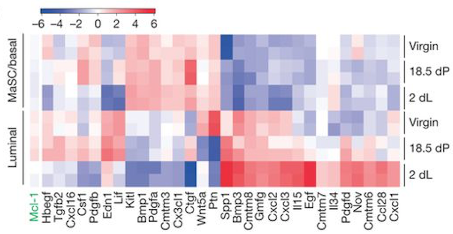
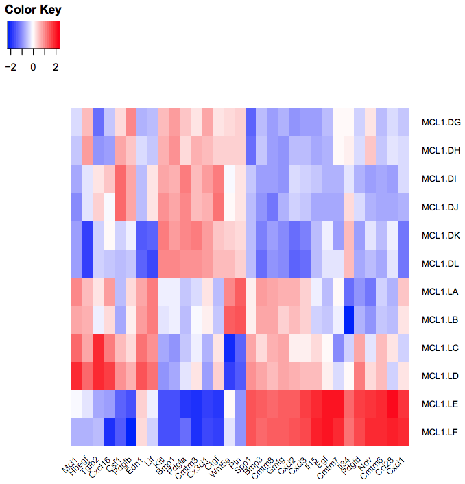

# Introduction
{:.no_toc}

To generate a heatmap of RNA-seq results, we need a file of normalized counts. This file is provided for you here. To generate this file yourself, see the [RNA-seq counts to genes]({{ site.baseurl }}/topics/transcriptomics/tutorials/rna-seq-counts-to-genes/tutorial.html) tutorial, and run limma-voom selecting *"Output Normalised Counts Table?"*: `Yes`. You could also use a file of normalized counts from other RNA-seq differential expression tools, such as edgeR or DESeq2.

The data for this tutorial comes from a Nature Cell Biology paper, [EGF-mediated induction of Mcl-1 at the switch to lactation is essential for alveolar cell survival](https://www.ncbi.nlm.nih.gov/pubmed/25730472)), Fu et al. 2015. This study examined the expression profiles of basal and luminal cells in the mammary gland of virgin, pregnant and lactating mice. Six groups are present, with one for each combination of cell type and mouse status.


> ### Agenda
>
> In this tutorial, we will deal with:
>
> 1. TOC
> {:toc}
>
{: .agenda}

# Preparing the inputs

We will use two files for this analysis:

 * **Normalized counts file** (genes in rows, samples in columns)
 * **Genes of interest** (list of genes to be plotted in heatmap)

## Import data

> ###  Hands-on: Data upload
>
> 1. Create a new history for this RNA-seq exercise e.g. `RNA-seq heatmap`
> 2. Import the normalized counts table.
>
>     To import the file, there are two options:
>     - Option 1: From a shared data library if available (ask your instructor)
>     - Option 2: From [Zenodo](https://zenodo.org/record/2529926)
>
>         > ###  Tip: Importing data via links
>         >
>         > * Copy the link location
>         > * Open the Galaxy Upload Manager
>         > * Select **Paste/Fetch Data**
>         > * Paste the link into the text field
>         > * Press **Start**
>         {: .tip}
>
>         - You can paste the links below into the **Paste/Fetch** box:
>
>           ```      
>       https://zenodo.org/record/2529926/files/limma-voom_normalised_counts
>       https://zenodo.org/record/2529926/files/limma-voom_luminalpregnant-luminallactate
>       https://zenodo.org/record/2529926/files/heatmap_genes
>           ```
>
>         - Select *"Genome"*: `mm10`
>
> 2. Rename the counts dataset as `normalized counts`, the limma-voom_luminalpregnant-luminallactate file as `DE results` and the list of genes as `heatmap genes` using the  (pencil) icon.
> 3. Check that the datatype is `tabular`.
>    If the datatype is not `tabular`, please change the file type to `tabular`.
>
>    > ###  Tip: Changing the datatype
>    > * Click on the  (pencil) icon displayed in your dataset in the history
>    > * Choose **Datatype** on the top
>    > * Select `tabular`
>    > * Press **Save**
>    {: .tip}
{: .hands_on}

The files should look like below (just the first few rows and columns of the normalized counts file is shown).


{: height="30%"}

We will create a heatmap for the 31 genes in Fig. 6b from the original paper using this dataset (see Figure below). These 31 genes include the authors' main gene of interest in the paper, Mcl1, and a set of cytokines/growth factors identified as differentially expressed. We will recreate this heatmap here.

{: width="50%"}

First we need to extract the normalized counts for just these 31 genes from the file containing the normalized counts for all genes in the experiment. To do that we will join the files on the Gene Symbols and then extract the columns we need.

## Extract normalized counts

> ###  Hands-on: Extract the normalized counts for the genes of interest
>
> 1. **Join two Datasets side by side on a specified field**  with the following parameters:
>    -  *"Join"*: the `heatmap genes` file
>    -  *"using column"*: `Column: 1`
>    -  *"with"*: `normalized counts` file
>    -  *"and column"*: `Column: 2`
>    -  *"Keep the header lines"*: `Yes`
>
>    The generated file has more columns than we need for the heatmap. In addition to the columns with normalized counts (in log2), there is the $$log_{2} FC$$ and other information. We need to remove the extra columns.
>
> 2. **Cut columns from a table**  to extract the columns with the gene ids and normalized counts
>    -  *"Cut columns"*: `c1,c5-c16`
>    -  *"Delimited by"*: `Tab`
>    -  *"From"*: the joined dataset (output of **Join two Datasets** )
>
>    The genes are in rows and the samples in columns, we could leave the genes in rows but we will transpose to have genes in columns and samples in rows as in the Figure in the paper.
>
> 3. **Transpose**  to have samples in rows and genes in columns
>    - *"Input tabular dataset"*:
>        -  *"From"*: the `Cut` dataset (output of **Cut** )
{: .hands_on}

We now have a table with the 31 genes in columns and the normalized counts for the 12 samples in rows, similar to below (just the first few columns are shown).


# Create heatmap of custom genes

> ###  Hands-on: Plot the heatmap of custom genes
>
> 1. **heatmap2**  with the following parameters:
>    -  *"Input should have column headers"*: the generated table (output of **Transpose** )
>    -  *"Data transformation"*: `Plot the data as it is`
>    -  *"Enable data clustering"*: `No`
>    -  *"Labeling columns and rows"*: `Label my columns and rows`
>    -  *"Coloring groups"*: `Blue to white to red`
>    -  *"Data scaling"*: `Scale my data by column` (scale genes)
{: .hands_on}

You should see a heatmap like below.

{: width="30%"}

> ###  Question
>
> How does the heatmap compare to the one from the Fu paper Fig 6 (above)?
>
>    > ###  Solution
>    >
>    > The heatmap looks similar to the heatmap in the paper, which is reassuring.
>    >
>    {: .solution}
{: .question}

Alternatively, or in addition, instead of a heatmap of custom genes, you could create a heatmap of the most differentially expressed genes in a dataset, as shown in the [RNA-seq ref-based tutorial]({{ site.baseurl }}/topics/transcriptomics/tutorials/ref-based/tutorial.html).


# Conclusion
{:.no_toc}

In this tutorial we have seen how a heatmap can be generated from RNA-seq data using the heatmsp2 tool in Galaxy. This uses the same dataset from the tutorials, [RNA-seq reads to counts]({{ site.baseurl }}/topics/transcriptomics/tutorials/rna-seq-reads-to-counts/tutorial.html), [RNA-seq counts to genes]({{ site.baseurl }}/topics/transcriptomics/tutorials/rna-seq-counts-to-genes/tutorial.html), and [RNA-seq genes to pathways]({{ site.baseurl }}/topics/transcriptomics/tutorials/rna-seq-genes-to-pathways/tutorial.html). We have also reproduced results similar to what the authors showed in the original paper for this dataset.
