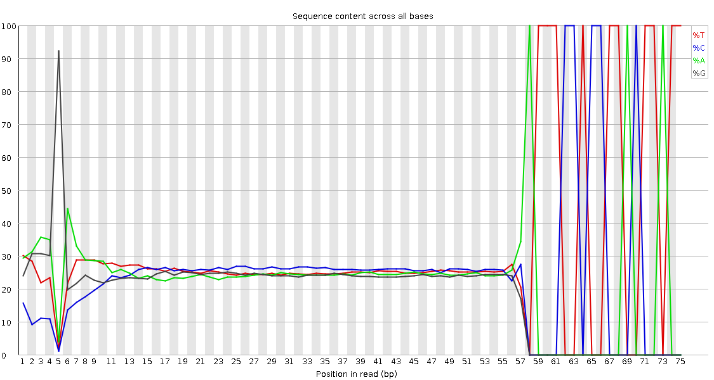
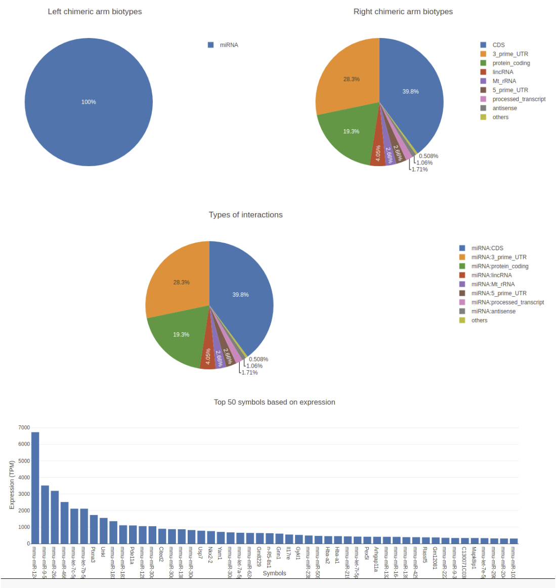
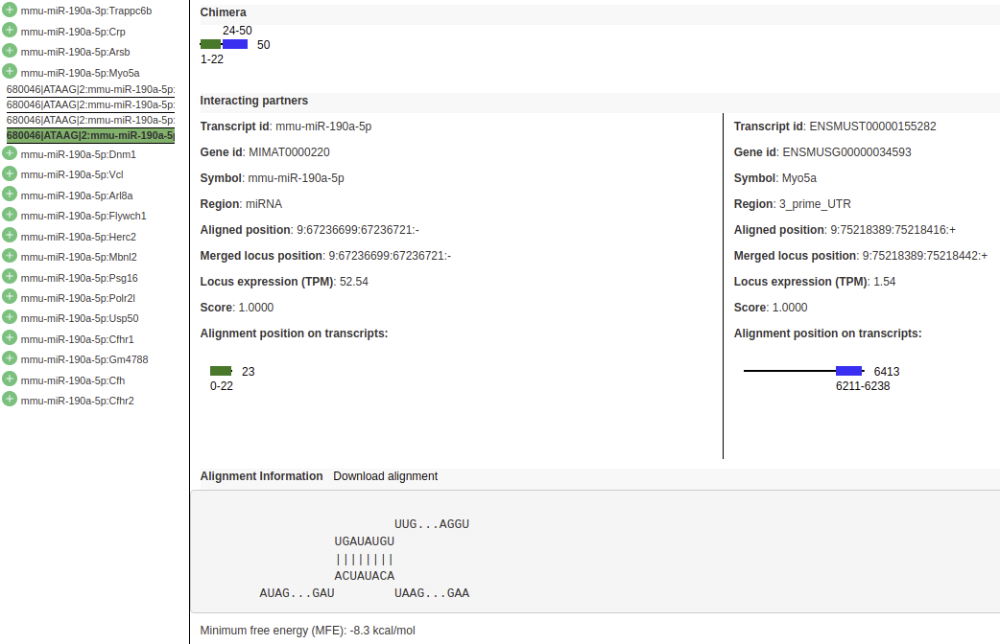

# Introduction
{:.no_toc}

<!-- This is a comment. -->

With the advances in the next-generation sequencing technologies, genome-wide RNA-RNA interaction predictions are now
possible. The most recent line of development has been to ligate the microRNA to the site-specific interaction region of
 the target, selecting these interactions via cross-linking to one of the Argonaute proteins required for microRNA-based
  regulation, and to sequence the resulting chimeric RNA molecule, for example, the CLASH and CLEAR-CLIP protocols.
Going beyond microRNAs, these protocols can be applied to RNA interactions that involve a regulatory protein
other than Argonaute. To generalize even further, researchers have applied the same idea to the detection of all
transcriptome-wide RNA-RNA interactions, which include both inter- and intramolecular base pairing without the necessity
 of choosing a specific regulatory protein for cross-linking. These protocols include LIGR-Seq that maps the human
 RNA-RNA interactome and PARIS that focused on long-range structures in human and mouse.

The reads from these experiments are chimeric with each arm generated from one of the interaction
partners. Due to short lengths, often these sequenced arms ambiguously map to multiple locations and  inferring the
origin of these can be quite complicated. Theoretically, alignment tools like `HISAT2` and `STAR` can be used to align
chimeric reads, but they are not efficient at this task. The other alignment tools like `BWA-MEM` or `Bowtie2` can be
used in local alignment settings to map these chimeric reads. In this case user needs to adjust the alignment parameters
to match the read lengths and there needs to be a lot of post-processing to be done to choose the best hits. Recently,
there is also an alignment tool called `CLAN` published to specifically map the chimeric reads from CLASH experiments.

In this tutorial, we will learn the analysis of a CLEAR-CLIP data set using a tool suite called `ChiRA`. The data used
is a random subsampling (100k reads) of a mouse cortex sample
([GSM1881541](https://www.ncbi.nlm.nih.gov/geo/query/acc.cgi?acc=GSM1881541)) prepared using CLEAR-CLIP protocol. It is
a complete analysis framework that can be used starting from raw sequencing reads to analysis and visualization of
results. `ChiRA` uses `BWA-MEM` or `CLAN` to map the reads. Subsequently, it also merges the overlappig alignments and
 chooses the best alignments per read by quantifying the all the loci that reads map to. In the end, it scores each
  alignment and outputs only the best alignments per read. The final part of this tutorial gives an insight into how to
  filter, export and visualize your results using the visualization framework `ChiRAViz`.


> ### Agenda
>
> In this tutorial, we will cover:
>
> 1. TOC
> {:toc}
>
{: .agenda}

# Get data

> ###  Hands-on: Data upload
>
> 1. Create a new history for this tutorial
> 2. Import the files from [Zenodo](https://zenodo.org/record/3709188) or from the shared data library
>
>    ```
>    https://zenodo.org/api/files/be3bc8ed-75bd-4470-b662-bca1a503b28d/miRNA_mature.fa.gz
>    https://zenodo.org/api/files/be3bc8ed-75bd-4470-b662-bca1a503b28d/Mus_musculus.GRCm38.dna.fa.gz
>    https://zenodo.org/api/files/be3bc8ed-75bd-4470-b662-bca1a503b28d/SRR2413302.100k.fastq.gz
>    https://zenodo.org/api/files/be3bc8ed-75bd-4470-b662-bca1a503b28d/SRR2413302.fastq.gz
>    https://zenodo.org/api/files/be3bc8ed-75bd-4470-b662-bca1a503b28d/transcriptome.fa.gz
>    https://zenodo.org/api/files/be3bc8ed-75bd-4470-b662-bca1a503b28d/whole_transcriptome.gff.gz
>    ```
>
>    
>    
>
> 3. Rename the datasets
> 4. Check that the datatype
>
>    
>
> 5. Add to each database a tag corresponding to ...
>
>    
>
{: .hands_on}

# Preprocessing

Before starting with the analysis of data it is always good to check the sequenced reads for low quality bases and
adapters.

## Quality control

> ###  Hands-on: Quality check
First use `FastQC` to assess the read quality
>
> 1. **FastQC**  with the following parameters:
>    -  *"Short read data from your current history"*: `SRR2413302.100k.fastq.gz` (Input dataset)
>
{: .hands_on}

> ###  Questions
>
> 1. Why do you think `FastQC` failed to find any adapters?
>
> > ###  Solution
> >
> > 1. Because `FastQC` it uses a set of standard adapters to screen for adapters. The "special" adapters used in this
library preparation are not present in the `FastQC` standard adapters list.
> >
> {: .solution}
>
{: .question}

## Adapter trimming
Due to the inefficiency of the current RNA interactome protocols, not all reads are not made up of RNA hybrids. In some
cases, reads contain single RNA fragments with adapters or nothing but only adapters. Hence adapter removal is a very important step
in this analysis. In this step, we use `cutadapt` to trim the adapters. As the adapters used in this library are not
standard Illumina adapters, we need to provide them manually.

> ###  Hands-on: Adapter trimming
We use `cutadapt` to trim the adapter content
>
> 1. **cutadapt**  with the following parameters:
>    -  *"FASTQ/A file"*: `SRR2413302.fastq` (Input dataset)
>    - In *"Read 1 Options"*
>       - *"3' (End) Adapters"* -> *"Insert 3' (End) Adapters"*
>           - *"Source"*: `Enter Custom sequence`
>           - *"Enter custom 3' adapter sequence"*: `GTGTCAGTCACTTCCAGCGG`
>       - *"5' (Front) Adapters"* -> *"Insert 5' (Front) Adapters"*
>           - *"Source"*: `Enter Custom sequence`
>           - *"Enter custom 5' adapter sequence"*: `NNNNAGGGAGGACGATGCGG`
>    - In *"Filter Options"*
>        - *"Minimum length"*: `10`
>
{: .hands_on}


> ###  Hands-on: Post adapter trimming quality check
It is interesting to see whether our manually entered adapters were trimmed
>
> 1. **FastQC**  with the following parameters:
>    -  *"Short read data from your current history"*: `Read 1 Output` (output of **cutadapt** )
>    - Observe the **Per base sequence content**
> 
{: .hands_on}
> ###  Questions
>
> 1. Would you be concerned about the abnormal "Per base sequence content towards the end"?
>
> > ###  Solution
> >
> > 1. Normally yes, but in this case not. Always look at this plot in combination with "Sequence Length Distribution"
plot. It looks like there is huge difference in base composition between 56th and 57th bases. But the number of
sequences that constitute this is very important. From the sequence length distribution, almost all the sequences are of
 length of 55 bases. Hence the abnormality in the per base sequence content is just because it is from
 very few (if not only 1) sequence.
> >
> {: .solution}
>
{: .question}

# Analysis of interactome data using `ChiRA` tool suite

The analysis includes several steps that deal with deduplication mapping, quantification and extraction of interacting
partners.

## Remove duplicate sequences

First, we eliminate the duplicate sequences from the library to reduce the computational effort. This will also have an
impact on the quantification of the loci because often these identical sequences might be PCR duplicates.

> ###  Hands-on
>
> 1. **ChiRA collapse**  with the following parameters:
>    -  *"Input FASTQ file"*: `Read 1 Output` (output of **cutadapt** )
>
>    > ###  Tip: Dealing with UMIs
>    >
>    > * If you have UMIs (at the 5' end) in the sequenced reads, please set *"Length of the UMI if present at the 5' end of your reads"*.
>    > * The UMI will be trimmed and put in the unique sequence id.
>    {: .tip}
>
{: .hands_on}


## Map reads to the reference transcriptome

> ###  Hands-on: Map chimeric reads from fasta file
Here we use `BWA-MEM` aligner in local alignment mode to locate the chimeric arms on the
transcriptome. Your reference can be single or split in two. Two references are
ideal for example if you have CLASH experimental data where you have separate
miRNA and target references.
>
> 1. **ChiRA map**  with the following parameters:
>    -  *"Input FASTA file"*: `fasta file` (output of **ChiRA collapse** )
>    - *"Single or split reference?"*: `Split reference`
>        -  *"Reference FASTA file"*: `miRNA_mature.fa` (Input dataset)
>        -  *"Second reference FASTA file"*: `transcriptome.fa` (Input dataset)
>    - *"aligner"*: `BWA-MEM`
>
{: .hands_on}


## Merge overlapping alignment information

In this step, we merge the overlapping aligned positions to define the read concentrated loci. If an annotation GTF file
produced, the transcriptomic alignment positions are first converted to their corresponding genomic positions. The
merging is also done on reads defining which parts of the reads are mapping that indicates potential interacting segments
of read.

> ###  Hands-on:
>
> 1. **ChiRA merge**  with the following parameters:
>    -  *"Input BED file of alignments"*: `ChiRA aligned BED` (output of **ChiRA map** )
>    - *"Do you have an annotation in GTF format?"*: `Yes`
>        -  *"Annotations in GTF format"*: `whole_transcriptome.gff.gz` (Input dataset)
>
>    > ###  Tip: Parameters for interactome/structurome data like SPLASH, PARIS
>    >
>    > * If you have data that contains large interaction regions, the default `Overlap based` merging may not capture whole interaction regions.
>    > * In that case use `blockbuster` merging mode and adjust the paramertes accordingly.
>        - From *"Select the mode of merging"*: `Gaussian based (blockbuster)`
>    {: .tip}
>
{: .hands_on}

## Quantify aligned loci to score the alignments

Now we have the loci where the potential interacting read segments are mapped to. Due to the small length of these arms, there is a
very high chance of multi mapping. Another reason for this is the lenient mapping parameters that are used to increase
the mapping sensitivity. Quantification needs 2 files containing read segements and loci where they are mapping to. From
this information, `ChiRA quanitify` tries to infer the correct origin of reads and calculates the expression of the loci
using a simple expectation-maximization algorithm.

> ###  Hands-on: Task description
>
> 1. **ChiRA qauntify**  with the following parameters:
>    -  *"BED file of aligned segments"*: `ChiRA aligned read segments` (output of **ChiRA merge** )
>    -  *"Tabular file of merged alignments"*: `ChiRA merged alignments` (output of **ChiRA merge** )
>
{: .hands_on}

## Extract the best scoring chimeras

After having the information about the loci expression, the final step extracts only the best scoring interacting
partners for each read. All the combinations of the transcripts that are overlapping with the interacting loci are
reported. If there is more than one locus with the equal best score then all the best hits are reported. If you have the
genomic fasta file the tool can hybridize the interacting loci sequences using `IntaRNA`.

> ###  Hands-on: Task description
>
> 1. **ChiRA extract**  with the following parameters:
>    -  *"File containing CRLs information"*: `ChiRA quantified loci` (output of **ChiRA qauntify** )
>    - *"Have genomic information?"*: `Yes`
>        -  *"Annotations in GTF format"*: `whole_transcriptome.gff.gz` (Input dataset)
>        - *"Choose the source for the FASTA file"*: `History`
>            -  *"FASTA file"*: `Mus_musculus.GRCm38.dna.fa.gz` (Input dataset)
>    - *"Did you use single or split reference for alignment?"*: `Split reference`
>        -  *"Reference FASTA file"*: `miRNA_mature.fa` (Input dataset)
>        -  *"Second reference FASTA file"*: `transcriptome.da` (Input dataset)
>    - *"Hybridize"*: `Yes`
>
{: .hands_on}

# Visualization

The output tabular file generated in the above step can be huge with up to some millions of rows depending on the
library size and more than 30 columns. Extracting useful data from this can be very tedious. For example, extracting and
visualizing the distribution of target biotypes of your favorite miRNA can be very tricky and might need more than a
hand full of galaxy tools to achieve. For this reason, there exists a visualization and filtering tool for this data along
with `ChiRA` known as `ChiRAViz`. It is a galaxy visualization framework to work with the output of `ChiRA`. But it does
not directly work with the tabular output we have. Rather it needs a "sqlite" database. For this reason, we first build a
sqlite database from the `ChiRA` output.

> ###  Hands-on: Data preperation
>
> 1. **Query Tabular**  with the following parameters:
>    - In *"Database Table"*:
>        -  *"Insert Database Table"*
>            -  *"Tabular Dataset for Table"*: `ChiRA chimeric reads` (output of **ChiRA extract** )
>    - In *"Table Options"*
>        - *"Use first line as column names"*: `Yes`
>    - *"Save the sqlite database in your history"*: `Yes`
>
> 2. Change the datatype to `chira.sqlite`
>
>    
>
{: .hands_on}

> ###  Hands-on: Visualize and chimeras
>
> 1. Please click on  *"Visualize this data"*. Then click on the `ChiRAViz` visualization.
> This loads the data into the visualization framework and shows some basic plots from the data.
>   - The visualization split into two to show the left and the right arms information.
>   - On home page pie charts of left and right chimeric arms, types of interactions and top 50 expressed RNAs are shown.
>
> 2. Then choose the kind of interactions information you want to see. For example, choose the most abundant `miRNA` and `3_prime_UTR` and click on **"Get interactions"**.
>
>
>
> - **"Chimera"** panel in the middle depicts the mapping positions on the read with read length.
> - **"Interacting partners"** panel shows the information on which transcripts the left and right arm are mapping to with their alignment positions on the transcripts.
> - **"Alignment Information"** panel shows the alignment if present with a possibility to download the alignment.
>
>
{: .hands_on}

> ###  Hands-on:  Filter interactions and export results
> `ChiRAViz` provides filters to search for keywords like gene symbols, sort interactions by score, filter by score or hybridization energy. Then the filtered interactions can be summarized or exported to a file. In this step, we filter the interactions with most abundant miRNA and consider those which have an `IntaRNA` predicted hybrid.
>    - Go to the home page by clicking **Home** on the top.
>    - Go to the bottom of the home page to the plot showing top 50 symbols based on their expression.
>    - Click on the most abundant miRNA `mmu-miR-466i-5p`. This will populate the left panel with all the interactions containing `mmu-miR-466i-5p`.
>    - Filter the entries that contain `IntaRNA` hybrid. If there is no hybrid predicted the value in that filed is `NA`
>       - From **"Filter by..."** choose `Hybrid`
>       - From **"Choose operator..."** choose `<>`
>       - Enter `NA` in the value field and hit the enter key.
>    - At this point, you can click on **Summary** to view the summary plots for this subset of interactions.
>    - Tick **"Check all"** on the bottom left corner and then click on **Export** to export the resulting interactions.
>    - This will export all the results to a file.
{: .hands_on}

# Conclusion
{:.no_toc}

Though chimeric reads look normal when inspected in a FASTQ file, the origin of each read is from two different RNA fragments. Limitations of the current sequencing protocols limit the length of each sequenced interacting RNA fragment. These smaller RNA fragments are often harder to map considering that the boundaries of each RNA fragment in the read are unknown. In this tutorial, we have seen how to map these reads and infer the true origins of them by quantifying the mapped loci. The visualization framework gives flexibility in filtering and searching output files, visualize the summaries of filtered data as well as exporting them.
